# 饼状图不值得你这样对待它们

> 原文：<https://medium.com/hackernoon/pie-charts-did-nothing-to-deserve-what-youre-doing-to-them-ca803997eb08>

谦逊的饼状图不是奇迹创造者，但它确实不应该受到持续不断的仇恨邮件和诽谤文章的攻击。拿这个流传的例子来说:

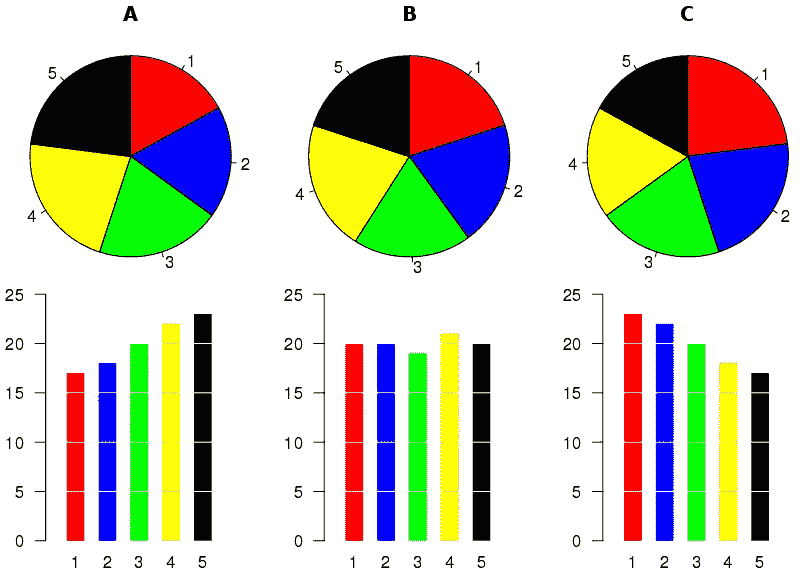

[https://en.wikipedia.org/wiki/File:Piecharts.svg](https://en.wikipedia.org/wiki/File:Piecharts.svg)

这张图有什么问题？批评者指出，对于相同的数据，饼状图看起来相似，即使条形图看起来不同。

听着，饼状图是讲述简单故事的简单生物。那些故事是关于写作的。我的总数是由许多类别组成的，还是只有几个类别？它们是如何分布的？它们是平均分布的，还是少数类别占主导地位？

对于多个饼图，就是比较这些特征。这些类别的份额有多相似？在每个实例中，相同的类别占主导地位，还是它们会发生变化？这就是全部了。

当你看着三张饼状图，却看不出有什么不同时，这并不是说饼状图不好，而是在这三种情况下，它们的构成非常相似！可怜的馅饼[图](https://hackernoon.com/tagged/chart)做了简单而吃力不讨好的工作，你们这些忘恩负义的人。不多不少。

不服气？让我们来看看这些冷酷的数字:

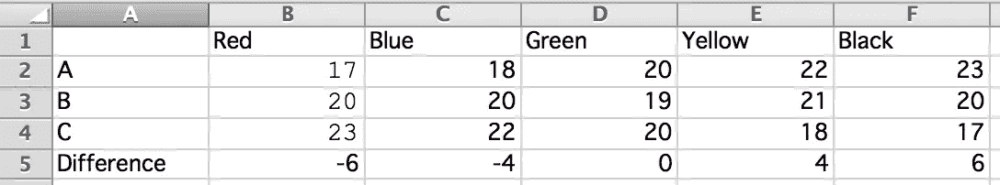

**最大的**总体差异是从图 A 到图 C，在一个类别中发生的最大变化是惊人的 6%！

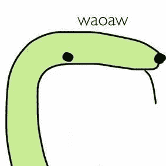

[https://www.facebook.com/TinySnekComics/](https://www.facebook.com/TinySnekComics/)

总之，成分非常相似，所以饼状图看起来相似。饼状图告诉我们的故事成立。

当然，有抱负的知识分子会指出，有时，小变化也很重要。一个谦虚的建议:如果你真的想*展现*的不同，为什么不*剧情*的不同呢？

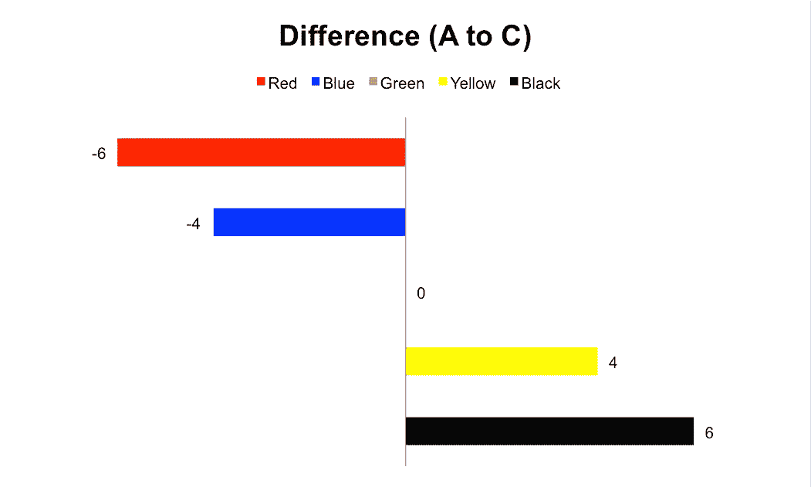

我不是*艺术家*，但是在用 Excel 做了两分钟之后，这个图表似乎在传达微小差异方面更有效了。比条形图有更好的[数据-油墨比](http://www.darkhorseanalytics.com/blog/data-looks-better-naked)！

然而，仅从图中的*来看*，你可能会相信，从情况 A 到情况 c，这五个类别的绝对值发生了很大的变化。毕竟，看看红色柱有多长！我们永远忠诚的朋友，饼状图，告诉我们相反的情况。

我们现在看到的是一个[设计](https://hackernoon.com/tagged/design)连续体。这是一条隐喻的线，我们可以沿着这条线前进，以这样或那样的方式，用一种利益换取另一种利益。由我们来决定我们想要做出的权衡，以服务于我们想要最好服务的目的。

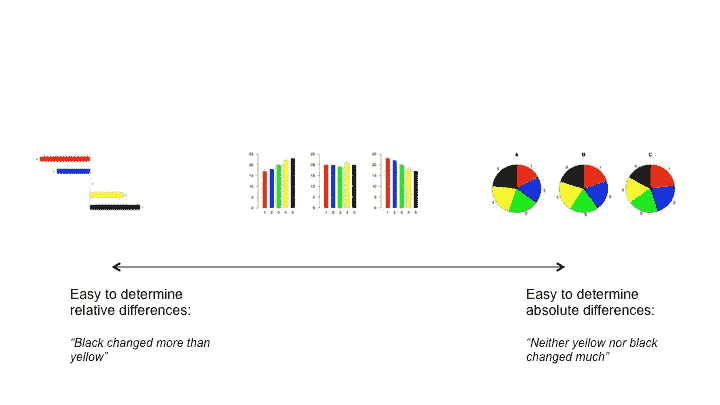

饼图显示，从 A 到 c，总体上没有太大变化。差异条形图(我编造了这个名称)显示，红色和黑色变化最大，但方向相反。这两种说法都是从相同的数据中得出的不同说法，而且两者同时成立。中间的常规条形图对两者都有所描述，但对每个故事的描述都不如其他的清晰。

当然，如果您想要跨单独的实例比较类别，您也可以将想要比较的类别彼此放得更近:

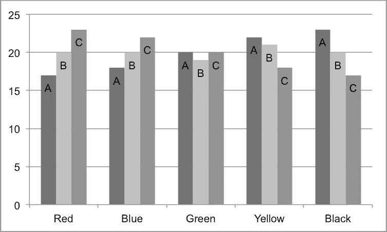

Three reds look odd side by side, so I colored them differently here.

在这里，更容易看到红色类别上升，黑色类别下降，绿色类别从 A 到 c 变化不大。

我会把这个版本放在中间的条形图上，但更靠近连续统的左侧——更容易比较 A、B 和 C 之间的同一类别，但代价是每个实例内的跨类别比较。

还有一点要说明的是，感性的烦恼困扰着各种图表，只是方式不同而已。就像红衣主教黎塞留一样，给我看任何一张图表，我或许都能找到一种方式谴责它令人困惑。根据数据的特征，我们可以有效地误用任何类型的图表。举个例子:

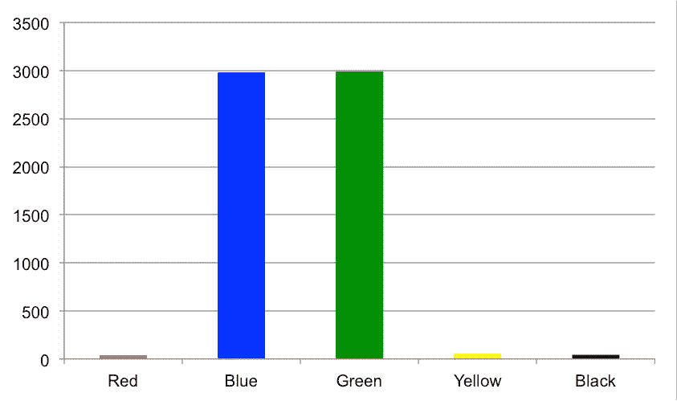

我肯定分不清是红的大还是黑的大，而且我把数据删了，所以永远不会有人知道。另一个伟大的(也是众所周知的)例子是选举地图:

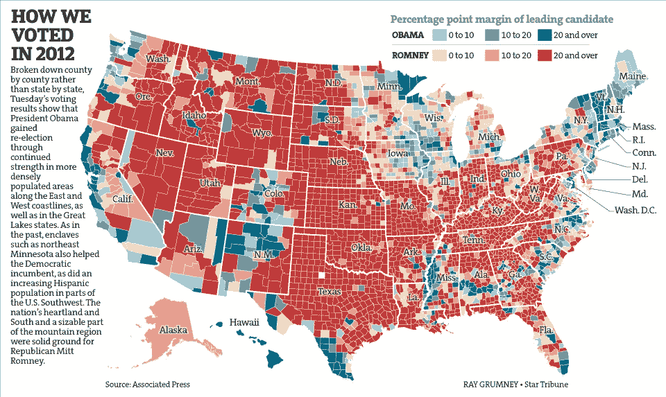

Ray Grumney / Star Tribune

红色看起来很大，蓝色看起来很小，但我们知道奥巴马在 2012 年赢得了大选。有很多方法可以解决这个问题，比如用地理精度换取尺寸精度，比如 [538 简洁的选举地图](https://projects.fivethirtyeight.com/2016-election-forecast/#electoral-map)。

此外，有些事情通常只有净收益。考虑:

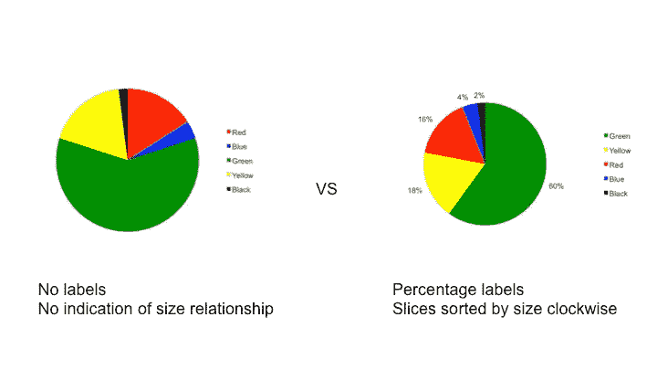

如果你的图表比较为一种图表提供了所有有益的特征，却排除了其他图表的常识性特征，那就不公平了。

这里有一种情况，饼图可能是好的。想象一下，一家公司在三个地方举行领导人选举。

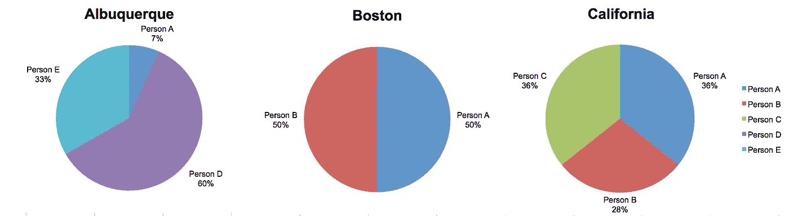

看起来 A 在波士顿和加州都很有竞争力。波士顿的比赛非常接近，但在加利福尼亚有另一个强大的竞争对手，所以在那里三个人之间非常接近。不知何故，C 在波士顿没有影响力，就像 A 和 B 一样。阿尔伯克基只是做了自己的事情，基本上没有受到来自波士顿和加州的外来候选人的影响。

那么为什么饼图在这种情况下工作得很好，而在另一种情况下却不行呢？我认为这与我们试图展示的*种*差异有关。这里我们展示的是典型的差异——我们可能会认为人们和他们影响的地点之间存在某种紧密的联系，因此当我们看到这些差异时会有很好的变化。如果我们的数据中所有的东西看起来都一样，那就没用了。

这在另一种情况下效果很好:查看不同类别的问卷结果。

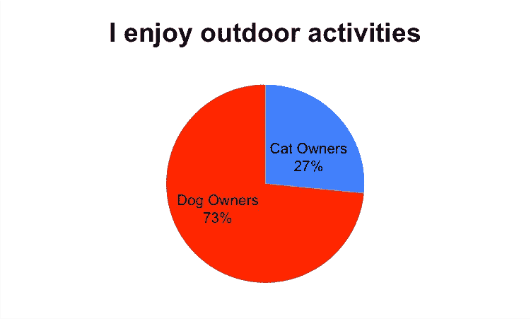

我们看到，在喜欢户外活动的人群中，大多数是养狗的人。简单明了。

因此，如果你想抱怨什么，就去抱怨图表被滥用的情况吧。没有一种图表类型是万能的，图表工具还不能读懂我们的思想。选择最能讲述你的故事的图表类型，并减少你想避免的陷阱。

饼状图也可以。他们在我们大多数人之前就存在了，而且可能会比我们所有人都活得长。当我们最终在一份 100 页的报告中读到气候导致的地球死刑判决时，它可能会有饼状图。所以，尽情享受你的手工甜甜圈图和你的自制方形饼图吧，潮人们。开玩笑的。不过，在那之前，你会发现我在我遇到的每一个好的小饼状图上都贴上了金星。

别说了，朋友们！

> [黑客中午](http://bit.ly/Hackernoon)是黑客如何开始他们的下午。我们是 [@AMI](http://bit.ly/atAMIatAMI) 家庭的一员。我们现在[接受投稿](http://bit.ly/hackernoonsubmission)，并乐意[讨论广告&赞助](mailto:partners@amipublications.com)机会。
> 
> 如果你喜欢这个故事，我们推荐你阅读我们的[最新科技故事](http://bit.ly/hackernoonlatestt)和[趋势科技故事](https://hackernoon.com/trending)。直到下一次，不要把世界的现实想当然！

