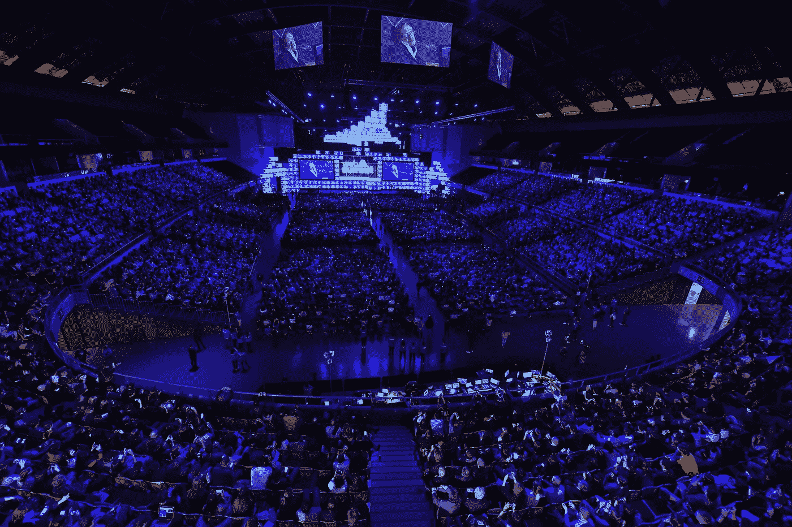
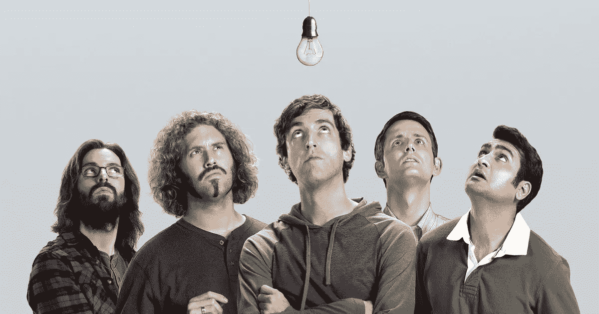
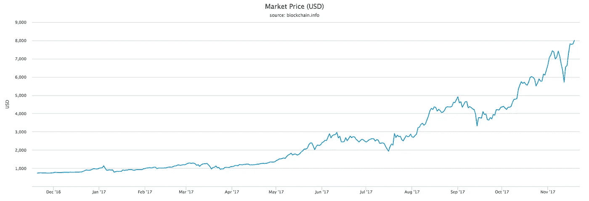
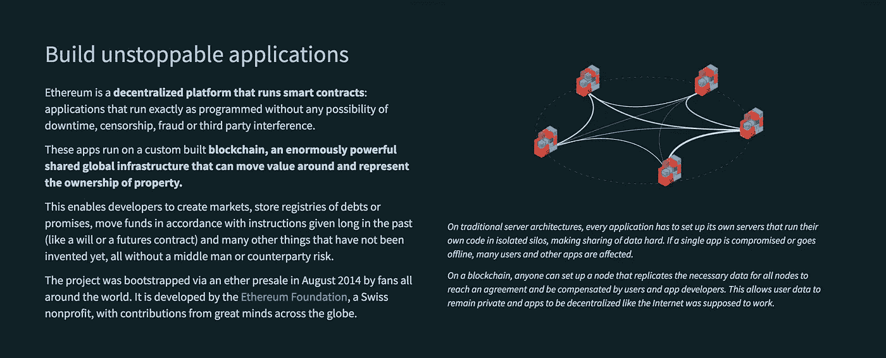
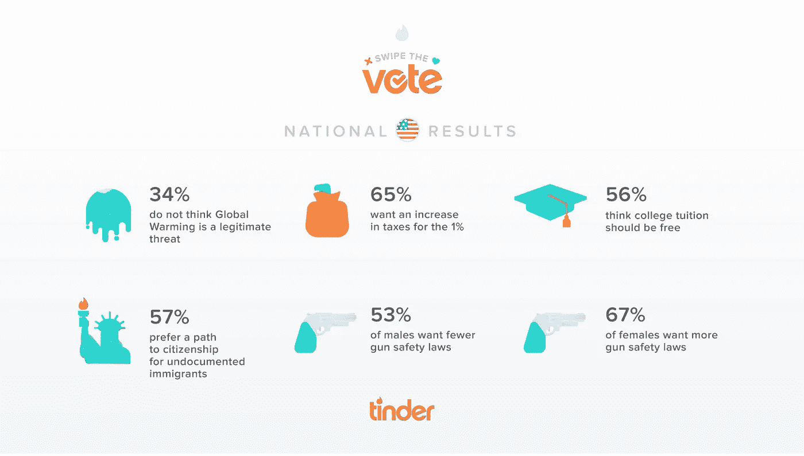
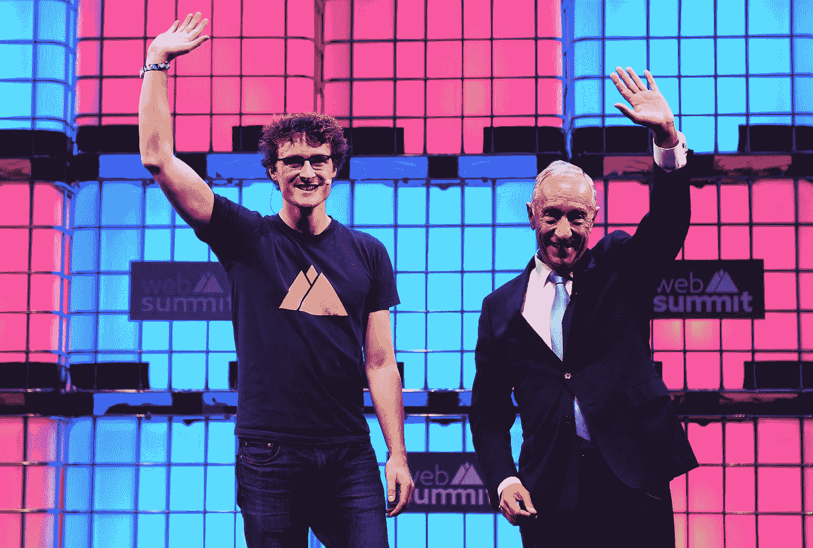
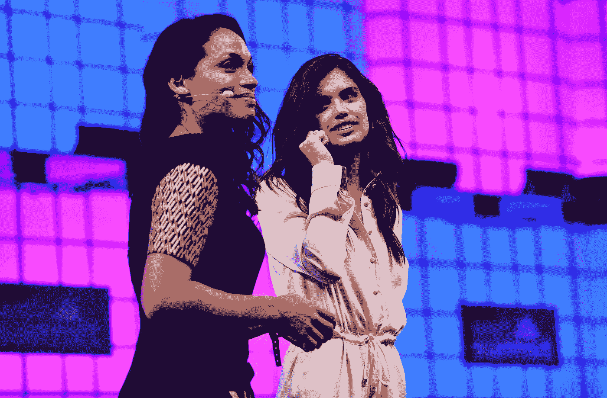

# 科技世界的朝圣

> 原文：<https://medium.com/hackernoon/pilgrimages-of-the-tech-world-5c20e4e61ee4>

> “道德之旅”及其“神龛”。

当我登上另一架航班，离开里斯本和最新一期的网络峰会时，我想告诉你一些发生在你正在阅读的屏幕背后的神奇的事情。那里有一个完整的世界，每天从一个国家转移到另一个国家。

在数码行业工作的人在*远离键盘*的时候在哪里？显然，离它不太远，你可能会在那种地方找到他。也许你会在一些文章中读到 WebSummit 的好坏。他们可能都是对的。如果你想知道它是否对你有好处，那就一直读到最后。

Stephen Hawking opening the celebration at WebSummit, 2017

# 精英俱乐部

如果你有去[旅行](https://hackernoon.com/tagged/travel)的计划，这是我的候选名单，一份全球最佳会议的非详尽列表。你可以把这些事件想象成有许多卫星围绕着它们运转的行星，一个事件只是冰山一角。

如果你在内容行业工作，你就无法避免。一些最好的独立艺术家会来这里举办传奇音乐会。

CES 的商品，其有争议的摊位宝贝，因为它是该领域出现的第一个大东西。活跃于 1967 年，是数字时代的一个千年。自 2010 年以来，镇上出现了一个新成员，网络峰会。它像旋风一样扰乱了既定的会议。第一版出版后仅仅几年，它就已经在全球范围内引起了[碰撞](https://collisionconf.com/)、[崛起](https://riseconf.com/)、[激增](https://surgeconf.com/)。每个事件是一吨会议之一，但也超过 2000 个最好的创业公司暴露出来。

我们正在等待下一个帕迪·科斯格拉夫，他将再次彻底改变这一切。它会比你预期的来得更快，因为这个世界每天都需要一场革命。

Paddy Cosgrave

## 密码

编码是与机器对话的能力。如今，学习成千上万种机器语言中的一种可能比学习人类语言更有利可图。我们称自己为程序员、编码员、开发者…

> 我们还会有更多的会议。我经常听说我们是这十年的摇滚明星…我们中的一些人已经巡回演出好几年了。

一些你不能错过的最好的开发者活动 [AgentConf](https://www.agent.sh/) 、 [Smashing Conf](http://smashingconf.com/) ，当然还有 [DEF CON](https://www.defcon.org/) 。[谷歌](https://events.google.com/io/)、[苹果](https://developer.apple.com/wwdc/)、[亚马逊](https://aws.amazon.com/summits/)和 [Github](https://githubuniverse.com/) 事件也是不可错过的，因为它们塑造了我们能够做的事情的未来。

# **创业文化**

Silicon Valley, a TV show

如你所见，世界各地几乎每天都有会议。你认为极客从不离开他们的洞穴或他们的教派？这种陈词滥调是组织许多活动和聚会的原因之一。我们担心，如果我们不做这种努力，我们会看起来像漫画。

> 俯仰，扰乱，支点，独角兽，你什么都懂。

**信仰**是这个行业一切到来的中心。而且背后往往没有坚实的基础。只有能量和励志的谈话。

[A memorable talk](https://www.facebook.com/WebSummitHQ/videos/1203367773062598) from **Gary Vaynerchuk**, last year at WebSummit

# 建立工作关系网

世界上第一个[联网](https://hackernoon.com/tagged/networking)的地方？彭博将其定义为极客的 ***达沃斯*** ，福布斯将其定义为地球上最好的科技会议。 你还不够吗？看一下统计数据。

*   6 万人有很多共同之处
*   2600 家世界领先媒体
*   1400 位全球最具影响力的科技投资者
*   1200 名世界级演讲者

## 聚会

夜晚很重要，当然是为了社交，但不是唯一。在那个世界里，人们醒着的时候几乎每个小时都在工作，他们需要尽可能多的时间放松。为什么不在都柏林著名的酒吧里用纸巾签下价值数百万美元的合同呢？你知道这个优步的故事吗？

# 金钱金钱金钱

[Observador](http://observador.pt/2017/11/18/governo-estima-impacto-da-web-summit-de-300-milhoes-de-euros-mas-valor-pode-aumentar/) 发布了政府估计的今年网络峰会的经济影响: **3 亿美元**给葡萄牙，自去年以来超过 5 亿美元。对于一个只有三天持续时间的事件来说，这是巨大的。

像 WebSummit 所代表的那样，人们来参加一个会议，其所代表的金钱价值是不可能估量的。有很多来自科技行业最大公司的首席执行官。数百名投资者、商业天使和风险投资。毫无疑问，数十亿美元正走在过道上。你不相信我，是吗？

举个例子来说明你应该相信我。我有幸与哈萨克斯坦最大的电信运营商****的代表讨论，你猜怎么着？他们在里斯本，和哈萨克斯坦政府一起带着 10 亿美元投资科技。🤑****

# ****热门话题****

## ******艾******

****如果说去年是 ar 年，今年肯定是关于 AI 的，就一个字母变了，easy。 **Waymo** 展示了其自动驾驶汽车，正如**优步**展示了 UberAir 自动飞行汽车一样。亚马逊展示了一些有前途的工具，比如 Alexa 背后的引擎，任何拥有 AWS 账户的人都可以使用。****

****斯蒂芬·霍金在开幕式上提出了一些关于人工智能时代的建议。****

## ****区块链****

********

****BTC/USD****

****去年，比特币和区块链是趋势。今年是新的一年。如今，比特币被普通大众所接受。同时，以太坊促进了区块链之上的新应用的开发。****

********

****[Ethereum](https://www.ethereum.org/)****

****去中心化互联网的梦想似乎一天比一天更接近现实。****

# ****政治****

****一年前的今天，特朗普当选。那是在上一届网络峰会期间。关于选举最有趣的话题之一来自 Tinder，上面有一些疯狂的数字。****

********

****游说改变了立场。数字革命暴露了巨大的(解除)监管问题，科技公司多年来一直围绕政治游说，以开放一些封闭的市场。一个新的时代即将到来，政客们争先恐后地参加这些活动，以吸引最好的专家和想法到他们的国家，这些优势包括诱人的税收、工作场所…****

********

****Paddy Cosgrave and Marcelo Rebelo de Sousa****

# ****朝圣者****

****简单来说，多点西装，少点书呆子 t 恤。几年前，大多数指数是年轻的极客，现在有更多的休闲人。指数似乎更专业，梦想家和怪人今天更难找到。****

****对这一现象的解释之一是金融科技和加密货币的爆炸，21 世纪的**？******

******另一个显著的变化是，越来越多的女性出现了。由于该组织努力吸引更多女性参加科技活动，她们在舞台上 **(35.4%)** 和观众中 **(42%)** 的比例也很高。******

********

****Rosario Dawson and Sara Sampaio****

# ****遇见我们****

****如果你参加一些我们可能会遇到的活动，或者如果你只是想交流一下你的游牧经历，请在 Twitter 上给我发短信。****