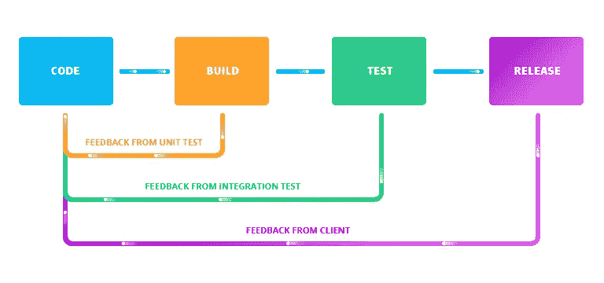

# 管道:通向持续发展的大门

> 原文：<https://medium.com/hackernoon/pipelines-your-doorway-to-continuous-development-43309c843f5a>

T 他的指南将帮助你将基于管道的连续交付引入你的[开发](https://hackernoon.com/tagged/development)项目。持续集成&交付不仅是本月的热门话题，也是行业标准。如果你想赶上最热门的 IT 趋势，这个指南是给你的。此外，如果你已经熟悉了连续方法。

## 本指南的目标

借助本指南，您将能够:

*   理解持续交付的概念
*   理解“交付[管道](https://hackernoon.com/tagged/pipeline)的概念，并了解如何使用它来自动化您的工作
*   掌握最佳实践并分析样品开发工作流程

## 为什么您应该关心持续交付

术语`continuous delivery`仍然有点令人困惑，因为它经常被替换为`continuous deployment`的概念，并且在`continuous development`的上下文中被提及。所有的短语都源于敏捷开发方法，在这种方法中，周期时间被尽可能地缩短。为什么？产品越快进入开发过程的下一阶段，您就能越快收到反馈，并能够交付另一个更好的版本——见下图。

当代码中的每个更改都变成部署时，更短的周期时间的优势是显而易见的，包括:

*   更快地交付新功能
*   即时接收反馈
*   提高质量
*   降低变更实施不成功的风险
*   节省手动执行任务所需的时间

为了从持续开发方法中获益，您必须尽可能地自动化您的工作。然而，CD 流程的实施可能会耗费时间和资源。在本指南的下一部分，我们将向您展示如何使用 Buddy 及其管道在大型和小型项目中轻松实现自动化持续方法。

# 想了解更多？点击这里查看全文。

> [黑客中午](http://bit.ly/Hackernoon)是黑客如何开始他们的下午。我们是 [@AMI](http://bit.ly/atAMIatAMI) 家庭的一员。我们现在[接受投稿](http://bit.ly/hackernoonsubmission)，并乐意[讨论广告&赞助](mailto:partners@amipublications.com)机会。
> 
> 如果你喜欢这个故事，我们推荐你阅读我们的[最新科技故事](http://bit.ly/hackernoonlatestt)和[趋势科技故事](https://hackernoon.com/trending)。直到下一次，不要把世界的现实想当然！

