# 像埃隆·马斯克一样推销:SpaceX BFR 发射的教训

> 原文：<https://medium.com/hackernoon/pitch-like-elon-musk-lessons-from-the-spacex-bfr-launch-2f947d0ad856>

埃隆·马斯克虽然不是最完美的演讲者，却发布了一些最强有力的产品公告。他的演讲的一些影响可以归因于他宣布的项目的大胆。然而，最大的影响在于他如何传递信息。他的演讲很好，足以掩盖他说话风格的随意性。大多数观众都想购买、加入或批评马斯克正在打造的东西。没有一个不受影响。

在这里，我总结和解构了埃隆最近宣布的 Space-X BFR(大猎鹰火箭又名大 F******火箭)，以获得组织伟大产品推介的步骤。事实证明，他过去的演讲是产品推介的绝佳参考。我想看看他的演讲在多大程度上遵循相同的模式，它们在哪里偏离，它们是如何演变的。希望这里的课程可以帮助创始人思考如何在他们的产品和公司发布会上产生最大的影响。

# 第一部分:愿景(即理想中的世界)

> “从根本上来说，如果我们是一个太空文明，多行星物种，那么[的未来](https://hackernoon.com/tagged/future)会比我们不是的时候更加令人兴奋和有趣。”
> 
> ——埃隆·马斯克

埃隆的演讲倾向于从描绘他所想象的世界开始。在这里，他解释了为什么多星球物种是一个伟大的想法。虽然这种愿景可能属于显而易见的想法，但埃隆利用了它对集体想象力的影响。他特意解释了星际生命将如何影响我们的未来，以此吸引观众的想象力。

这种方法稍微偏离了他通常的开场白，即不受控制的 GHG 排放的危险，或者在这种情况下，作为一个单一星球物种的长期厄运。

# 第一步——诉诸奇迹

事实证明，唤起人们对获得的渴望比唤起他们对失去或痛苦的恐惧更有效。后者是强大的，但伴随着恐慌、疲劳和失败主义的风险。这是气候变化倡导者(以及许多关注影响的企业家)所面临的挑战。

与对获得欲望的诉求密切相关的是对想象一个更美好的世界或充满奇迹的生活的诉求。他想用自己的愿景激励观众。

> “你希望早上醒来时觉得未来会很美好。”
> ——埃隆·马斯克

**你的产品的长期愿景有哪些吸引人的地方？你的演讲可以从描绘这个奇迹的样子开始，以及为什么它与观众当前的问题有关系。**

# 第二步——解释疼痛

这有助于像埃隆一样，用一点大棒跟随胡萝卜，并提醒人们选择你的愿景也意味着避免痛苦。多行星生命意味着逃避诸如人口过剩、资源最终匮乏和灭绝事件概率等问题。

这也有助于解释你过去的视野障碍是什么。这些可能是技术或成本障碍，就像埃隆的情况一样。目标是帮助改变人们认为当前可能的框架。埃隆帮助观众认识到，人类在科学进步方面的能力已经达到了以前被视为科幻小说的地步。他向我们介绍了非常具体的障碍以及 Space-X 团队为克服这些障碍而取得的进步(或计划取得的进步)。

您的演示可能不会留出太多时间来讨论这种程度的细节，但是如果您认为人们会有主要的异议或疑虑，那么提前面对它们会有所帮助。这与你刚刚描绘的愿景形成对比，将观众的注意力从怀疑带回跟随你的旅程，并挑逗每个人心中问题的答案，“如何？”

# 第二部分。第一个启示

> “去年，大多数人认为最终使火星适于居住的计划是不切实际的。所以今年，我们决定展示可行性证明。”
> —埃隆·马斯克

埃隆雄心勃勃的产品发布往往会面临相当多的审查，所以他花了大量时间证明怀疑者是错的。由于产品是一个集体使命的连续体(消除对人类的现存威胁)，他利用过去的成功作为参考点。在 BFR 的例子中，Space-X 可以展示一个时间表，证明他们正在改变太空旅行的动力。

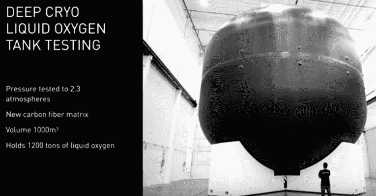

*图一。为 BFR 号提供动力的燃料。埃隆的演示是这个坦克爆炸。*

他展示了 BFR 号的主油箱，迈出了让怀疑者闭嘴的第一步。“我们开发了一种新的碳纤维基体，比以往任何时候都更强、更有能力。”埃隆声称。

对怀疑论者的第二次打击是，埃隆证明了“这能做到吗？”已经(在某种程度上)得到了回答。他通过图片和视频提供进度报告，这样观众就可以直观地看到项目。你的里程数可能会有所不同，但就像埃隆一样，你会面对那些希望看到证明你不全是空谈的怀疑者。

*图二。发射率的增长*

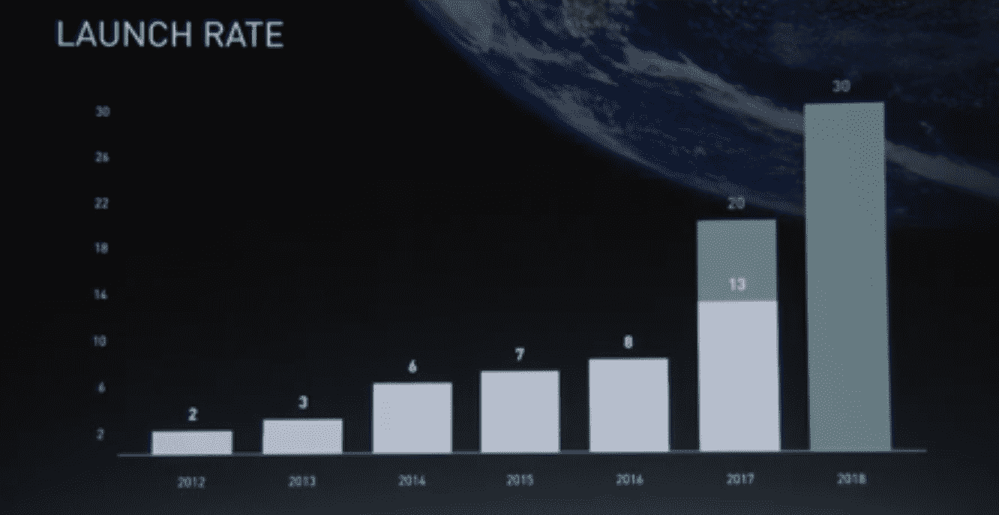

他声称，该项目不仅通过谈话，而且通过观众可以直观掌握和理解的媒介，一直在快速进展。上面的条形图显示了火箭自首次亮相以来在发射率方面的成功。

# 步骤 3 —演示

没有比让怀疑者安静下来更好的方法了，告诉他们你已经做了你声称的事情。即使你能展示的是测试版，展示也比讲述要好一个数量级。

您可能不需要(或没有时间)向观众展示完整的演示，但您希望展示一些代表您实际上已经构建了一些东西的东西。*即使是蒸汽器皿也能产生强大的效果*

展示产品时，人们往往倾向于首先分享产品的特性或技术规格。虽然这两个方面的一些接触点可能有助于回答显而易见的问题，但你最好先把注意力放在好处上。更好的是您的解决方案提供的优势与现有解决方案的对比。如果你的产品代表了以前从未有人做过或者已经尝试过但失败了的东西，使用一个人们能理解的类比可能会有帮助。例如，埃隆把 BFR 飞船比作一架飞机。

你可以通过多种方式分享利益。一种是使用类比，如上所述，比如宇宙飞船从一个国家到另一个国家的速度与普通飞机相比。请注意，这个具体的例子是埃隆采用的大师级工艺，我们稍后会了解到。另一个是解释你的产品的优点是如何从早期的测试版本发展而来的。还有一个是解释你的解决方案是如何构建的，以继续发展利益，例如，通过规模经济降低成本，或通过网络效应提高价值。

如果你展示的是产品效果图，相对于你的大视野来说，非常接地气是值得的。虽然一张地球化火星的渲染图令人印象深刻，但它仍然给埃隆过去的演示留下了太多的疑问。在这种情况下，他展示了设备的效果图，这是到达那里的第一步，火箭飞船。

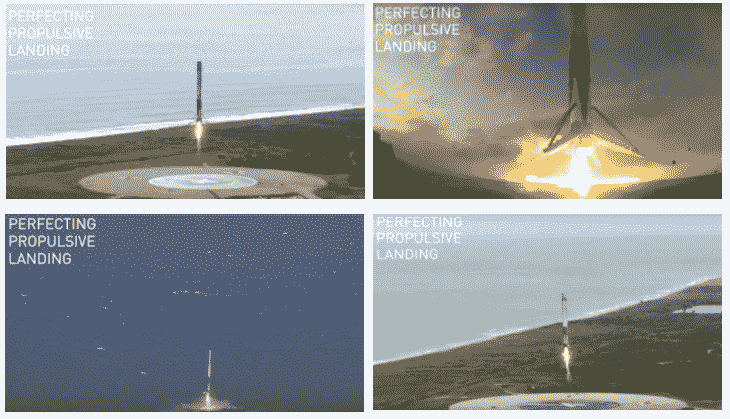

*图 3。完善推进着陆。Elon Musk 通过展示火箭在不同地形上成功着陆的不同场景，展示了推进着陆的进展，展示了其可靠性。*

# 步骤 4 —规格

虽然功能经常会让观众厌烦和分心，但有时突出功能有助于提醒人们你正在构建的东西很难做到。虽然你可能想也可能不想直截了当地说出来，但详细说明制作该产品的一些组件可能会非常有用。

为了让项目对观众有意义，埃隆·马斯克讨论了使其能够运行的船的规格，并简化了每个部分，以便每个人都理解他们在项目中的重要性。

浏览规格是强调优势的另一个机会。这也是一个展示多于讲述的机会。额外的图片、视频剪辑或以不同的角度展示产品可能会有所帮助。

这一步的主要价值在于，通过展示具体的功能决策如何影响收益，让整个事情变得可能，变得更好，从而进一步消除观众的疑虑。额外的价值在于表明你和你的团队为制造一个伟大的产品付出了很多，而复制你的努力是非常困难的。

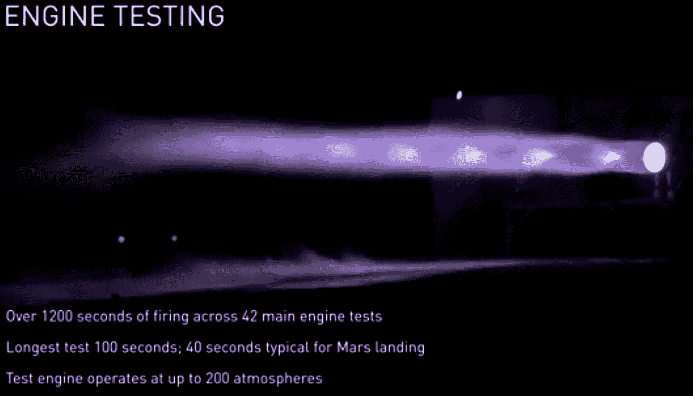

*图 4。BFR 的发动机测试*

“猛禽发动机将是有史以来任何飞行器中推力最大的发动机”，埃隆如是说。鉴于上图中描述的发动机规格，这是航天项目朝着正确方向迈出的一大步。发动机的规格确实超出了任何航天项目的图表。

# 第三部分。我们是如何来到这里的

在 Elon Musk 演示的这一部分，他后退一步，回忆起 SpaceX 项目开始的时候。这很重要，因为它开始回答“为什么是我们？”。就 SpaceX 而言，这是一个不得不从首批猎鹰火箭的多次失败尝试中吸取教训的团队。

埃隆·马斯克将猎鹰项目与 BFR 项目进行了对比，不仅展示了太空旅行技术的发展，还展示了它们如何通过项目的连续迭代取得进展。这与主要智能手机品牌通过对比新旧技术来展示其旗舰设备的方式类似。埃隆·马斯克甚至表示，你可以在 BFR 的有效载荷部分安装一堆猎鹰 1 号宇宙飞船。这让观众了解了他们在开发的早期阶段是如何进步的。

# 步骤 5——团队努力

你可能已经介绍过你的团队，通过出示证书或在你的介绍中来消除疑虑。虽然你可以利用这个机会第一次展示你的团队的优点(过去的公司和成就)，但这实际上是展示你的团队一起做了什么。

有很多方法可以做到这一点。一种是解释你的团队在这个项目中所经历的时间长度和努力程度。另一种方法是简单谈谈你的团队过去是如何一起克服困难的。还有一个是展示产品本身的进步(就像埃隆做的那样)。“我们搞砸了猎鹰 1 号的前 3 次发射，但谢天谢地，第 4 次发射是成功的”，埃隆在回顾 SpaceX 的早期阶段时说。

这里的目标不是列出一份简历，而是展示你有能力推出一款优秀的产品，这可以从你的团队已经取得的进步中得到证明。推论是，你有团队活力和性格来继续实现期望。你甚至不一定需要详细谈论团队或团队成员。你的产品和牵引力可以说明一切。

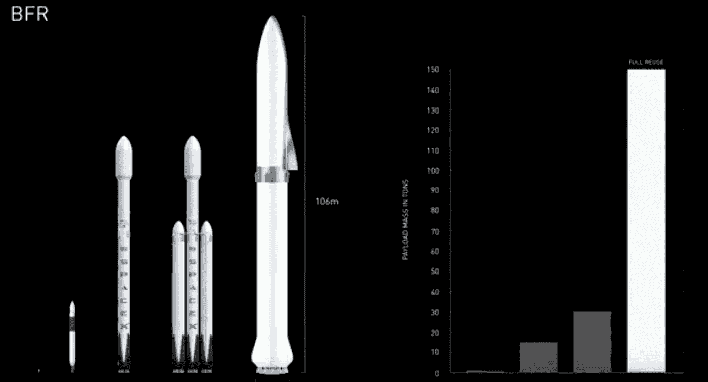

*图五。从猎鹰 1 号到 BFR*

从上面的图中，我们观众可以看到 SpaceX 项目的指数增长，不仅是 BFR 与早期猎鹰项目的尺寸差异，还有能力差异。

# 第四部分。这是一个 BFD 又名我们如何取胜

接下来，埃隆展示了 BFR 的工程设计，并强调了当前版本如何超越了之前的设计。他讨论了这一点和其他几个产品决策，以继续展示团队如何从以前着陆失败的错误中吸取教训，以及他们如何从工程角度调整他们的方法。这种对产品的持续深入研究进一步加深了他消除疑虑的努力。

这也使他的演示与竞争对手形成对比。他继续展示 BFR 的能力，将它与其他著名的宇宙飞船如土星五号进行比较。例如，他解释了 BFR 如何在有效载荷方面超越竞争对手。

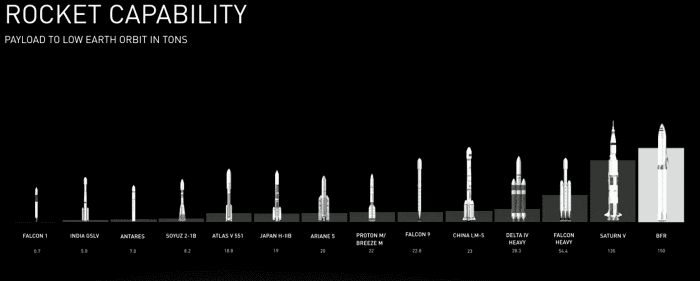

*图 6。BFR vs 竞争对手*

正如观众从上图中看到的，就其能够携带的有效载荷量而言，BFR 超过了所有其他航天器。"值得注意的是，BFR 比土星五号具有更强的能力，甚至完全可重复使用."埃隆声称。

他进一步向观众展示了与这些宇宙飞船相比，BFR 的性价比有多高。他在这里强调，BFR 将花费最少的钱发射，提供更多的能力，并可重复使用。

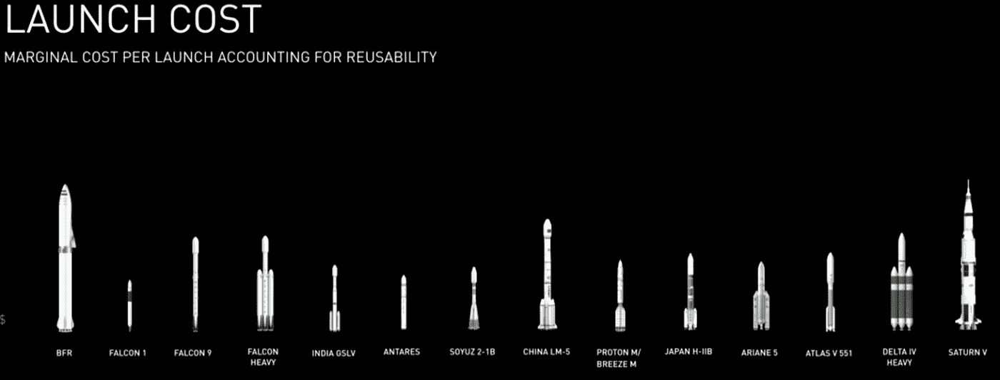

*图七。BFR vs 竞争对手的投放成本*

# 第六步——竞争

不管你喜不喜欢，也不管你知不知道，你推出的任何东西都会面临竞争。这包括与不作为(惰性甚至安于现状)竞争。因此，有必要画出清晰的对比，让你的产品优势非常明显。如果你幸运地属于你自己的联盟，你甚至可以展示你是如何让你自己的产品过时的。

在埃隆的案例中，他帮助观众认识到，不要在飞机到达目的地后就抛弃它是多么重要。“我们如何制造这种复杂的火箭，然后每次飞行时都让它们坠毁，这真是太疯狂了，太疯狂了！”埃隆表示。飞船的主要燃料成本很低。显然，仅仅给宇宙飞船加油的成本比让另一艘宇宙飞船飞往另一个目的地的成本要低。没有其他竞争系统提供这一点，现在很明显，不努力实现这样的系统是多么愚蠢，SpaceX 赢了。

在这一步，埃隆主要展示了 BFR 的好处，以及它如何影响当前的太空项目。在许多情况下，BFR 在效率和成本以及外形和功能方面都是一大进步。这诱使观众相信这个项目真的是独一无二的。"可重复使用绝对是最基本的，再填充航天器是非常有价值的."埃隆在强调 BFR 的可重用性时声称。

至少，这一步是你继续强调产品独特优势的机会。如果可以的话，展示一下你是如何用一千个利益削减来杀死竞争对手的。

# 第五部分:大揭露

鉴于该项目的轨迹，埃隆·马斯克声称登陆火星将在 2022 年成为可能。由于火星和地球每两年同步一次，SpaceX 还计划在 2024 年前让 4 艘飞船登陆火星。这种频繁的着陆导致了火星基地的建立，最终延伸到一个城市，为地形改造铺平了道路。但是这些都不是大揭露。

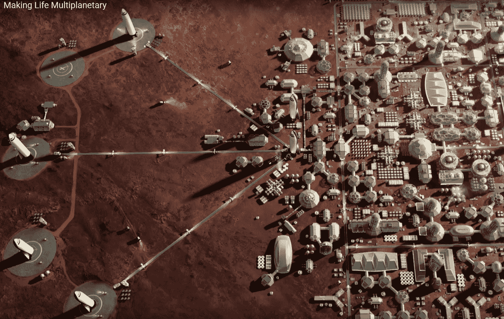

*图 8。火星的地形改造*

“如果你建造一艘能够去火星的船，如果你乘坐同一艘船，从地球上的一个地方到另一个地方，会怎么样？”埃隆·马斯克(Elon Musk)就即将发生的事情调侃观众。

一个重大发现是，利用 BFR 在地球上进行运输也是可能的，这预示着国际旅行的一场革命。因此，从洛杉矶到多伦多的距离只需 24 分钟。*哇哦。*

你可能还记得，在伊隆之前的演讲中，关于行星旅行的说法被用来戏谑你可以把飞船想象成飞机的事实。他多次这样做，似乎是为了创造一种模拟，人们可以用它来更好地了解 BFR 火箭的威力。但是当他说 BFR 的速度如此之快，可以与航空公司竞争，从北美到欧洲的航班将需要 30 分钟时，他故意让观众认为 BFR 是一架民用飞机。只是一个又大又快的。

因为他已经引导观众相信殖民月球和火星的更大愿景的可行性，所以超音速旅行似乎是小菜一碟。

*图九。穿越 BFR 的国际旅行*

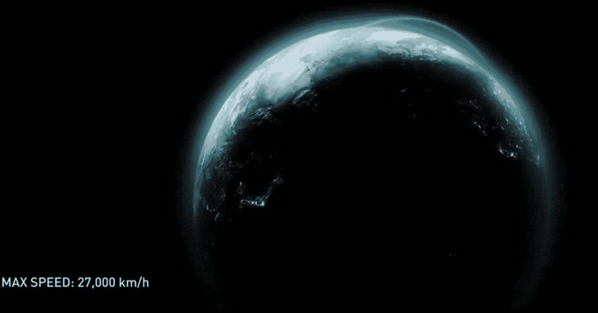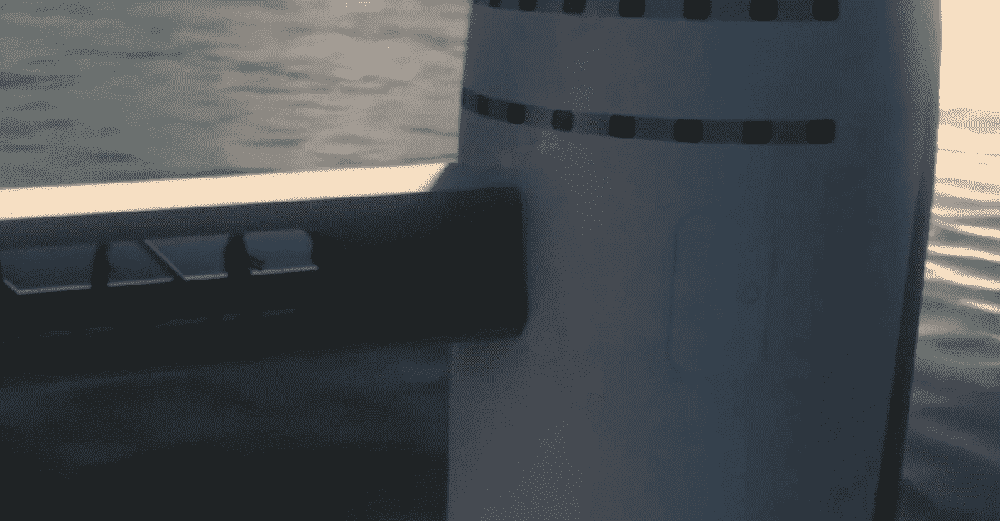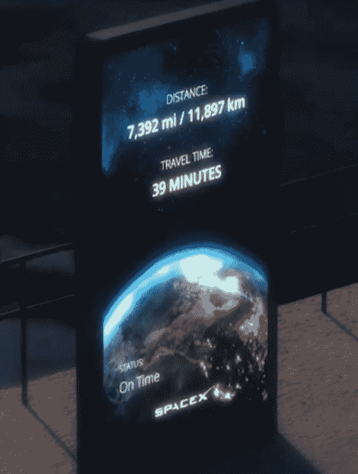

# 第七步——下一步是什么

你的产品可能不是宇宙飞船或火箭(也许是)，但这并不意味着你不能采用同样的“给他们看星星，给他们月亮”的技巧。你和你的观众已经被你的产品所提供的宏伟愿景所吸引。如果你的愿景真的很宏大(如果是这样的话，你在筹款方面的情况会好很多)，而且非常可信，那么剩下来达成协议的就是给观众一些他们今天可以理解的东西——但不是任何东西。一些几乎和你的大愿景一样大胆，但相比之下更可信的东西。

同样，如果你的愿景是宏伟的，并且你正在创造一个真正伟大的产品，你可以发布的产品的下一个功能或版本应该是非常令人印象深刻的。哪怕只是和你的长远眼光有一点点关系。尤其是如果它进一步在想象中创造了通向那个愿景的桥梁(例如，“哇，我可以乘坐宇宙飞船飞**到地球的另一边！”)**

陈述的最后一步是你给怀疑的棺材钉上最后一颗钉子的机会。这是一个让你的观众知道他们可以加入的机会。你是在告诉观众你的愿景，一个更好的未来版本，接下来的步骤是什么，并邀请他们加入。