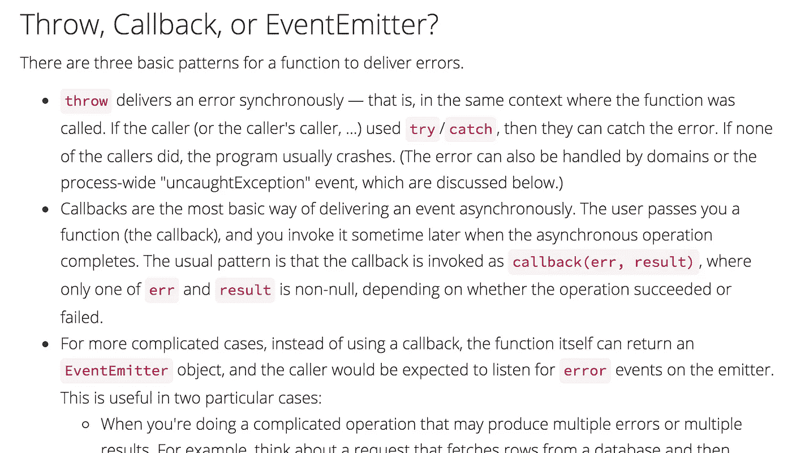

# Node.js 的陷阱

> 原文：<https://medium.com/hackernoon/pitfalls-of-node-js-c4055dfecd8e>

最近，我写了很多 Python 和围棋，但如果你了解我，你会知道[我](http://tejas.io/) [曾](http://www.meetup.com/nashjs/events/224842082/) [曾](/@tejasmanohar/i-m-on-the-koa-js-team-14a72717504d#.k4vvn14ni) [一个](/@tejasmanohar/babel-6-and-mocha-657923628b9c?source=user_profile---------4-) [少校](/@tejasmanohar/understanding-es6-const-ab448906c4e1?source=user_profile---------10-) [Node.js](https://nodejs.org/en/) [主将](https://github.com/tejasmanohar/npm-algos)。最近，当我不得不伸出手指写一个快速的“生活帮”或数字处理脚本来加快我的一天时，我没有想到 JS，所以我肯定不能再把它称为我的首选语言。也就是说，既然我曾经做过，我相信我有权利批评它…所以，让我们开始吧。

## 标准程序库

Node 的标准库尽可能的小。尽管这是鼓励社区建立库的好方法，但它也使得标准化和进一步构建任何东西变得更加困难。

但是，不要误解我——在使用过 [Ruby](https://hackernoon.com/tagged/ruby) 和 [Python](https://hackernoon.com/tagged/python) 之后，我强烈反对庞大、深度的标准库。相反，我更喜欢像 Go 和 Java 那样庞大而肤浅的标准库。不同之处在于，这些标准库提供了解决最常见情况所需的所有工具和扩展所需的绑定，而 Node 的标准库只提供了构建工具以解决最常见情况所需的所有(主要是本机)绑定。代替[另一个](https://github.com/github/fetch) [HTTP](https://github.com/request/request) [客户端](https://github.com/mzabriskie/axios)，我们开发了[种方式](https://github.com/f2prateek/train) [到](https://github.com/tylerb/graceful) [增强](https://github.com/gorilla/mux)标准实现，这种方式几乎在任何地方都可以重用。

## 错误处理



Joyent [post](https://www.joyent.com/node-js/production/design/errors) on “Error Handling in Node.js”

如果上面的片段还不够，看看下面的:

```
function onError(err) {
    log.fatal({
        code: 1,
        err
    }, 'process exit');
    process.exit(1);
}process.on('unhandledException', onError);
process.on('unhandledRejection', (p, err) => onError(err));
```

异常冒泡让应该在调用点处理的错误无休止地传播，而无所不包的处理程序只是糟糕的语言结构的一种变通方法。当一个关键函数的第 *n* 级调用点的控制流可以在没有注意到的情况下影响整个错误处理场景时，要意识到您的更改的影响要困难得多。更重要的是，可子类化的*错误* s 促进[断言类型错误，而不是行为错误](http://dave.cheney.net/2014/12/24/inspecting-errors)。

## 同步码

尽管异步 I/O 很重要，但它不是一切。如果有的话，我会说忘记这是 Node 迄今为止最大的缺点。Node 迫使您处处考虑并发性，而 Go、Lua、Python(尽管还有其他问题)和其他语言允许您根据需要将它合并进来，而无需切换范例。

澄清一下，你可以——我也愿意相信我已经——在 Node 中用更新的构造实现了这一点，比如基于[生成器的协程](http://tobyho.com/2015/12/27/promise-based-coroutines-nodejs/)和[异步/等待](https://zeit.co/blog/async-and-await),但是它们从来都不是一流的，它们需要大量的部落知识以便有效地利用[所有](https://www.promisejs.org/)[其他](https://bjouhier.wordpress.com/2012/03/11/fibers-and-threads-in-node-js-what-for/) [范例](http://blog.yld.io/2015/12/15/using-an-event-emitter/)[社区](http://zef.me/blog/6096/callback-free-harmonious-node-js) [跟随](https://howtonode.org/step-of-conductor)。如果你不相信我，试着从头开始教这些。

# 以及超越！

现在，我不是说 Node.js 是一个糟糕的平台；我只是说给其他平台一个机会，看看情况如何比较！当我被困在 Node land 时，我经常通过盯着例子笑着来评估其他平台，我见过很多(但不是全部！)JavaScript 开发人员也是这样做的，但是，通过走出我的舒适区，我明白了如果不与它建立牢固的关系，就不可能有效地批评它，对于语言来说，这包括调试、解决异常情况以及学习细节。

我在这里真正想指出的是 Node.js 带来的一些权衡，以及我很高兴看到更多内置的东西，此外，**在**(特别是在工具方面)其他平台之上。

> 黑客中午是黑客如何开始他们的下午。我们是这个家庭的一员。我们现在[接受投稿](http://bit.ly/hackernoonsubmission)并乐意[讨论广告&赞助](mailto:partners@amipublications.com)机会。
> 
> 要了解更多信息，[请阅读我们的“关于”页面](https://goo.gl/4ofytp) , [喜欢/在脸书给我们发消息](http://bit.ly/HackernoonFB)，或者简单地，[发推文/DM @HackerNoon。](https://goo.gl/k7XYbx)
> 
> 如果你喜欢这个故事，我们推荐你阅读我们的[最新科技故事](http://bit.ly/hackernoonlatestt)和[趋势科技故事](https://hackernoon.com/trending)。直到下一次，不要把世界的现实想当然！