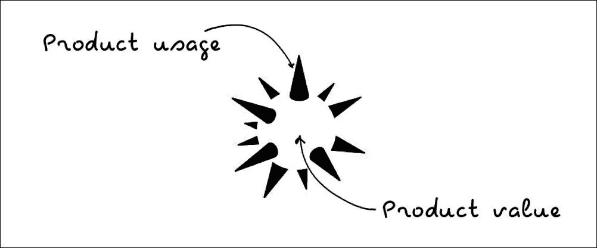
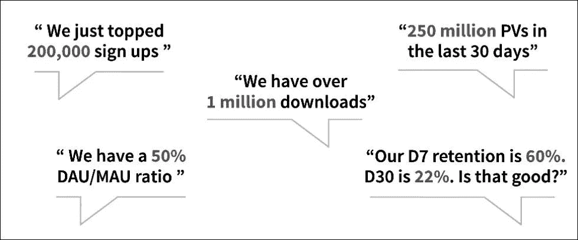
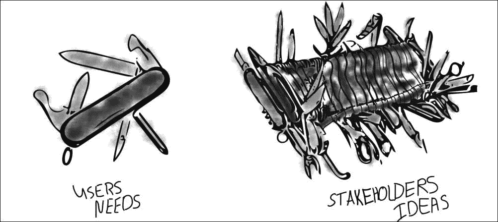
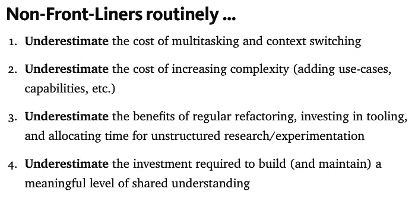

# Pivot 产品热卖—八月版

> 原文：<https://medium.com/hackernoon/pivot-product-hits-august-edition-84ab6ec45686>

# [什么(确切地说)是反活性使用产品？](https://cur.at/mQIO0uw?m=web&sid=ELo1d8v)

Plainflow 的莱昂纳多·费德里科说,[参与度](https://hackernoon.com/tagged/engagement)是一个滞后指标。

*总而言之:*大多数产品经理都将用户参与度作为他们产品的一个关键“衡量标准”。但是用户时间是有限的，需要我们关注的多种产品对我们生活的影响是不断的分心(从通知中)和上下文切换。

“反活性使用”产品终结了这一逻辑。使用反活动使用产品，用户不需要做任何事情。该产品在完全自主的情况下工作，但仍能交付成果。

通过节省用户最宝贵的资源(时间)，反活跃使用产品挑战了我们对保留和产品参与的先入之见，并为价值交付设定了新的标准。

# 人们真的(真的)在使用你的产品吗？

作为对莱昂纳多上述帖子的反驳，格雷洛克的乔希·埃尔曼解释了为什么用法仍然是大多数人最重要的信号。

*综上:*作为产品经理，很容易迷失在虚荣的指标和数据点中。然而，产品经理*真正*需要考虑的唯一事情是:

*   人们在使用你的产品吗？
*   他们按照你的期望使用它吗？
*   他们的表现是否符合你的预期？

你想了解哪些用户比其他人更有可能回来。那些极有可能回来的是你的核心用户。你想让大多数新用户在第一个月就转化为核心用户。

一旦你可以预测哪些用户是核心用户，你就可以开始计算他们做了什么来增加成为核心用户的可能性。首先，根据人们在第一个月访问你的产品的天数，计算他们在第二个月再次访问你的产品的可能性。

# [功能蠕变不是真正的问题！](https://cur.at/x7kISF3?m=web&sid=ELo1d8v)

Hiten Shah 说:“功能蔓延掩盖了无法执行产品核心价值的事实。”。

*总之:*如果您正在与功能蔓延做斗争，那么您实际上正在经历一些根本问题的显现。

可能是因为你不知道你的市场需求是什么。随着您的成长，您会获得具有不同需求的新客户群。为每个细分市场构建与你的总体产品愿景无关的功能太容易了。

产品经理的工作是确保内部每个人对你正在构建的东西有相同的理解。你让每个人都有发言权，弊大于利。

沉迷于功能蠕变是不会成功的，你会通过解决真正的潜在问题而成功。为了避免功能蠕变，要清楚你的产品是什么，以及如何最好地交付给每个客户群。

# 人们需要我的产品！

但是他们想要吗？贾斯廷·杰克逊问道。

*简而言之:*成功营销产品的唯一方法是制造人们想要的东西。识别“需求”是不够的。人们很难去做他们知道对他们有益的事情。好处是未来太远。为了长期健康，人们需要减肥，但大多数人并不这样做。

但是，有*的*产品可以帮助人们减肥，远离化石燃料。那么，他们的秘密是什么？他们以人们想要的形式包装他们的产品。

为了帮助减少碳氢化合物的排放，埃隆·马斯克从人们想要的东西开始:一辆快速、豪华的汽车(Model S)。

顾客在情感上购买，然后用逻辑使他们的购买合理化。要想成功，就要做一些能给用户带来快速收益的东西，然后随着时间的推移继续提供价值。

# [不要只为高级用户构建产品！](https://cur.at/PLGUFmx?m=web&sid=ELo1d8v)

Amplitude 的马克·东丹维尔说，要小心那些敢于直言的少数派。

*总之:*超级用户经常使用你的产品，对它了如指掌。与普通用户不同，他们会给你反馈，并留下评论和应用内评论。

但是超级用户只占你总基数的一小部分。作为产品经理，你的目标是吸引新用户，把他们变成普通用户，然后是超级用户。

倾听客户的意见让你了解他们的需求。但是高级用户遇到的问题通常只适用于他们自己，而不适用于更广泛的用户群。

确保你倾听所有用户的意见，而不仅仅是大多数人的意见，并且产品团队致力于尽快将新用户转化为高级用户。

# [订阅产品是坏演员吗？](https://cur.at/gSHVKJh?m=web&sid=ELo1d8v)

吉斯·贝莱说:“我对旧版本很满意。”。

*简而言之:*你还记得什么时候你可以购买 Word、Excel 和 Windows 的永久许可，而这种许可几乎从未改变过？所有这些现在都可以订阅。为什么？因为永远租用软件显然比购买软件花费更多的钱！

尽管 SaaS 目前很受欢迎，但当纯粹为了减轻产品团队不断创新和交付价值的压力而引入订阅模式时，这对客户来说是不好的。

# [产品经理应该彻底坦诚吗？](https://cur.at/LHvUNuF?m=web&sid=ELo1d8v)

激进的坦诚是弥合毁灭性的同理心和令人厌恶的攻击性之间的鸿沟的一次大胆尝试。多亏了金·斯科特的同名[书](https://hackernoon.com/tagged/book)，在过去的两年里，这已经成为一个‘热门’的商业话题。

本质上，它是一个沟通框架，允许从业者在真正的同理心、批评性反馈和艰难的决定之间游走。然而，它与一些可疑的行为联系在一起，比如“背后捅刀子”，并被用作工作场所敌意的借口。

大多数产品经理在他们的交流中是善意的，但是很容易回到老习惯。有些人天生倾向于“取悦他人”，而有些人则不那么感同身受。理解极端坦率的概念让我们更加意识到自己的自然倾向。

## 特色产品活动

# [让任何人使用你的产品的策略](https://cur.at/GATBrtg?m=web&sid=ELo1d8v)

感谢上个月来参加我在伦敦的[产品统计](https://cur.at/gG4Oueu?m=web&sid=ELo1d8v)讲座的所有人。对于那些未能到场的人，这里是会议的幻灯片。

遗憾的是，大部分音频都从镜头中丢失了，所以实际的演示是不可用的。但是感谢 SC 和 Gunita 邀请我，我绝对可以推荐他们的月度会议。

## 本月产品报价

## 关于构建软件产品的常见误解。

来自约翰·卡特勒的一份伟大的清单。

最初发布于 [Pivot 产品点击](https://pivotservices.curated.co/)。