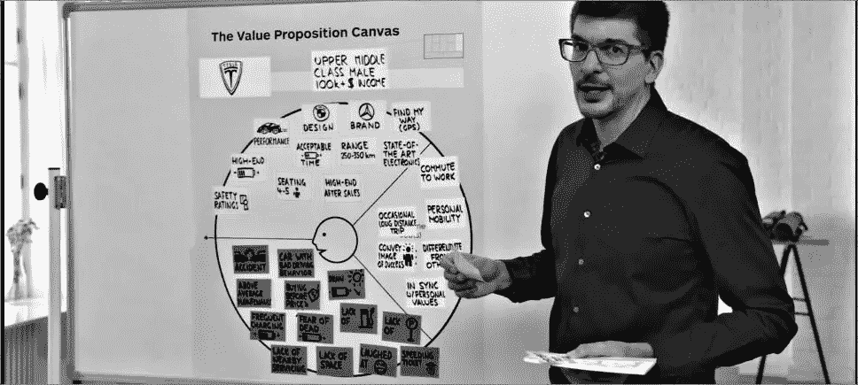
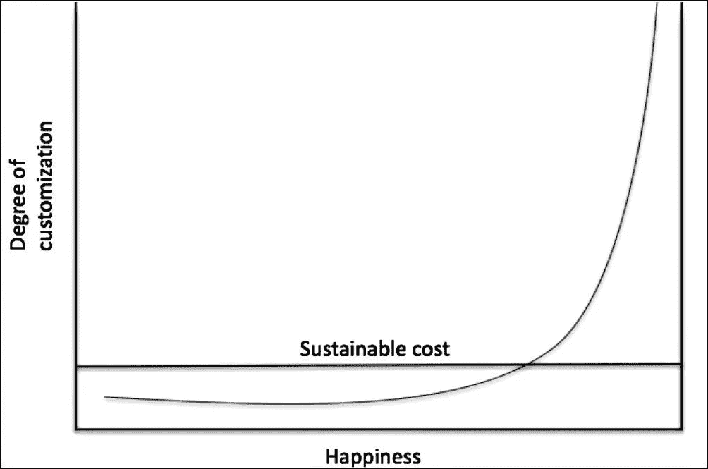
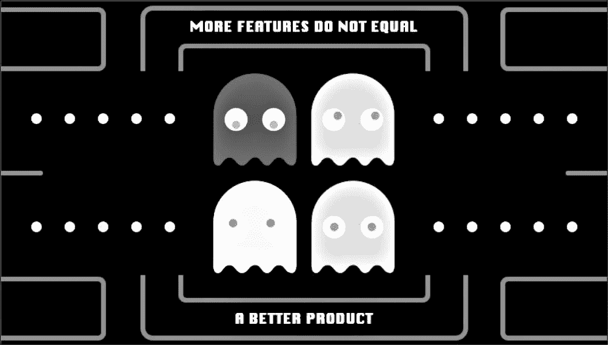

# Pivot 产品精选| 11 月版

> 原文：<https://medium.com/hackernoon/pivot-product-hits-november-edition-3a5d8e3e9b44>

# [产品战略工具集](https://cur.at/seB1H2y?m=web&sid=ELo1d8v)

亚历克斯·奥斯特瓦尔德的油画大师班。

*总之:*在初创公司和科技公司，向同事推销产品战略的价值可能很有挑战性，因为这里的主流文化是编码而不是说话。为了取得成功，产品经理需要部署在最短时间内交付最大价值的[工具](https://hackernoon.com/tagged/tools)和方法。

在我的经验中，最有效的组合是 Alex Osterwalder 的价值主张画布和[价值图](https://cur.at/kBC7bp7?m=web&sid=ELo1d8v)结合 Ash Maurya 的[精益产品画布](https://cur.at/GLMYoEO?m=web&sid=ELo1d8v)。这些可以由一个团队完成，易于使用，并围绕目标客户、要做的工作、价值主张和市场渠道迅速达成交易。

在这篇精彩的短文中，Alex Osterwalder 使用价值主张画布展示了特斯拉如何满足其各种目标客户的需求。

# [什么是(确切地说)产品定制曲线？](https://cur.at/PLunsLM?m=web&sid=ELo1d8v)

YC 公司的 Aaron Harris 说，在产品开发中，没有一件事能让所有用户都满意。

*总而言之:*如果你是一家[初创企业](https://hackernoon.com/tagged/startup)，任何一个愤怒的客户都会觉得自己是世界末日。这经常导致产品团队创建不可持续的产品定制。最大的危险是承担难以消除的巨额成本。这样做可能会迫使你的公司走向失败或极端。

更难的事情是，根据你真正想要的用户的快乐程度的增加，来决定定制什么。

作为一个指导原则，作为软件特性的定制比涉及人员流程的定制更容易构建。如果您必须构建一个人员流程，那么构建一个以后可以用软件替换的流程。

# [不投资产品，投资客户](https://cur.at/BG45gDt?m=web&sid=ELo1d8v)

Vonjour 的丹·陶菲克说，这不是特征问题。

*综上:*产品是创业公司的基础。产品的第一次迭代交付了公司未来几年交付的核心价值。但产品中的小迭代只是交付边际回报。如果你没有以一种有意义的方式获得用户，你就没有给你的企业生存的机会。

在创建 Vonjour 时，Dan 的团队迅速开发了新功能，认为每一个功能都是一个转折点。(“票务将会改变游戏规则……”)但是，在增长方面，没有一个人有所作为。

最终，他们停止开发功能，将剩余的资金投入到市场营销中，而不是产品上。在这样做的时候，他们发现他们注意到的不完美对用户来说不是问题。大多数人对产品的现状非常满意。

# [用人工智能设计产品](https://cur.at/1QqThkE?m=web&sid=ELo1d8v)

用人工智能设计就像设计其他东西一样。脸书大学的 Erica Virtue 说，关注人们的问题，测试你的假设，并在出现问题时提供启示。

*总而言之:*人工智能的魅力在于它能让你的产品“神奇地”工作。

但是好的产品设计使用人工智能的方式是增强体验，而不是定义体验。在研究脸书建议的同时，埃里卡的团队并没有试图发明一种全新的行为。相反，他们找到了一个现有的，并做得更好。

即使你的人工智能大部分时间都在工作，也会有失败的时候。因此，真人可用性测试仍然很重要。通过观察人们早期的经历，Erica 的团队发现了他们在人工智能方面的许多问题，否则他们不会注意到这些问题。

# [特色/产品/公司？](https://cur.at/jUCkAdS?m=web&sid=ELo1d8v)

*简而言之:*大多数公司都是从功能和产品之间的某个地方起步的。这也是大多数公司的最终目标，一系列看起来像产品但实际上介于两者之间的功能。

特性为用户提供特定的积分值。产品将相关的功能组合在一起，解决普遍存在的问题。机会越大，解决方案越普遍，专注就越有回报。

Instagram 在一个产品中内置了一系列相对简单的功能。但是机会太大了，他们能够通过把用户整合成更大的东西，把产品变成一个公司。

这些功能在用户群中无处不在。他们以一种适合所有人的方式解决了一个许多人都需要的问题。

# [如何做出毫无疑问的产品决策](https://cur.at/IVLIEu5?m=web&sid=ELo1d8v)

当你怀疑自己的产品决策时，退一步问自己:我对这个世界的信念是什么，这是否会把我们推向那个方向？Slack 的保罗·罗萨尼亚问道。

*总之:*从在 Twitter 上引入算法时间线，到默认为 Slack 的所有用户打开“请勿打扰”功能，保罗·罗萨尼亚已经主持了科技界一些最引人注目(也是高风险)的产品决策。

这种性质的产品决策可能会瘫痪信仰行为。但是，保罗给产品经理的建议不是回避批评，而是一头扎进他们的疑虑中。

从通过电子邮件进行辩论开始，提供直接的人际接触来征求反馈。这个过程将帮助你回到你的产品的目的，你的公司的世界观和(关键的)你的本能。

# 【WhatsApp 和脸书如何规模化设计产品

WhatsApp 的查理·迪茨(Charlie Deets)表示，在开发一款产品时，有一个明确的问题需要解决，这可能是成功的一半。

*总而言之:*脸书用高层次的使命来推动公司决策，而 WhatsApp 用设计原则来聚焦产品对话，因此他们的大部分思维都集中在执行的细节上。

与 FB 不同的是，WhatsApp 更喜欢用**而不是**来提醒人们产品中的新功能。他们认为，如果他们构建了明显有用的功能，人们会发现它们，参与度自然会随之而来。

如果 WhatsApp 有一个产品座右铭，那就是“缓慢而审慎地前进”当设计师移交给工程师时，他们试图交付尽可能多的最终规格。

# 本月产品报价

> [“长话短说。尊重用户的时间。说重点，别挡道。”](https://cur.at/eJvxGp0?m=web&sid=ELo1d8v)

Clearleft 的语音产品设计入门。

最初发布于 [Pivot 产品点击](https://pivotservices.curated.co/)。