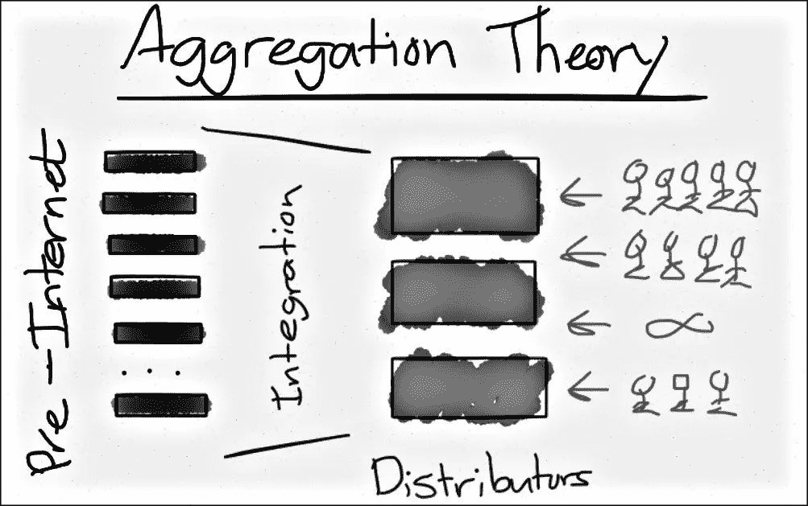
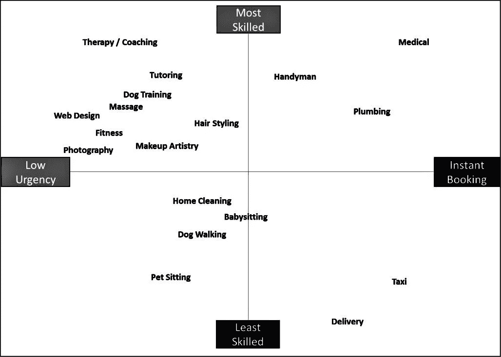
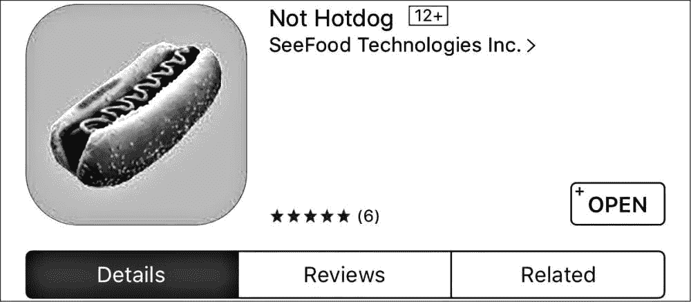
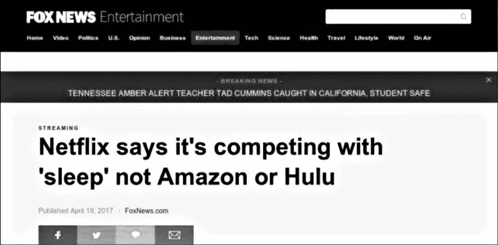

# Pivot 产品点击率—10 月版

> 原文：<https://medium.com/hackernoon/pivot-product-hits-october-edition-8c846b957591>

# [聚合理论|产品大创意](https://cur.at/ZdPQRBO?m=web)

本·汤普森(通过他的 strategery 品牌)无疑是目前最有影响力的产品战略评论员，而聚合理论就是他的相对论。“大创意”对一切都有意义。

*综上所述:*聚合理论描述了*某些平台公司*(如[脸书](https://hackernoon.com/tagged/facebook)、[谷歌](https://hackernoon.com/tagged/google)、优步)是如何以如此系统的方式主宰他们的行业的。这也解释了为什么它们的估值如此之高。在投资者眼中，他们在玩零和游戏。

本认为，聚合器具有以下特征:

*   他们与用户有着直接的关系
*   他们“出售”的商品是数字化的，因此边际成本为零
*   他们“出售”的商品是通过互联网交付的，这意味着零分销成本
*   他们的交易通过信用卡或贝宝等自动处理

聚合器喜欢赢家通吃的效果。随着聚合器对用户的价值不断增加，竞争对手越来越难夺走用户或赢得新的用户。

聚合器有不同的类型(网飞不同于优步，不同于脸书)，甚至有*超级聚合器*。但它们的潜力是一样的:随着客户获取成本的降低，边际客户会被越来越多的供应商吸引到这个平台上来。

# [人工智能将如何影响产品战略？一个思维实验](https://cur.at/yePhh9Z?m=web)

HBR 的 Ajay Agrawal 说，随着人工智能的进步使得预测变得更便宜，亚马逊的策略可能会从购物然后发货转变为运输然后购物。

*综上所述:*人工智能从根本上说是一种预测技术。那么，如果像亚马逊这样的公司的数据科学家、工程师和机器学习专家提高了预测机器的准确性，会发生什么呢？答案是，预测变得如此准确，以至于他们向您运送货物变得更加有利可图*预测*您会想要什么，而不是等待您订购它们。

如果在今天实施，收集和处理退回物品的成本将超过收入的增长。但是，更好的预测将吸引更多的购物者，他们将产生更多的数据来训练人工智能，这将导致更好的预测，创造收入增加和回报降低的良性循环。

# [产品经理竞争分析](https://cur.at/kdhDm2S?m=web)

Philosophie 的克里斯·巴特勒说，如果你不明白竞争分析如何影响你的战略，那它就是浪费时间。

*简而言之:*竞争分析本质上是将你的战略与竞争对手的战略进行比较。了解你的竞争对手是如何看待这个世界的，以及你的(潜在)客户对他们的感觉是非常有益的。

竞争分析有助于构建你自己的产品环境，发现你的客户的其他问题，甚至团结团队对抗共同的敌人。

但是，因为你的竞争对手而不是你的客户需要的结果做出太多的选择，会让你受到他们的摆布。不管客户对你目前的产品有什么看法，你都是在与他们对你的竞争对手的看法作斗争，而不是与他们产品的特点作斗争。

# [考虑建造“X 的优步？”](https://cur.at/JrZl3lE?m=web)

PocketSuite 的萨姆·马登(Sam Madden)表示，提供一项服务所需的技能越丰富，传统的优步模式就越不可能奏效。

*总之:*在你开始构建下一个“X 的优步”产品之前，想清楚一些基本变量。

从消费者的角度来看，仔细想想你正试图颠覆哪种类型的服务行业，以及该行业在技能与紧迫性图表中的位置。这将有助于最大限度地方便客户。从正面来看，考虑客户转换与保留需求，并优化最高和最经济的利用率。

您的产品需要考虑所需的定制服务或项目、对专业人员是否适合工作的理解以及传达请求的灵活性。

价值最大化意味着为客户提供最大的便利，为专业人士提供最大的利用率。

# [产品中的 AI 只是炒作吗？](https://cur.at/WZhfCTb?m=web)

麻省理工学院的詹姆斯·萨默斯说，任何看过杨坚的应用程序在硅谷给所有食物贴上‘热狗’或‘非热狗’标签的人可能都不会意识到这一场景有多准确。

对于每一家初创公司和科技公司来说，随意谈论他们如何“利用人工智能”来提升产品价值是一种新常态。在大多数情况下，这些主张忽略了两个基本事实。第一个是机器学习适用所需的数据集的庞大规模，第二个是这项技术仍然有多么有限。

为了让一个人认出热狗，你给她看热狗。要让深度学习系统识别热狗，你可能需要给它喂 4000 万张热狗图片。

# [为新兴市场打造产品](https://cur.at/BGiERvS?m=web)

谷歌的 Alyssa Maharani 表示，产品经理在当地面临的挑战可能与在发达国家截然不同

*总之:*对于世界上大多数人来说，互联网仍然缓慢且不稳定。确保您的产品需要最少的数据来运行是确保采用的关键。加入某种形式的“离线模式”也很重要，这样可以确保在完全没有互联网覆盖的情况下，客户可以继续使用你的产品。

英语仍然是社会地位的语言，所以产品仍然可以用英语设计。但是产品经理应该考虑添加符号和图标来帮助那些不太懂这门语言的人。

许多人在新兴市场购买二手手机，因此产品必须针对旧品牌、较慢的处理器和较低的内存空间进行优化。为了测试一个新版本，去该国已知的“盲点”，买一些二手手机，不断收集反馈。

# 特色产品活动

# [产品讲座|产品战略会议—10 月 17 日](https://cur.at/tjUJfg0?m=web)

10 月 17 日星期二，碰巧在伦敦的产品战略极客可能想听听 Krishna Panicker 在 Rainmaking Loft 的演讲，题目是“了解你的竞争对手”

作为微软、Skype 和 Blink 的前产品经理，Krish 对颠覆和战略之间的联系，以及为什么产品管理不是为了制造一个伟大的产品，而是为了让用户感到敬畏，有一些很好的见解。

最初发布于 [Pivot 产品点击](https://pivotservices.curated.co/)。