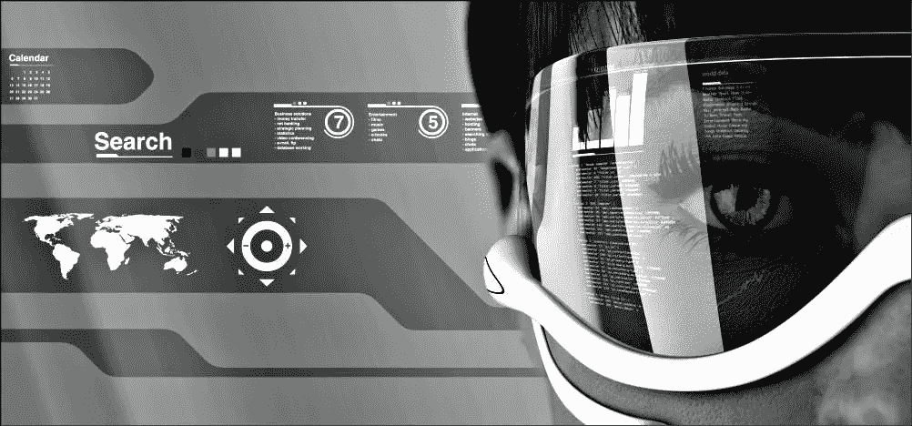
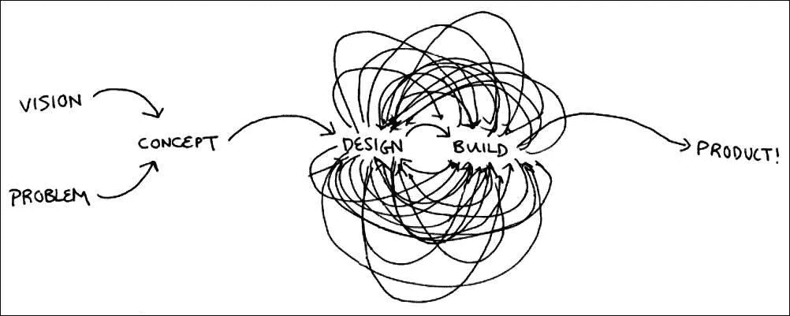
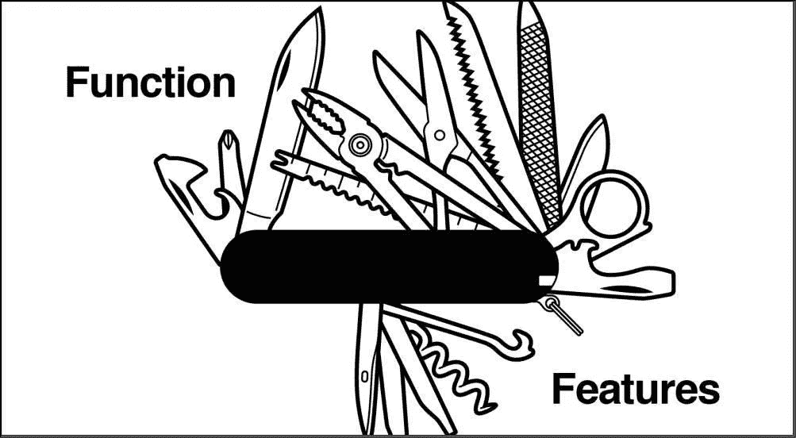
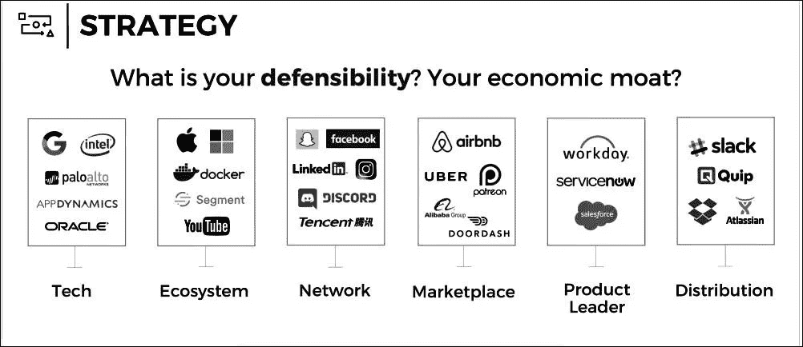
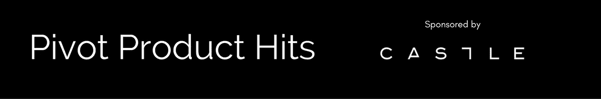

# Pivot 产品热卖|九月版

> 原文：<https://medium.com/hackernoon/pivot-product-hits-september-edition-91913fd79ec8>

# [机器学习如何带来更好的产品设计？](https://cur.at/5vGfjSR?m=web)

Quora 的首席执行官介入(显然是在 Quora 上…)

*总之:*机器[学习](https://hackernoon.com/tagged/learning)可以随着时间的推移帮助策划更好的产品。预测用户行为有助于围绕人们将如何使用你的产品来塑造你的 UX。

机器学习有助于减少用户做出选择的需要。如果你有一个搜索引擎，人们进行的搜索(以及他们去的网站)可以预测他们下一步想搜索什么。

如今，几乎所有的 B2C 产品都有由机器学习推荐驱动的界面。其中包括 Quora、网飞和 Spotify。一方面，网飞让用户很难控制它会推荐什么。另一方面，Twitter 很大程度上把你的时间表限制在你关注的人的推文上。

# [声控产品只是炒作吗？](https://cur.at/BlyAxWQ?m=web)

语音用户界面的全部潜力仍有待实现。FastCo 的 Katherine Schwab 说，目前，它们只不过是语音控制的智能手机。

*总之:*微软最近的一项研究显示，大多数人仍然没有 vui 应该如何工作的心智模型。最大的挑战也是最简单的挑战之一:很难理解他们能做什么，不能做什么。

只有 14.3%的受访者使用智能家居设备购物。给出的理由是没有屏幕，不知道如何使用该设备购物。

总的来说，人们使用语音设备来完成相对简单的任务，他们也可以使用智能手机来完成这些任务。最受欢迎的使用案例是要求设备播放歌曲、控制智能灯和设置计时器。问天气。

这表明语音是一种辅助技术，而不是主要技术，不值得它迄今为止受到的大肆宣传。

# [想打造下一个伟大的产品？](https://cur.at/Y4ALU3n?m=web)

大卫·马丁说，要发现下一个伟大的产品机会，就要关注*不会*改变的东西。

*总之:*消费趋势由两个基本因素构成:变化和人类的基本需求。我们今天使用的大多数产品都满足了人类的一些基本需求。安全、价值、分散注意力、方便和乐趣是我们本性的基本组成部分。他们永远不会离开。

真正满足人类基本需求的新方法很少。发现新趋势的最好方法就是观察进入市场的新产品，并问自己:这些产品是否以新的方式满足了人类的基本需求？

人工智能是一种科技趋势。真正强大的趋势，告诉你一些关于未来的有意义的事情，是人类行为和期望的趋势。

# [产品如何钩住用户](https://cur.at/lzoWzXC?m=web)

Nir Eyal 说，不管你喜不喜欢，养成习惯的技术已经出现了。

*总之*:随着无限的干扰争夺我们的注意力，公司正在掌握新的策略来保持在用户的思想和生活中的相关性。我们面临着一个一切都将变得更加令人上瘾的未来。

公司越来越发现他们的经济价值是他们创造的习惯强度的函数。在脸书和谷歌等科技巨头的带领下，各地的产品团队都在掌握习惯形成的机制，以增加他们产品的参与度。

习惯形成技术创造了与“内部触发器”的联系，无需营销或刺激就能把用户带回来。

因此，消费者需要了解习惯形成技术如何防止不必要的操纵。

# [你的产品真正卖的是什么？](https://cur.at/yKn07ZL?m=web)

Gary Vaynerhchuk 说，在一个注意力分散的市场中，节省时间的产品将会胜出。

*总之:*太多的人专注于发布技术迭代或为产品添加功能，这只会使体验变得复杂。

没有人希望他们的日常生活变得复杂。已经没人关心规格和数量了。人们真的希望汽车能够自动驾驶！他们想要自由、简单和速度。

人工智能是一项重要的技术，因为它可以节省你的时间。它可以学习和自动化原本需要更长时间的流程。虚拟助手节省你的时间。Google Now 和 Siri 为您节省时间。优步为您节省时间。这就是他们获胜的原因。

产品团队应该问自己的主要问题是:我的产品如何加速过去对所有人来说都是乏味和令人厌倦的市场体验？

# [流程与产品](https://cur.at/5NBooVY?m=web)

“顾客只关心我们的产品拿在手中的感觉，其他什么都不在乎，”Tinder 的小杰夫·莫里斯说

*简而言之:*我们在一个赞美我们所建造的一切的过程的行业中工作。我们痴迷于路线图、方法、缩略语和生产力工具。但是我们需要记住，客户并不关心我们如何构建我们的产品，或者我们的流程。

我们每天都在写规格、归档吉拉门票和编辑路线图。这就是过程。

我们的工作是通过我们构建的项目取悦客户。过程是重要的，但是不要忘记顾客是根据一件事来评价我们的。这就是产品。

# [为什么产品参与是你最强有力的销售人员](https://cur.at/wOcmT5S?m=web)

众所周知，“帮助是新的卖点。”这就是为什么通过用户参与度来衡量产品价值是你拥有的最强大的销售工具。

*简而言之:*不久前，SaaS 公司发现他们创造了一个新的销售线索挖掘渠道。新渠道就是产品本身，它产生的新销售线索被称为产品合格销售线索，简称 PQLs。pql 是指达到预定义触发条件的用户，这些触发条件表明他们很有可能成为付费客户。

PQL 的定义因产品而异。不变的是，参与度与购买倾向密切相关。因此，销售团队可以有效地投入时间和精力，只与那些打破常规的人沟通。

如今，每一家高性能的 SaaS 公司都围绕一个中心目标(快乐、积极参与的用户)调整其产品、工程、客户成功和增长团队，该目标由提供可衡量结果的强大数据支撑。

# [你的顾客讨厌 MVP！(你也应该……)](https://cur.at/AfhRL6a?m=web)

WP Engine 的杰森·科恩(Jason Cohen)表示，没有人愿意使用一款让创造者感到尴尬的未完成产品。

*总之:*产品团队多年来一直遵循 MVP 教条，却没有重新评估这是否是在取悦客户的同时最大化学习的正确方式。客户想要现在就能使用的优秀产品。

功能少但受欢迎的产品比功能多但不受欢迎的产品更成功。谷歌文档推出时只有微软 Word 的功能。它之所以成功，是因为它出色地完成了最初的设计目标:简单性和实时协作。

不是每个产品都必须变得复杂。有些产品可以(也应该)保持简单、可爱和完整。

# 本月产品报价

> [“设计的简单性和质量已经成为一条护城河，特别是当它与鼓励采用的产品特性或为增量用户提供新的价值层结合在一起时。”](https://cur.at/ZlaRbLs?m=web)

为 Greylock 的 Sara Guo 鼓掌——这是对产品战略前景的精彩总结。

*原载于*[*pivotservices.curated.co*](https://pivotservices.curated.co/)*。*