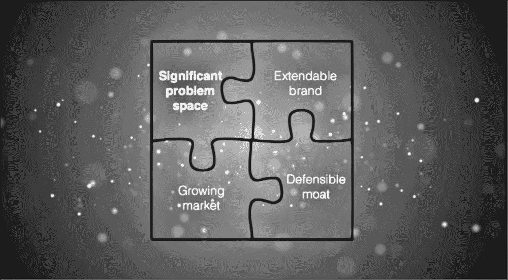
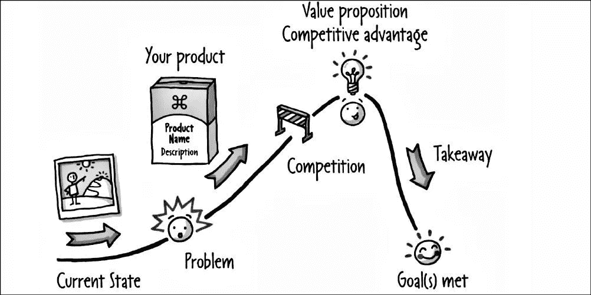
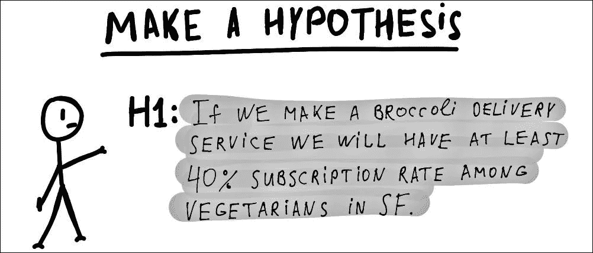
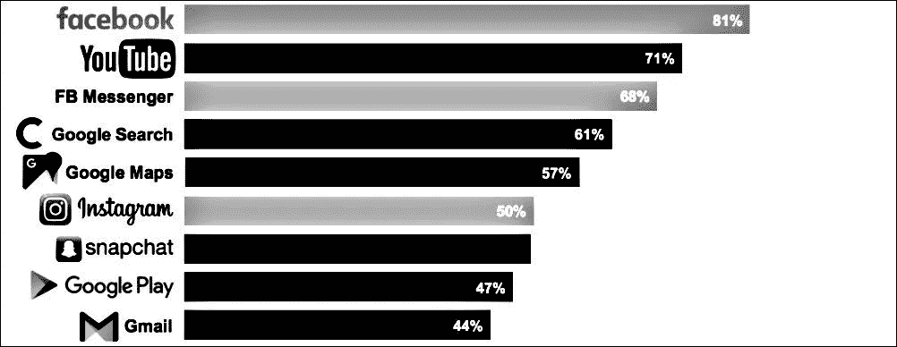
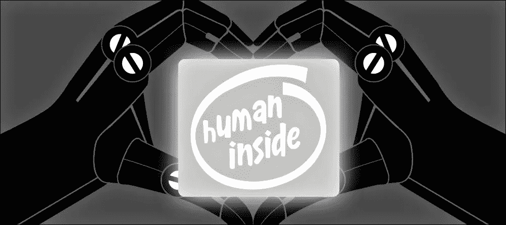

# 枢轴产品命中|最终切割

> 原文：<https://medium.com/hackernoon/pivot-product-hits-the-final-cut-b5de534192ab>

# [制定正确的产品战略](https://cur.at/FDBNJJl?m=web)

公司总是会失败。Intercom 公司的德·特雷纳表示，你的产品策略是对抗这种威胁的最佳手段。

*总结*:在一个充满真知灼见的简短演讲中，Des Traynor 解释了为什么在早期阶段，确定产品战略甚至比完善销售和营销更重要。

深入探究你的产品所解决的问题，它的防御“护城河”，产品和品牌之间的关系，以及成为[技术](https://hackernoon.com/tagged/technology)不可知论者的重要性，这是一个永恒的大师班，面向各地的创始人和产品领导者。

# [产品战略工具箱](https://cur.at/Qi5v7tm?m=web)

我在 11 月伦敦产品战略会议上的报告。

*总结:*2017 年产品战略版图概述。这涵盖了从本·汤姆森的“聚合理论”到安珠·夏尔马的“堆栈谬误”的所有内容，包括“待完成的工作”、“开关分析”、“价值金字塔”和“故事弧线”。

# [你的策略是假设！](https://cur.at/25IQP7Q?m=web)

艾米·埃德蒙森和保尔·瓦丁在《哈佛商业评论》中说，在今天不确定的环境中，将战略视为一种假设而非计划是有意义的。

*简而言之:*大多数公司认为战略在分析上是合理的，并将所有的失败(比如错过销售目标)视为有缺陷的执行。欺骗和掩盖是这种情况的自然副产品，因为管理层拒绝接受“不”或“这不可能”的答案。问问大众和富国银行就知道了。

缩小战略和执行之间的差距可能不是为了更好的执行，而是战略和运营之间的更多对话。更多的实验。

“假设战略”的关键指标在于管理者如何解释计划和实际结果之间差距的早期迹象。这是否意味着团队表现不佳，或者最初的假设有缺陷？

# [什么是 f$%*产品策略？！？](https://cur.at/UFDb0ZT?m=web)

Yoav Yechiam 说，正如柴郡猫观察到的，如果你不知道你要去哪里，任何道路都会带你去那里。

*总而言之:*初创公司的首席执行官们往往过于痴迷于产出和“进步”，以至于他们忘记了检查自己的进程。

创业失败是因为他们不能足够快地实现产品/市场的契合。他们很快就耗尽了时间和金钱。他们忽视了他们的产品策略，而是专注于战术、技巧和简单的解决方案。

如果你试图将入职转换率从 30%提高到 60%，而你的用户获取成本是终身价值的 10 倍，那么你真正的问题不是你的产品经理，而是你的产品策略。

# [投资产品意味着什么](https://cur.at/HO6zcUV?m=web)

*简而言之:*投资软件的决策与任何其他投资决策没有什么不同。它应该从商业案例开始，并与贵公司的主要价值驱动因素联系起来

在产品早期过度投资是一个普遍问题。明智的做法是用任何人都可以访问的网络技术来构建你的初始产品。原生应用是传递客户价值的强大工具，但不适用于早期实验。

不要指望“发现”新的盈利模式，因为(很可能)它们并不存在。关注那些已经建立的(下载收费，软件即服务，广告)。如果你不能预见一条盈利的道路，那就质疑投资的价值。

10 个产品创意中有 9 个不值得建立。

# [移动应用业务正在消亡](https://cur.at/Tf5Kff5?m=web)

《快速公司》称，打造一款移动产品来启动业务并净赚数十亿美元的梦想看起来越来越不可能了。

*总之:*康姆斯克最近发布的移动应用报告揭示了一小撮科技独角兽在应用领域的主导地位。十大最常用应用中有三个属于脸书，四个属于谷歌，另外两个是 Snapchat 和 Pandora。榜单上的每一款应用都是由一家上市公司拥有的。

增长最快的新应用是那些多年来一直保持增长势头的应用，是受益于强大“网络效应”的市场或服务的产品。想想优步，文莫和音乐

# [2028 年产品管理会是什么样子？](https://cur.at/tXxgQX4?m=web)

Alpha 公司的 Thor Ernstsson 说，说到产品管理，我们仍处于 MS-DOS 阶段，还在摆弄软盘。

*总之:*产品管理就是做出基于数据的决策，为客户创造价值。其中很大一部分涉及为设计、工程和营销人员配备[工具](https://hackernoon.com/tagged/tools)和数据，以有效完成工作。

除了某些产品领导角色之外，未来的产品管理流程将整合到整个组织的其他角色和职能中。

到 2028 年，所有企业都将顾客至上。没有一个消费者或企业用户会对一个令人沮丧的产品有耐心，尤其是当他们可以迅速转向竞争对手的时候。用户总是选择无摩擦的体验，往往没有意识到他们正在进行转换。

# 本月产品报价

> “产品与市场的契合不是收入的增长，也不是用户的增长，更不是 App Store 的第一名。产品与市场的契合是保持持续增长的前提。”

Pinterest 的凯西·温特斯(Casey Winters)发表了一篇关于重要的*真实*指标的精彩文章。

# 最后…

## 谢谢你(再见)

这是 Pivot 产品的最新版本。我要感谢每一个不辞辛苦订阅、阅读和分享我们对产品战略的共同兴趣的人。

我希望阅读和编辑出版一样有收获。

再见。

*保罗 J |* [*枢轴*](https://cur.at/1fDN8Mw?m=web)

最初发布于 [Pivot 产品点击](https://pivotservices.curated.co/)。