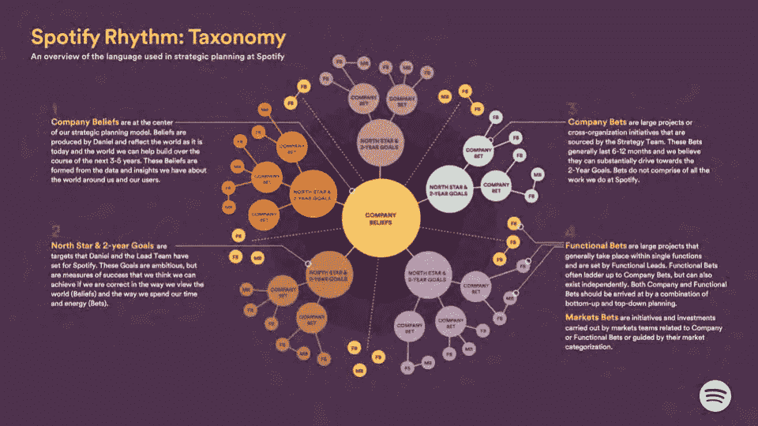

# 下注吧

> 原文：<https://medium.com/hackernoon/place-your-bets-4022b732ba4c>

## 将产品(和公司)战略描述为一系列赌注

在最近的帖子[12 Signs You are Working in a Feature Factory](https://hackernoon.com/12-signs-youre-working-in-a-feature-factory-44a5b938d6a2#.2jkk8hw2m)、 [Success Theater](/p/success-theater-b60a1666fe67) 和[亲爱的产品经理](https://hackernoon.com/dear-product-managers-c488ba6386ea)中，我讨论了当产品经理未能反思实际成果时，工程师和 UX 感到的怨恨。这里的部分问题是建立共享上下文和共享词汇的挑战。话语是强大的，它们很重要。

我一直在寻找更有效的方式来谈论战略(特别是以一种能引起一线共鸣的方式)。在这篇帖子里，我要谈谈 ***下注*** 这个词的力量。

Old-school roulette (Wikipedia)

几个月前，我读了 Henrik Kniberg 的一篇有趣的文章，他分享了他在 Agila Sverige 的一次演讲中的幻灯片。幻灯片描述了 Spotify 当前的战略规划方法(又名 Spotify Rhythm)，值得回顾。在所有伟大的金块中，有一件事特别引起了我的注意:单词 *bet* 的使用。这些年来，我遇到了项目、任务、倡议、史诗、目标、岩石、巨石、okr、实验和目标(还有一大堆我可能忘了)。但从不下注。

Slide from Henrik’s presentation

因此，我尝试与团队打赌(连同他讨论的 DIBB 框架，并与任务和计划相结合),并成为其粉丝。赌注是多方面的，谈论起来很有趣。他们抓住了假设、期望结果、实验、风险和回报之间的完美互动。

为什么*这个字赌*管用？

1.  打赌可以是战术性的或战略性的，说明性的或描述性的。它可以与你将要建造的东西、你希望解决的问题或者市场上将要发生的事情有关(例如)。它的范围可以从关于业务的核心假设到小型持续改进实验的结果
2.  赌注可以宽松，也可以严格。商业案例通常是“沉重的”。赌注可以是轻量级的，也可以是超级结构化的
3.  根据定义，赌注是以结果为中心的。我们打赌某事会发生，并问“打赌结果如何？”。但是他们也建议实验和学习
4.  通过称之为打赌，我们承认“输掉”打赌是一种选择。不知何故，即使是实验这个词也没能让我们为失败做好准备
5.  赌注有赔率。有时候概率是已知的，有时候是未知的
6.  赌注有大有小。这可以用非常具体的成本来讨论，也可以用更宽泛的概念来讨论，如机会成本、注意力分散、团队疲劳、所需工作强度等。
7.  时间表很重要。我们什么时候能知道赌注是否有回报？
8.  谈论赌注将不可避免地引发围绕风险、信息可用性、学习、验证和结果的良好讨论。他们是很好的谈资。谈论它们很有趣
9.  我们探索我们正在做的各种隐含的赌注(但没有正式承认)。例如，通过押注企业客户(押注 A)，我们可能隐含地押注更长的销售周期(押注 B)和利用现有支持团队支持企业客户的能力(押注 C)
10.  赌注迫使我们探索我们的“操作”假设和“普遍真理”(Knikberg 称之为信念和北极星/ 2 年目标)。我打赌可能是你验证过的事实。或者，我可能已经注意到市场上有迹象表明，该企业的一个基本租户正处于不稳定状态。如果某件事是肯定的(几乎没有什么是肯定的)，那么它就不再是一个赌注
11.  通过下小赌注(在短时间内)，我们可以“购买”信息来澄清大赌注的可能性
12.  你可以有一个投资组合，每个投资组合都有不同的风险状况、对冲等。与团队讨论这一点有助于我们在整个计划/投资组合中构建我们的风险偏好
13.  我们考虑同时下注的理想数量(“进行中的下注”)。一次下注太多会分散团队的注意力，在某些情况下，团队会追求冲突/竞争下注，从而降低整体赔率
14.  赌注可以分层“嵌套”和/或具有相关性。该公司可能会在一项新兴技术上下大赌注，而这项技术会级联成许多规模较小、更具战术性的功能赌注

查看 Kniberg 的幻灯片。他们的框架可能对你的公司合适，也可能不合适，但是 Bet 这个词可能仍然有用。

> [黑客中午](http://bit.ly/Hackernoon)是黑客如何开始他们的下午。我们是 [@AMI](http://bit.ly/atAMIatAMI) 家庭的一员。我们现在[接受投稿](http://bit.ly/hackernoonsubmission)并乐意[讨论广告&赞助](mailto:partners@amipublications.com)机会。
> 
> 如果你喜欢这个故事，我们推荐你阅读我们的[最新科技故事](http://bit.ly/hackernoonlatestt)和[趋势科技故事](https://hackernoon.com/trending)。直到下一次，不要把世界的现实想当然！

