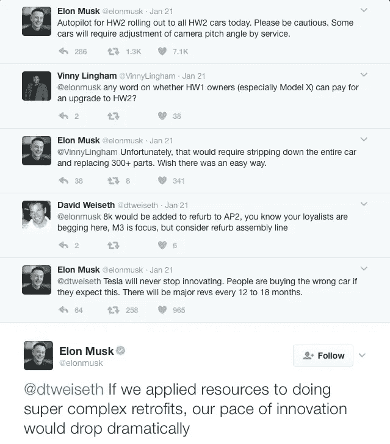

# 苹果的“计划淘汰”并没有按计划进行

> 原文：<https://medium.com/hackernoon/planned-obsolescence-isn-t-going-as-planned-f24733f7a119>

iPad sales are down

今天早上，我读到了 iPad 销量下降的消息，我不得不承认，我对这个消息感到有些沮丧。

问题是我不喜欢别人为我制定计划。苹果公司计划淘汰我的产品，这让我很不爽。

我的 iPad 3 过去处理的许多任务已经被我变得更大的手机接管了。因此，我的 iPad 的主要功能是作为一个更大的屏幕，这将使我的眼睛更容易阅读、基本写作、发信息、视频和视频聊天，以及偶尔的演示。在如此有限的作用下，我看不出为什么我应该每两年更换一次我的 iPad。相反，我计划坚持 5 年的更换周期。与手机相比，这更接近于个人电脑的更新周期，这在 iPad 从个人电脑手中接管更多角色的情况下是有意义的。

但苹果为我制定了其他计划。我想他们认为 3 年的更换周期更适合我。所以大约在我的 iPad 三岁的时候，它开始变慢，直到它变得完全迟钝，并且需要非常长的时间才能启动。即使在密码屏幕出现后，它也不会在五分钟内对触摸屏的滑动做出反应。

应用程序的运行速度也非常慢。以苹果新闻为例。点击这个应用程序意味着要等几分钟，然后它才能加载到我正在阅读的最后一页。点击回家(对你来说)可能还要等几分钟。

苹果传达的信息很明确。

买个新 iPad。

这让我有点恼火。你知道，大约三四年前我买 iPad 时，它被称为“新 iPad”仅仅六个月后，iPad 4 推出了 lightning 连接器和更快的处理器，我的新 iPad 变成了旧 iPad。

我算是原谅了苹果公司。但这种对新 iPad 的不那么微妙的推动是不可接受的，我不会不战而降。

换句话说，是时候召唤超人了。也称为“重置”按钮。

因此，我继续重置我的 iPad。它清除了所有的应用程序，我可以从头开始。我只重装了几个基本的电子邮件、聊天、视频、新闻、浏览和写作应用。此外，我没有坚持使用苹果应用，而是尝试了第三方应用，比如 Flipboard 和 News360。

差别是显而易见的。iPad 感觉自己获得了新生。它仍然缓慢，但可以忍受。我想我可以再经营一年。

苹果的计划淘汰显然没有按我的计划进行。我认为这将使我成为延期客户，如果事情按计划进行，他们今年就会得到这位客户。不管怎么说，延期客户总比没有客户好。

我必须补充一点，对于一类人来说，计划淘汰 iPads 可能是适用的。这可能是喜欢复杂设计工作的 iPad Pro 用户。他们需要速度更快的 iPads 来运行处理器密集型应用程序，并且他们不介意不断升级他们的设备。但即便如此，这也只是一个小市场，因为真正的设计专业人士会使用 Mac Pro 或其同类产品。

对苹果来说不幸的是，大多数 iPad 用户都是普通人。我猜这些打算买 iPad 的人，大部分已经买了。这些 iPad 用户中的许多人像我一样，已经推迟一两年更换他们的旧 iPad。这可以解释为什么 iPad 销量下降。

我认为苹果不应该真的指望 iPad 会像 iPhone 一样畅销。毕竟，人们对手机的需求和对 iPad 的需求大相径庭。这可能就是为什么在 iPhones 中，有计划的淘汰是一个成功的策略。

例如，我的旧 iPhone 4 没有可以计算步数的运动处理器。因此，任何基于手机计算步数的应用程序都无法运行。这将使 iPhone 5S 之前的所有 iPhone 对任何喜欢运动的 iPhone 用户来说都变得过时。

至少，在健身带出现之前是这样，与手机相比，健身带更容易随身携带。显然，苹果不会就这样让顾客离开。这就是为什么苹果手表？我相信与其他智能手表相比，它卖得很好，这使它获得了成功。它的销量不如 iPhone，但这并不意味着它是失败的。没有什么比 iPhone 卖得更好。

回到计划淘汰。不需要运动处理器的人呢？

例如，我的妻子仍然坚持使用她忠实的 iPhone 4，因为她对计步应用程序不感兴趣。比起更大的 iPhone，她更喜欢小巧紧凑的 iPhone 4，它可以完美地满足她的需求，包括打电话、发信息、发电子邮件以及偶尔的浏览和导航。她对科技不感兴趣，但她确实对苹果计划淘汰 iPhone 4 感到恼火，就像我对我的 iPad 一样。

对苹果来说幸运的是，大多数 iPhone 用户更像我，而不是我的妻子。我目前拥有 iPhone 6S+，但无法停止对 iPhone 7+的梦想，它具有双镜头摄像头和防水能力。好的一面是，iPhone 7 出来六个多月了，我还带着我的 iPhone 6S+。幸运的话，苹果改变我的计划的计划可能会再次不按计划进行。

那么有解决办法吗？

我认为特斯拉的埃隆·马斯克有一个。他似乎已经意识到这种强制购买会疏远忠诚的顾客，并造成可以避免的环境污染。因此，特斯拉开始为其汽车配备新的面向未来的硬件，这些硬件可以用更新的软件进行更新。这意味着一辆旧的特斯拉汽车将拥有和一辆全新的汽车一样的软件和功能！

我认为这种模式应该成为科技行业的标杆。

编辑:看来我对特斯拉的看法是错的。正如马斯克指出的(见下文)，未来证明技术可能不实用。即使在手机领域，像谷歌的 Project Ara 这样的模块化手机也还没有启动。

*尽管如此，我的观点仍然有效。公司需要在创新和更长的产品寿命之间找到平衡。正在毁灭我们的环境(并榨干我的钱包)的消费主义循环需要被减缓，即使无法停止。*

> [黑客中午](http://bit.ly/Hackernoon)是黑客如何开始他们的下午。我们是 [@AMI](http://bit.ly/atAMIatAMI) 家庭的一员。我们现在[接受投稿](http://bit.ly/hackernoonsubmission)并乐意[讨论广告&赞助](mailto:partners@amipublications.com)机会。
> 
> 如果你喜欢这个故事，我们推荐你阅读我们的[最新科技故事](http://bit.ly/hackernoonlatestt)和[趋势科技故事](https://hackernoon.com/trending)。直到下一次，不要把世界的现实想当然！

