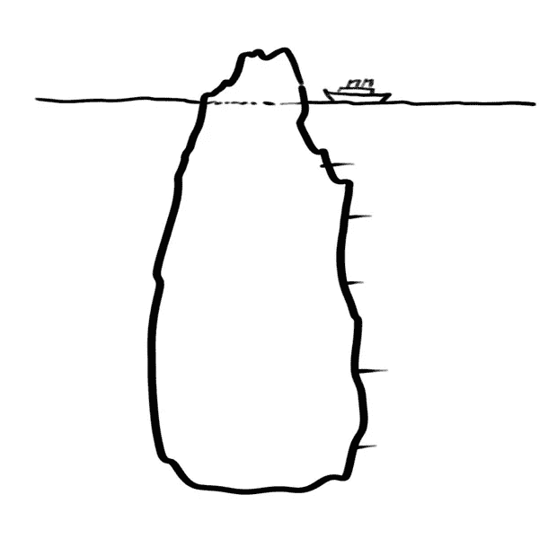

# 平台与产品

> 原文：<https://medium.com/hackernoon/platforms-vs-products-c5e75b2fc1c8>

# (Polymatic 每月通讯:第 7 期)

在 1921 年之前，司机在美国州际公路上通过看彩色编码的电线杆来确定他们的方向/位置。这既烦人又危险。公路局的雇员埃德温·w·詹姆斯改变了这一切。他的高速公路编号系统确保驾车者能够知道他/她在两条高速公路交叉处的位置。南北高速公路为奇数，东西高速公路为偶数。北部和东部的人数增加了。考虑到第一辆 T 型车是在 1908 年制造的，这个编号系统对于一个刚刚开始痴迷于汽车的社会来说是及时的…

—

上周我做了两次演讲。一份给四大会计师事务所驻伦敦的创新团队，另一份给奥斯汀的一些设计师。两组人都想了解平台、创新以及真正改变游戏规则的业务是如何从系统思维中产生的。为什么？因为技术发展的速度使得产品和服务比以往任何时候都更快地过时。但不是平台。 [Edwin W. James](https://www.fhwa.dot.gov/infrastructure/ewjames.cfm) ，一位道路工程师/系统思想家，在 1921 年采用平台方法设计了**州际公路编号系统。** **任何新的高速公路或贡献增强了系统但又符合它**。这个系统在 97 年后的今天仍在使用。

这就是平台的力量。它们成为了标准。很长一段时间…

本周的书籍和文章都是关于平台的

**1。考虑到如今主要平台(谷歌、脸书、微软、Visa/万事达卡等)的主导地位，人们可能会倾向于相信没有更多的平台可以创造了。[平台革命](http://amzn.to/2pU1QHi)提出了观察市场和确定机会所在的方法。**

**2。书**:2010 年《The Mesh》出版时，我读了这本书，尽管它谈到的模型在今天无处不在，但我惊讶于她在 Kickstarter 和拼车赢家等平台上展示价值可能性的方式。快速和良好的阅读。

**3。文章**:亚马逊和沃尔玛，[这两个最大的线上线下零售平台](http://www.glossy.co/ecommerce/why-luxury-remains-far-out-of-reach-for-amazon-and-walmart?utm_medium=email&utm_campaign=glossydis&utm_source=daily&utm_content=170427)，还没有完全抓住奢侈品零售的机会。也许这就是你的机会？

**4。叙述**:杰夫·贝索斯“*这仍然是互联网的第一天*”是他自亚马逊第一天起就保持的三个战略一致性之一。[这份 2013 年的叙述](https://www.slideshare.net/faberNovel/amazoncom-the-hidden-empire) **，遗漏了 Echo 等最近的创新，分享了亚马逊用来主导的核心战略方法。

本周一切顺利！

色艺

*   *我被雇佣来做关于创新、技术和战略的演讲。想要提升我们的创新或战略商数吗？**我想给你的公司/企业或附属团体/团队一个。在 seyi@asha-labs.com 联系我**
*   ** **过去一周，我的文章在 LinkedIn、Medium、Business Insider 等网站上点击了 100 万次**。感谢阅读和分享。写作对我来说是最简单的事情，我很感激你喜欢我写的东西！

****[**最初发表于此，你可以在此报名参加《博学通讯》！**](https://www.getrevue.co/profile/seyifabo/issues/polymathic-monthly-issue-7-platforms-vs-products-53984)****

************************

> ****[黑客中午](http://bit.ly/Hackernoon)是黑客如何开始他们的下午。我们是阿美族家庭的一员。我们现在[接受投稿](http://bit.ly/hackernoonsubmission)并乐意[讨论广告&赞助](mailto:partners@amipublications.com)机会。****
> 
> ****如果你喜欢这个故事，我们推荐你阅读我们的[最新科技故事](http://bit.ly/hackernoonlatestt)和[趋势科技故事](https://hackernoon.com/trending)。直到下一次，不要把世界的现实想当然！****

********