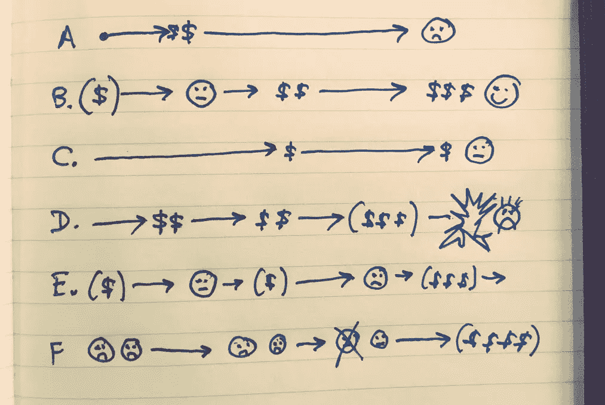

# 山姆，再放一遍！

> 原文：<https://medium.com/hackernoon/play-it-again-sam-961bd0751748>

我一直在摆弄一本自己选择冒险的书。一个朋友建议我先把*不开心*的路铺好。这听起来有点令人沮丧，但结果却很有趣。事情出错的方式有很多:

这里的错误是将这种走向失败的趋势视为无能或恶意的副产品。有时个人贡献者肯定会有这种感觉。快速增长的好处让人感觉真实，坏处让人感觉遥远。人类在很多事情上都像这样踢罐子。

这里的要点是，如果我们意识到这一切的不可避免性，也许我们可以不那么针对个人，并为此做些什么。知道你的情况没有什么不同是一种奇怪的安慰。

选择了一条共同的道路…

*   成功。市场中的牵引力。
*   早期。团队迅速扩大产品以满足客户需求(和投资者主导的增长目标)。产品复杂性增加。
*   第一轮“非常大和重要”的客户同意购买服务。引入的主要限制。
*   快速招聘。新员工适应速度较慢，但这被视为快速增长和/或招聘门槛降低的自然副产品(而不是不受管理的复杂性的作用)
*   快速的内部晋升来管理新员工。个人贡献者进入管理角色(新的和新定义的)
*   一些技术决策将永远困扰着组织。不是因为他们不好，而是因为组织失去了改变方向的灵活性
*   共享团队吸收成长的痛苦。关于规模经济(和预测需求的感知能力)的根深蒂固的假设导致资金/资源不足
*   一些高层重组
*   质量问题激发了独立 QA 部门的创建。战战兢兢地见了面。
*   团队仍然能够快速交付，但是只能通过偷工减料(他们向自己承诺以后会把事情修补好)
*   生产和稳定的努力暗示了问题。Org 将这些归因于个人/团体的失误和“粗心”(而不是系统性问题)。新功能开发变慢。
*   团队被“低垂的果实”所吸引，从而模糊了障碍和复杂的领域。艰难的挑战靠边站
*   绿地创新努力。这些项目被视为“好工作”的例子，这给处理遗留问题的团队带来了疑问。成功剧场保持了完整的动力感
*   发展进一步放缓。相互指责。“成功的”管理者获得更多资金。其他经理饿了。
*   是时候“长大”了。答案是管理更加严格，并在组织结构图中增加了新的层次。困难但有效的领导者被新的层面所隔离。
*   拥有机构知识的高级团队成员缓慢流失……既有正常的职业变动，也有对速度/支持的日益不满
*   扩张。家乡城市的招聘压力激发了向新城市(或许还有国外)扩张的动力。
*   缺乏内部晋升，因为领导层变得越来越沮丧，并对高级经理失去信心/信任。寻求“外界视角”。
*   生产中的重大问题导致“句号”和争先恐后的答案。相互指责，剑拔弩张。顾问来了。产量几乎为零。
*   为了满足增长需求和提高产量，公司进行了额外的收购。关于如何将这些整合到产品生态系统中的各种假设。
*   而且还在继续…(另一篇文章)