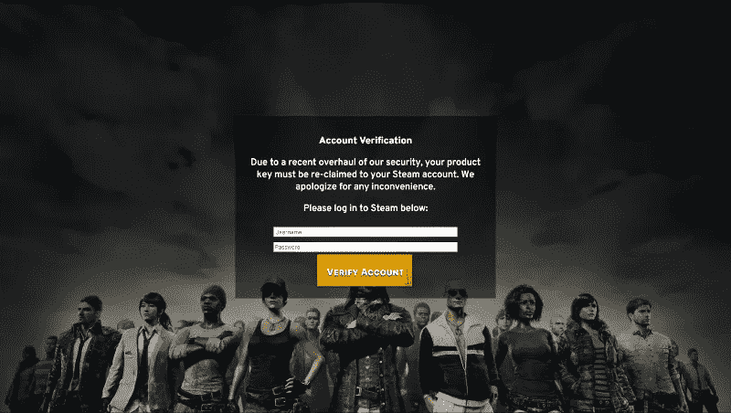
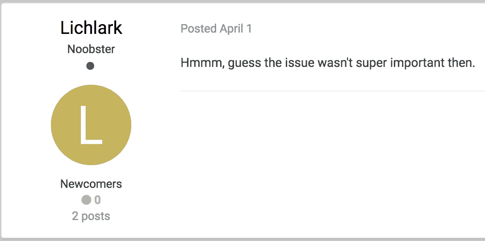
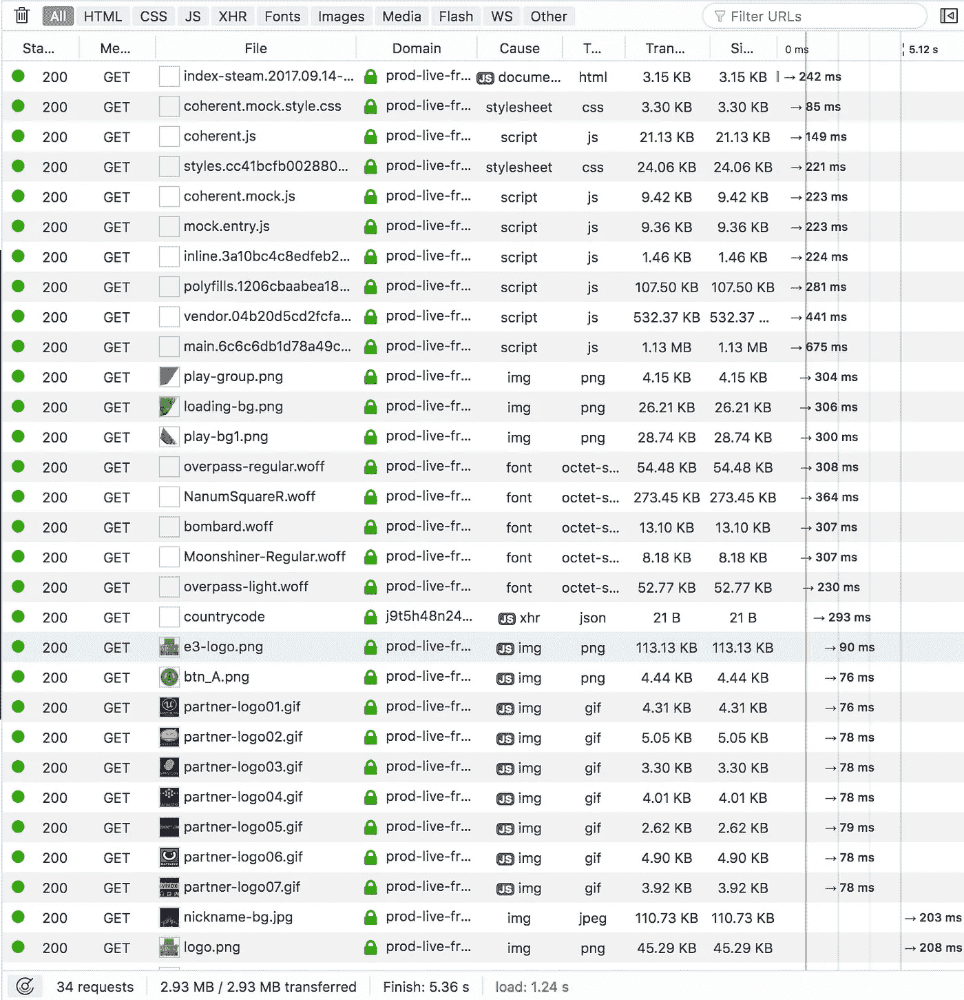
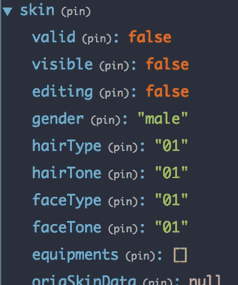

# 玩家未知的战场主菜单容易被黑客攻击

> 原文：<https://medium.com/hackernoon/playerunknowns-battlegrounds-main-menu-is-vulnerable-to-hacking-d483b00a7036>

**更新:**这个安全漏洞已经被堵上了。详见我的[下篇](/@fsufitch/pubg-main-menu-hack-its-fixed-cbad28c706fa)。

**更新更新:**有一个错误的报告说这个问题又出现了。在这里阅读[。](/@fsufitch/pubg-main-menu-hack-the-state-of-1-0-b1187f82c368)


[**PlayerUnknown 的战场**](https://www.playbattlegrounds.com/main.pu) (或简称 PUBG)是一款新的、极受欢迎的电子游戏。它主要围绕“皇家战役”游戏，让多达 100 名玩家在一场战斗中相互对抗，以成为最后一名。

这款游戏和它的开发者(蓝洞)非常有野心，并且已经和 PUBG 一起取得了巨大的成功。尽管这款游戏尚未正式“发布”，但它的并发玩家人数已经超过了 200 万，收入达到了数千万美元，而且电子竞技也在蓬勃发展。这种曝光率和成功伴随着某些期望——性能、稳定性、视觉效果、AAA 级竞争营销等——这些期望并不总是能得到满足。这篇文章不是关于他们的；是关于 [**安全**](https://hackernoon.com/tagged/security) 。

首先，让我们看看这个问题的基本情况。它是什么，有多大，对你有什么意义？

# 底线，提前

PUBG 主菜单是一个在不安全的 HTTP 连接中远程加载的网页，使其容易受到跨站点脚本(XSS)通过中间人(MITM)攻击或其他方式破坏 HTTP 请求的攻击。这意味着非常容易和可信的网络钓鱼，刺探用户行为，加上其他可能的攻击角度。

**再一次，这次用英语……**PUBG 加载屏幕和它的主菜单中的各种用户界面元素在技术上不是你(玩家)“安装”的游戏的一部分。当你启动游戏时，它们从一个官方服务器中被提取出来，并呈现在实际游戏的顶部(你的角色站在周围的 3D 模型)。这种渲染是通过透明的“浏览器”来完成的，这种浏览器将它们视为真实的网页。


The blue arrows are pointing to UI elements that are actually a “webpage”

加载这些元素的连接*不安全*。这意味着，当数据从 PUBG 服务器转移到你的电脑时，它可以被截取和修改。换句话说，操作你和 PUBG 服务器之间连接的任何部分的人都可以操纵数据并*改变你在主菜单中看到的内容*，或者让主菜单做一些它通常不会做的事情——例如，向第三方报告你拥有的游戏内物品。

**听起来很严重。你为什么要公开这件事？**确实很严重。通常我不会因为一个“早期访问”游戏中的 bug 而小题大做，但是正如我之前提到的， *PUBG 本身就是一件大事*。无论是否提前进入，这个漏洞都会影响数千万人的安全。两个多星期前，我已经在蓝洞的支持下和他们的[论坛](https://forums.playbattlegrounds.com/topic/78439-main-menu-security-vulnerability/)报告了这个 bug。由于它没有被迅速修复，并且是一个严重的问题，我觉得我有责任告知社区这一风险。

**对玩家的实际危险是什么？**对于利用这个漏洞的黑客来说，他们要么需要你的计算机上已经有恶意软件(在这种情况下，你有更大的问题),要么他们需要成为你和 PUBG 之间的“中间人”。这意味着，如果你正在做这些事情，你就有风险:

*   通过不安全的公共无线连接玩游戏(例如在星巴克)
*   使用您可能不信任其质量的人设置的有线或无线网络进行游戏(例如大学网络或 Xfinity)
*   鉴于最近关于 WiFi 安全性的[披露](https://www.wired.com/story/krack-wi-fi-wpa2-vulnerability/)，通过*任何*无线网络玩游戏

如果黑客成功利用了这一点，他们至少可以修改你在屏幕上看到的内容，很容易使它看起来像是 PUBG 的官方部分。

我甚至创建了一个概念证明。在看到动画蓝洞闪屏和游戏音乐开始后，你可能会遇到这样的情况:



看起来很官方吧？它完全是假的，是从一个与 PUBG 或 Bluehole 完全无关的服务器上发送的，如果你输入了登录信息，它会把你的登录信息发给我(但它没有)。

黑客也有可能做更多邪恶的事情。我不是一名安全研究员，也没有足够的代码访问权限来做出肯定的回答。至少，这个安全漏洞已经被 Xfinity 用来[在游戏本身](https://forums.playbattlegrounds.com/topic/7248-possibly-main-menu-insecurity/)内部做广告了。

**下一步是什么？**除了完全不玩 PUBG，玩家几乎没有办法完全避免这种风险。为了尽可能地减少它，只在你的家庭网络上玩，使用有线连接，或者如果你的路由器不在任何潜在黑客的范围内，使用无线连接。

更重要的是，这需要尽快解决。由于 PUBG 是“根据社区反馈开发的”(根据其 [Steam 页面](http://store.steampowered.com/app/578080/PLAYERUNKNOWNS_BATTLEGROUNDS/))，它需要你对这个问题的反馈，以便及时解决。请在他们的论坛、评论或社交媒体上给开发者留言。有了你的帮助，PUBG 的安全可以像这个锅一样坚不可摧:


# 现在，一个故事

> 这就是我们陷入技术困境的地方。如果你不感兴趣，请随时收听。

我有一个坦白:这个问题不是我自己发现的。我的一个朋友向我透露了一个消息，他告诉我六个多月前有人在 PUBG 论坛**上发了一个帖子**，抱怨 Xfinity 能够[在主菜单](https://forums.playbattlegrounds.com/topic/7248-possibly-main-menu-insecurity/)中插入广告，就像他们在其他不安全的网站上做的一样。撇开他们可疑的 ISP 行为不谈，这是一个巨大的危险信号。令人震惊的是，这个问题根本没有得到解决，这个帖子以一个响亮的“咩”结束:



Nope, not an April 1st joke!

作为一名网络开发人员，这激起了我的好奇心，所以我开始钻研。

## 调查

这样做的时候，我发现每次游戏加载的时候，都会有一个 HTTP GET 请求被发送到[http://front.battlegroundsgame.com/index.html](http://front.battlegroundsgame.com/index.html)。它的内容？

```
$ curl [http://front.battlegroundsgame.com/index.html](http://front.battlegroundsgame.com/index.html)
<script>
    var url = window.location.search;
    url = url.replace("?", '');
    location.href='[https://prod-live-front.playbattlegrounds.com/2017.09.14-2017.10.02-556/index-steam.2017.09.14-2017.10.02-556.html?'+url](https://prod-live-front.playbattlegrounds.com/2017.09.14-2017.10.02-556/index-steam.2017.09.14-2017.10.02-556.html?'+url);
</script>
```

My actual reaction, as those in the chatroom I was in can attest

就是这样。这就是加载整个 UI 的内容。

不仅它首先不是有效的 HTML，而且是通过完全不安全的普通 HTTP 连接提供的，而且即使这些事情不是问题，这也是一种糟糕的做法！

很自然地，我通过在浏览器中加载该 URL 继续深入下去:



加载那个 URL 实际上是加载了 PUBG UI！它还通过查看查询本身产生了大量信息:

*   每次你加载 PUBG 的时候，它都会下载将近 3 MB 的内容
*   UI 的最新更新是在 10 月 17 日(在撰写本文的两天前)
*   UI 构建在一个类似 Javascript 的环境中，并打包了一个标准的 Webpack main/vendor/polyfill 设置。稍后将详细介绍。(还有，为什么标准嵌入式浏览器需要 polyfills？！)
*   使用[连贯 UI](http://coherent-labs.com/) 完成与实际游戏引擎(虚幻)的交互和浏览器视图的嵌入
*   文件包含似乎有些草率，因为“模拟”文件正在进入生产

Javascript 文件本身是很小的，所以从其中收集很多信息是很困难的……但并非不可能。里面有些有趣的东西:

*   UI 采用最新版本的 [Angular 4](https://angular.io) 打造；整洁！
*   一种“ping 测试”被执行以确定你是否在中国，如果你在，一些[荀攸](http://www.xunyou.com)资源被加载…看起来像一些中国软件发行的东西？
*   UI 的数据是使用 [Redux、](http://redux.js.org/)组织的，使用适当的[浏览器扩展](https://github.com/zalmoxisus/redux-devtools-extension)允许对其进行处理
*   **更新:**索引页面还包含一个谷歌分析跟踪片段！谁不喜欢分析有多少人加载了他们的主菜单呢？

此外，这里还有一些社会正义活动家的乐趣:玩家对象有一个默认的性别(男性)和其他物理属性，各种没有被缩小的令牌有一个奇怪的“兄弟”相关的命名主题:

```
l.connection.sendMessage("UserProxyApi","InvalidateBroFriends",n)
```



然后，作为最重要的部分，控制台日志包含鼓舞信心的行，如:

```
[EGN] engine received DestoryLobbyCharacter:0 Array [  ]  mock.entry.js:7:3
```


我不知道这是怎么回事。无论如何……它看起来像我期望的“早期访问”代码库的样子。不安全的 HTTP 请求是一个更大的问题，所以… *回到安全话题！*

## 错误报告

鉴于我*知道*我发现的 HTTP 漏洞可能被利用，我赶紧给蓝洞写了一份错误报告。去他们的支持网站，我发现…


…它本身不使用安全通信，对于身份验证页面也是如此。这不是好兆头。

我还是报告了这件事，一天之内我就收到了一位游戏大师的回复，他承认了这份报告，并要求我也在 PUBG 论坛上分享它。公共论坛。全世界都能看到问题的地方。[我做了](https://forums.playbattlegrounds.com/topic/78439-main-menu-security-vulnerability/)，它似乎得到了与最初让我走上这条道路的帖子同样多的关注。

鉴于从第一次提到这个问题到想出一个解决方案已经有足够的时间——或者至少是一个权宜之计，不要让数百万玩家暴露在[黑客](https://hackernoon.com/tagged/hacking)面前——我在这里写这篇文章。

然而，这不仅仅是一篇报道！因为我有…

## 演示

之前有一些它的截图，但这里是它所有的荣耀:[https://github.com/fsufitch/pubg-mainmenu-hack](https://github.com/fsufitch/pubg-mainmenu-hack)。**更新:**我记得将存储库设置为“public ”,现在应该可以访问了。

> 声明:这不是我最好的编码工作。很乱很可怕，但是很管用。不要这样编码。

它由一个简单的基于 Go 的服务器组成，该服务器提供一个`index.html`文件，加载一堆“邪恶的”JS 代码，这些代码将自己注入到 UI 中，试图对用户进行网络钓鱼。当然，我实际上没有保存任何人的信息，并且“登录”表单是一个虚拟的，但是它确实提供了一个引人注目的视觉效果:


Legit or not?

这个被黑掉的用户界面在[http://104.239.228.225/index.html](http://104.239.228.225/index.html)是可用的。(**更新:**我已经禁用了服务器，因为它已经不再相关，但我仍然需要继续运行。)您可以使用 web 浏览器访问它，或者您可以通过在您的`hosts`文件中添加以下行来欺骗您自己的 PUBG 加载它:

```
104.239.228.225 front.battlegroundsgame.com
```

这是在`%SystemRoot%\System32\drivers\etc\hosts`为 Windows 环境找到的。移除线路将禁用黑客攻击。

如果你*真的*不喜欢编辑那个文件，我编了一个简单的程序[帮你做](https://github.com/fsufitch/pubg-mainmenu-hack/releases/download/v1.0/PUBG-n00dzmod_4_a64.exe)。它的名字极具暗示性，就像恶意软件可以在你不知情的情况下做到这一点。然而，它并没有损害你的电脑，只是添加了`hosts`行，等待你按下 Enter 键，然后移除该行。

**编辑:**我收到的一些评论指出，hosts-file 注入不是一个“真正的”漏洞，因为很多东西都容易受到它的攻击。虽然这是真的，但是这个主机注入是演示这个问题的一个简单方法，因为一个易于应用、可移植的 MITM 演示要难得多。


Video of this story as it happened

这是 PUBG 安全冒险的结束…暂时的。这里希望蓝洞将继续改善 PUBG 的所有方面，停止让用户处于危险之中，并成为真正的“电子竞技就绪”。感谢阅读！