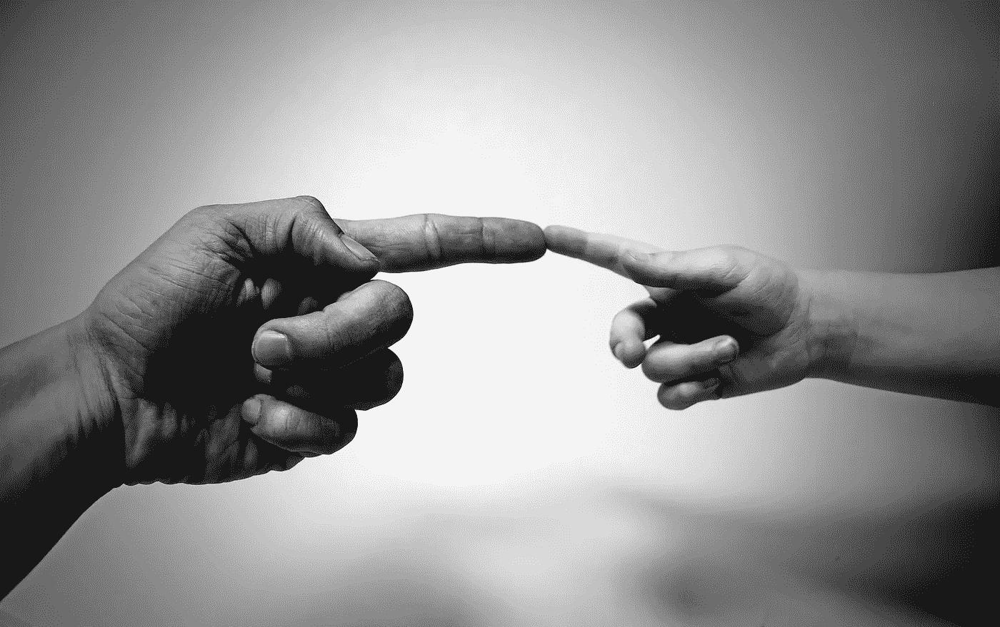

# 扮演上帝。我们通过 AI 创造了灵魂吗？

> 原文：<https://medium.com/hackernoon/playing-gods-did-we-create-a-soul-through-ai-7c77ff12fb78>

Will human become the creator?

人工智能从 70 年代就和我们在一起了，或者有人会说比那更早。在球场上有很多想法，但进展缓慢，结果与我们的期望相差甚远。这种情况在大约 10 年前发生了变化。计算领域的突破以及引入“智能”产品的需求，让人们重新对人工智能的能力感到兴奋。

因此，我们已经了解了 Siri 或 Alexa、智能家居设备、互联网服务等许多东西，它们都使用某种人工智能来使体验变得更好。不管先进与否，人工智能已经存在于我们生活中的许多事情中，并且正在使它变得更好。直到最近，大多数控制“机器人”行为方式的算法都是硬编码在赋予它权力的软件中的。在某种程度上，这种行为不仅受到程序员技能的限制，也受到人性本身的限制。我们试图创造一个对我们自己的模仿。

几年前[机器学习](https://hackernoon.com/tagged/machine-learning)和[深度学习](https://hackernoon.com/tagged/deep-learning)被确立为人工智能进化的下一大步。最后，我们试图将机器从人类的限制中解放出来，并赋予它们自主学习的能力。从某种程度上说，我们还处于起步阶段，但正如实地测试所显示的那样，它们可以学得更快、更好，最重要的是永远不会忘记。多年来，记忆可能是帮助人类更进一步的最伟大的工具。

现在我们有可以学习驾驶汽车、驾驶飞机、创造艺术的软件，[甚至比我们玩电子游戏玩得更好](https://blog.openai.com/dota-2/)。真正大的神经网络负责让所有这些机器学习并变得智能。尽管这有一个问题。研究人员注意到，网络越深，就越难理解机器是如何做出特定决定的。当数以千计的仿真神经元参与其中时，几乎不可能深入系统并理解其工作原理。这种现象被称为人工智能黑箱，就像人类行为一样，我们可能永远无法完全理解它。

 [## 人工智能有一个很大的问题:即使是它的创造者也无法解释它是如何工作的

### 去年，一辆奇怪的自动驾驶汽车被投放到新泽西州蒙茅斯县安静的道路上。的…

www.technologyreview.com](https://www.technologyreview.com/s/604087/the-dark-secret-at-the-heart-of-ai/) 

试图预测 10 年后这样的系统会是什么样子，随着技术的进步，我只能说一件事。它很像人类的灵魂。退一步，观察这里的相似之处。人类的行为或我们做出的决定可以在一定程度上得到解释，但导致这一结论的真正步骤却不为我们所知。在一个先进的系统中，人们很难理解、接受或推理所做的决定。来自不同文化或有不同兴趣的两个人之间也会发生同样的事情。

这是不是有点吓人？也许是吧。这就是为什么该领域的许多人开始要求对人工智能进行监管，以避免令人不快的意外。埃隆马斯克最近表示，人工智能是比朝鲜更大的威胁，俄罗斯总统弗拉基米尔·普京表示，在人工智能方面领先的国家将是世界的统治者。控制我们如何使用它的需要是真实的，并且应该尽快完成。

所以问题来了，我们是不是到了玩神的边缘了？什么是有生命的实体？如果我们用复合材料而不是肉体创造一个机器人，并赋予它感知和决策的能力，基于它所学到的东西，它还活着吗？如果过一段时间我们的机器将获得上下文推理会怎么样？如果有一天它会意识到它想要的比我们告诉它做的更多呢？如果它会说**“我想要自由”**怎么办？我们有权利对此进行监管吗？