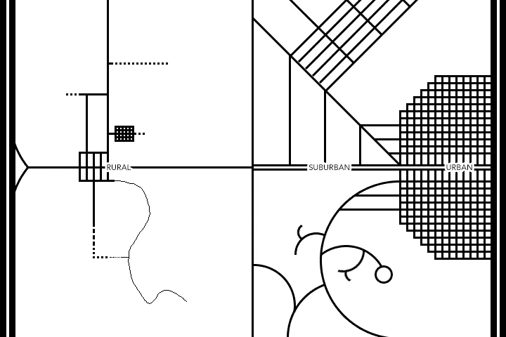
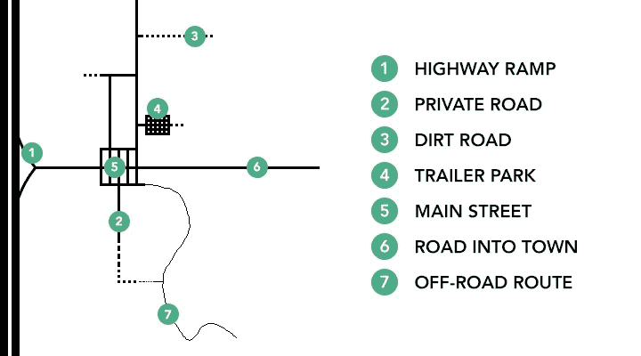
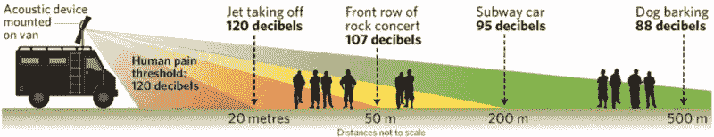
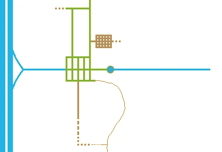
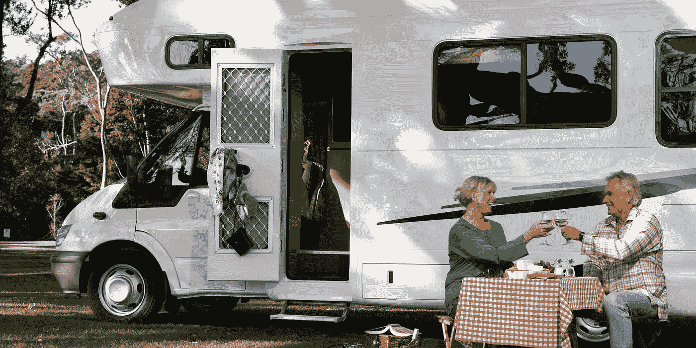

# 在乡村玩耍:自动驾驶汽车和美国乡村

> 原文：<https://medium.com/hackernoon/playing-in-the-sticks-self-driving-cars-and-rural-america-b1c89554bcba>

当美国农村大声疾呼“我们怎么办？”的时候，暴露他们的虚伪是很容易的，当然也很有趣、回避为所有人构建更智能解决方案的机会没有什么好处，甚至更没尊严。

自动交通是一个有价值的例子:当然，这个概念在城市环境中具有不可否认的意义，但我们能否——更进一步说，我们是否应该——在偏远地区巩固这种技术，在那里，边缘案例比比皆是，机械工具仍然胜过数字解决方案，因为当芯片出现故障时，你总是可以转动扳手，保持那种标志性的农村自力更生？

*“当关键时刻”*来吧，那很好。

在这篇文章中，我将提出几个观点，希望读者用自己的经历来培养一些主动性；我们应该为硅谷的呆子们寻求可行的挑战，同时，为那些在大平原上深深扎根的人拓宽视野。

为了描绘战场的一致画面，我创建了一张地图，标出一些典型的乡村道路布局和驾驶场景。现在，你们这些优秀的乡下人将不得不原谅我任何惊人的疏漏……我比大多数人都见过更多的美国，但我肯定是一个城里人。

好吧，我们睡觉吧。

## 这不是我们的第一次竞技

因为无论白天黑夜，将城市景观与乡村分开从来都不是一个简单的争论。

当然，19 世纪和 20 世纪的粗犷的个人主义者长期辛苦地开垦农田，但正是中央政府通过《宅地法》提供了这些土地。也就是说，该法律旨在为未开发的土地带来定居，因此，虽然农民受益，但《宅地法》肯定不是在没有经济动机的情况下完成的。

是的，如果没有大城市的资金来支付大部分基础设施费用，美国的穷乡僻壤就不会有电、管道、火车或公路……但话说回来，这些发明的大部分原材料，以及由此产生的商业，都穿越广阔的乡村。从这个角度来看，铺设铁路和公路交通来连接城市对农村居民来说很难算是一种无私的恩惠……然而，美国这么多小城镇的存在仅仅是因为在主要目的地之间转移一些商业美元的明显潜力。

关键是，对于城市人来说，将农村地区视为遗迹是天真的(人或许是遗迹，但不是地区)……同样，对于农村人来说，假装他们没有从城市或随之而来的生活水平提高中受益也是愚蠢的。这种平衡是微妙的，需要相互尊重和考虑——除非你声称自己是一个真正的住在陆地上的山民，在这种情况下，你是一个骗子，因为如果你正在读这篇文章，你显然可以上网。

## 进化或被消灭

反驳:郊区会随着城市的发展而发展，因为大众决定了市场。拒绝你喜欢的交通技术，但是如果汽油达到 40 美元/加仑，因为政府禁止内燃机，或者保险公司开始要求实时数据监控，或者为你的汽车制造零件的供应商破产，你怎么想都没关系。你不会有逆势而为的手段。

你，这个头发花白的乡下人，想象一下这样一个未来:你友好的汽车经销商*经常问你:“嘿，伙计，想不想离开那个生锈的桶，开上那辆崭新的自动驾驶汽车？”*带着一个经历过一切的牛仔的钢铁般冷漠的决心，你把手放在你 83 年的野马车的挡泥板上，回答说，*“现在不行。永远不会。”嗯，振作起来。事情不会这样发展下去的。不要找出困难的方法…带着一些想法来支持过渡，并确保您的需求得到考虑。*

## 你不是每天都能看到的

一辆雪佛兰 Silverado 在你脸上滚动煤炭，扬起灰尘和岩石。一辆 ATV 拖着另一辆 ATV。一个老人拿着猎枪靠近你的车。一个路标把你指向一个峡谷。路中间的沙发上有鸟。任何野生动物做任何事。这些只是我在农村地区看到的一些事情，可能会给当今的自动驾驶技术带来一场混乱；更糟糕的是，这些事件发生得如此之少，以至于解决这种边缘情况似乎是对资源的巨大浪费。

但是，至少在理论上，当一个人与文明分离时，环境越来越多地呈现这种角色。我的意思是，这几乎是文明的目标:减轻生活中不可预测的事件，以增加控制。但是在野外呆上足够长的时间，你会发现一小时又一小时的无所事事夹杂着你从未见过的偶然事件。

考虑到单独处理这些边缘案例会耗费大量资源，我会推荐一个相当直接的解决方案，希望中心地带的人们能够理解:[将武器放在 AVs 上](/@mitchturck/self-driving-cars-and-sound-cannons-an-indecent-proposal-43ebf99fafc)。

我知道我喜欢讽刺这个概念，但这是我的想法，实际上我很喜欢它——尤其是在农村场景中。在自动驾驶汽车上投掷远程声学设备(LRAD)是迄今为止对任何四条腿问题最实用的解决方案，考虑到多少自动驾驶技术可能是电动的(即静音)，当快速通过一个可能每十分钟看到或听到一辆汽车的村庄时，拥有一个基本上相当于智能喇叭的工具是至关重要的。

## 穿越边境

乡下有很多非正统的车辆——其中很少适合用自动驾驶软件来增强或取代，车主有办法或兴趣做出这种改变的就更少了。你如何将所有的机动车辆一下子连接到自动交通工具上？

我认为这比听起来容易:你不知道。

Blue: self-driving / Green: connected / Brown: anything goes

当谈到私人道路和越野路径(棕色)时，在网格上放置任何东西都没有多大意义。他们很少旅行，经常乘坐各种奇怪的车辆…更不用说故意冒险驾驶，这种自主软件可能会变成一个真正的失败者。所以别管那些了。

一旦你上了公共资助的地方公路(绿色)，你就开始成为其他人的负担和责任…甚至是那些远离城市的人，如果你把卡车绕在电线杆上，他们的税收可以帮助支付基础设施费用。为了让所有的自动交通在这些区域内行驶，这些绿色道路上的任何车辆都应该连接起来。虽然不一定是“gubment 走了，带走了我的隐私”,只是那种帮助网格了解潜在障碍可能出现的匿名反馈信号。我们谈论的是几乎不花钱、几乎不显示任何东西的转发器；对于那些整张脸上没有【T2，别踩我】纹身的人来说，这应该很容易。所以，如果你想骑着你的轻便摩托车从边远地区去加油站，你的选择是:

*   给它装上一个匿名应答器，随你便
*   把它装到一辆已经有应答器的卡车上
*   把它放在你家，然后用你的卡车去加油
*   无论如何，带着离网的轻便摩托车去加油站，冒着被任何时刻保持警惕的 AV 发现你而向当局报告的风险，或者撞上什么东西并对损害负全部责任

现在，对于穿越市、县和州界线的主要道路(蓝色部分)。那些是在自动驾驶的世界里。你不能开车去那里，就这样。因此，如果你没有为你的农场拥有一辆自动运输卡车，或者没有一辆自动驾驶汽车去镇上旅行，你需要以其他方式让自己离开方向盘。为此，我在镇外画的蓝色/绿色的大点可以作为停车换乘服务:有能力运送一些人和他们的货物的穿梭巴士可以像公共交通一样运行。你在 3:07 停下你的联网但非自主的卡车，你停车，然后在 3:10 跳上无人驾驶巴士/pod/什么的去尤马，或者其他什么目的地。

如果为这个国家的每一个小镇开发一条自主的穿梭路线听起来成本太高，请记住每天都有什么在那里滚动:货物。在亚马逊的送货车辆上放置一个乘客车厢，你会发现自己带着西红柿和罐头食品出现在城市的街角。

## 冒险才刚刚开始

Christ, it’s the Macarena of #vanlife

听到迫在眉睫的变化，只想到风险，这是很自然的。这很自然，也很愚蠢。

事实上，今天你所享受的每一项创新都遭到了嘲笑、怀疑和恐惧。你可以阅读过去所有的否定说法，嘲笑他们原始的大脑…但那是你，伙计。那也是你。

把那种猴子级别的制造恐惧的反应从你的脑海中抹去。“如果汽车会自动驾驶，那我就不能自由驾驶了。”好极了。还有什么？如果车辆能够智能地自动驾驶，还会发生什么？

你可以花很少的钱从你的农场里运出一支车队。你可以经营一个人的农场。你可以享受更低的税收，减少运输效率提高带来的官僚作风，这也是你一直投票支持的。你可以和你的伙伴一起喝啤酒，然后回家而不死。你可以把你的狗送到兽医那里，而不用离开你的沙发。你可以让私人购物中心出现在你的车道上。你可以去大城市看你的兄弟，而不用担心路上的那些混蛋。你可以和各种类型的旅行者建立联系，他们现在可以自由地来看看是什么让你的城镇如此伟大。你可以自己旅行，不用担心身体健康。或者你可以让你的孩子自己探索这个国家，然后及时回家吃晚饭。或者你可以把你婆婆塞在一个里，让她离你越远越好。

我不会给你所有的答案。你应该比我更清楚无人驾驶交通有多有益，因为你住在这里。成为乡村美好生活的捍卫者。