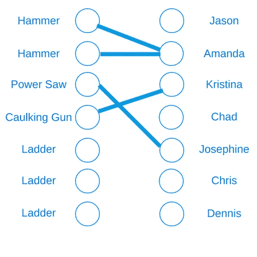
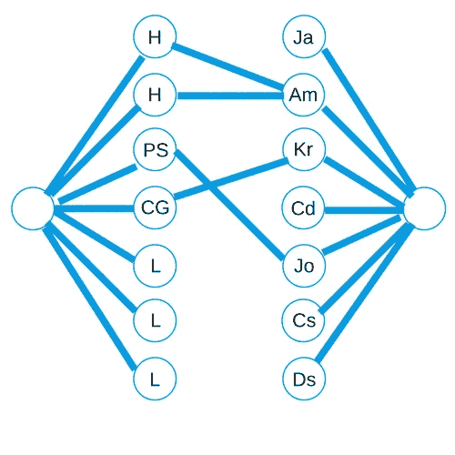

# 玩媒人游戏

> 原文：<https://medium.com/hackernoon/playing-match-maker-ec4eed7615af>

在上周的文章中，我们看到了函数图形库的介绍。这是一个整洁的小库，允许我们在 Haskell 中构建图形。然后，它使得解决基本的图形问题变得非常容易。例如，我们可以将我们的图形插入一个函数中，这个函数会给出最短的路径。在另一个例子中，我们用一个函数调用找到了图的最小生成树。

这些例子是相当做作的。我们的“输入”或多或少已经是一种图形格式，所以我们不需要花太多心思去转换它。然后我们在没有提供任何真实背景的情况下解决了任意的问题。在编程中，图算法经常在你最意想不到的时候出现！我们将用一个示例问题来证明这一点。

# 激励的例子

假设我们在建一栋房子。我们有几个人在修房子，他们都有各种各样的任务要做。他们需要某些工具来完成这些任务。只要一个人在工作中得到一件工具，他就能取得进步。当然，我们的工具供应有限。假设我们有一套工具:

```
Hammer
Hammer
Power Saw
Ladder
Ladder
Ladder
Caulking Gun
```

现在我们有以下的人在这栋房子里工作，他们都有以下的需求:

```
Jason, Hammer, Ladder, Caulking Gun
Amanda, Hammer
Kristina, Caulking Gun
Chad, Ladder
Josephine, Power Saw
Chris, Power Saw, Ladder
Dennis, Caulking Gun, Hammer
```

我们希望找到一种工具分配，使得最多的人至少拥有一种工具。在这种情况下，我们实际上可以找到一个任务，让所有七个人都有一个工具:

```
Jason - Ladder
Amanda - Hammer
Kristina - Caulking Gun
Chad - Ladder
Josephine - Power Saw
Chris - Ladder
Dennis - Hammer
```

我们将像上次一样从句柄读取问题，并假设我们首先读取工具的数量，然后读取人员。我们的输出将是工具列表，然后是从每个人的名字到他们可以使用的工具列表的映射。

```
module Tools whereimport           Control.Monad (replicateM)
import           Data.List.Split (splitOn)
import           System.IO (hGetLine, Handle)readInput :: Handle -> IO ([String], [(String, [String])])
readInput handle = do
  numTools <- read <$> hGetLine handle
  numPeople <- read <$> hGetLine handle
  tools <- replicateM numTools (hGetLine handle)
  people <- replicateM numPeople (readPersonLine handle)
  return (tools, people)readPersonLine :: Handle -> IO (String, [String]) 
readPersonLine handle = do
  line <- hGetLine handle
  let components = splitOn ", " line
  return (head components, tail components)
```

# 一些天真的解决方案

现在我们的第一个猜测可能是尝试贪婪算法。我们将遍历工具列表，找到列表中第一个可以使用该工具的人，并递归其余的人。这可能看起来有点像这样:

```
solveToolsGreedy :: Handle -> IO Int
solveToolsGreedy handle = do
  (tools, personMap) <- readInput handle
  return $ findMaxMatchingGreedy tools (Map.toList personMap)findMaxMatchingGreedy :: [String] -> [(String, [String])] -> Int 
findMaxMatchingGreedy [] _ = 0 -- No more tools to match
findMaxMatchingGreedy (tool : rest) personMap = case break (containsTool tool) personMap of
  (allPeople, []) -> findMaxMatchingGreedy rest personMap -- Can't match this tool
  (somePeople, (_ : otherPeople)) -> 1 + findMaxMatchingGreedy rest (somePeople ++ otherPeople)containsTool :: String -> (String, [String]) -> Bool
containsTool tool pair = tool `elem` (snd pair)
```

不幸的是，这可能导致一些次优结果。在这种情况下，我们的贪婪可能会导致我们将填缝枪分配给 Jason，然后 Kristina 将无法使用任何工具。

所以现在让我们试着通过两次递归调用来解决这个问题！我们会找到第一个可以将工具分配给的人(或者扔掉工具)。一旦我们做到了这一点，我们将想象两个场景。在案例 1 中，这个人将使用这个工具，所以我们可以从列表中删除这个工具和这个人。然后我们将对余数进行递归，并加 1。在案例 2 中，这个人不会使用这个工具，所以我们将递归，只是从这个人的列表中删除这个工具。

```
findMaxMatchingSlow :: [String] -> [(String, [String])] -> Int
findMaxMatchingSlow [] _ = 0
findMaxMatchingSlow allTools@(tool : rest) personMap = 
  case break (containsTool tool) personMap of
    (allPeople, []) -> findMaxMatchingGreedy rest personMap -- Can't match this tool
    (somePeople, (chosen : otherPeople)) -> max useIt loseIt
      where
        useIt = 1 + findMaxMatchingSlow rest (somePeople ++ otherPeople)
        loseIt = findMaxMatchingSlow allTools newList
        newList = somePeople ++ (modifiedChosen : otherPeople)
        modifiedChosen = dropTool tool chosendropTool :: String -> (String, [String]) -> (String, [String])
dropTool tool (name, validTools) = (name, delete tool validTools)
```

好消息是这将使我们得到最优解！它很好地解决了我们的简单问题！坏消息是，在更困难的案件上会花费太长的时间。像这样一个简单的“使用它或失去它”的算法将花费指数时间(`O(2^n)`)。这意味着即使对于中等大小的输入(~100)，我们也要等待很长时间。任何大得多的东西都要花费惊人的时间。另外，我们没有办法记住这里的解决方案。

# 图表来拯救！

因此，在这一点上，我们是否注定要在一个快速不准确的算法和一个正确但缓慢的算法之间做出选择？在这种情况下，答案是否定的！这个问题实际上最好通过使用图算法来解决！这就是所谓的“二分匹配”问题的一个例子。我们将创建一个包含两组节点的图。在左侧，每个工具都有一个节点。在右边，每个人都有一个节点。图中唯一的边是从左边的节点到右边的节点。如果“人”可以使用工具，则“工具”节点具有到“人”节点的边。这是我们图表的一部分(加上或减去我的设计技巧)。到目前为止，我们只画出了与阿曼达、克里斯汀和约瑟芬有关的边缘。



现在我们要找到这个图中的“最大匹配”。也就是说，我们希望边的最大集合使得没有两条边共享一个节点。使用图算法解决这个问题的方法是把它变成另一个图问题！我们将在最左边添加一个节点，称为“源”节点。我们将它连接到每个“工具”节点。现在我们将在最右边添加一个节点，称为“sink”节点。它将从每个“人”节点接收一条边。这个图中所有的边的距离都是 1。



Again, most of the middle edges are missing.

在这种情况下，最大匹配的大小等于从源节点到汇节点的“最大流量”。这是一个有些超前的概念。但是想象有水从源节点涌出，并且每条边都是“管道”,其值(1)是容量。我们想要最大量的水一次流过水槽。

上周我们看到了最短路径和最小生成树的内置函数。FGL 也有现成的最大流量解决方案。所以我们现在的主要目标是获取我们的对象并构建上面的图。

# 准备我们的解决方案

几周前，我们针对这个问题创建了一个细分树。这一次，我们将展示如何编写一个更通用的算法。在整篇文章的其余部分，你可以想象`a`是一个工具，`b`是一个人。我们将编写一个通用的`maxMatching`函数，它将接受一个 a 列表、一个 b 列表和一个谓词函数。这个函数将决定一个`a`对象和一个`b`对象之间是否应该有一条边。我们将使用上面的`containsTool`函数作为我们的谓词。然后我们调用我们的通用函数。

```
findMaxMatchingBest :: [String] -> [(String, [String])] -> Int
findMaxMatchingBest tools personMap = findMaxMatching containsTool tools personMap…(different module)findMaxMatching :: (a -> b -> Bool) -> [a] -> [b] -> Int
findMaxMatching predicate as bs = ...
```

# 构建我们的图表

为了建立我们的图表，我们必须决定我们的标签。同样，我们只用整数来标记我们的边。事实上，它们都有一个“容量”标签 1。但是我们的节点会稍微复杂一点。我们希望将节点与对象相关联，并且我们有一组异构的(和多态的)项目。我们将使这个`NodeLabel`类型可以引用四种节点类型中的任何一种:

```
data NodeLabel a b = 
  LeftNode a |
  RightNode b |
  SourceNode |
  SinkNode
```

接下来，我们将通过构建内部部分来开始构建我们的图表。我们将制作两组节点以及连接它们的边。我们将左边的节点分配给从 1 到列表大小的索引。然后，正确的节点将采用从第一个列表大小以上的一个到列表大小之和的索引。

```
createInnerGraph 
  :: (a -> b -> Bool) 
  -> [a]
  -> [b]
  -> ([LNode (NodeLabel a b)], [LNode (NodeLabel a b)], [LEdge Int])
createInnerGraph predicate as bs = ...
  where
    sz_a = length as
    sz_b = length bs
    aNodes = zip [1..sz_a] (LeftNode <$> as)
    bNodes = zip [(sz_a + 1)..(sz_a + sz_b)] (RightNode <$> bs)
```

接下来，我们还将使元组将索引匹配到没有节点标签包装的项目本身。这将允许我们调用这些项上的谓词。然后，我们将通过使用列表理解来去掉所有的边。我们将找出每一对，并确定谓词是否成立。如果是的话，我们会添加边缘。

```
where
  ...
  indexedAs = zip [1..sz_a] as
  indexedBs = zip [(sz_a + 1)..(sz_a + sz_b)] bs
  nodesAreConnected (_, aItem) (_, bItem) = predicate aItem bItem
  edges = [(fst aN, fst bN, 1) | aN <- indexedAs, bN <- indexedBs, nodesAreConnected aN bN]
```

现在我们已经有了所有的片段，所以我们将它们组合起来以完成定义:

```
createInnerGraph predicate as bs = (aNodes, bNodes, edges)
```

现在我们将构建“总图”。这将包括源节点和接收器节点。它将在返回值中包含这些节点的索引，以便我们可以在我们的算法中使用它们:

```
totalGraph :: (a -> b -> Bool) -> [a] -> [b] 
  -> (Gr (NodeLabel a b) Int, Int, Int)
```

现在，我们将从内部图表中取出所有部分以及每个列表的大小开始我们的定义。然后，我们将源和接收器的索引指定为这些组合大小之后的数字。我们还将制作节点本身，并给它们适当的标签。

```
totalGraph predicate as bs = ...
  where
    sz_a = length as
    sz_b = length bs
    (leftNodes, rightNodes, middleEdges) = createInnerGraph predicate as bs
    sourceIndex = sz_a + sz_b + 1
    sinkIndex = sz_a + sz_b + 2
    sourceNode = (sourceIndex, SourceNode)
    sinkNode = (sinkIndex, SinkNode)
```

现在，为了完成这个定义，我们将首先创建从源节点到正确节点的边。然后，我们将从左边的节点到水槽做边。我们也将使用列表理解。然后我们将所有的节点和边合并到两个列表中。

```
where
  ...
  sourceEdges = [(sourceIndex, lIndex, 1) | lIndex <- fst <$> leftNodes]
  sinkEdges = [(rIndex, sinkIndex, 1) | rIndex <- fst <$> rightNodes]
  allNodes = sourceNode : sinkNode : (leftNodes ++ rightNodes)
  allEdges = sourceEdges ++ middleEdges ++ sinkEdges
```

最后，我们将通过制作图表来完成定义。如前所述，我们还将返回源和汇索引:

```
totalGraph predicate as bs = (mkGraph allNodes allEdges, sourceIndex, sinkIndex)
  where
    ...
```

# 压轴戏

好了，最后一步！我们现在可以填充我们的`findMaxMatching`函数了。我们将首先从构建图表中获得必要的组件。然后我们将调用`maxFlow`函数。这是开箱即用的，就像上一篇文章中的`sp`和`msTree`！

```
import Data.Graph.Inductive.Graph (LNode, LEdge, mkGraph)
import Data.Graph.Inductive.PatriciaTree (Gr)
import Data.Graph.Inductive.Query.MaxFlow (maxFlow)findMaxMatching :: (a -> b -> Bool) -> [a] -> [b] -> Int
findMaxMatching predicate as bs = maxFlow graph source sink
  where
    (graph, source, sink) = totalGraph predicate as bs
```

我们完事了。这将总是给我们正确的答案，它运行得非常快！如果你想尝试一下，看看 Github 上的代码吧！

# 结论

咻算法很累人，不是吗？我们刚刚写了一大堆代码。让我们快速回顾一下。所以这一次我们看了一个实际的问题，它不是一个明显的图形问题。我们甚至尝试了几种不同的算法。尽管他们都有问题。最终，我们发现图形算法是解决方案，我们能够用 FGL 实现它。

如果你想使用 FGL(或者其他最棒的 Haskell 库)，如果你学会了如何使用 Stack，那会有很大的帮助！这个伟大的工具将项目组织和包管理打包成一个工具。查看我们的免费 [Stack 迷你课程](http://academy.mondaymorninghaskell.com/p/your-first-haskell-project)并了解更多！

如果你从来没有用 Haskell 编程过，那么你还在等什么？超级好玩！你应该下载我们的[入门清单](https://www.mmhaskell.com/checklist)，获取一些关于创业的提示和资源！

下周敬请关注周一早上哈斯克尔的博客[的更多内容！](https://www.mmhaskell.com/)