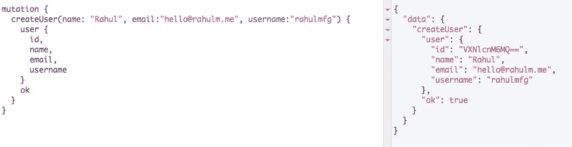
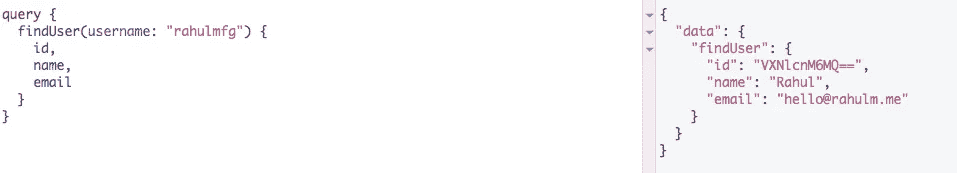
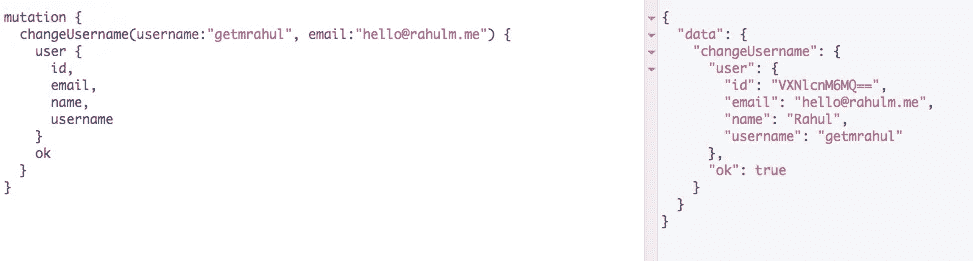

# 玩 GraphQL + Python Flask

> 原文：<https://medium.com/hackernoon/playing-with-graphql-python-flask-84ead622461c>

好朋友😉建议我学习 [GraphQL](https://hackernoon.com/tagged/graphql) 就在我寻找资源的时候，[如何 GRAPHQL](https://www.howtographql.com/) 上线了。

我带着 GraphQL 的基本原理进去，后来发现了[石墨烯](http://graphene-python.org/)。这是 Python 的 GraphQL 框架。我对石墨烯更感兴趣。

所以我也学习了这些东西，并想出了一个简单的项目[来使用 GraphQL 和 Python-Flask 和 Graphene-SQLAlchemy。](https://github.com/Getmrahul/Flask-Graphene-SQLAlchemy)

在[演示项目](https://github.com/Getmrahul/Flask-Graphene-SQLAlchemy)中，我创建了一个简单的表格“users ”,包含字段 id、名称、电子邮件、用户名。并且，创建了一个模式( [schema.py](https://github.com/Getmrahul/Flask-Graphene-SQLAlchemy/blob/master/schema.py) )来

*   添加新用户。
*   获取所有用户列表。
*   查找用户名为的用户。
*   用电子邮件 ID 更新用户名。

下面是 GraphQL 查询执行的示例截图:

Mutation to create a new user

Query to find a user

Mutation to change username

你可以试试这里的演示项目。期待使用[反应](https://hackernoon.com/tagged/react)与演示项目堆栈。如果你发现任何打字错误或错误，一定要让我知道。👨‍💻 🙌