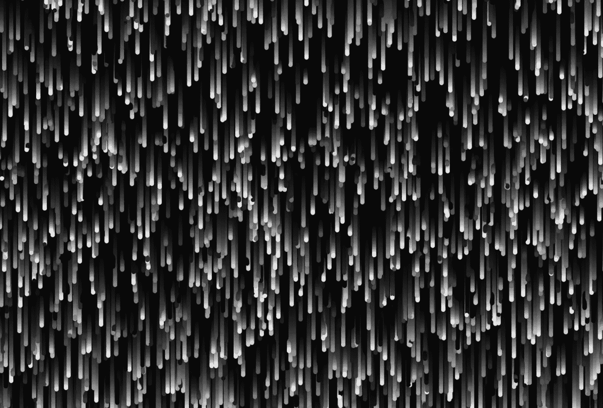

# 玩粒子

> 原文：<https://medium.com/hackernoon/playing-with-particles-ef87744d7ed2>

## 创建粒子雨效果

如果你是这个系列的新手，从这里开始:[第一部](/@radarboy3000/creative-coding-basics-4d623af1c647#.hn9zzliob)、[第二部](/@radarboy3000/creative-coding-basics-4d623af1c647#.hn9zzliob)和[第三部](/@radarboy3000/how-to-make-particles-1cbeee937593#.wwjhkv7u2)

所有的代码和库都可以在这里找到:[https://github.com/GeorgeGally/creative_coding](https://github.com/GeorgeGally/creative_coding)



Particle rain effect

所以现在我们有了粒子…让我们玩得开心点，创造一些粒子效果。希望这也能让你了解同样的代码如何创造出截然不同的效果，并让你进行更多的尝试，这就是神奇和有趣的地方。

因此，让我们创建一个简单的，但视觉上令人愉快的粒子雨效果，就像上面的图像…

我们已经有了我们需要的所有代码…我们只需要让粒子轨迹从顶部落下，而不是反弹，然后当它们到达底部时重新出现在顶部…

所以，首先让我们添加一些粒子…我们将球的速度设置为 0，因为粒子正在下落。我们给它一个从 0 到屏幕宽度的随机起始位置，即。*随机(w)；*这和说 *random(0，w)是一样的；*我们在屏幕上方的某个地方给球一个垂直的起点，以免它们都在同一个地方开始。以及使用 *rgb 的随机灰色(随机(255))*；

因此，我们的设置代码将如下所示:

```
var ctx = createCanvas("canvas1");
var max_balls = 2000;
var balls = [];**for (var i = 0; i < max_balls; i++) {
  addBall();
}**// push a ball and it's values into the array
function addBall(){
  var ball = {
    **x: random(w),**
    **y: random(-200,0),**
    **speed_x: 0,
    speed_y: random(0.5, 3),**
    size: 8,
    **colour: rgb(random(255))**
  }
  balls.push(ball);
  if (balls.length > max_balls) balls.splice(0,1);
}
```

对于我们的 *moveBall()* 函数，它看起来和以前几乎一样，除了我们需要在粒子越过边缘时将它重置到顶部:

```
function moveBall(){ for (var i = 0; i < balls.length; i++) {

   var b = balls[i];
    b.x = b.x + b.speed_x;
    b.y = b.y + b.speed_y;*// if ball goes over bottom reset it* **if (b.y > h) {
      b.y = random(-100,0);
      b.colour = rgb(randomInt(255));
   }** }}
```

为了简洁起见，让我们将剩余的内容放在一个 *resetBall()* 函数中。我们需要将球的引用传递给函数，否则函数不知道我们引用的是哪个球。我们只需将一个对象/变量传递给括号中的函数即可，如下所示:

```
*// syntax: functionName(variable)* resetBall(b)
```

并像这样接收函数中的变量:

```
function resetBall(_b) {
  // do some stuff with _b
}
```

在编码中，我们经常使用下划线(在这种情况下像 _b ),因为这样很容易看出我们引用的是局部变量引用(在函数内部声明的任何变量在函数外部都看不到——这是一件好事。你应该尽可能地避开全局变量)。

所以现在我们完成的代码应该是这样的:

```
var ctx = createCanvas("canvas1");
var max_balls = 2000;
var balls = [];for (var i = 0; i < max_balls; i++) {
  addBall();
}function addBall(){
  var ball = {
    x: random(w),
    y: random(-200,0),
    speed_x: 0,
    speed_y: random(0.5, 3),
    size: 8,
    colour: rgb(random(255))
  }
  balls.push(ball);
  if (balls.length > max_balls) balls.splice(0,1);
}function draw(){
 ctx.background(0, 0.06);
 moveBall();
 drawBall();
}function moveBall(){
  for (var i = 0; i < balls.length; i++) {
    var b = balls[i];
    b.x = b.x + b.speed_x;
    b.y = b.y + b.speed_y; **if (b.y > h) {
      resetBall(b);
    }**
  }
}**function resetBall(_b){
  _b.y = random(-100,0);
  _b.colour = rgb(randomInt(255));
}**function drawBall(){
  for (var i = 0; i < balls.length; i++) {
    var b = balls[i];
    ctx.fillStyle = b.colour;
    ctx.fillEllipse(b.x, b.y, b.size, b.size);
  }
}
```

就这样...粒子雨。您将使用的大多数代码实际上只是它的变体。所以玩一玩，看看你还能想出什么效果…下次见。

**在 Instagram 上关注我这里:**[**https://www.instagram.com/radarboy3000/**](https://www.instagram.com/radarboy3000/)

**在推特上关注我:**[**https://twitter.com/radarboy_japan**](https://twitter.com/radarboy_japan)

**又如我这里的脸书页:**[](https://www.facebook.com/radarboy3000)

**创意编码入门第一部分:[https://medium . com/@ radarboy 3000/Creative-Coding-basics-4d 623 af 1c 647 # . HN 9 zzliob](/@radarboy3000/creative-coding-basics-4d623af1c647#.hn9zzliob)**

**创意编码入门第二部分:[https://medium . com/@ radarboy 3000/introduction-to-Creative-Coding-Part-2-d 869832 d9 FB # . fzxcom 541](/@radarboy3000/introduction-to-creative-coding-part-2-d869832d9ffb#.fzxcom541)**

**创意编码入门第三部分:[https://medium . com/@ radarboy 3000/how-to-make-particles-1 cbee 937593 # . wwjhkv 7 u 2](/@radarboy3000/how-to-make-particles-1cbeee937593#.wwjhkv7u2)**

**Github 资源库的所有代码:[https://github.com/GeorgeGally/creative_coding](https://github.com/GeorgeGally/creative_coding)**

**[](http://bit.ly/HackernoonFB)****[](https://goo.gl/k7XYbx)****[](https://goo.gl/4ofytp)**

> **[黑客中午](http://bit.ly/Hackernoon)是黑客如何开始他们的下午。我们是这个家庭的一员。我们现在[接受投稿](http://bit.ly/hackernoonsubmission)并乐意[讨论广告&赞助](mailto:partners@amipublications.com)机会。**
> 
> **如果你喜欢这个故事，我们推荐你阅读我们的[最新科技故事](http://bit.ly/hackernoonlatestt)和[趋势科技故事](https://hackernoon.com/trending)。直到下一次，不要把世界的现实想当然！**

****