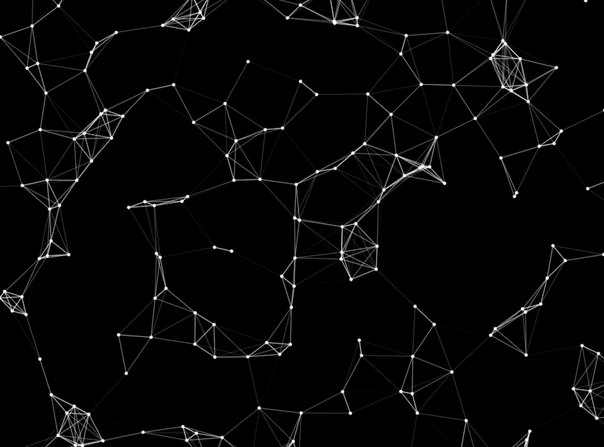

# 构建粒子星座效果

> 原文：<https://medium.com/hackernoon/playing-with-particles-part-2-9a4804091024>



## 互相检查两个数组

如果您一直在跟进，那么做一个新的 git pull 来获取最新的代码。

*如果你是第一次接触这个系列，从这里开始:* [*第一部分*](/@radarboy3000/creative-coding-basics-4d623af1c647#.hn9zzliob)*[*第二部分*](/@radarboy3000/creative-coding-basics-4d623af1c647#.hn9zzliob)*[*第三部分*](/@radarboy3000/how-to-make-particles-1cbeee937593#.wwjhkv7u2)*[*第四部分*](/@radarboy3000/playing-with-particles-ef87744d7ed2#.ntk4zugse) *和* [*第五部分*](/@radarboy3000/polygons-translation-and-rotation-ecd44509aa45#.6l27kzox6)***

***这些教程的所有代码和库都可以在这里找到:*[*https://github.com/GeorgeGally/creative_coding*](https://github.com/GeorgeGally/creative_coding)**

**我想向你介绍我一直在使用的两个功能。第一个是 *dist()* ，使您能够计算两个对象之间的距离:**

```
***// returns distance between to objects* 
dist(x1, y1, x2, y2);** 
```

**所以我们可以这样写:**

```
**var my_distance = dist(x1, y1, x2, y2);**
```

**或者像这样在一个 *if 语句*中使用它:**

```
**if (dist(x1, y1, x2, y2) > 100) { *// do something*}**
```

***dist()* 函数不仅可以方便地检查物体之间的距离，还可以用于碰撞检测和避障。如果你使用我的库，你不需要知道函数的内部工作原理，如下所示:**

```
**function dist(x1, y1, x2, y2) {
 x2-=x1; y2-=y1;
 return Math.sqrt((x2*x2) + (y2*y2));
}**
```

**我想展示的另一个函数是 *posNeg()* ，它返回一个随机值 1 或-1。在你的一些探索中，你可能已经注意到，当你要求一个随机的速度，例如随机的(-10，10)，你的值可能最终为零或接近于零，这通常不是你想要的。因此，我们可以使用 posNeg()通过这样做来规避它:**

```
**var speed_x = posNeg * random(5,10);**
```

**好了，理论到此为止。让我们重现上图中的星座网络效果。首先让我们让一些球飞来飞去…这里真的没有什么新东西，除了使用 *posNeg()* 和我去掉了 *if 语句*上的括号，如果语句中只有一行代码，你可以这样做:**

```
**var ctx = createCanvas("canvas1");
var number_of_balls = 200;
var balls = [];
var radius = 200;
ctx.lineWidth = 1;
for (var i = 0; i < number_of_balls; i++) {
  addBall(i);
}function addBall(_i){
  var ball = {
    x: random(w),
    y: random(h),
 **speed_x: posNeg() * random(0.2, 1),
    speed_y: posNeg() * random(0.2, 1),**
    size: 5,
    colour: rgb(255),
    angle: i * 360/number_of_balls
  }
  balls.push(ball);
}function draw(){ctx.background(0);moveBall();
  drawBall();}function moveBall(){ for (var i = 0; i < balls.length; i++) { var b = balls[i];
    b.x += b.speed_x;
    b.y += b.speed_y; **if (bounce(b.x, 0, w)) b.speed_x *=-1;
    if (bounce(b.y, 0, h)) b.speed_y *=-1;** }} function drawBall(){ for (var i = 0; i < balls.length; i++) { var b = balls[i];
     ctx.fillStyle = b.colour;
     ctx.fillEllipse(b.x, b.y, b.size); }}**
```

**现在让我们利用 *dist()* 函数，假设:如果一个粒子靠近另一个粒子，在它们之间画一条线。在代码中我们会说:**

```
**if (dist(b1.x, b1.y, b2.x, b2.y) <= 50) {
   ctx.line(b1.x, b1.y, b2.x, b2.y);
}**
```

**我们需要遍历所有的粒子来做这个检查，所以我们可以创建一个这样的函数，然后在我们的 *moveBall()* 函数中调用它:**

```
**function moveBall(){ for (var i = 0; i < balls.length; i++) { var b = balls[i];
    b.x += b.speed_x;
    b.y += b.speed_y; drawConnections(i); if (bounce(b.x, 0, w)) b.speed_x *=-1;
    if (bounce(b.y, 0, h)) b.speed_y *=-1; }} *// pass in the particle number we want to check against*function drawConnections(_particle_number) {

  // loop through all the particles again  
  for (var j = 0; j < balls.length; j++) { b1 = balls[_particle_number];
    b2 = balls[j];

    *// check the distances between the two particles
    // and draw a line between them 
    //if they're less than a certain distance* if (dist(b1.x, b1.y, b2.x, b2.y) <= 50) {
        ctx.strokeStyle = rgb(255);
        ctx.line(b1.x, b1.y, b2.x, b2.y);
    }}}**
```

**但是用那种方式做有些低效。**

**首先，在某个阶段 j 会等于我们的粒子数，即。if 会自我核对，显然它总是小于 50。我们可以通过这样做来解决这个问题，通过使用*！=* (不等于)符号:**

```
**function drawConnections(_particle_number) {

  for (var j = 0; j < balls.length; j++) {

    *// only check particles which aren't the same*
    **if (j != _particle_number) {** b1 = balls[_particle_number];
      b2 = balls[j]; if (dist(b1.x, b1.y, b2.x, b2.y) <= 50) {
        ctx.strokeStyle = rgb(255);
        ctx.line(b1.x, b1.y, b2.x, b2.y);
      } **}** }}**
```

**但是仍然有一些东西是低效的(对于粒子来说，学会尽可能高效总是好的)。从我们的 *moveBall()* 和 *drawConnections()* 函数来看，本质上我们有两个循环，一个在另一个里面，检查所有其他的球。所以我们真正在做的是:**

```
**for (var i= 0; i< balls.length; j++) { // get a particle   
     b1 = balls[i]; // now loop through all particles and check against it
     for (var j = 0; j < balls.length; j++) { b2 = balls[j]; **if (i!=j) {** *// check the distance between particles etc****.
     }*** }}**
```

**如果我们检查粒子 5 和粒子 10。然后我们将检查粒子 10 和粒子 5。所以我们实际上加倍了我们的计算。不太好。所以一旦我们检查了一个粒子，没有理由再检查一次。并且解决方案简单而优雅。如果对照第一个粒子:balls[0]，我们可以从下一个粒子 p[1]开始第二个循环。就这样继续下去。此外，由于最后一个粒子已经与所有其他粒子进行了核对，因此我们可以缩短第一个循环:**

```
****for (var i= 0; i< balls.length-1; j++) {**// get a particle   
    b1 = balls[i]; // now loop the next particles
   ** for (var j = i+1; j < balls.length; j++) {** b2 = balls[j];

      *// check the distance between particles etc.* }}**
```

**下面是完整的代码:**

```
**var ctx = createCanvas("canvas1");
var number_of_balls = 200;
var max_distance = 80;
var balls = [];// push a ball and it's values into the array
for (var i = 0; i < number_of_balls; i++) {
  addBall(i);
}function addBall(_i){
  var ball = {
    x: random(w),
    y: random(h),
    speed_x: posNeg() * random(0.2, 1),
    speed_y: posNeg() * random(0.2, 1),
    size: 5,
    colour: rgb(255),
  }
  balls.push(ball);
}function draw(){ ctx.background(0); moveBall();
  drawBall();}function moveBall(){ for (var i = 0; i < balls.length; i++) {

    var b = balls[i];
    b.x += b.speed_x;
    b.y += b.speed_y; if (bounce(b.x, 0, w)) b.speed_x *=-1;
    if (bounce(b.y, 0, h)) b.speed_y *=-1; }} function drawBall(){

  for (var i = 0; i < balls.length; i++) {

    var b = balls[i];
    drawConnections(i);
    ctx.fillStyle = b.colour;
    ctx.fillEllipse(b.x, b.y, b.size);

  }}function drawConnections(_i) {

   for (var j = _i+1; j < balls.length; j++) { b1 = balls[_i];
      b2 = balls[j]; if (dist(b1.x, b1.y, b2.x, b2.y) <= max_distance) {
        ctx.strokeStyle = rgb(255);
        ctx.line(b1.x, b1.y, b2.x, b2.y);
      } }}**
```

**如果根据距离调整线宽，我们还可以做一件事来使它看起来更好:**

```
**function drawConnections(_i) { for (var j = 0; j < balls.length; j++) { b1 = balls[_i];
    b2 = balls[j];
    var distance = dist(b1.x, b1.y, b2.x, b2.y);
    if (j!=i) {
      if ( distance <= max_distance) {
          ctx.strokeStyle = rgb(255);
          **ctx.lineWidth = 1 - distance/max_distance;**
          ctx.line(b1.x, b1.y, b2.x, b2.y);
      }
    }
  }}**
```

**嘣，我们有一个简单，干净，优雅的粒子星座效果，就像上面的标题图像。太棒了。希望你喜欢这个教程。快乐编码。**

**如果你是这个系列的新手，从这里开始:[第一部分](/@radarboy3000/creative-coding-basics-4d623af1c647#.hn9zzliob)，[第二部分](/@radarboy3000/creative-coding-basics-4d623af1c647#.hn9zzliob)，[第三部分](/@radarboy3000/how-to-make-particles-1cbeee937593#.wwjhkv7u2)，[第四部分](/@radarboy3000/playing-with-particles-ef87744d7ed2#.ntk4zugse)和[第五部分](/@radarboy3000/polygons-translation-and-rotation-ecd44509aa45#.6l27kzox6)**

**这些教程的所有代码和库都可以在这里找到:[https://github.com/GeorgeGally/creative_coding](https://github.com/GeorgeGally/creative_coding)**

****在 Instagram 上关注我这里:**[【https://www.instagram.com/radarboy3000/】T21](https://www.instagram.com/radarboy3000/)**

****在这里关注我的推特:**[**https://twitter.com/radarboy_japan**](https://twitter.com/radarboy_japan)**

****又如我这里的脸书页:**[](https://www.facebook.com/radarboy3000)**

****[](http://bit.ly/HackernoonFB)********[](https://goo.gl/k7XYbx)********[](https://goo.gl/4ofytp)****

> ****[黑客中午](http://bit.ly/Hackernoon)是黑客如何开始他们的下午。我们是 [@AMI](http://bit.ly/atAMIatAMI) 家庭的一员。我们现在[接受投稿](http://bit.ly/hackernoonsubmission)，并乐意[讨论广告&赞助](mailto:partners@amipublications.com)机会。****
> 
> ****如果你喜欢这个故事，我们推荐你阅读我们的[最新科技故事](http://bit.ly/hackernoonlatestt)和[趋势科技故事](https://hackernoon.com/trending)。直到下一次，不要把世界的现实想当然！****

********