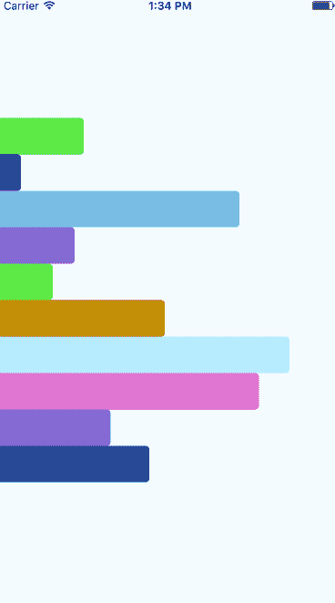
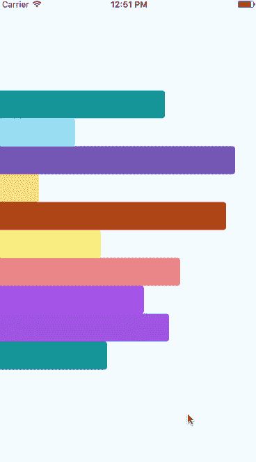
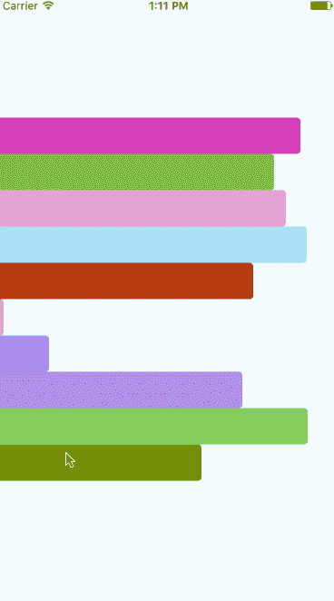

# 使用 React 本机动画

> 原文：<https://medium.com/hackernoon/playing-with-react-native-animations-d065e7e97391>

对于我今年的第一个帖子，我想保持简洁，尝试一下 [React 本地动画 API](https://facebook.github.io/react-native/docs/animations.html) 。我们将创建一些动画栏，并不断改变它们的大小。这是我们的最终结果



Please note that any choppiness is a result of recording the GIF (video at end of post as well).

有兴趣试试吗？我们开始吧。

## 项目设置

所有的代码都可以在 Github 上找到，但是如果你想继续下去，这里是你需要开始做的事情。

```
react-native init RNBarGraphExample
```

然后创建一个`app/index.js`和`app/AnimatedBar.js`并将下面的内容复制粘贴到它们中开始。

这两个文件都非常简单，会在你的应用程序中产生一个浅蓝色的屏幕(没有别的)。让他们快速浏览一遍，了解发生了什么。

最后，我们希望在我们的应用程序中实际使用这些文件——为此，用以下内容替换`index.ios.js`和`index.android.js`。

最后一步，纯粹是为了方便，是通过 npm 安装`randomcolor`。

## 创建数据

在渲染之前，我们需要一些数据。我们将保持简单，创建 10 个宽度在 0 和屏幕宽度之间的数据元素——这将全部发生在`app/index.js`

当我们的组件安装时，它将创建 10 个不同宽度的元素。现在让我们快速创建一些静态条，这样我们就可以开始看到一些东西。在`app/AnimatedBar.js`中，我们将设置一些静态样式并将它们应用到我们的视图中。

请注意，每个条的背景颜色来自状态，这将是一个随机的颜色，并在组件的任何重新呈现之间保持不变。您现在应该会看到类似这样的内容


Your colors will vary.

酷——我们看到了一些东西！但是很无聊…

## 进入时的动画

所以现在我们想在第一次渲染时动画显示条形的宽度。这是视觉上的愉悦和快速的胜利。要做到这一点，我们需要在`app/AnimatedBar.js`中创建一个新的动画值，然后使用该值来指定我们的条的宽度。

这样，我们的 bar 的值将总是为 0，所以现在我们需要将它从 0 动画化为您传递到`AnimatedBar`实例中的值——我们将在`AnimatedBar`中的 componentDidMount 中这样做。我们利用`Animated.timing`函数将值从 0 更改为传入的值。如果您愿意，也可以使用`Animated.spring`。

这个函数将我们的动画值作为第一个参数，将配置对象作为第二个参数。最初宽度是 0，我们告诉它逐渐从 0 到 X(其中 X 是通过 props 传递给组件的随机宽度值)。当重新加载应用程序时，您应该会看到类似这样的内容。



## 延迟动画

我们上面所做的可能有点忙——有很多事情同时发生。让我们将它设置为逐级向下，在渲染每个条形之间有一点延迟，好吗？

如果您还记得前面的内容，我们还向我们的`AnimatedBar`发送了一个延迟，它只是一个静态数字(本例中为 100)*该值在该区域中的索引。因此第一个元素的延迟是`100 * 0 = 0`，第二个是`100 * 1 = 100`，…，`100 * 9 = 900`。因此，第一个元素将立即开始，最后一个元素直到近一秒钟后才开始。

记住这一点，让我们使用延迟值！同样，我们将在组件中工作，除了`Animated.timing`，我们还将使用`Animated.sequence`和`Animated.delay`。

`Animated.sequence`允许我们对各种动画功能进行排序，而`Animated.delay`只是让我们延迟连续的动画事件。

> Animated.timing 实际上有一个延迟选项，你可以通过它来做同样的事情，而且更简洁，但我想尝试不同的功能来了解它们，并与你分享。

因此，您可以看到，我们将一组动画函数传递给 Animated.sequence，它将按顺序调用这些函数。对于延迟，我们使用传递给组件的延迟。



在这里，我们看到的是和之前一样的动画，只是层叠而下，两者之间稍有延迟！简单的变化，但我认为它增加了很多动画…而且我们学了更多的 API！

## 恒定动画

目前，我们的应用程序只在最初加载数据时进行渲染——对于许多应用程序来说，这已经足够了，但让我们玩得更开心一点，让它不断更新。核心动画已经就绪——我们只需要抽象一些`AnimatedBar`代码，以便在组件更新时也能运行。我们将为此创建一个新函数，并在组件第一次挂载以及 componentWillReceiveProps 被调用时调用它。

太好了！现在，我们将设置一个间隔，每 1 秒生成一次新数据。

这就是我们完整的动画！下面的视频更好地展示了这一运动

> 想看看 React Native 中动画的真实应用吗？报名参加我的[免费 React 本土课程](https://learn.handlebarlabs.com/p/react-native-basics-build-a-currency-converter)！

问题/评论？请回复我，一定要推荐这篇文章！

[](http://bit.ly/HackernoonFB)[](https://goo.gl/k7XYbx)[](https://goo.gl/4ofytp)

> [黑客中午](http://bit.ly/Hackernoon)是黑客如何开始他们的下午。我们是 [@AMI](http://bit.ly/atAMIatAMI) 家庭的一员。我们现在[接受投稿](http://bit.ly/hackernoonsubmission)并乐意[讨论广告&赞助](mailto:partners@amipublications.com)机会。
> 
> 如果你喜欢这个故事，我们推荐你阅读我们的[最新科技故事](http://bit.ly/hackernoonlatestt)和[趋势科技故事](https://hackernoon.com/trending)。直到下一次，不要把世界的现实想当然！

