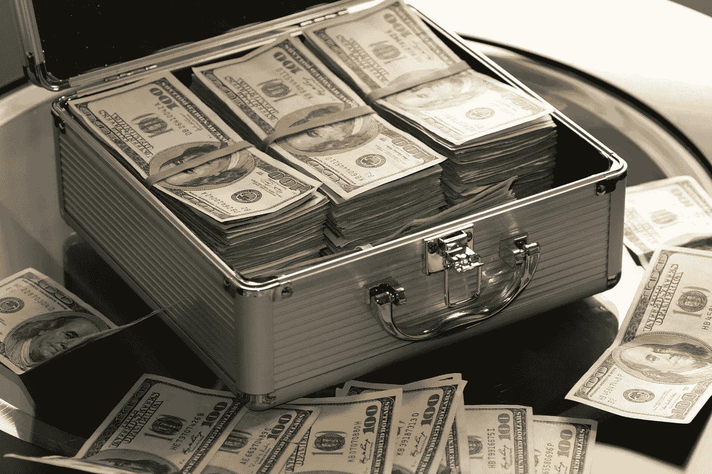

# 请投资我的初创企业，我对它的估值为 60 亿美元

> 原文：<https://medium.com/hackernoon/please-invest-in-my-startup-which-im-valuing-at-6-000-000-000-000-afe675c64340>

My startup is worth 67 Bill Gateses.

## 独角兽太 2016 年了。

你好，投资人！我知道你每天都会看到很多投球。有些看起来很有希望，甚至好得难以置信。但是今天让我告诉你一个交易，如果你现在不接受，你会后悔的。

我想向你们介绍我的创业公司，我，创始人兼首席执行官，对它的估值是 60 亿美元。我不能告诉你太多关于这家公司的事情，因为我不想让你窃取我的想法，但是相信我，当我说我的秘密创业公司的价值将是一个中等发达国家 GDP 的三倍！我知道我的创业公司有巨大的市场潜力，因为当我在 TGI 星期五餐厅的神风特攻队中向我的朋友拉里、休和杰罗德问起这件事时，他们都说这件事“听起来很酷”。

我很清楚这个估值是亚马逊的 12 倍。然而，我的公司有亚马逊没有的东西:一个非常古怪的标志！事实上，我的创业是如此创新和协同，它甚至没有一个名字！相反，我让一位名叫醉鬼查理的街头艺术家开发了一个由零组成的符号，代表当我的初创公司达到 60 亿美元的潜力时我将赚到的所有钱。

我的产品很受欢迎！我很自豪地说，通过我们的众筹努力，它已经有 972 个支持者。因此，请理解，为了成为我们 60 亿美元创业资金的一部分，你将和其他 972 名帮助我们筹集了总计 1280 美元的人一起被放在封顶表上。

我知道形势对我不利。但我相信我拥有成功所需的一切，比如 reddit 上极其通情达理、值得信赖的陌生人的绝妙建议。他们从未误导过我，比如他们告诉我，除掉一个联合创始人的最好方法是藏起尸体。谢谢你的好建议，KewlGuy1026！

我知道投资者通常投资于创始人，而不仅仅是产品。你应该知道我是个局外人。我知道这是真的，因为我读过马尔科姆·格拉德威尔的书。我每天工作 23 个小时，只是为了确保我能在一年半的时间里达到 10，000 小时。我都不睡觉！我只是用额外的一个小时来嘲笑那些晚上需要八小时睡眠才能正常工作的人。哈哈哈…你们都是傻逼！

我的产品没有竞争对手！有些人可能会说，这是因为成千上万的初创公司已经尝试了我们的概念，但都失败了，因为他们意识到需求没有他们希望的那么多。但我认为这是因为我的项目是如此创新，甚至埃隆·马斯克都会说，“伙计，我真不敢相信我没有想到这一点！让我扔钱给你！爸爸要下雨了！”

市场是北美的每个人。和南美洲。和非洲。和欧洲。和亚洲。到处都是！除了澳大利亚——我的团队中没有人愿意为了在高速公路上开车不小心撞上一只袋鼠而经历 20 个小时的飞行。

你可能会好奇为什么我需要钱来加速公司的发展。目前，我们处于收入前…和产品前…和商业前模式。但是，如果你资助我们，我打算充分利用你的投资，把钱花在一张超棒的乒乓球桌、大量的酒和由 14 克拉钻石制成的公司礼品上。去他妈的其他创业公司和他们该死的手提袋！手提袋对大粪来说太小，对小粪来说又太大。我也想在办公室里养一只宠物种马，作为公司文化的一项举措，但我明白这是否是一项应该等到 b 系列的成本。

未来，我的产品将把人工智能与虚拟现实和机器学习结合起来，用于区块链的大数据，同时使用以比特币租赁的自动驾驶汽车。如果这听起来荒谬且毫无意义，那么让我告诉你，你显然没有阅读足够的行业术语！

谢谢你的时间。我期待听到你准备好亲手交付 300 亿美元支票的消息。

# 喜欢这个作品吗？如果有足够多的人点击下面的❤️，我保证会写更多！非常感谢你的支持！