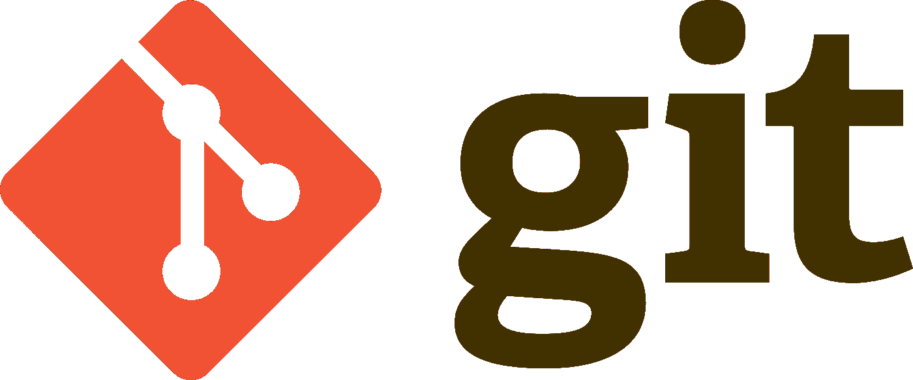

# 请使用 git

> 原文：<https://medium.com/hackernoon/please-use-git-da3bea7d1234>

尽管现在是 2016 年，Git 在组织和团队中无处不在，但我在巴基斯坦遇到了数量惊人的不使用版本控制的人。这让我很难与他们合作。

即使你不是巴基斯坦人，也不使用 Git 这样的版本控制系统(VCS ),你也应该这样做。我不敢相信我必须解释这一点，但当与 Github、Gitlab 或 Bitbucket 等代码托管网站结合使用时，您会得到:

*   完整的项目历史
*   正确的版本控制
*   还原到以前的版本
*   高效协作的能力
*   自动备份
*   挂钩自动化构建服务的能力
*   更好地实时查看您的更改
*   更好地了解代码随时间的演变

这篇文章指出了我从人们那里得到的一些不使用 git 的借口，并解释了为什么它们不是好的借口。

> 太复杂了

不，不是的。像任何其他技术一样，你需要花一点时间来学习它，并将其集成到你的工作流程中，但是一旦完成了这些工作:**你可能只会使用大约十个命令——永远不会。**阅读[萨姆科尔科斯](https://medium.com/u/202fbe17df40?source=post_page-----da3bea7d1234--------------------------------)’[文章](https://medium.freecodecamp.com/git-cheat-sheet-and-best-practices-c6ce5321f52)因为那些都是我用的命令。

> 我不太擅长命令行。

黑白的文字屏幕吓到你了吗？应该不会，[不要怕指挥](http://www.howtogeek.com/138675/htg-explains-why-you-shouldnt-be-scared-of-the-terminal-on-linux/)线。作为一名开发人员，你将不得不在某个时候学习它，或者在替代方法更有效的时候，通过使用 GUI 应用程序来阻碍你的开发。

如果你仍然不相信，这里有一些非常好的跨平台 Git 客户端的列表，它们有漂亮的界面:

*   [基特克拉肯](https://www.gitkraken.com/)
*   [Github 桌面](http://desktop.github.com/)
*   [任何这些](https://git-scm.com/downloads/guis)

> “我们的项目太小了”

没有这回事。即使你的项目只有十行代码，它也是有目的的，应该被版本控制。使用 VCS，您可以:

*   发布项目的能力
*   吸引贡献者
*   使未来的项目增长成为可能
*   你所有改变的时间表
*   撤销更改的能力
*   使用**一个**命令备份您的存储库
*   在所有设备上同步代码库

您还可以获得:

*   将代码自动部署到服务器的能力
*   对每一个代码变更进行自动测试

> “我们的团队太小了”

没有这回事。即使只有一个人，你也会得到:

*   你所有改变的时间表
*   撤销更改的能力
*   使用**一个**命令备份您的存储库
*   在所有设备上同步代码库

两人或两人以上，您将获得:

*   与**一个**命令共享代码
*   最新代码库的单一来源
*   所有代码库变更的鹰眼视图
*   代码贡献的责任
*   关于个人捐助者的统计数据
*   简化的代码审查

> “我们使用 Dropbox”

这不是答案。Dropbox 是用来存储和分享文件的。在代码共享方面，它不如 git 有效，而且它对冲突没有帮助。哦，你用文件历史来恢复旧版本？还是不够好。它不会超过三十天。你知道什么有伟大的版本历史吗？一个 VCS。猜猜什么不是 VCS。Dropbox。

> “我们使用电子邮件附件”

*   你有多少版本的代码库？
*   有多少次你的代码分裂成多个分支，因为人们在自己工作之前没有复制其他人的更改？
*   你喜欢把对方的代码复制粘贴到自己的代码里吗？

顺便说一下，Git 通过[补丁](https://git-scm.com/book/en/v2/Git-Commands-Patching)支持电子邮件协作。事实上，通过电子邮件发送 git 补丁是向 Linux 内核提交补丁的首选方式。

> “我们的设计师不是技术人员”

你的设计师创建 HTML 和 CSS 文件吗？他们有足够的技术来使用 Git。令人惊奇的是，在 Github pages 的帮助下，你可以通过在浏览器中访问一个 url 来查看他们的[最新变化](https://pages.github.com/)。

我们的[公司网站](https://payload.tech/)托管在 Github 页面上。它只是一个 [git 仓库](https://github.com/payloadtech/corporate-site)中的 HTML/CSS。

> “我是学生”

你最需要它！当你还是学生的时候，你每天都要应对代码挑战。如果没有 VCS 来帮助你备份代码，你最终会因为硬盘故障或 USB 驱动器损坏而丢失代码，并丢失所有过去的知识。

此外，在 Github 上，你可以展示你的作品集。作为雇主，你会选择哪一种:

*   亚当:他的简历上说他为一个学校项目写了一个非常棒的日历应用程序。
*   鲍勃:他的简历上说他为一个学校项目写了一个很棒的日历应用程序，**，他在 Github 上有一个链接可以查看他的代码。**

> “我不需要 VCS”

你知道。

> “不，我不知道”

[是](http://stackoverflow.com/questions/1408450/why-should-i-use-version-control) [你](http://soundsoftware.ac.uk/why-version-control) [他妈的](http://oss-watch.ac.uk/resources/versioncontrol) [做](https://www.quora.com/What-is-git-and-why-should-I-use-it)。

> “我有很大的依赖文件”

Git 有能力[忽略存储库中的指定文件](https://git-scm.com/docs/gitignore)。使用一个[构建系统](https://en.wikipedia.org/wiki/Build_automation)来获取和安装你的依赖项，不要将它们签入你的代码。这里有一个你可以使用的工具列表。

> “我有需要存储在代码中的大型文件和数据集”

[Git LFS 帮你搞定了。](https://git-lfs.github.com/)

> 我不想让别人看到我的代码。

*   你的代码让你尴尬吗？不应该，我们都是从写垃圾代码开始的。我知道我做到了。
*   你的代码是私有的和机密的吗？可能不是，但如果是，Gitlab 和 Bitbucket 会让你免费托管无限的私有库。

> 我更喜欢 X 而不是 Git

亵渎。

严肃地说:尽管 X 是个人选择，Git 是流行的选择。使用 Git 而不是 X 将使人们更容易快速加入进来！如果你想接触尽可能多的合作者，Github 绝对是你的不二之选。

除此之外，我还使用空格而不是制表符，我使用 Atom 而不是 Vim、Emacs 和 Sublime。如果你想发起一场火焰战争，欢迎你给我发微博。😉

如果你有其他不使用 Git 的原因，请发微博给我，我会在这里添加并回复。

与你的老板、**老师、**、团队领导或那个拒绝听你说话的古怪朋友分享，让他们创建一个更合理的工作流程。

此外，如果你喜欢预发布软件，可以在[Mailpenny.com](https://mailpenny.com)查看我的应用，它是开源的，托管在 [github](https://github.com/payloadtech/mailpenny) 上:

*   `master`分支自动部署到生产中
*   每按一次自动[运行测试](https://travis-ci.org/payloadtech/mailpenny)
*   每次推送运行[覆盖测试](https://coveralls.io/github/payloadtech/mailpenny?branch=dev)
*   每次推送都会编译文档[并发布文档](http://www.rubydoc.info/github/payloadtech/mailpenny/dev)
*   每个 Github 推送、部署、发布或拉取请求都会在空闲时通知我

> [黑客中午](http://bit.ly/Hackernoon)是黑客如何开始他们的下午。我们是 AMI 家庭的一员。我们现在[接受投稿](http://bit.ly/hackernoonsubmission)并乐意[讨论广告&赞助](mailto:partners@amipublications.com)机会。
> 
> 如果你喜欢这个故事，我们推荐你阅读我们的[最新科技故事](http://bit.ly/hackernoonlatestt)和[趋势科技故事](https://hackernoon.com/trending)。直到下一次，不要把世界的现实想当然！

