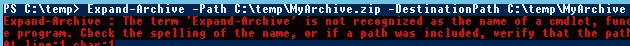
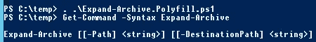
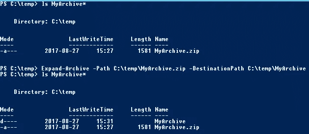

# PowerShell 的 Polyfill

> 原文：<https://medium.com/hackernoon/polyfill-with-powershell-ad70c6cd7703>

## **修补旧版本 PowerShell 上缺失的部分**

当编写脚本时，针对多个运行时版本可能真的很痛苦，脚本可能被分支到不同的文件中，或者包含复杂的条件语句来处理 PowerShell 运行时/模块版本之间的差异/缺失，从而导致不可读和不可维护的意大利面条代码。

如果您改为检测缺失的命令并在需要时为其提供实现，会怎么样呢？这将允许您让您的脚本看起来相同，并且基本上不知道它在哪个运行时上运行，从而使代码更加简洁和易于维护。

这种技术称为多填充，是 web 开发中的常见做法，不同的浏览器版本和供应商会有所不同。

事实证明，在 PowerShell 中做到这一点相当简单，我将使用 PowerShell 5 中引入的`[Expand-Archive](https://docs.microsoft.com/en-us/powershell/module/microsoft.powershell.archive/expand-archive?view=powershell-5.0)`命令来演示这一点，该命令从指定的归档文件中提取文件

很明显，它在 PowerShell 的早期版本上会失败得很惨

因为 PowerShell 拥有。NET 中，我们可以利用自。NET 4.5 ( *)对于更老版本的 PowerShell，我们也可以直接使用 7zip 或类似的命令行工具，或者利用第三方。NET 汇编，因为我们可以在我们的 polyfill 中做任何可能的 PowerShell* 。
这样的聚合填充可能如下所示:

上面的脚本检查命令是否存在，如果不存在，它将执行一个代码块，这个代码块将创建一个全局可用的函数，带有我们期望的参数和功能。为了在我们的脚本中使用它，我们将它点源到我们的脚本或外壳
`. .\Expand-Archive.Polyfill.ps1`

我们可以像在新版本的 PowerShell 中一样使用它。

# 结论

Polyfilling 是一种非常简洁的方式，它具有更加同质和可维护的脚本，同时还允许您采用新的命令和特性，即使您有一两台旧服务器*；)*