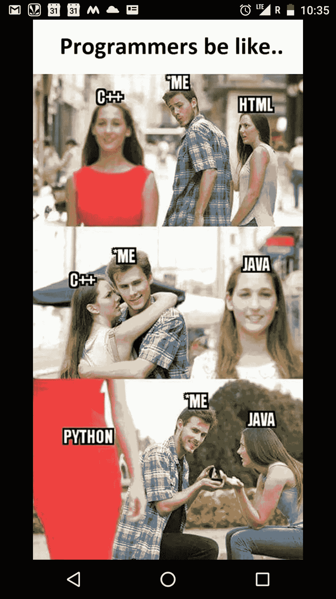

# 多语言编程——好与坏

> 原文：<https://medium.com/hackernoon/polyglot-programming-the-good-and-the-bad-a2e024a416fa>

## 当你知道反应，但也聚合物；MySQL，还有 MongoDBLaravel，也是 Express 安卓，也反应原生；Bash，还有 Python。

A perennial dilemma — Choosing your tech

对于门外汉来说，通晓多种语言的程序员是一个能用多种编程语言编写出做同样事情的有效计算机程序的人。

当你知道许多相互竞争的技术时，感觉很棒。你可以很容易地挑选最好的( *est？*)工作的工具，从一开始就高效工作。

在过去的 20 年里，一直在从事甲骨文工作的公司人员，除了甲骨文之外，还讨厌你了解 MySQL 和 MongoDB。**使眼色*使眼色。*

谈到了解最好的工具和高效，了解许多竞争技术也是一把双刃剑。*如何？*我给你列下来吧。

> *免责声明:前方有自以为是的内容*

我将把我的想法分为两类，即“赞成”的，我将谈论为什么成为一名通晓多种语言的程序员是一件好事，在“反对”的下面，我将列出不好的方面。

## 赞成者

## **1。天下第一**

许多流行的技术出名是有原因的。他们带来了特定的意识形态和方法，以有效地解决特定类型的问题。当你了解了许多这样的意识形态和方法，在不同的平台上利用它们的力量并不困难。

例如，我最近在 Android 中使用了 React 风格的编码，即一个函数负责改变整个应用程序的 UI，整个应用程序的状态作为一个对象来维护。这大大改善了我的工作流程，减少了调试 [app](https://kivenaa.com) 的时间。

## **2。不使用劣质工具**

你知道 jQuery，你知道它很棒。你可以用它做各种各样的事情。可悲！这不是一个有效的工具来编写 spa(单页应用程序)。但是你可以被迫使用它，当你只知道 jQuery 并且你时间不够的时候。

如果你也了解 React 或 Angular，它们更适合这份工作，你可以为自己省去很多麻烦(无论是现在还是将来)。

对此甚至有一个技术术语:[领域特定语言](https://en.wikipedia.org/wiki/Domain-specific_language)或 DSL。

## 3.混搭的力量

当您既了解 bash 脚本又了解 Python 时，您可以很容易地将您的 Bash 脚本替换成 Python 的等价物，以防将来您的任务是解析 HTML，除了您的脚本现在正在做的事情之外。

> 你在 BASH 中定制的 HTML 解析例程，永远打不过[美汤](https://www.crummy.com/software/BeautifulSoup/bs4/doc/)。好了，我说了。

另一方面，如果您不了解 Python，那么您只能使用常规的 bash。祝你好运。

**推论** : *当简单的一行***就可以了，你为什么还要写一个 Python 脚本来列出所有正在运行的进程呢？**

*如果你明白这一点不是关于 BASH 或 Python 的，那就给你一点印象吧。*

## *4.更快的迭代*

*[DSL](https://en.wikipedia.org/wiki/Domain-specific_language)极大地提高了您将新代码发布到产品中的速度，并减少了您的总体[上市时间](https://en.wikipedia.org/wiki/Time_to_market)。我是 DSL 的忠实拥护者，我甚至录制了一段视频。*

*[Subscribe](https://www.youtube.com/channel/UCUmQhjjF9bsIaVDJUHSIIKw)!*

# *坏处*

## *1.这些选择会让你偏头痛*

*你知道的技术越多，你就越迷茫。你总是会发现自己在诸如开发人员生产力、文档、性能、社区等尺度上衡量技术。*

*没有哪种技术是绝对的赢家。如果你认为是的话，很有可能你没见过多少世面。LOL。*

*例如，最近我处于一种必须在 [Laravel](https://laravel.com) 和 [Express.js](https://expressjs.com/) 之间做出选择的境地。我在这两方面“同样精通”,但一个都不精通。在那个阶段，我的想法更像是:*

> *“拉勒维尔有我需要的一切！但是一般来说 Node 更快，至少他们是这么说的。我希望我的聊天应用程序有一个快速(est)服务器。嗯……但是随着 PHP 7 和像 HHVM T21 这样的技术的发布，PHP 也声称要快得多。嗯……Express 很轻，但是 Laravel 有更好的模板系统。闭包！我喜欢封闭。嘿 PHP！能给我一些封口费吗？函数式编程呢？”*

*请杀了我吧。:(*

**

## *2.很难跟上所有的技术*

*“无知是一种幸福”。我完全同意！至少就跟上你的技术堆栈而言。当你试图跟上你曾经接触过的所有技术时，你总是会发现自己东奔西跑却一事无成。*

> *“React X.X 发布了！必须读一读。安卓奥利奥也发布了！必须观看所有的开发者演示”*

*与此同时，Laravel 的一个新版本也已经推出，并取消了相当多的东西。*狗屎！无论你多么努力，你的知识很快就会过时。如果你离开了你最喜欢的技术，即使是一两个月，这个社区也会介绍和反对许多会让你回来后揪头发的特性。**

> *还记得刚开始编[花粉聊天](https://pollenchat.com/)的时候，Laravel 是 4.2。我推出花粉聊天的时候，Laravel 已经是 5.2-beta 了。这期间我在哪里？我正在编写[Android 应用](https://play.google.com/store/apps/details?id=in.raynstudios.pollenchat)，它使用了基于 Laravel 的 API:P*

*因此，我有一个全新的服务，我刚刚推出，但底层框架已经过时，新版本中有突破性的变化，所以我不能只是“[*composer*](https://getcomposer.org/)*update*”我的代码。*

## *3.你会变得更唯利是图，而不是专家*

*在多种技术之间周旋会让你很少有时间关注任何一种技术的最佳实践。你总是专注于让所有的东西都协同工作，你重视“更快的上市时间”这样的事情。此外，你只需要满足自己，你已经选择了最好的工作工具，所以你得到的性能也是最大的，因为你无法帮助它。*

*你知道如何设计网站、移动应用程序和/或后端 API，但在性能、最佳实践和安全性方面有许多深层次的问题，你永远不会真正有时间获得专业知识，因为你正忙于跟上这些问题。*

## *4.企业对雇佣兵不感兴趣。大部分！*

*你有一个文件夹来备份你的 Android 开发技能，但你仍然不知道一个 99.99%准确的 Android 项目的文件夹结构(这实际上发生在我身上，早在 2016 年)，这证明你不是该主题领域的专家。*

> *面试官:“你连一个 Android 项目的文件夹结构都不知道”，*
> 
> *我:“但是，我知道我的 Java、XML 和 Gradle 代码去哪里了…”，*
> 
> *面试官:“没有，对不起，没有被录用！”。*

*但初创公司正在迅速改变科技领域。这些人表现出了雇佣“万金油”的愿望，尽管仍有许多初创公司依靠“算法琐事”来淘汰糟糕的开发人员。*

*所以，你们走吧，伙计们！这就是我想与黑客们分享的全部内容。如果你有类似的经历或者其他什么想补充的，请留下你的评论。我以前也写过类似的故事。在这里阅读:*

* [## 全栈开发和语法混乱

medium.com](/@rajat1saxena/full-stack-development-and-the-mess-of-syntaxes-4bf785c30552) 

谢谢你的时间。* 

*如果你喜欢这篇文章，请将它推荐给你的社交网络，并关注我以获得更多类似的文章。如果你喜欢开发数字化的东西，你也应该订阅我的 YouTube 频道。*

## *[推特](https://twitter.com/rajat1saxena) | [YouTube](https://www.youtube.com/channel/UCUmQhjjF9bsIaVDJUHSIIKw) | [瑞恩工作室](https://medium.com/rayn-studios)*

*直到下一次…*