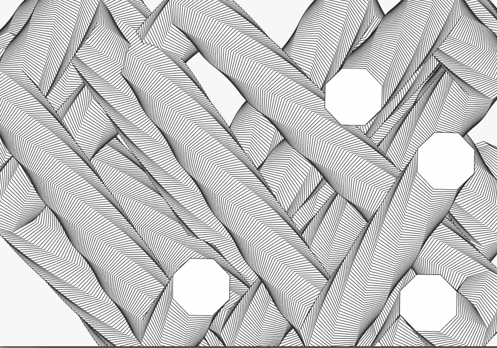
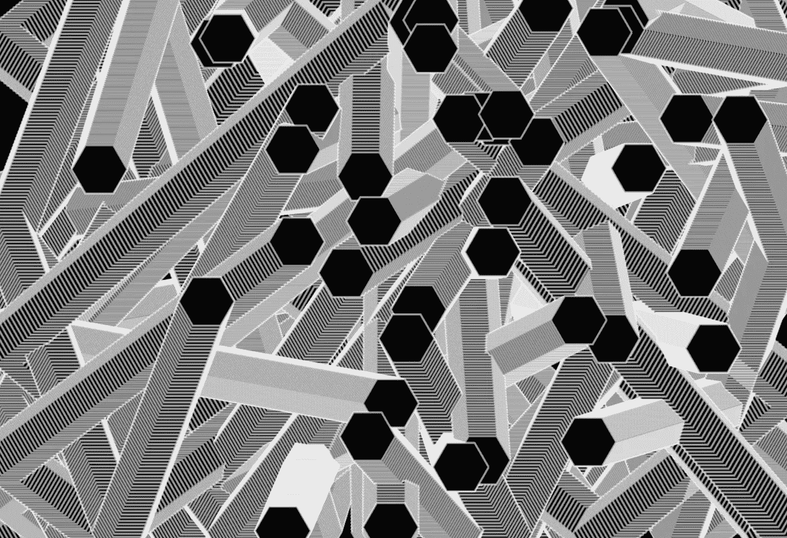

# 创造性编码基础-多边形，平移和旋转

> 原文：<https://medium.com/hackernoon/polygons-translation-and-rotation-ecd44509aa45>

## *用 Javascript 构建复古屏保效果*



**The end game here is to use our original particle code to create a 90s screensaver effect…**

如果你是这个系列的新手，从这里开始:[第一部](/@radarboy3000/creative-coding-basics-4d623af1c647#.hn9zzliob)、[第二部](/@radarboy3000/creative-coding-basics-4d623af1c647#.hn9zzliob)、[第三部](/@radarboy3000/how-to-make-particles-1cbeee937593#.wwjhkv7u2)和[第四部。](/@radarboy3000/playing-with-particles-ef87744d7ed2#.ntk4zugse)

这些教程的所有代码和库都可以在这里找到:[https://github.com/GeorgeGally/creative_coding](https://github.com/GeorgeGally/creative_coding)

你好，创意程序员。首先，我想向你展示如何绘制一种新的形状——多边形，并最终为我们建立一个 90 年代的屏保效果。

我们可以使用我的 [creative_coding.js](https://github.com/GeorgeGally/creative_coding) 函数简单地绘制任何多边形形状: *fillPolygon()* 和 *strokePolygon()* :

```
ctx.fillPolygon(x, y, number_of_sides, size);
ctx.strokePolygon(x, y, number_of_sides, size);
```

虽然您不需要知道这些函数在幕后是如何工作的，但是如果您感兴趣的话，我们可以通过使用 sin 和 cos 来计算多边形的点，从而构建一个多边形:

```
ctx.polygon = function (_x, _y, sides, size){
 this.beginPath();
 this.moveTo (_x +  size * Math.cos(0), _y +  size *  Math.sin(0));
 for (var i = 1; i <= sides; i += 1) {
    this.lineTo (_x + size * Math.cos(i * 2 * Math.PI / sides), 
                 _y + size * Math.sin(i * 2 * Math.PI / sides));
  }
}
```

在后面的教程中，我将介绍 *Math.sin 和 Math.cos，*创造性程序员的好朋友。

因此，使用我们的旧粒子代码，我们最初的 drawBall()函数现在看起来像这样(我使用一个实心多边形，然后是一个描边多边形，以获得轮廓效果:

```
function drawBall(){
  for (var i = 0; i < balls.length; i++) {
    var b = balls[i];
    ctx.fillStyle = b.colour;
    **ctx.fillPolygon(b.x, b.y, 8, b.size);**
    ctx.strokeStyle = rgba(255, 0.6);
    **ctx.strokePolygon(b.x, b.y, 8, b.size);**
  }
}
```



Polygon particles

画一个多边形，然后不得不画另一个看起来像重复。我刚刚意识到我已经打破了我自己的规则 3(做一件事三次，必须做一个函数)，所以我们开始吧:

```
this.outlinedPolygon = function (_x, _y, _sides, _size, _fill, _stroke){
  this.fillStyle = _fill;
  this.fillPolygon(_x, _y, _sides, _size);
  this.strokeStyle = _stroke;
  this.strokePolygon(x, y, _sides, _size);
}
```

所以现在我们的 drawBall()函数可以简化了:

```
function drawBall(){
  for (var i = 0; i < balls.length; i++) {
    var b = balls[i];
    **ctx.outlinedPolygon(b.x, b.y, 8, b.size, "black", "white");**
  }
}
```

(也许 *outlinedPolygon* 是个蹩脚的名字，其实很有可能，不过没关系，如果不贴，我以后再改，自建库的诸多好处之一)。

接下来，让我们用一个微妙的变化来调整代码，这将使一切看起来更好，通过在多边形移动时轻微旋转它们。

但要做到这一点，我需要向你介绍翻译，这可能看起来比实际更复杂…

*   首先要旋转一个对象，我们实际上是旋转整个画布/页面，然后将它移动回原始状态。我们首先用: *ctx.save()保存屏幕的当前状态；*然后用 *ctx.restore()恢复到原始状态；*
*   在我们保存了画布状态之后，我们想要旋转我们的对象。然而，默认情况下，事物从屏幕的中心旋转，我们希望旋转每个单独的对象。因此，我们需要将中心点设置为对象的中心点，我们通过使用 *ctx.translate(x，y)来做到这一点；*
*   然后我们可以使用 *ctx.rotate(弧度)旋转我们的对象；* [弧度](https://en.wikipedia.org/wiki/Radian)，hmmm，对。不爱他们。它们似乎总是比它们的价值更麻烦，所以我使用我自己的函数*CTX . rotated degrees(degrees)，*对我来说，它似乎更人性化。
*   在 0，0 处绘制对象——因为我们已经将整个画布移动到对象的 x 和 y 点。
*   一旦我们旋转了我们的对象，如上所述，我们需要用 *ctx.restore()将屏幕恢复到原始状态；*

似乎有点复杂。但事实并非如此，它的工作原理总是一样的。保存。翻译。旋转。还原。像这样:

```
*// save the current state of the canvas*
**ctx.save();** *// move the centrepoint to that of your object you want to rotate* **ctx.translate(b.x, b.y);** *// rotate your object with ctx.rotate() or ctx.rotateDegrees()* **ctx.rotateDegrees(radians);** *...draw your shapes*
*// restore to the original state of the canvas*
**ctx.restore();**
```

所以我们的整个 drawBall()函数现在看起来像这样:

```
function drawBall(){
  for (var i = 0; i < balls.length; i++) {
    var b = balls[i];
    ctx.fillStyle = b.colour;
    **ctx.save();**
    **ctx.translate(b.x, b.y);**
    **ctx.rotate(b.rotation);**
    **ctx.outlinedPolygon(0, 0, 8, b.size, "black", "white");**
    **ctx.restore();**
  }
}
```

*(我们需要记住，如果我们已经用 ctx.translate()将画布移动到我们对象的中心点，我们现在必须为 0，0 绘制我们的对象。)*

我们需要做的唯一其他主要事情是给每个粒子添加一个旋转属性，这样我们就可以跟踪它们各自的旋转。然后，我们在 moveBall()函数中递增这个旋转变量，因此我们的整个代码将如下所示:

```
var ctx = createCanvas("canvas1");
var number_of_balls = 4;
var balls = [];
ctx.lineWidth = 1;// push a ball and it's values into the array
for (var i = 0; i < number_of_balls; i++) {
  addBall();
}function addBall(){
  var ball = {
    x: random(w),
    y: random(h),
    speed_x: random(3,5),
    speed_y: random(3,5),
    size: 70,
    colour: rgb(255),
    **rotation: random(1)**
  }
  balls.push(ball);
}function draw(){//ctx.background(255, 0.2);
  moveBall();
  drawBall();
}function moveBall(){ for (var i = 0; i < balls.length; i++) {
    var b = balls[i];
    b.x += b.speed_x;
    b.y += b.speed_y;
    **b.rotation += 2;**
    if (bounce(b.x, 0, w, b.size)) {
      b.speed_x *=-1;
    } if (bounce(b.y, 0 ,h, b.size)) {
      b.speed_y *=-1;
    } }} function drawBall(){
  for (var i = 0; i < balls.length; i++) {
    var b = balls[i];
    ctx.save();
    ctx.translate(b.x, b.y);
    **ctx.rotateDegrees(b.rotation);**
    ctx.outlinedPolygon(0, 0, 8, b.size, "black", "white");
    ctx.restore();
  }
}
```

现在我们有了多边形屏幕保护程序:


Polygons!

就这样了。对于这种代码，你可以做很多事情。Hppy 编码…

**在 Instagram 这里关注我:**[**https://www.instagram.com/radarboy3000/**](https://www.instagram.com/radarboy3000/)

**在这里关注我的推特:**[【https://twitter.com/radarboy_japan】T21](https://twitter.com/radarboy_japan)

**又如我这里的脸书页:**[**https://www.facebook.com/radarboy3000**](https://www.facebook.com/radarboy3000)

以下是我之前的创意编码教程:

创意编码入门第一部分:[https://medium . com/@ radarboy 3000/Creative-Coding-basics-4d 623 af 1c 647 # . HN 9 zzliob](/@radarboy3000/creative-coding-basics-4d623af1c647#.hn9zzliob)

创意编码入门第二部分:[https://medium . com/@ radarboy 3000/introduction-to-Creative-Coding-Part-2-d 869832 d9 FB # . fzxcom 541](/@radarboy3000/introduction-to-creative-coding-part-2-d869832d9ffb#.fzxcom541)

创意编码入门第三部分:[https://medium . com/@ radarboy 3000/how-to-make-particles-1 cbee 937593 # . wwjhkv 7 u 2](/@radarboy3000/how-to-make-particles-1cbeee937593#.wwjhkv7u2)

创意编码介绍第四部分:[https://medium . com/@ radarboy 3000/playing-with-particles-ef 87744d 7 ed 2 # . 5r 081j 34 l](/@radarboy3000/playing-with-particles-ef87744d7ed2#.5r081j34l)

Github 仓库中的所有代码:【https://github.com/GeorgeGally/creative_coding 

[](http://bit.ly/HackernoonFB)[](https://goo.gl/k7XYbx)[](https://goo.gl/4ofytp)

> [黑客中午](http://bit.ly/Hackernoon)是黑客如何开始他们的下午。我们是 [@AMI](http://bit.ly/atAMIatAMI) 家庭的一员。我们现在[接受投稿](http://bit.ly/hackernoonsubmission)并乐意[讨论广告&赞助](mailto:partners@amipublications.com)机会。
> 
> 如果你喜欢这个故事，我们推荐你阅读我们的[最新科技故事](http://bit.ly/hackernoonlatestt)和[趋势科技故事](https://hackernoon.com/trending)。直到下一次，不要把世界的现实想当然！

