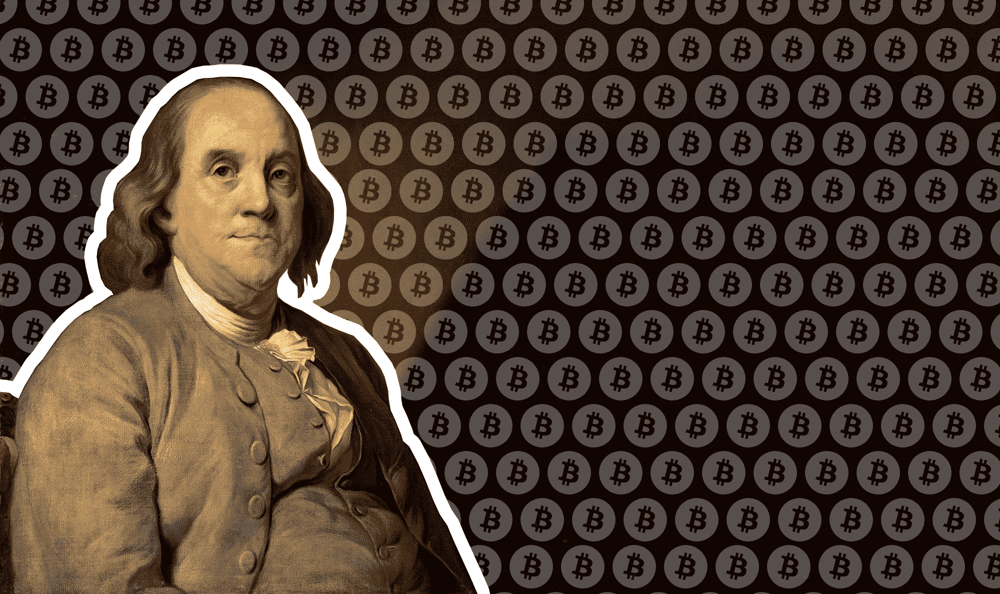

# 可怜的理查德加密货币指南

> 原文：<https://medium.com/hackernoon/poor-richards-guide-to-cryptocurrency-69f295e63759>

*由*[诺亚杰索普 ](https://twitter.com/njess)

本·富兰克林的理财建议是出了名的。“省一分就是赚一分”是富兰克林去世两个世纪后的一句口头禅，而“对知识的投资总是有最好的回报”在今天和乔治三世国王时代一样适用。但很少有人知道富兰克林也是一个狂热的加密货币爱好者，他写了一本“年鉴”，建议女士们、先生们和革命将军们如何从拜占庭将军的问题中获利。以下是他的密码相关妙语的简要概述 *:*

1.  一个明智的投资者决不会投资超过合理范围的资金。什么是合理的取决于个人的流动资金，处理损失的能力，交易风格等。*(我们今天的目的并不等同于法律投资建议:如果你只投资你能承受全部损失的钱，你将永远不会经历严重的损失。交易员将这一致命举动称为“吹涨”)。*
2.  明智的投资者必须妥善保管账户。当使用比特币基地或交易所等交钥匙钱包时，请始终使用双因素身份验证。始终确保使用谷歌认证，而不是短信。
3.  明智的投资者一定不会把资金留在交易所的公共钱包里。在他们的交易完成后，他们不会把你的生意和他们的混在一起。
4.  一个明智的投资者绝不能做出愚蠢的购买行为，否则可能会因为资产增值而后悔。愿我们不是那个点价值 4000 万美元的比萨饼的人。
5.  明智的投资者在汇款前必须三次确认钱包密码。邪恶的人会试图欺骗你——注册看起来像你试图投资的加密项目的域名，在留言板上发布虚假的信息/地址来发送资金
6.  明智的投资者必须将贪婪拒之门外。深思熟虑地成功比上当骗子要好。如果好得难以置信…
7.  一个明智的投资者必须对不同的服务使用唯一、安全的密码。
8.  明智的投资者必须给他们的手机运营商打电话，要求他们锁定账号，防止在没有照片的情况下转账。
9.  一个明智的投资者必须在保护好自己之后才公开谈论密码。
10.  一个明智的投资者必须知道为隐私建立单独的社交媒体档案并不粗鲁。
11.  *一个明智的投资者应该只讨论进场和出场价格，而不是买入或卖出的数量。*
12.  *一个明智的投资者*应该知道，霍德勒是一个长期相信某个协议的人。
13.  明智的投资者只会谈论项目、价格和协议，而不会谈论人。
14.  *明智的投资者*应该咨询税务专家，尤其是在将加密货币兑换回美元时。
15.  *明智的投资者*在投资前必须研究谁是 ICO 的幕后黑手。
16.  明智的投资者一定不要害怕获利——游戏是低买高卖——不是最低买，最高卖
17.  *明智的投资者*必须向门外汉传播对加密的热爱。
18.  一个明智的投资者必须知道早期的风险项目可能会导致完全的损失
19.  一个明智的投资者必须知道，下跌 90%的加密货币和下跌 80%的货币是一样的……然后再下跌 50%。
20.  明智的投资者应该平仓。
21.  明智的投资者应该运行杀毒软件(或 Linux 的安全发行版),并确保任何密钥生成都在离线电脑上进行。
22.  明智的投资者可能会考虑投资硬件钱包。
23.  明智的投资者应该保留钱包的纸质备份。
24.  明智的投资者必须对创造者拥有过多代币的项目保持怀疑。
25.  *明智的投资者*一定知道什么时候该有[一点笑料](https://uetoken.com/)。
26.  明智的投资者必须寻求志同道合者的陪伴。他们可能会听取意见，但会做出自己的决定。
27.  *明智的投资者*在交易非公开信息前可能会寻求法律指导。
28.  明智的投资者必须确保他们不仅仅是这里的游客。

*女士们先生们，今天学到了一些东西，可以在 Twitter 上关注作者*[*@ njess*](https://twitter.com/njess)*。在充分披露:上述作者已经或目前正在投资于一些不同的货币和代币。想要表达感谢、娱乐和/或厌恶的上流社会成员可以按(👏)下面。我们错过了适合上流社会密码爱好者的东西吗？请写信给我们。*