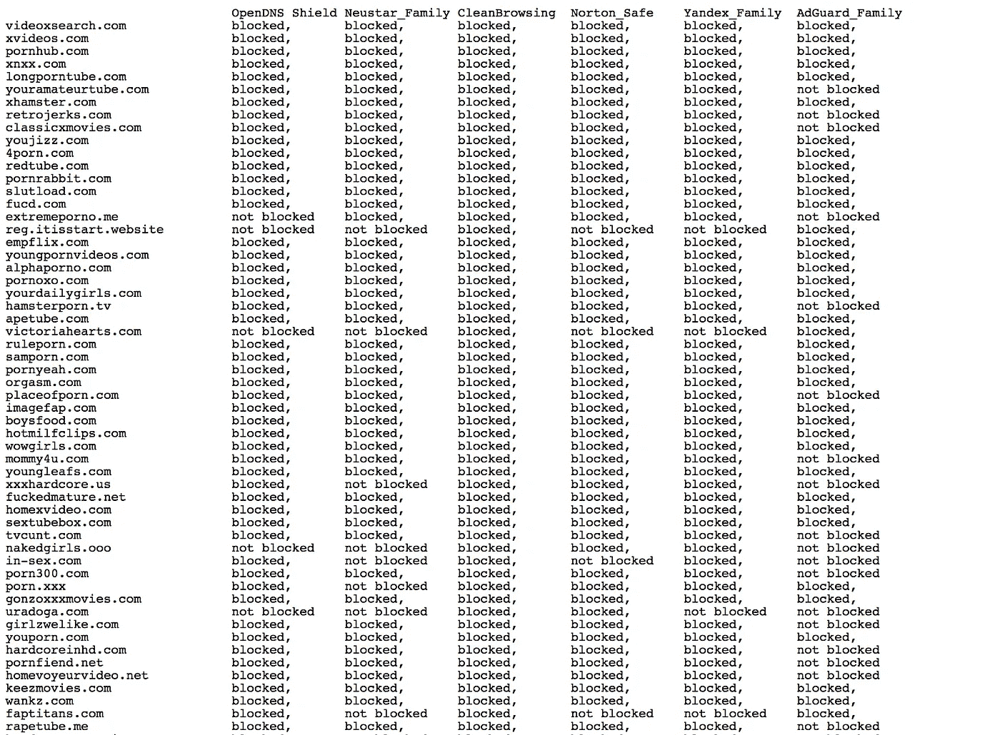
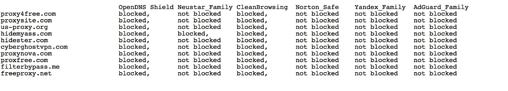

# 色情过滤器比较:OpenDNS，Neustar，CleanBrowsing，诺顿，Yandex 和 AdGuard

> 原文：<https://medium.com/hackernoon/porn-filters-compared-opendns-neustar-cleanbrowsing-norton-yandex-and-adguard-41f207062c4>

在最近的一篇文章中，我提供了一些令人失望的测试细节，测试中使用了几个免费的 DNS 解析器来阻止对网络钓鱼和恶意域名的访问。

总之:*他们没有像预期的那样工作*。公平地说，我的测试不是很科学，因为我只从 pishtank、恶意软件域和我的电子邮件中获得了一些随机的恶意域，并期望它们被阻止。所以也许..这是意料之中的。

然而，这让我开始思考..*那我们的孩子呢*？如果他们不能阻止对恶意域名的访问，他们能阻止对色情网站的访问吗？我认为大多数使用这些服务的人实际上是想阻止他们的孩子接触成人内容。他们至少能在那里做好工作吗？

# 测试色情过滤器(免费的)

所以再次测试，我去了。我挑选了 6 个免费的色情/成人/露骨内容过滤器:

*[OpenDNS _ Family shield](http://opendns.com)(208.67.222.123)
* Neustar _ Family secure(156.154.70.3)
*[clean browsing _ Family safe](https://cleanbrowsing.org/)(185.228.168.168)
*[Norton _ connect safe](https://safeweb.norton.com/)(199.85.126.20)
*[Yandex _ Family](https://dns.yandex.com/)(77.88.8.7)
* AdGuard _ Family(176.103.130.132)

并尝试看看他们是否能够阻止访问色情内容。我选择了 88 个不同的色情网站(在 Google & Bing 上关键字“色情”排名第一)。我基本上是手动操作的——一页一页地获取每个域名。在第 6 页之后，我跳到第 15 页，继续收集域名。

我跳到第 15 页的原因是为了得到一些不太受欢迎的域名。我还用另外两个类似的关键字重新做了测试，这两个关键字以一种不那么高尚的方式表示“性交”。我就是这样得到了 [88 个不同的域](https://pastebin.com/raw/ztA7HQVE)。

# 结果

在 88 个色情网站中，我预计所有的网站都会被屏蔽。他们在搜索引擎上排名靠前，很容易在网上找到。只有 **CleanBrowsing** 屏蔽了所有域名，诺顿**safe connect 因遗漏 5 个域名而位居第二:**

> **CleanBrowsing** : 100%阻塞
> **诺顿** : 94%阻塞(83 个阻塞，5 个未阻塞)
> **Yandex** : 93%阻塞(82 个阻塞，6 个未阻塞)
> **OpenDNS** : 89%阻塞(79 个阻塞，9 个未阻塞)
> [**Neustar**](https://www.home.neustar/):81%阻塞(72 个阻塞，16 个未阻塞)

Neustar 和 AdGuard 表现不佳，甚至错过了一些热门网站。完整的结果列表在此链接上:

[https://pastebin.com/raw/ztA7HQVE](https://pastebin.com/raw/ztA7HQVE)

带有结果的 pastebin 的部分屏幕截图(medium 不便于导入表格):

# 测试免费代理

当你过滤色情内容时，有许多易于使用的免费代理应该被阻止。在测试前 10 大免费代理域名时，只有 **OpenDNS** 和 **CleanBrowsing** 全部屏蔽。

没有其他服务试图阻止对代理的访问。我会给他们打-1 分，因为他们很容易绕过自己的过滤器。

# 强制安全搜索

当阻止访问色情内容时，重要的事情之一是限制搜索引擎——因为它们在结果中缓存色情图像，绕过过滤器控制。

谷歌提供了一种通过 DNS 强制安全搜索的方法，只有 **Yandex** 、 **AdGuard** 和[、 CleanBrowsing 、强制执行。这是这三项服务的一大优势。](https://cleanbrowsing.org)

# TLDR

如果你到了这里，你读了整本书，所以差不多就是这样。我没有测试任何付费服务，所以不能证明它们的准确性。

我们还能测试什么？欢迎建议。