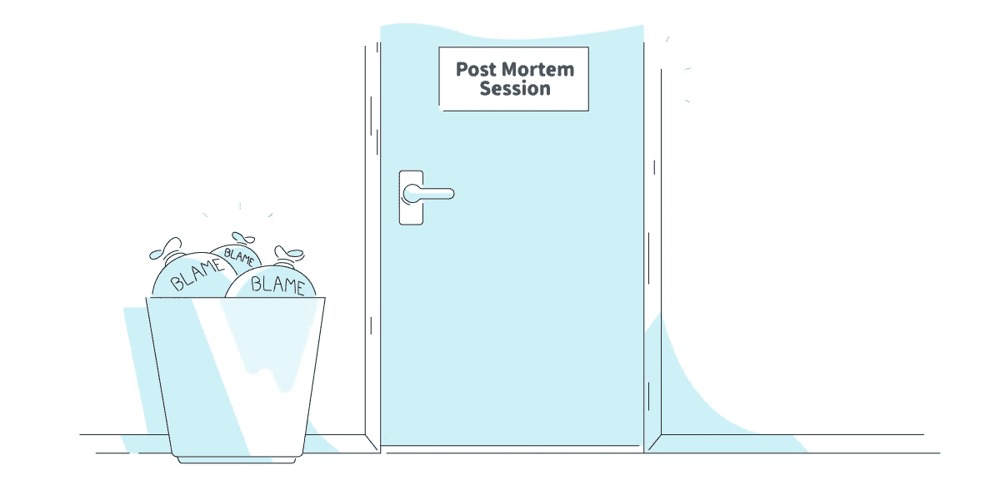
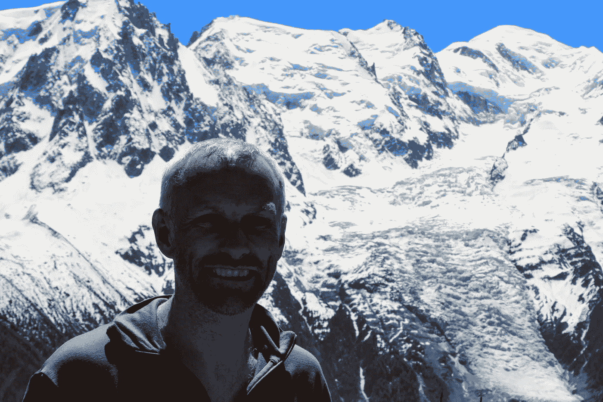

# 验尸是为了学习和分享

> 原文：<https://medium.com/hackernoon/post-mortems-are-for-learning-and-sharing-1b6a38526923>

## 介绍我们如何在 [Skyscanner Engineering](https://medium.com/u/401f3b3c958f?source=post_page-----1b6a38526923--------------------------------) 进行验尸

Post Mortems are for learning and sharing. Illustration by Skyscanner’s Gavin Spence.

*作者约翰·帕里斯*

这是我们的后死亡系列的第一篇文章，我们希望随着时间的推移继续下去。但是首先，让我们在 [Skyscanner Engineering](https://medium.com/u/401f3b3c958f?source=post_page-----1b6a38526923--------------------------------) 更详细地了解验尸对我们意味着什么

在 [Skyscanner](http://skyscanner.net?utm_medium=blog&utm_source=engmediumblogpost&utm_campaign=post_mortems_are_for_learning) 我们知道我们的技术或流程在某些时候会让我们失望，这没关系。

对我们来说，重要的是我们抓住机会学习，然后在整个组织内分享经验，这样其他人就不会遇到同样的问题。随着我们的技术平台不断扩展，以满足全球旅行者的需求，这一点尤其如此。我们希望确保那些在冲浪板上冲在浪尖的团队能够与其他仍在冲浪板上的团队分享他们的经验。我们还希望确保 Skyscanner 能够满足全球各地所有时区的旅客和合作伙伴的期望。

停机后，我们的团队将进行“事后分析”(也称为事件后审查)。在这些审查中，我们揭开了导致失败的事件和情况的盖子，寻找防止再次发生的方法，并改进检测和缓解。

如何进行这些审查对它们的成功至关重要。如果你想真正地学习，那么你必须把任何责备的问题留在门口。这不是一个新概念，学术界和各行各业的许多专家都有大量关于无过失尸检的资料。

“…leave any questions of blame at the door.” Illustration by Skyscanner’s Gavin Spence.

我们还必须关注细节，如果我们想找到根本原因，就要坚持不懈。我们在这里使用的最简单的流程是 [5 个为什么](https://en.wikipedia.org/wiki/5_Whys)，即使在复杂的环境中，它也适用于大多数事件。然而，它有其局限性。如果你对技术人员在这些问题上的进一步阅读感兴趣，那么从以下内容开始是不会错的:

*   约翰·奥尔斯帕在 Etsy 的时候
*   [Mathias Lafeldt 和他错误删除实例的经历](/production-ready/writing-your-first-postmortem-8053c678b90f)
*   这是我们的好朋友[杰森·汉德在维克多行动](https://victorops.com/oreilly-post-incident-review/)

这是一个正在进行的系列介绍。现在，开始第一次验尸:

🐞[那次一个休眠的 bug 复活了，所有的事情都同时出错了](/@SkyscannerEng/that-time-a-dormant-bug-came-alive-and-everything-went-wrong-at-the-same-time-9669b289dece)戴夫·阿彻和马特·海利

## **喜欢你听到的吗？与我们合作**

我们在 Skyscanner 以不同的方式做事，我们正在全球办事处寻找更多的工程团队成员。看看我们的 [Skyscanner 职位](https://www.skyscanner.net/jobs/)寻找更多空缺。

[We’re hiring!](https://www.skyscanner.net/jobs/)

# 关于作者

大家好，我是 John，是 Skyscanner 爱丁堡分公司的技术经理。我是一个团队的组长，负责确保全球旅行者在需要使用 Skyscanner 时可以使用我们的服务。在我们的角色中，我们为服务失败提供了最后一道防线，并使工程团队本着“您构建它，您运行它”的精神变得更加强大。

在我空闲的时候，你会发现我骑着自行车，跑着上山，走着爬山，尤其是在苏格兰的冬天。

*想了解更多在 Skyscanner 工作的情况或我在这里的工作吗？给我发电子邮件到约翰(点)巴黎(点)skyscanner(点)网。*

John Paris, Skyscanner