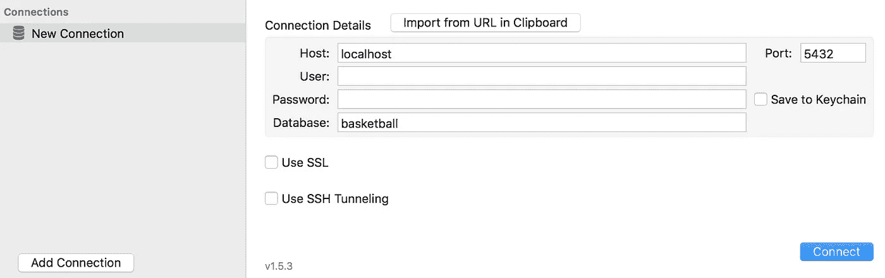
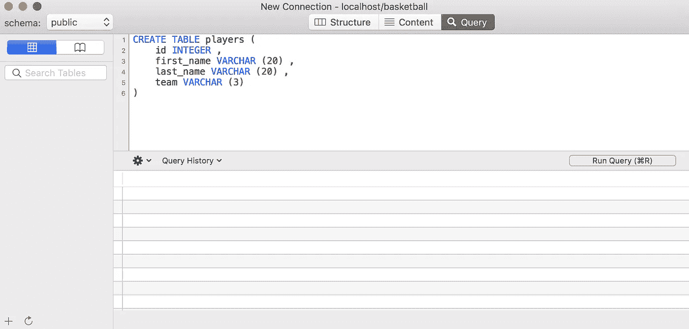
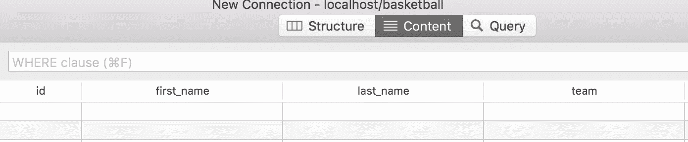
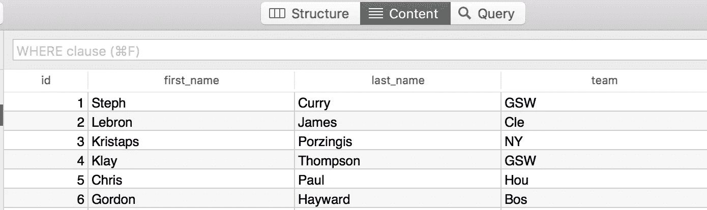
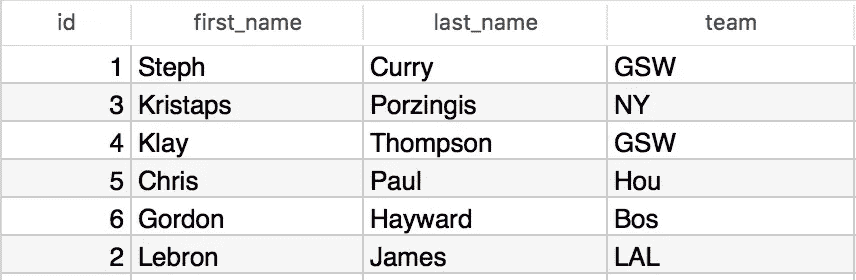

# PostgreSQL，用篮球运动员讲解

> 原文：<https://medium.com/hackernoon/postgresql-explained-with-basketball-players-f99fb812c065>

数据库可能是一个可怕的词。它通常被认为是庞大而复杂的，但是它们可以让你的应用程序整洁有序。关于这两种主要类型的数据库之间的差异，这里有一本入门书可能会有所帮助。


Westbrook loves stats. And stats are data!

至于你将要阅读的内容，我强烈建议跟随 [PSequel](http://www.psequel.com/) ，这是一个 Mac 上的图形用户界面，可以让你看到你正在处理的数据。像许多运动一样，篮球充满了数据，使它更有趣。stat 行是一个重要的数据块。拥有三双实力的拉塞尔·维斯特布鲁克还不如成为一名统计学家。还有什么比准备一些基于球员属性的数据库更好的方式来为即将到来的篮球赛季做准备呢？

再解释一下。PostgreSQL 是关系数据库的顶级程序之一。虽然还有其他好的工具，如 MySQL 和 SQLite，但我发现 PostgreSQL 是最受欢迎的，因为它是开源的，并且有一个非常棒的在线社区。

现在，游戏时间到了。


A little database dancing to start things off

# 创建数据库

创建数据库很简单。首先，通过运行以下命令，确保您的服务器正在命令行上运行:

```
psql
```

现在您已经登录，创建数据库就像下面这样简单:

```
create database ***(name of database)***;
```

创建完成后，您可以使用\l 命令看到所有数据库的列表。要从命令行退出，可以使用\q。

# 输入 PSequel



Type in your database and let’s connect!

PSequel 是一个 GUI，它使查看数据变得更加容易。我创建了一个名为篮球的数据库。现在让我们连接并创建一些表。

# 表格创建

一旦连接完毕，您就可以自由地创建表格来组织您的所有数据。选择“查询”后，我们可以创建如下表格:



从上面可以看到，我正在创建一个名为“玩家”的表。在这个表中，将有四行:一个 ID(主要是为了跟踪我添加了多少人)、一个名字、一个姓氏和一个团队。您会注意到在这些之后列出了一个数据类型，它让数据库知道预期的数据类型。整数是一个数字。Varchar 代表“可变长度字符”字符串。括号中其后的数字是最大字符数。关于 PostgreSQL 中可以使用的数据类型的更多信息，请查看这个[漂亮的列表](https://www.postgresql.org/docs/9.5/static/datatype.html)。因此列出的团队只能容纳三个角色。完成后，运行查询并刷新页面(左下角)。



该表虽然是空的，但现在可以在“内容”选项卡中找到。但是我们不能空着桌子工作。我们来补充一下。

# 关于插入的一切

使用全新的空表，返回查询并插入以下内容:

```
INSERT INTO players (id, first_name, last_name, team) VALUES (1, 'Steph', 'Curry', 'GSW');
```


Steph Curry loves dancing for data

在这里，我将记录插入到我的“球员”表中。第一组括号虽然不是强制性的，但它告诉数据库数据将进入哪些列。只要符合第二个括号组，您可以在这里按任意顺序排列这些列。例如，如果我试图将一个整数放入名字字段，PSequel 不会允许。将字符串(或 varchars)放在引号中也很重要。

够简单吗？好吧，让我们添加一些数据，看看如何操作它。

# 选择你的全明星



We have some data to work with

从提供的图像，现在我们可以选择和操纵球员。到目前为止，我们的阵容很强大。回到查询，运行下面一行:

```
SELECT * FROM players
```

从这里，你可以看到每个人。但是如果你只想看金州勇士队的球员呢？接下来，运行以下几行:

```
SELECT * FROM players
WHERE team = 'GSW'
```

当我们想要从数据库中更新或删除项目时，这个“where”关键字尤其重要。其他关键字可以连接到这些行，以显示更多的数据。

```
SELECT * FROM players
WHERE team = 'GSW'
OR team = 'NY'
```

上面的陈述将向您显示来自金州或纽约的任何人。请注意“or”语句。

```
SELECT * FROM players
WHERE team = 'GSW'
AND first_name = 'Steph'
```

该语句将只返回斯蒂芬·库里，因为虽然克莱·汤普森确实在同一支球队(GSW)，但他的名字不匹配。

您还可以对整数运行大于、小于或等于语句。以下面的例子为例，请注意没有返回前两个 id。

```
SELECT * FROM players
WHERE id > 3
```

# 更新和删除

现在让我们更改数据库中的一些内容。我们听到了一些关于勒布朗·詹姆斯在合同到期后去湖人的猜测。我们如何在数据中反映这一点:

```
UPDATE players
SET team = 'LAL'
WHERE last_name = 'James'
```

第一行指定您正在更改的表格。第二行指定了我们要设置的内容。第三行告诉我们，我们只想更改姓氏为 James 的数据。像前面的例子一样，我们可以添加更多的参数，以及' and '或' or '语句。

请注意，勒布朗·詹姆斯现在效力于洛杉矶湖人队。通过点击 ID 列标题，我们可以再次按 ID(或任何其他标题)对玩家进行排序。



删除以类似的方式完成，但是使用单词“delete”代替“update”。同样，我们可以添加任意多的参数。下面的命令将勒布朗·詹姆斯从列表中删除。

```
DELETE players
WHERE last_name = 'James'
AND team = 'LAL'
```

但他可能不喜欢这样。

感谢阅读。随时联系我聊天码或者篮球[这里](http://jonathanhaines.me)。下次见。