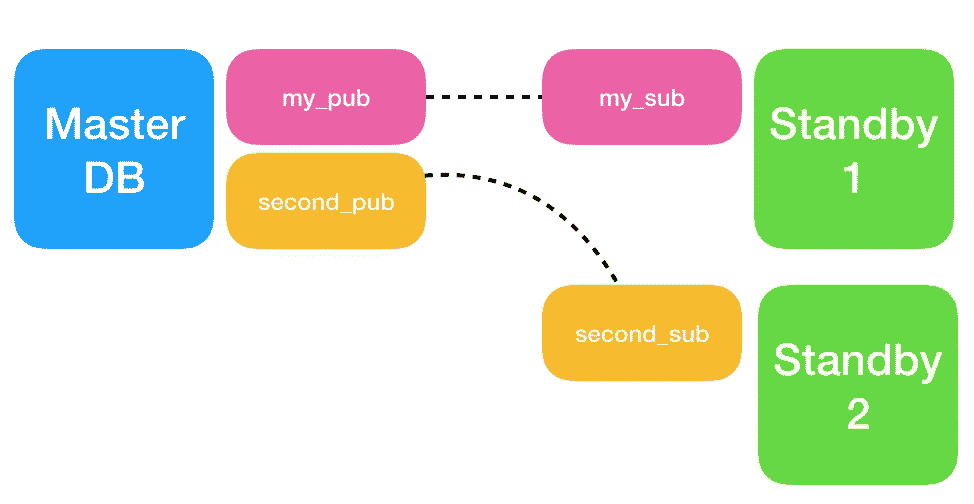

# 使用 PostgreSQL 10 进行逻辑复制

> 原文：<https://medium.com/hackernoon/postgresql-logical-replication-86df5b51cc5a>

## 有简单例子的入门书

在 PostgreSQL 10(即将推出测试版)中，我们看到了逻辑[复制](https://hackernoon.com/tagged/replication)的引入，这是一个长期以来备受追捧的特性。

## 为什么是逻辑复制？

目前，在 9.x 中，我们有内置的流式复制功能，可处理物理 WAL 数据。

> *物理复制是指在数据块级别而不是行级别进行复制。*

换句话说，流复制将原始数据块级别的更改复制到其备用服务器，但很少了解这些数据块实际上对数据库做了什么**。**

**现在，随着[逻辑复制](https://www.postgresql.org/docs/10/static/logical-replication.html)的出现，这种情况发生了变化，在 T9 中，数据在一个逻辑级别上复制。这意味着流复制现在实际上了解这些块在数据库行为方面做了什么。**

****

**现在，我们可以决定要复制哪些表，并且我们还可以在备用服务器上写入数据，而不是使用需要精确的二进制副本的备用服务器。这些事情在以前是不可能的，除非使用第三方复制软件(各有利弊)。**

**这个特性源自于 [2ndQuadrant](https://www.2ndquadrant.com/) 的天才开发人员和他们在 [pglogical](https://www.2ndquadrant.com/en/resources/pglogical/) 上的惊人工作。虽然 pglogical 的所有特性并没有在 PostgreSQL 10 中实现，但我们现在已经正式支持 PostgreSQL 中的逻辑复制，这是一个巨大的进步。**

## **体系结构**

**逻辑复制基于发布和订阅。这是一种常见的方法，其他流行的 RDBMS(如 Oracle 和 Microsoft SQL)也使用这种方法。**

****

**Pub / Sub Architecture of Logical Replication. A publication may be limited to just a few tables or all tables. One can achieve per-table sharding this way with multiple standby servers.**

## **基本示例**

**在本例中，我们将在 localhost 上设置两个 PostgreSQL 10 集群。一个运行在端口 **5432** (主)上，另一个运行在端口 **5433** (备用)上。postgresql.conf 唯一的修改是 *wal_level=logical。*在两个集群上执行此操作。**

**假设这些集群现在都在运行，我们创建一些表，希望从主服务器复制到备用服务器。**

**让我们先在母版上这样做:**

```
**master=# create table foo (foo text PRIMARY KEY, quux text); 
         create table bar (bar text PRIMARY KEY, quux text);
**CREATE TABLE
CREATE TABLE****
```

**现在让我们为这两个表创建一个出版物(同样在母版上)。我们还需要一个拥有复制权限的用户，我们称之为*备用用户*。**

```
**master=# create publication my_pub for table foo, bar;
**CREATE PUBLICATION**master=# create role standby_user with login password '12345' 
         replication; 
**CREATE ROLE****
```

**在我们做任何事情之前，让我们在母版上添加几行。**

```
**master=# insert into foo (foo, quux) values ('hi', 'there');
**INSERT 1**
master=# insert into bar (bar, quux) values ('and', 'here');
**INSERT 1****
```

**在备用服务器上，我们现在设置订阅。**

```
**standby=# create subscription my_sub 
        connection 'host=localhost dbname=my_db 
                    user=standby_user password=12345 port=5432' 
        publication my_pub;
**CREATE SUBSCRIPTION****
```

**激活订阅后，我们将在备用服务器的日志中看到以下内容:**

```
**LOG:  logical replication apply worker for subscription "my_sub" has started
LOG:  logical replication table synchronization worker for subscription "my_sub", table "foo" has started
...**
```

**在主服务器上，我们将看到复制槽已经自动创建，并且正在进行初始同步。在备用数据库中，我们将看到两个表现在各包含一行。**

**请注意，逻辑复制仍然利用您在旧的流复制中使用的复制插槽，因此应该使用 *pg_replication_slots 表*进行监控。**

## **结论**

**我们已经看到，逻辑复制很容易设置，只要有一种方法可以通过 TCP 从备用服务器直接连接到主服务器。**

**对于通过互联网复制的生产系统，一定要在 Postgres 中使用 **ssl=on** 。不仅仅是因为安全原因，还因为当使用 SSL 模式时，默认情况下会启用压缩。**

**与任何功能一样，深入研究官方文档以确定可能与您的需求相关的限制和潜在问题非常重要。参见:**

**[](https://www.postgresql.org/docs/10/static/logical-replication.html) [## PostgreSQL:文档:10:第 31 章。逻辑复制

### 表的逻辑复制通常从拍摄发布者数据库上的数据快照开始，然后…

www.postgresql.org](https://www.postgresql.org/docs/10/static/logical-replication.html)**