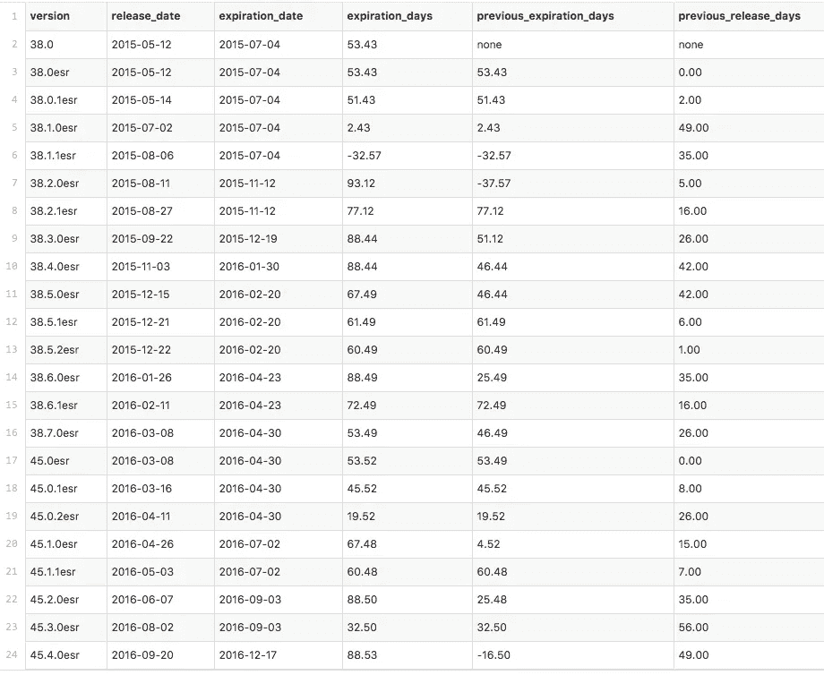
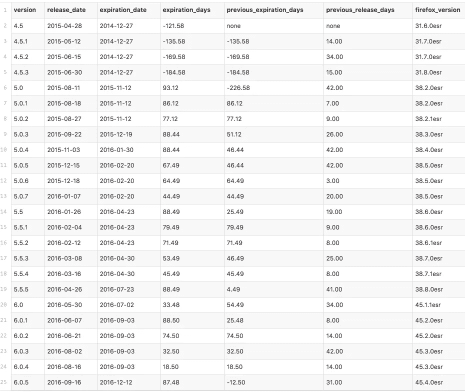

# Firefox(和 Tor 浏览器)证书锁定漏洞兔子洞的事后分析

> 原文：<https://medium.com/hackernoon/postmortem-of-the-firefox-and-tor-certificate-pinning-vulnerability-rabbit-hole-bd507c1403b4>

# 前言

漏洞披露的最初几天是一段非常有趣的旅程。事情开始于

## [mnordhoff/firefox-pin-data](https://github.com/mnordhoff/firefox-pin-data)

### [firefox-pin-data - Firefox 和 Tor 浏览器 pin 数据](https://github.com/mnordhoff/firefox-pin-data)

[github.com](https://github.com/mnordhoff/firefox-pin-data)

虽然 Firefox 和 Tor Browser 在过去都容易受到攻击，但事实证明这种情况并不经常发生。让我们看看其中的几个，并找出一些日期。以下是 Firefox ESR 的统计数据:

如您所见，除了当前版本之外，Firefox ESR 过去唯一一次终止的时间是从 2015 年 7 月 4 日*到 2015 年 8 月 11 日**。然而，这是一个相当重要的时间窗口。此外，看起来 *38.1.1esr* 实际上在装运时已经过期。直到 *38.2.0esr* 的发布才加强了牵制。在 *45.0.2esr* 和 *45.1.0esr* 之间也只有 4 天的更新时间。*

*现在，让我们看看 Tor 浏览器稳定:*

**

*你会注意到 Tor 浏览器在 *5.0* 发布之前已经有过期的 pin。这是因为 Tor 实际上反向移植了锁定功能，但可能没有意识到他们需要更新截止日期。这是一个诚实的错误，公平地说，Tor 浏览器直到版本 *5.0* 才真正支持静态引脚。然而，除此之外，Tor 在此最新版本之前并不容易受到攻击。他们实际上相当公平。*

# *结论和致谢*

*这是一个非常有趣的追踪 bug。它展示了当你处理一个复杂的代码库时，过程的失败是如何的难以发现，并且没有任何迹象表明有什么东西失败了。如果我说运气在这个 bug 的发现中没有发挥重要作用，那我是在撒谎。如果 movrcx 在 9 月 3 日或 9 月 20 日 T21 之前尝试攻击，他的测试就会失败。只是因为他在这 17 天的时间内进行了这项研究才被发现。*

*Mozilla 也在研究如何强化扩展更新过程本身，这样即使你将来能够再次破解证书锁定，这样的攻击也不会起作用。该漏洞实际上仅限于通过 AMO 更新的扩展。遵循自身更新过程的扩展不受影响。Tor 浏览器包含的版本中的 [HTTPS Everywhere](https://www.eff.org/https-everywhere) 更新过程没有受到影响，因为它们通过[EFF.org](https://www.eff.org)进行更新，并在更新下载后进行签名验证。然而，AMO 交付的版本可能会像所有其他版本一样受到影响。*

*以下是我想做的一些致谢:*

*   *没有他最初的发现，这一切都不会被解开。在我们梳理代码以找出这个 bug 的根源时，他也非常容易共事。*
*   *[艾琳·阿特沃特](https://twitter.com/errorinn)——在我试图理清头绪时，她的帮助是无价的。她最初告诉我 Mozilla 在 HPKP 之外使用静态 pin 的事实。*
*   *[我希望你和我一样对此感兴趣。我觉得从整个过程中可以学到很多东西。](https://medium.com/u/1d37facf203b# tor-dev on OFTC——当我联系他们时，他们的反应非常积极，他们在讨论问题时的透明度是你在大多数开发团队中看不到的。</li></ul>
 [黑客中午](http://bit.ly/Hackernoon)是黑客如何开始他们的下午。我们是 AMI 家庭的一员。我们现在[接受投稿](http://bit.ly/hackernoonsubmission)并乐意[讨论广告&赞助](mailto:partners@amipublications.com)机会。
    > 
    > 如果你喜欢这个故事，我们推荐你阅读我们的[最新科技故事](http://bit.ly/hackernoonlatestt)和[趋势科技故事](https://hackernoon.com/trending)。直到下一次，不要把世界的现实想当然！

    *