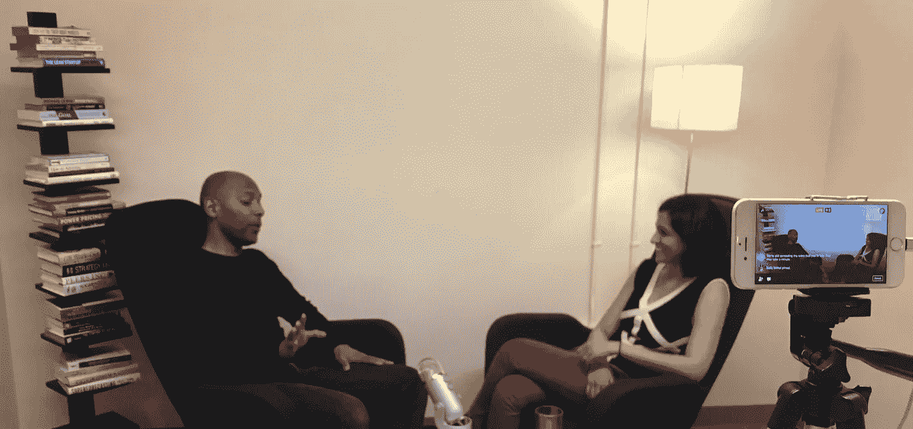

# 一个大学辍学生如何爬上最令人垂涎的技术工作 Slack 的工程总监？

> 原文：<https://medium.com/hackernoon/power-of-persistance-412237125b3c>

Leslie Miley ([Venture for America](http://ventureforamerica.org/), [Slack](http://slack.com)) in an interview with [Shruti Gandhi](https://twitter.com/atShruti) ([Array Ventures](http://array.vc))

Array Ventures(T1)的 Shruti Gandhi 最近与 Venture for America (VFA)的 les lie Miley(T3)以及 Slack(T5)的前工程总监坐在一起，讨论他在最新的播客(T7)中的故事。在去 VFA 之前，Leslie 曾在谷歌、苹果、Twitter 工作，最终成为 Slack 的工程总监。然而，他经历了一次陡峭的上坡攀登才到达现在的位置。以下是我们可以从他的故事中得到的启示:

1.  **排除万难**

莱斯利克服了生活中的许多障碍。小时候，他的父亲在通用汽车公司的装配线上有一份稳定的工作。然而，当他父亲失业时，一切都崩溃了。由于工厂关闭，Leslie 的家人，实际上是加州圣何塞的整个街区都在挣扎。莱斯利从堪萨斯大学辍学，开始帮助家里。经济机会对他来说是有限的。

在那里，他找到了做保安、销售以及最终做工程的机会。他开始在苹果公司做夜班保安，注意到工程师们也在加班。

通过他深夜的谈话，Leslie 意识到他自己想成为一名工程师。他慢慢开始了解工程概念，不久后在一家科技公司找到了一份销售工作。他在[苹果](http://apple.com)、[沃尔玛](http://walmart.com)、 [ODesk](http://upwork.com) /Upwork、[谷歌](http://google.com)、 [Twitter](http://twitter.com) 和 [Slack](https://slack.com/) 等硅谷最受欢迎的创业公司之一的工程职位上步步高升。

**2。碰碰运气**

莱斯利一路上有许多坎坷，但也有人在那里帮助支持他。在赛门铁克工作期间，他差点被解雇，因为他发送了一个感染了病毒的新产品套件。更不用说 Leslie 发给赛门铁克最大的客户了。在他的命运被确定之前，莱斯利的经纪人介入了。他告诉首席执行官，莱斯利年轻，没有经验，但工作努力，富有奉献精神。

> 他说，“他必须被允许失败，这样他才能学习。”

有人抓住了他的机会，没有因为他的错误而解雇他。

3.**向前支付**

今天，莱斯利正在向前支付。他离开了 Slack，加入了 VFA，成为一名常驻行政人员，帮助那些需要经济发展的城市。在 VFA 工作期间，Leslie 与底特律、新奥尔良、亚特兰大和迈阿密等城市的许多社区和公司进行了交谈，以规划如何开发类似于硅谷的技术生态系统。

还想要更多吗？查看下面的整个播客，并订阅[播客](https://itunes.apple.com/us/podcast/array-ventures-podcast/id1215062660?mt=2)，从其他成功的创始人那里学习一系列技巧和技能。

 [## Shruti Gandhi 在苹果播客上的播客

### 免费下载 Shruti Gandhi 的[Array]播客过去的剧集或订阅未来的剧集。

itunes.apple.com](https://itunes.apple.com/us/podcast/array-ventures-podcast/id1215062660) 

[*甘地*](https://twitter.com/atshruti) *是* [*阵列创投*](http://www.array.vc/) *的管理合伙人。Array Ventures 是一家风险投资公司，投资于创始人创建的公司，这些公司利用数据和人工智能领域的深度技术创新。*

> [黑客中午](http://bit.ly/Hackernoon)是黑客如何开始他们的下午。我们是 AMI 家庭的一员。我们现在[接受投稿](http://bit.ly/hackernoonsubmission)并乐意[讨论广告&赞助](mailto:partners@amipublications.com)机会。
> 
> 如果你喜欢这个故事，我们推荐你阅读我们的[最新科技故事](http://bit.ly/hackernoonlatestt)和[趋势科技故事](https://hackernoon.com/trending)。直到下一次，不要把世界的现实想当然！

