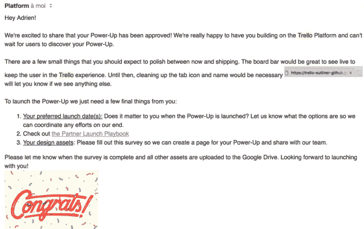
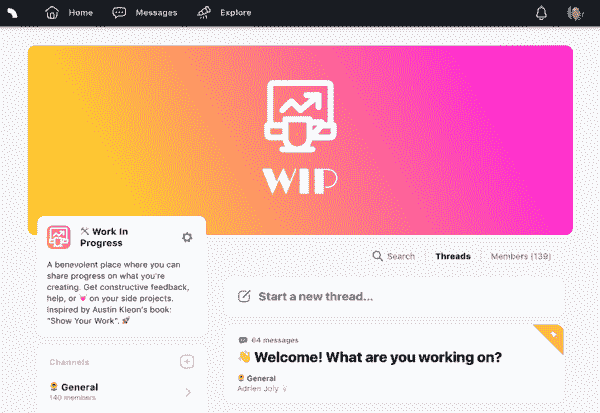

# 🚀新闻:在去 Trello 和 WIP 社区的路上通电！

> 原文：<https://medium.com/hackernoon/power-up-on-its-way-to-trello-and-wip-community-5af44320badc>

## 在过去的 10 天里，我本应该在法国南部和家人一起放松一下。我做到了。还有，我没有！🙃

# 1.胜利:在通往特雷罗的路上加电💪

8 月 8 日星期二，我**收到了一封来自** [**特雷罗**](https://hackernoon.com/tagged/trello) 的电子邮件，宣布了一个好消息:他们同意将我的大纲加入他们的官方加电列表，使它可以从任何特雷罗董事会公开获得！🎉

我们决定在 17 日星期四发布它。届时，我将发表一篇文章来介绍“[评论编辑器(AJ](http://devpost.com/software/trello-outliner-lpv3zt) )是干什么用的，为什么我要建立它，为什么你也需要它！

现在，**我需要**:

-帮助杀死所有的 bug(*beta 测试对* [*那块板*](https://trello.com/invite/b/C1BeGLFW/755950e252ae81aeb6c899187fab1be2/outliner-test-board-production) *很感激*)；

-我即将发表的文章中的用例及用户评价。

所以，如果你爱特雷罗，我会非常感谢你的帮助！

# 2.在 WIP 中共享进度和表扬🙌

你知道我喜欢**开发新的(兼职)项目**，并且发现以“隧道模式”工作很难，很令人沮丧(“T20”独自工作几个月，然后尝试成功推出)。

根据奥斯汀·克莱恩的书《展示你的工作》中的建议，我正在寻找一个慈善论坛，在这个论坛中，开发(副)项目的人们可以分享他们的进展(和过程),并获得反馈。

感谢 [levels.io](https://medium.com/u/75452cb7f664?source=post_page-----5af44320badc--------------------------------) ，我发现“spectrum.chat”是**创建那个** [**社区**](https://hackernoon.com/tagged/community) 的一个非常好的产品，因为它是公开的，对任何人开放(与 Slack 相反)。

**所以我用它**创建了那个社区:[https://spectrum.chat/wip](https://spectrum.chat/wip)(*“进行中的工作”是社区*的名字)

如果你想分享你的进步，帮助其他人建造令人敬畏的产品，和/或学习其他创客是如何做的，**来加入我们吧！**💪

**今天就到这里吧！**

我很快就要和我的女朋友以及最好的朋友去美国旅行了！我们会去火人节，所以让我知道你是否也会去！

✌️

# 喜欢那篇文章吗？给它一些❤，并分享它！

## 想知道接下来是什么吗？订阅我的个人简讯:

 [## 阿德里安·乔利评论

### 埃德里安娜·乔利——每周，我都会分享我在一天内完成的一个兼职项目....

www.getrevue.co](https://www.getrevue.co/profile/aj-sideprojects)