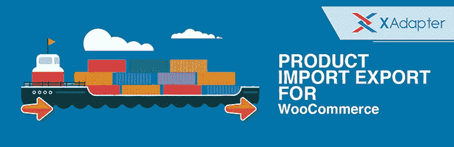
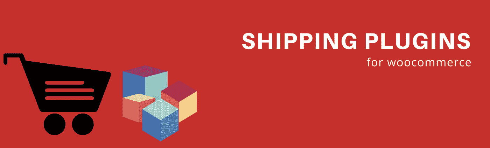
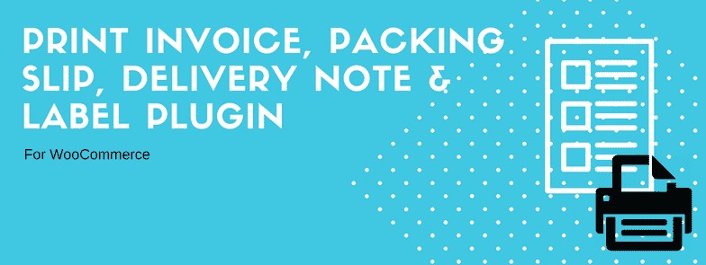
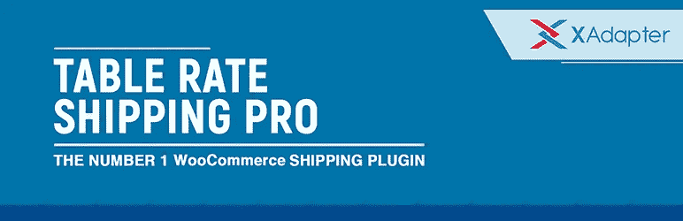

# 用最好的 WooCommerce 插件给你的 WordPress 网站加电

> 原文：<https://medium.com/hackernoon/power-up-your-wordpress-website-with-the-best-woocommerce-extensions-3642448d0ea3>

2003 年，标志着这个叫做[的奇迹的开始。它最初是一个博客系统，后来逐渐发展成为一个完整的内容管理系统。到目前为止，WordPress 占据了 26.4%的网络份额，其指数增长的更大部分归功于其广泛的可用性，这要归功于数以千计的插件、主题和小工具。更不用说，WordPress 是使用最多的 CMS，市场份额为 59.4%。](https://wordpress.org/)

2015 年标志着 WordPress 的母公司 Automattic 收购 [WooThemes](https://woocommerce.com/) 的又一重大事件。 [WooCommerce](https://hackernoon.com/tagged/woocommerce) ，WooThemes 的旗舰插件，现在已经赢得了最高的[电子商务](https://hackernoon.com/tagged/ecommerce)平台市场份额。自 2012 年以来，向 WooCommerce 迁移的比例增加了 14 倍。WooThemes 最初是为 WordPress 销售商业主题，在 2011 年 WooCommerce 推出后，逐渐成为大多数电子商务网站不可或缺的支持。

一旦你下载了 WooCommerce，你会很快意识到你的 WordPress 网站现在配备了一个强大的电子商务主干，但是为了释放 WooCommerce 的真正潜力，你需要投资一些重要的高级插件。

这里有一个插件列表，它可以增强你的电子商务商店，并使它变得更大

1.  [**产品导入导出插件**](https://www.xadapter.com/product/product-import-export-plugin-for-woocommerce/)

Product Import Export for WooCommerce

当你的商店有大量的产品，并且创建每个产品的繁琐任务让你害怕时，产品导入导出插件将会拯救你。您需要的只是一个正确配置的 CSV。

一旦你的 CSV 准备好了，就用这个插件把它们导入你的网站。如果你意识到你在一些产品中犯了错误，该怎么办？您可以随时在 CSV 中进行更正，然后重新导入相同的内容。

这个插件也可以帮助你保存你所有产品的备份，当你需要迁移到一个不同的网站时，这个插件是非常宝贵的。

WooCommerce 的[**Product Import CSV Suite**](https://woocommerce.com/products/product-csv-import-suite/)也是一款不错的产品，但在功能上确实有一些局限。

[**2。**动态定价和折扣](https://www.xadapter.com/product/dynamic-pricing-discounts-woocommerce/)

Dynamic Pricing and Discounts for WooCommerce

这个多功能插件是你的 WooCommerce 网站的必备组件。你所有的定价需求都会被这个解决。您是否希望对所选产品、特定类别或购物车中的所有产品进行折扣。你甚至可以选择在购买产品组合的基础上给予折扣。更不用说无价的“BOGO”规则。

此外，您可能希望为不同的客户提供不同的折扣，或者希望将折扣限制在特定的日期范围内。

基本上，为了保持销售畅通，偶尔打折是很重要的。

[**3。为 WooCommerce** 而战](https://beeketing.com/beeketing-for-woocommerce)

Beeteking for WooCommerce

当你在经营一家 WooCommerce 商店时，你可能需要很多插件来构建和优化你的销售漏斗。例如:产品推荐、电子邮件营销、优惠券、追加销售插件……

如何将所有这些功能集成到你的商店，只需一个插件？它真的会节省你很多时间和体力。 [Beeketing for WooCommerce](https://beeketing.com/beeketing-for-woocommerce) 是一个营销工具包，旨在为你做所有那些手工工作。该插件提供 10 多种功能(免费& premium ),帮助优化您的销售漏斗并培养与客户的关系:

*   追加销售相关产品和交叉销售产品包
*   推荐最畅销的商品，将商品与个性化的产品滑块相匹配
*   设置并向客户发送自动跟进电子邮件
*   策划不同类型的优惠，如免费赠品/折扣/免运费促销
*   和许多其他功能将通过频繁的 Beeketing 来添加。

如果你想更详细地了解这个插件是如何工作的，我们推荐你[点击这里](https://beeketing.com/beeketing-for-woocommerce)查看。

**4。支付网关**

如果没有支付网关，你的商店会有什么好处呢？你不能永远依赖“货到付款”。幸运的是，有许多可靠的支付网关和插件来帮助你连接你的网站。WooCommerce 的顶级支付网关是

*   [**支付宝**](https://docs.woocommerce.com/document/paypal-standard/)
*   [**条纹**](https://www.xadapter.com/product/stripe-payment-gateway-for-woocommerce/)
*   [**亚马逊**](https://www.xadapter.com/product/amazon-payments-gateway-woocommerce/)
*   【Authorize.net】T5[T6](https://codecanyon.net/item/authorizenet-credit-card-gateway-for-woocommerce/1336994)

**5。运输插件**

如果你卖的是实物，一个运输插件是必须的。如果您需要每天运送大量产品，有时您可能需要不止一个。一些最好的运输插件是

*   [**UPS**](https://www.xadapter.com/product/woocommerce-ups-shipping-plugin-with-print-label/)
*   [**联邦快递**](https://www.xadapter.com/product/woocommerce-fedex-shipping-plugin-with-print-label/)
*   [**美国邮政**](https://www.xadapter.com/product/woocommerce-usps-shipping-plugin-with-print-label/)
*   [**DHL**](https://www.xadapter.com/product/woocommerce-dhl-shipping-plugin-with-print-label/)

因此，当谈到发布插件时，XAdapter 插件似乎是最受欢迎的。每个运输插件都有许多插件来提供额外的功能。

[**6。WooCommerce 订阅**](https://woocommerce.com/products/woocommerce-subscriptions/)

WooCommerce 订阅插件，于 2012 年推出，目前是他们最畅销的插件。订阅是电子商务商店不可或缺的一部分。以某种方式，你会发现这个插件的需要。最好的例子可以是——网飞、在线课程、报纸网站、互联网订阅、杂志订阅。你的订阅产品可以是像网飞这样的虚拟产品，也可以是像杂志这样的实体产品。

配合 [**会员插件**](https://woocommerce.com/products/woocommerce-memberships/) ，订阅插件可以成为你正在运行的 WordPress 站点的主干。

RightPress too 的 [**订阅**](https://codecanyon.net/item/subscriptio-woocommerce-subscriptions/8754068) 插件对你的商店来说是个不错的选择。

[**7。WooCommerce 货币切换器**](https://wordpress.org/plugins/woocommerce-currency-switcher/)

WooCommerce Currency Switcher

WooCommerce 货币切换器插件是创建多种货币商店的理想解决方案。让我们面对现实吧，你总是想扩大你的商店，拥有来自世界各地的顾客。这个插件将减轻你的客户的工作，并允许他们实时转换货币。

你可以选择使用一个短代码**【woocs】**或者作为一个小部件来使用这个插件。

这个免费的插件有一些额外的功能，如一套其他的短代码，定制选项，兼容许多第三方插件。

它的[高级版](https://codecanyon.net/item/woocommerce-currency-switcher/8085217)有无限数量的货币。

**8。服务台插件**

这是另一个插件，如果没有它，一个网站的生存在某个时候会面临风险。作为店主，你不能永远依赖电子邮件的支持。如果你错过了一些客户邮件怎么办？很快，你可能会目睹你的网站的垮台。

但是，幸运的是，今天的 WordPress 站点拥有非常高效和有价值的帮助台插件。在所有可用的插件中，以下两个是非常好的。

*   [**WSDesk by wsdesk**](https://wsdesk.com/)
*   [Zendesk](https://www.zendesk.com/)

以上两个插件的界面和功能都相当相似。然而，主要的区别在于 Zendesk 是一个基于云的插件，因此需要更高的成本。

对于中小型企业来说，WSDesk 可以成为救星。而且，你所有的 Zendesk 门票都可以很容易的导入到 WSDesk。

尽管如此，以上两个插件都可以作为你商店的一个很好的插件。

[**9。打印发票、装箱单、送货单&标签插件**](https://www.xadapter.com/product/print-invoices-packing-list-labels-for-woocommerce/)

这是另一个必不可少的插件，没有它产品的销售会很困难。这个插件可以帮助你打印发票，装箱单，送货单和标签。有很多模板可以根据需要打开进行编辑。

您可以打印单个订单，或批量打印发票、包装、交付，只需几次点击。这是一个非常有用的插件，帮助您包装和运输订单，并进一步让您在您的货物中包括发票和政策。

[10**。表率航运亲**](https://www.xadapter.com/product/woocommerce-table-rate-shipping-pro-plugin/)

Table Rate Shipping pro

收取过高的运费会导致你失去潜在客户。要价太低会让你亏本。因此，设定运费是每个 WooCommerce 商店的关键要求。

虽然默认情况下，WooCommerce 提供了一些灵活的运费选项，但如果你寻求完全控制，我会推荐这种流行的表价航运扩展。Table Rate Shipping pro plugin 将为您提供许多高级运输选项，包括:

根据预先配置的“区域”设置运费

根据所购商品的“数量”、“价格”和“重量”计算运费。

设置单位/单价/单位重量成本。

因此，这个插件有很好的可用性。

因此，今天，由于 WooCommerce 及其顶级插件作者如****[**x adapter**](https://www.xadapter.com)**[**right press**](https://codecanyon.net/user/rightpress/portfolio)**[**WP 关联公司**](https://affiliatewp.com/)**[**WP bakery**](https://codecanyon.net/user/wpbakery)**********