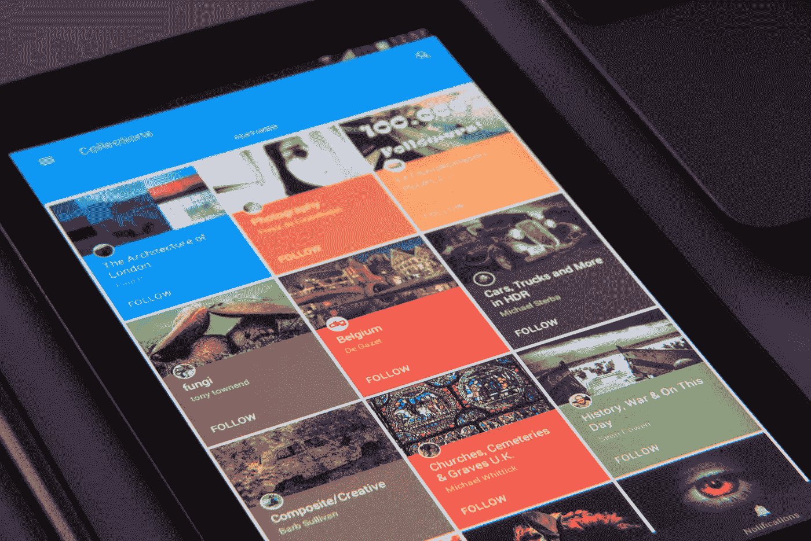

# 面向工程师的 PR 101

> 原文：<https://medium.com/hackernoon/pr-101-for-engineers-7cd116cc5347>

## 揭开公共关系的神秘面纱，让它发挥作用

[Craig Kerstiens](https://twitter.com/craigkerstiens) ，这位来自 [Citus Data](https://www.citusdata.com/) 的产品大师，从一个非营销人员的角度，做了一场关于公关的迷你推特风暴。

*1/ One of the most foreign things for me to learn coming from working with engineers was how to interact with media*

作为一名最终找到了[营销](https://hackernoon.com/tagged/marketing)之路的工程师，我们来谈谈这个吧。

*编程注意事项:这篇文章是 GTM 主题的一系列不定长文章中的 n 篇，主要针对* [*初创企业*](https://hackernoon.com/tagged/startup) *的人，主要是领导，主要来自非 GTM 背景。末尾有一个列表。*

# 做媒体是一份工作

*2/ Speaking with press/media is a very different skill than you’d think, it’s not just tell your message and answer questions*

媒体是有目的的。他们需要讲述更好的故事，有独特的观点，比他们的竞争对手产生更多的兴趣(和眼球)。考虑他们的动机。就像其他人做工作一样，他们有动机。

给他们听你说话的理由。建立你的诚信。帮助他们完成目标。

> 你在推进他们的事业吗？如果不是，你为什么期望他们提高你的工资？

# 帮助媒体更好地开展工作

3/ Lots of things felt really foreign, but it’s a matter of them being under time constraint and the medium that make it what it is

当他们第一次讲述一个故事时，他们会做得更好。还是那只*有故事的*一个。或者两者都有。一篇好的独家报道是任何一类记者的最佳结局。

注意力跨度就是他们的样子，他们能够消费或书写的细节和深度是有限的。除非你本身就是一个知名品牌，否则你的广告时间将被限制在一两个报价之内——所以要做得好。

如果你有幸成为焦点，长篇小说会是一种完全不同的体验。

最后，大多数科技媒体都想在他们写的任何话题上变得更聪明。他们感兴趣并喜欢学习技术、解读行业等。他们想要提供的不仅仅是事实；进入深度和分析层次，使*的*读者更聪明。

时间紧迫。所以，让自己变得有用和可信:

*   **帮助他们变得更聪明**
*   中立地做，这样他们才能信任你
*   愿意花时间去做这件事，而不是推销你的议程
*   告诉他们一些他们不知道的，或者其他人不知道的事情，不要居功

# 了解您的信息

4/ Ignoring the question is never something you want to do, but bridging to the narrative you care about AND that’s relevant is important

媒体培训。去拿一些。或者穷人的版本:找到你友好的营销人员，让他们进行角色扮演面试，这样你就可以得到练习。

*   **知道你想要表达的 1-3 点**
*   想办法把对话和你的观点联系起来
*   但是不要偏离或忽略这些问题
*   如果你不能或不愿意回答某个问题，要开诚布公
*   如果这显然是一次推介/简报会，*在开始时陈述你的观点*，然后*在结束时重复它们*，并且*发送一封跟进*电子邮件
*   尽量不要做断言。如果你是一个品牌名称，你可以摆脱它。否则，要有基于现实的理由。
*   练习。找一个以前做过的人来角色扮演。专注于能够引导对话，不激动地回答棘手或关键的问题，并在对方感兴趣或不感兴趣时阅读。
*   如果你被引用或引述的方式不准确，事后礼貌地澄清一下

5/ There’s a lot of small things which are key: know your numbers, know your customers (ones you can talk about), know your product launches

# 了解你的数字

是的，请。充分了解你的数据并记录下来。能够准确地回答关于你的公司和市场的问题。需要武装的东西:

*   创始故事
*   问题已解决
*   问题是为谁解决的
*   你的产品解决这个问题的真实故事(如果可能的话，说出名字)
*   增长数字或百分比
*   市场尺寸
*   行业或更广阔的世界中的哪些因素创造了你的机会
*   对与你所在领域相关的行业趋势的看法，越打破常规越好
*   市场格局，你的竞争对手是谁，你适合在哪里
*   对于“如果亚马逊/谷歌/BigCo 开始与你竞争，你会怎么做？”

# 了解你的原话

6/ Oh, and sound bites! Plan them in your head… what makes sense to quote? Over time this comes more naturally but takes attention early

更好的是，从多个来源，包括你自己，获得支持你观点的声音片段和引文。

*   我们的创始人总是说..
*   顾客 X 说..
*   Gartner 的某某说..
*   阿德里安·科克罗夫特在他的演讲中说..
*   某某 VC 说..

# 了解你的受众

弄清楚谁是对你特别重要的媒体和渠道。哪些覆盖了你的空间？哪些人吸引了你想吸引的人的注意力？

阅读他们的作品，了解他们的节奏。找到共同点。将你的推销、简报和评论特别针对他们感兴趣的领域。

建立关系。故意的。像对待人一样对待他们。

# 有用

让你自己为他们的文章提供背景信息和彩色评论，即使它们与你无关，即使你没有被引用。

指向有用的资源，如行业报告、分析师和其他可能提供见解的人。

把故事传递给他们。但是不要违反任何法律。:)例如，注意到某人网站上的一些模糊或隐藏的变化，这表明他们遇到了某种法律事件？指出来。

# 有人情味

如果你不知道如何把人当人看，那就去学。如果你是一个反社会者，养成习惯。如果你是一个严重的内向者，让别人去做吧。为你的公司找一张可以面对媒体的面孔。如果你找不到人，就找外面的专业人士。代理机构和自由职业者数量众多。

# 谈一谈代理机构

他们大多很烂。适合你的好书有几个共同的特点:

*   *与你关心的媒体的关系*
*   *与其他公司、高管、分析师的关系*可能有用
*   能够像你一样清晰地讲述*你的故事*,或者比你更好——这意味着他们显然能够并且愿意学习你的产品/技术/语言
*   愿意做将你的故事转化为记者议程的工作
*   *能否创造机会*提高你的知名度——位置、署名、内容、演讲等等

## 本系列中的文章(和模板)

*   [工程师营销 101:功能介绍](/@aneel/marketing-101-for-engineers-ee9e7fcb1a51)
*   [工程师营销 102:打造漏斗](/@aneel/marketing-102-for-engineers-ddf3b7fa61e6)
*   [面向工程师的营销 201:信息传递&定位](/@aneel/marketing-201-for-engineers-b28147fdb59d)
*   [面向工程师的营销 202:发布](/@aneel/marketing-202-for-engineers-launching-9437aa0e4961)
*   [工程师市场营销 203:销售支持](/@aneel/marketing-203-for-engineers-sales-enablement-e47662ca996a)
*   工程师市场营销 204:创造需求
*   [工程师营销 301:战略&策划](/@aneel/marketing-301-for-engineers-strategy-planning-2e4473fcc879)
*   工程师的营销 302:雇佣营销人员
*   [面向工程师的营销 303:定价框架](/@aneel/marketing-303-for-engineers-pricing-frame-aa71c8860a2b)
*   [工程师营销 401:GTM 阶段](/@aneel/marketing-401-for-engineers-stages-of-going-to-market-6adcedc64e17)
*   [针对工程师的营销 402:诊断&故障排除](/@aneel/marketing-402-for-engineers-diagnostics-troubleshooting-d946a337c258)
*   [工程师营销 403:解答创始人常见问题](/@aneel/marketing-403-for-engineers-office-hours-bf4d2d0b5f56)
*   [工程师销售 101:功能介绍](/@aneel/sales-101-for-engineers-6fcd1b49cffa)
*   [针对工程师的 PR 101](/@aneel/pr-101-for-engineers-7cd116cc5347)
*   [面向工程师的分析师关系 101](/@aneel/analyst-relations-for-startups-101-ea9338cb13ed)
*   [基本消息模板【谷歌文档】](https://docs.google.com/document/d/1neA71qCSeV3xH1Dpbtcy67m3v2ETmmB_Qq02ckkKUiQ/edit?usp=sharing)
*   [基本漏斗指标模板【谷歌表单】](https://docs.google.com/spreadsheets/d/11r4tHm_es6Tl4DItNUc_KzNdyvrmbbRmb38CJPLCvRU/edit?usp=sharing)
*   [基本发布时间表模板【谷歌文档】](https://docs.google.com/document/d/13Zscb5sX9ggjpWf05Ka-oj5wulC3Kb9z0LyMEQesnzM/edit?usp=sharing)
*   [基本战斗卡模板【谷歌文档】](https://docs.google.com/document/d/1dOCKhE1Ufmwp7bXeQTBCkST7NPwiCPJ2oyWEdpQut1g/edit?usp=sharing)
*   [详细战斗卡模板【谷歌文档】](https://drive.google.com/open?id=1EC3Lq6Z_IVrZKR4-jHgnc5-e3krZw4bA5Z-HAOJlH10)
*   [基本营销日历模板【谷歌表单】](https://docs.google.com/spreadsheets/d/1nXr0IqwnhQsUi_D83ecPXsIyDdiTkpNZ66piRkayPsA/edit?usp=sharing)
*   [基本营销阶梯模板【谷歌表单】](https://docs.google.com/spreadsheets/d/17EfTQp_21WomJ9cwiM4ian9M2QRcbM17_d3DilGNThY/edit?usp=sharing)

## 参考书目

*   克雷格·克斯廷的[创业公关指南](http://www.craigkerstiens.com/2015/07/21/An-intro-PR-guide-for-startups/)
*   首轮资本的[为什么大多数创业公司没有得到压力](http://firstround.com/review/why-most-startups-dont-get-press/)
*   迈克·马尼的[反对雇佣公关公司的案例](http://maneydigital.com/the-case-against-hiring-a-pr-agency)
*   杰森·莱姆金的《SaaS 创始人公关指南》
*   马特·韦伯的[这是我给那些不擅长公关的人(比如我)的公关建议](http://interconnected.org/home/2017/10/26/ticktock)
*   在船上:[权衡禁运与排他的利弊](http://onboardly.com/startup-pr/weighing-the-merits-of-embargo-vs-exclusive/)

*感谢***[*麦克·马尼*](https://medium.com/u/c4d30ec105bc?source=post_page-----7cd116cc5347--------------------------------)*[*帕姆·s·恩吉桑*](https://medium.com/u/e6825e9792f2?source=post_page-----7cd116cc5347--------------------------------) *的反馈！****

************

> **黑客中午是黑客如何开始他们的下午。我们是这个家庭的一员。我们现在[接受投稿](http://bit.ly/hackernoonsubmission)并乐意[讨论广告&赞助](mailto:partners@amipublications.com)机会。**
> 
> **如果你喜欢这个故事，我们推荐你阅读我们的[最新科技故事](http://bit.ly/hackernoonlatestt)和[趋势科技故事](https://hackernoon.com/trending)。直到下一次，不要把世界的现实想当然！**

****