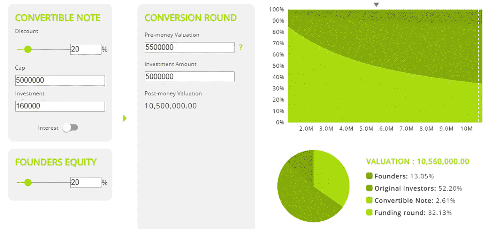

# 对可换股票据定价的实用建议

> 原文：<https://medium.com/hackernoon/practical-advice-on-pricing-convertible-notes-f13d3edd9341>

你发行的是可转换债券吗？这样做是为了避免给自己的初创公司设定[估值带来的麻烦吗？良好的..再想想！可转换债券有自己的一套计算和协商方法。为了你自己和你的](https://www.equidam.com/what-is-startup-valuation-what-the-market-is-willing-to-pay-and-the-meaning-of-it/)[初创公司](https://hackernoon.com/tagged/startup)，你在进行任何估值协商时，都应该同样关注它们。

关于可转换债券的利弊，人们已经说了很多。我经常被问到的一个观点是，不需要计算估值，因为我们都知道，每个人都有自己的估值评估，目的是确定股权转换后的持股比例。

的确，在大多数情况下，可转债的条款掩盖了估值信息，使它只是更加模糊。很多文章都警告创业者不要错误使用这种工具。普遍的共识似乎是围绕一个有限的使用，与一些角落的情况，如桥梁融资，他们是完美的。

但如果你必须使用它们，你至少应该了解最常见的术语，以及它们对你的股份和公司未来的影响。

## 但什么是可换股票据呢

可换股票据是公司与投资者之间的合同，它规定投资者以债务的形式向公司提供资本。第二个，也是最重要的规定是转换。当预定的“触发事件”发生时，债务转换为权益(换句话说，票据转换为股份)，可转换票据持有人成为股东。

作为双方之间的私人合同，几乎任何条款都可以适用。随着时间的推移和工具的使用，合同变得越来越标准化，现在包含了一些共同的条款和主题。然而，请记住，双方当事人仍可添加不常见的条款，最终合同可能看起来与标准合同相去甚远。

## 那么，这些可转换债券的定价问题是什么？

和任何融资合同一样，它的条款对公司的融资及其未来的融资规模都有影响。

投资者(或多名投资者)的投资金额于触发事件发生时按某一估值进行转换。该估值通常为触发轮融资的税前估值与债券“上限”之间的最低值。对于该值，应用“贴现”，其构成可换股票据持有人于触发回合中相对于投资者承担的风险的溢价。

应用折扣后，可转换票据持有人的所有权百分比根据债务价值计算。

请记住，这可能与可转换票据持有人投资的实际金额不同，因为可能会收取利息。在某些情况下，由于投资者实际上是在向公司提供债务，他们会要求获得利息。通常，利息按年计算，然后根据发行和转换之间的月数支付。

## 为什么这些计算很重要？

当投资者将其债务转换为股权时，他们将获得公司的股份。这当然会对你的股份产生影响。你的股份也会在触发轮被投资者稀释。这意味着，通过改变触发回合的上限、折扣和估值，你的最终股权头寸可能会有很大变化。

> *在我们全新的免费* [*可兑换纸币计算器*](https://www.equidam.com/convertible-note-calculator/#/index) 上查看所有场景和平均折扣率

你和你的投资者都应该对这些投入的不同水平的结果做一些情景分析。

除此之外，您可能对触发估值有所了解。你的投资者也是。最终股权之间的关系是理解的关键。

最终估值越高，可转换票据持有人的股份就越低。除非估值高于上限。在这种情况下，可转换票据持有人将获得相同的股权，从而理想地受益于更高的估值，因为他们的股票将价值更高。

这意味着有兴趣购买可转换票据的投资者将保持较低的上限和较高的折价。而你和创始团队会争取相反。

关于早期折扣和上限的数据并不容易获得，这使得被误导的企业家成为信息较少的一部分。在所有这些操作中，最好与其他创始人、律师或顾问就这些条款进行磋商，以避免未来出现意外。

当关于上限的讨论成为谈判的核心时，许多关于估值的问题就会浮出水面。此外，对于这部分讨论，美国企业家通常比另一部分了解得更少。此外，对于这一部分，我们应该与其他创始人、律师或谷歌核实。

> *想了解更多关于你的估价，试试*[*Equidam*](http://www.equidam.com)*！这是免费的，你可以在几分钟内开始！*

## 结论

可转换票据通常由简单的计算和数学组成。与股东协议和其他东西相比，它们是更灵活的合同。然而，在大多数情况下，它们隐藏了许多复杂性，并将其留给将来的讨论。谨慎使用它们，并尽可能预测不同的结果。

*原载于 2016 年 2 月 10 日*[*【www.equidam.com】*](https://www.equidam.com/practical-advice-pricing-convertible-note/)*。*

> [黑客中午](http://bit.ly/Hackernoon)是黑客如何开始他们的下午。我们是 [@AMI](http://bit.ly/atAMIatAMI) 家庭的一员。我们现在[接受投稿](http://bit.ly/hackernoonsubmission)并乐意[讨论广告&赞助](mailto:partners@amipublications.com)机会。
> 
> 如果你喜欢这个故事，我们推荐你阅读我们的[最新科技故事](http://bit.ly/hackernoonlatestt)和[趋势科技故事](https://hackernoon.com/trending)。直到下一次，不要把世界的现实想当然！

