# 实用指南:如何在 Itunes 中注册帐户并向 App Store 提交应用程序

> 原文：<https://medium.com/hackernoon/practical-guide-how-to-register-account-in-itunes-and-submit-an-app-to-the-app-store-2cf94e62797e>

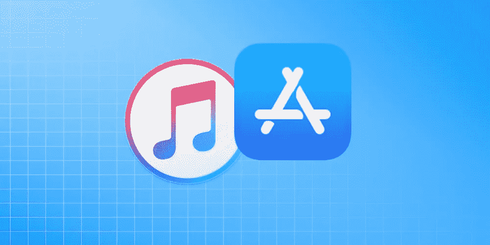

我们喜欢只需简单几步就能完成所有事情。由于我们的许多[博客读者](https://dashbouquet.com/blog)拥有他们的移动应用程序，我们认为写下一份关于如何在 iTunes 中注册帐户并向 AppStore 提交应用程序的清晰指南将是一个好主意。

# 第一部分

## 账户注册

为了向商店提交应用程序，您必须拥有一个开发者帐户。

**注意:**为了注册成为开发者，你需要支付 99 美元的费用。

**账户注册步骤:**

*   前往 Apple 开发者网站
*   点击右上角的“账户”
*   创建 Apple ID 或使用您现有的 ID
*   如果您要创建新的 ID，请填写所有必需的信息，并验证您的电子邮件地址

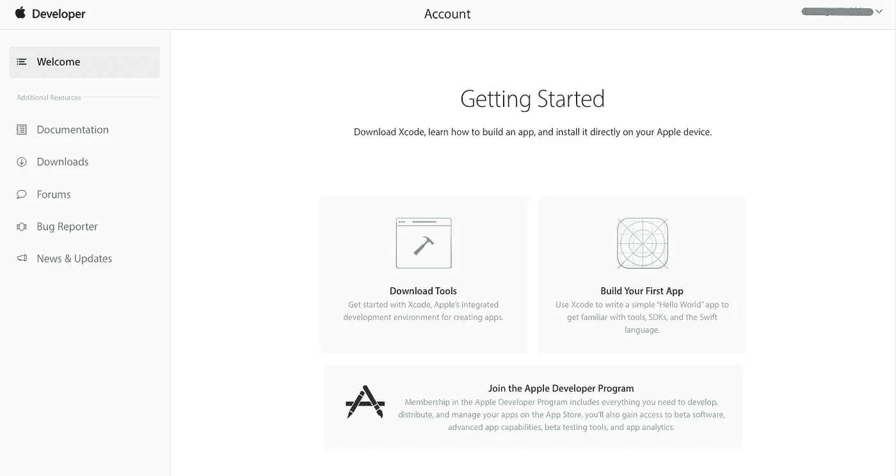

成功！现在登录。

当你登录到你的开发者账户后，你会有很多东西要读——当然是法律协议。花一些时间和你的律师一起真正地浏览所有的文本，因为它与你的业务有关，你不想跳过任何重要的点。

一旦你完成并得到律师的批准，点击提交，你就可以开始了！

说到上面提到的费用，是加入[苹果开发者计划](https://developer.apple.com/programs/enroll/)的费用。不投资一些钱，你将无法访问所有的信息，图书馆和工具，所以这是必须要做的事情。这些是必要的步骤:

*   登录后(如上步骤)，你会在页面底部看到“加入苹果开发者计划”，点击链接
*   然后点击右侧的“注册”按钮

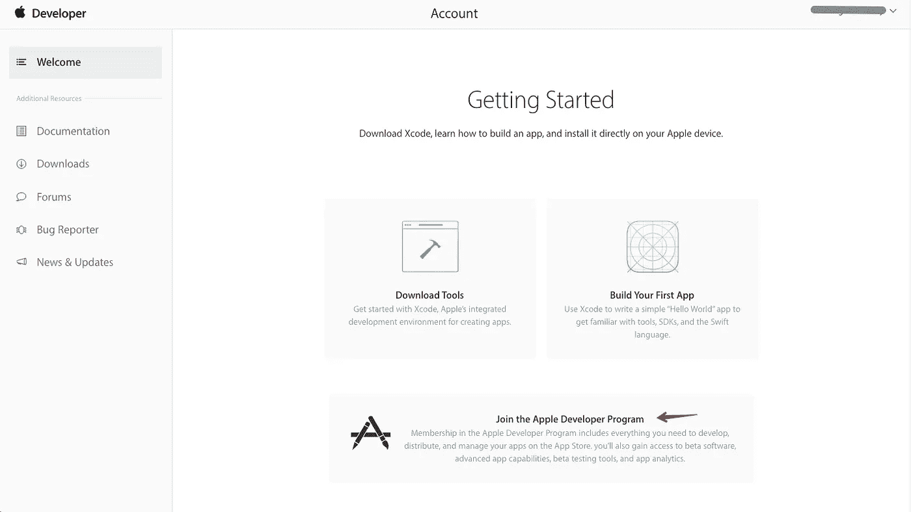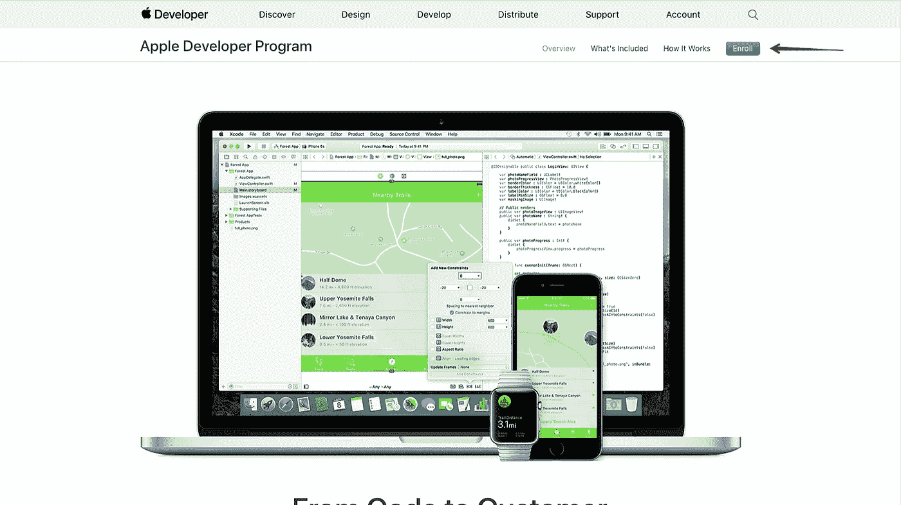

现在有一个棘手的部分。您可以选择是以个人身份还是以公司身份注册，我们建议您选择“个人”选项，因为这将节省您的时间，并且需要更少的文书工作。但是，如果你是一个真正的中型或大型公司，显然选择“公司”选项。

*   勾选“个人”或“公司”后，点击“开始注册”
*   选择您的业务类型，然后单击“继续”
*   输入所有必需的信息
*   再次与您的律师一起阅读协议，获得批准，勾选“我同意”框，然后单击“继续”
*   再次查看所有信息，然后单击“继续”

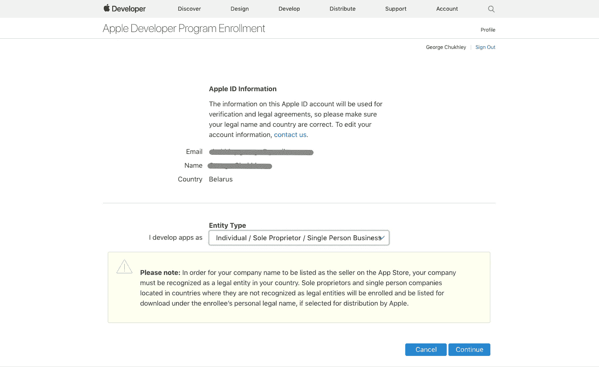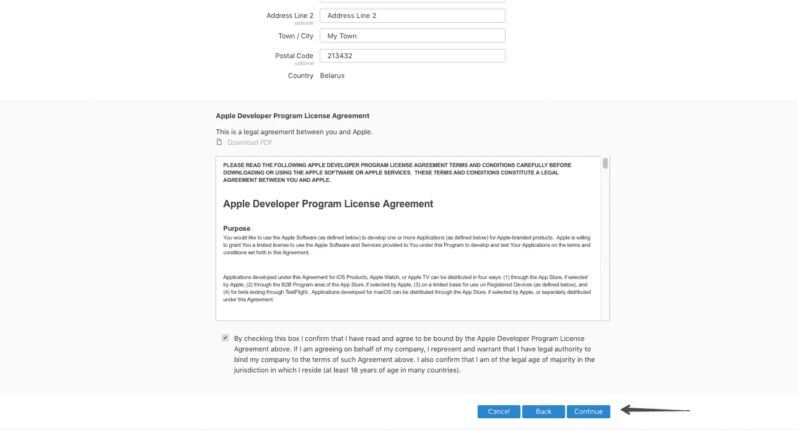

现在，您将可以选择自动更新您的会员资格，这意味着您的应用程序将始终可用，您将能够随时获得所有会员权益。这个选项很方便，但是否选择由你决定。

*   决定自动续订选项后，单击“继续”
*   再次登录
*   填写账单信息
*   点击“购买”

完成所有这些步骤后，您将收到确认您加入[开发者计划的电子邮件。](https://developer.apple.com/programs/)现在点击链接，登录，瞧，你成功了！

在[开发者中心](https://developer.apple.com/)有很多信息，包括各种教程、文档、视频等。在开发应用程序时，你将主要关注证书、id&档案和 iTunes Connect。

# 第二部分

## 提交应用程序前要做的事情

到现在为止，你必须熟悉苹果开发中心，你应该知道证书，身份证和个人资料领域的重要性。为了让这款应用程序获得苹果公司的批准，并在 iOS 设备上运行，它必须有一个苹果公司签署的证书。在没有签名或签名无效的情况下，应用程序不会运行。因此，为了让您的应用程序正常工作，您需要转到证书、id 和配置文件并生成配置文件。它们由开发中心生成，将允许 [Xcode](https://developer.apple.com/xcode/) 签署您的应用程序。有两种类型的配置文件:

*   开发:这种配置文件只链接到特定的设备，所以你可以用它们来检查你自己设备上的应用程序
*   分发:这些是用来在你的应用提交给苹果之前签名的

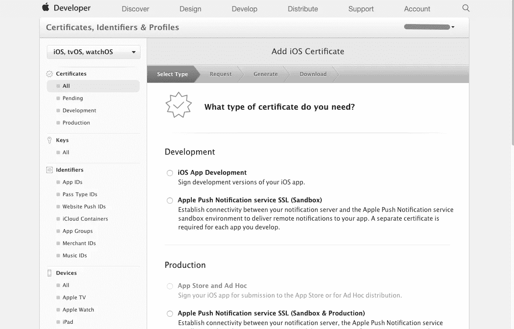

以下是创建证书的步骤:

*   如果您在开发中心页面，请单击左侧的证书、身份证和个人资料或屏幕中间的齿轮图标
*   一旦你在那里，检查在左上角的下拉菜单说 iOS，tvOS，watchOS
*   点击右上角的“+”
*   您将被引导至“添加 iOS 证书页面”。选择“iOS 应用程序开发”并点击“继续”
*   然后您将看到如何通过钥匙串访问生成 CSR。为此，请在 Mac 上打开“钥匙串访问”应用程序。
*   打开后，点按“钥匙串访问”—“证书助理”——向证书颁发机构申请证书
*   将会打开一个“证书助手”窗口
*   在此窗口中，填写您的电子邮件和姓名，勾选“保存到磁盘”和“继续”
*   将文件保存在 Mac 上
*   您创建了 CSR，现在您必须生成此证书。为此:
*   返回开发中心，单击“继续”
*   点击“选择文件”，选择保存的文件，然后点击“继续”

您将看到一个屏幕，显示证书已准备好。下载它，然后双击开发证书文件，以便将其安装到钥匙串中。将出现一个钥匙串访问对话框，在此窗口中单击“添加”,安装将完成。

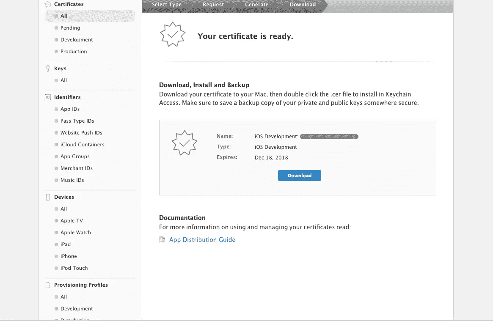

完成所有这些步骤后，您获得了开发概要文件的证书，但是您还需要一个用于分发概要文件的证书。以下是你需要做的事情:

*   点击“添加另一个”
*   在生产区选择 App Store 和 Ad Hoc，点击“继续”

这个过程与上面描述的相似，然后你会收到一个证书。之后，下载它并再次双击它的安装。

现在，如果您查看“钥匙串访问”,您会看到您的证书都已安装。

做完这些烦人的工作后，是时候注册你的设备了。再次进入“证书、id 和配置文件”区域，单击“设备—全部”(在左侧),然后单击右侧的“+”。然后:

*   打开 iTunes 并将设备插入 Mac
*   选择您的设备
*   当 iTunes 显示关于你的设备的信息时，点击序列号，它会变成你的设备的 UDID，你需要复制它
*   返回设备注册，输入设备名称并粘贴 UDID。完成后，单击“继续”
*   之后，点击“注册”

但这还不是全部！现在你需要一个应用 ID。在证书、id 和配置文件菜单中，单击标识符\应用 id，然后单击右侧的“+”。填写所有必需的信息，不要忘记勾选“显式应用程序 ID”，然后输入捆绑包 ID。然后点击“继续—注册”,这时您就可以开始创建分发和预置描述文件了。

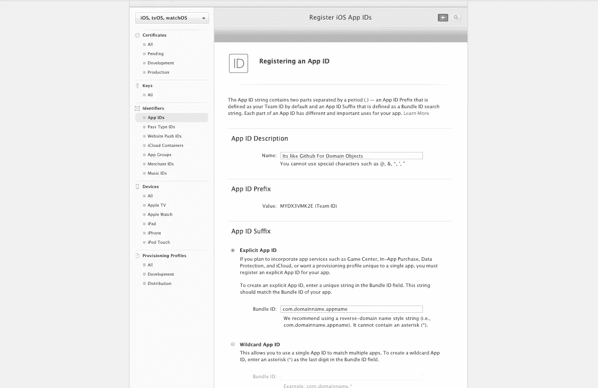

*   在与之前相同的菜单中，单击预配配置文件\全部，然后单击“+”
*   勾选“iOS 应用程序开发”和“继续”
*   为个人资料选择一个应用 ID。你现在只有一个了。
*   选择证书
*   选择您的设备
*   为此新配置文件输入一个描述性名称
*   下载档案
*   点击“添加另一个”。这将节省您的时间，因为在同一个页面上也可以创建分布配置文件。
*   选择“应用商店”选项
*   遵循相同的步骤，直到您下载了配置文件

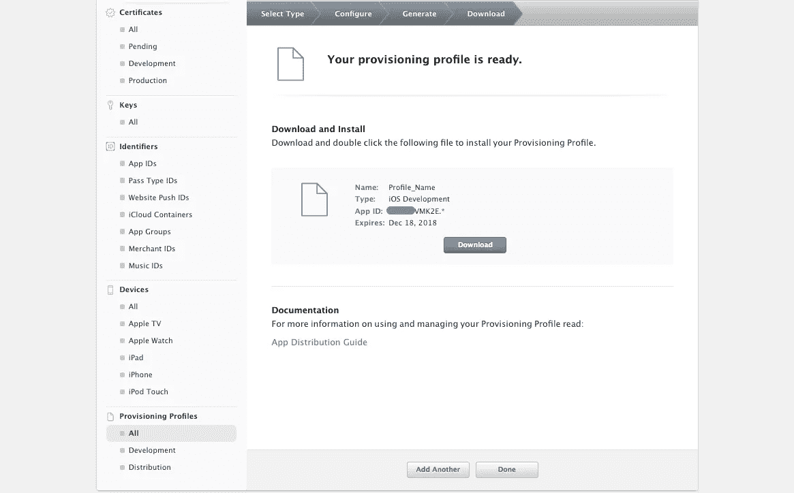

现在提交申请的一切都准备好了！

# 第三部分

## 如何在 iOS 设备上运行您的应用程序

显然，你需要一个应用程序来执行我们将要描述的所有步骤。然而，有很多应用程序你可以免费下载并测试，以防你的还没有准备好。你现在要做的是:

*   在 Xcode 中打开项目
*   打开项目导航器
*   单击左侧树的节点
*   点击目标(DropCharge)
*   点击“常规”
*   将部署目标(底部中间)设置为 9.0

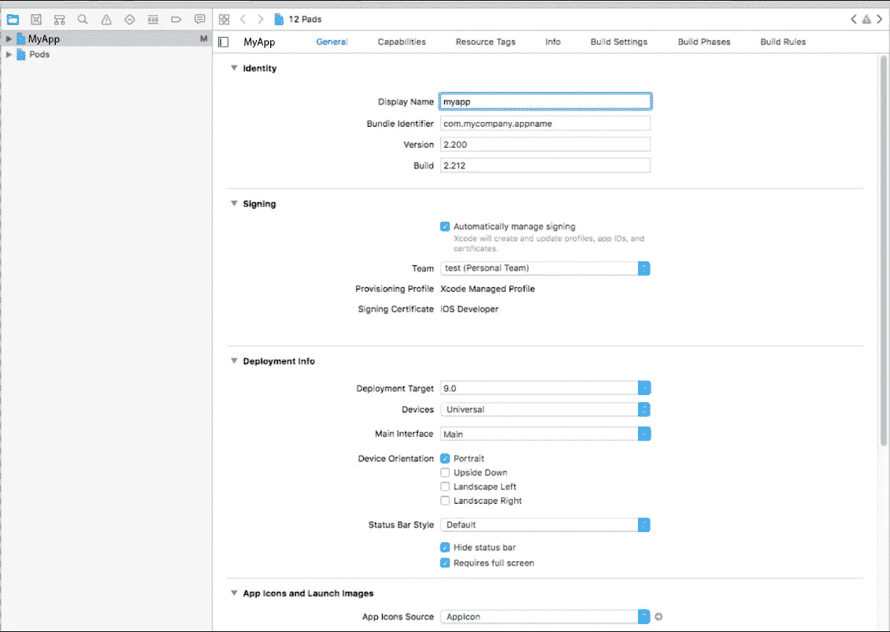

部署目标意味着你的应用支持的最低 iOS 版本，就这么简单。请记住，如果您将应用程序设置为 iOS 8.0，而所用的 API 仅在 9.0 上可用，应用程序将会崩溃。

接下来的步骤是:

*   更改捆绑包标识符(与 Apple ID 相同)
*   通过选择必要的帐户来分配您的团队
*   点击构建设置，并在搜索字段中输入“签名”

在搜索结果中，您将看到“代码签名身份”部分，单击“调试”和“发布”条目的下拉列表，然后选择您的预置描述文件。选择您的开发人员配置文件进行调试，选择您的发行版配置文件进行发布。

*   确定您的设备已连接到 Mac
*   选择为此设备生成
*   按下⌘B 开始建设
*   ⌘R 出版社
*   查看设备上运行的应用程序！

现在让我们看看如何将您的应用程序提交到 App Store。首先，进入开发者苹果网站的会员中心，使用你的凭证登录，然后点击 iTunes Connect。你将得到一个介绍，如果你愿意，你可以跳过它。以及确保接受服务条款。欢迎来到仪表板！

如果您想为您的应用程序获得资金，请点击“[协议、税务和银行](https://developer.apple.com/library/content/documentation/LanguagesUtilities/Conceptual/iTunesConnect_Guide/Chapters/ManagingContractsandBanking.html#//apple_ref/doc/uid/TP40011225-CH21-SW1)”，然后选择“请求”(右上角)，并在律师的帮助下执行所有必要的步骤。你必须填写联系方式、银行和税务信息。现在我们继续。

*   回到仪表板
*   点击“我的应用”
*   点击左上角的“+”并选择“新建应用程序”

填写必要的信息:选择 iOS，填写应用程序的名称，选择主要语言，选择正确的捆绑 ID，创建 SKU。然后点击“创建”！然后在详细信息屏幕上点击“应用程序信息”并填写。

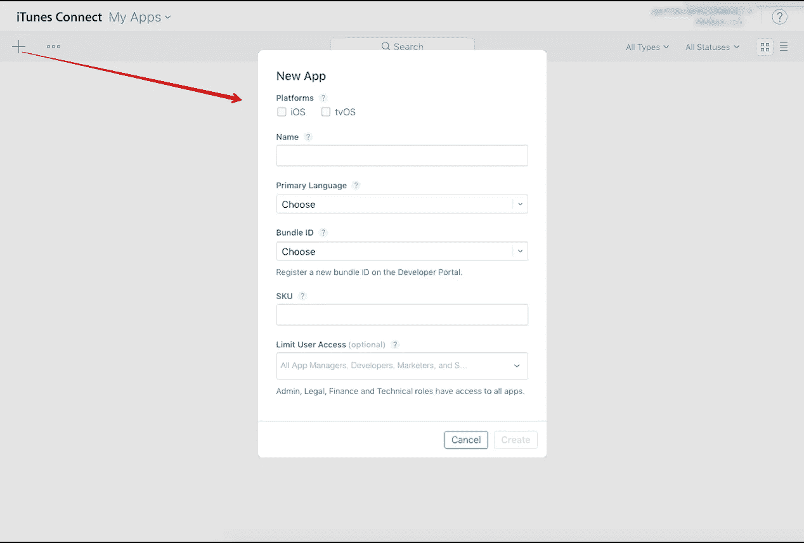

然后转到“定价和货币”，选择你的价格或选择该应用程序将是免费的。如果你想使用付费应用程序，你也可以在那里选择你的定价表。

最后点击“1.0 准备投稿”。

*   添加截图和图标。如果你的应用是通用的，确保你提交了 iPhone 和 iPad 的截图。
*   完成应用程序的描述
*   输入关键词，不要低估它们的重要性
*   输入网站支持页面的 URL
*   向下滚动至“一般应用信息”(跳过“构建”)
*   添加图标
*   设置版本号
*   填写版权声明中的信息
*   在“评级”旁边，您会看到“编辑部分”。填吧，老实点！如果审阅者不同意，他们可以更改它。
*   然后滚动到“App 评论信息”。在“注释”中，你可以写下任何你想让评论者知道的东西。换句话说，您可以通过提供所有必要的链接、凭据和信息来帮助更快、更好地评估您的应用程序，从而简化审核者的工作。
*   然后，您可以转到“版本发布”部分，选择您希望您的应用程序何时发布。但如果是你第一次提交，只需留下自动发布的选项，点击“保存”即可。现在点击“提交审核”！如果有消息说有错误，这可能只是意味着应用程序尚未上传，所以不要担心。

但是，你还需要通过 Xcode 提交一个 app。为此:

*   前往 Xcode，并在上部选择通用 iOS 设备
*   然后选择产品/归档
*   点按“上传到 App Store”
*   选择您的凭证，点击“选择”
*   您将看到要上传的应用程序，因此单击“上传”

看到成功上传窗口后，单击“完成”。

*   返回 iTunes 并转到您跳过的构建部分
*   点击“提交应用前选择一个版本”
*   选择构建并单击“完成”
*   点击“保存—提交审核—提交”

现在，等待你的应用程序被批准！你可以点击左边的“活动”来查看它在 iTunes 中的状态。

作者:乔治·楚克利