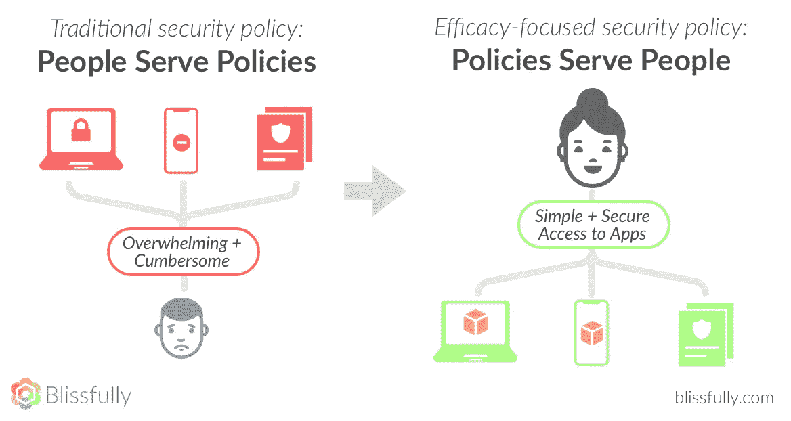
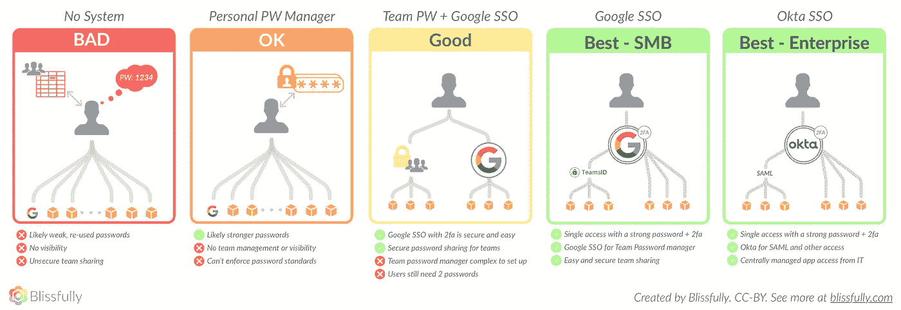
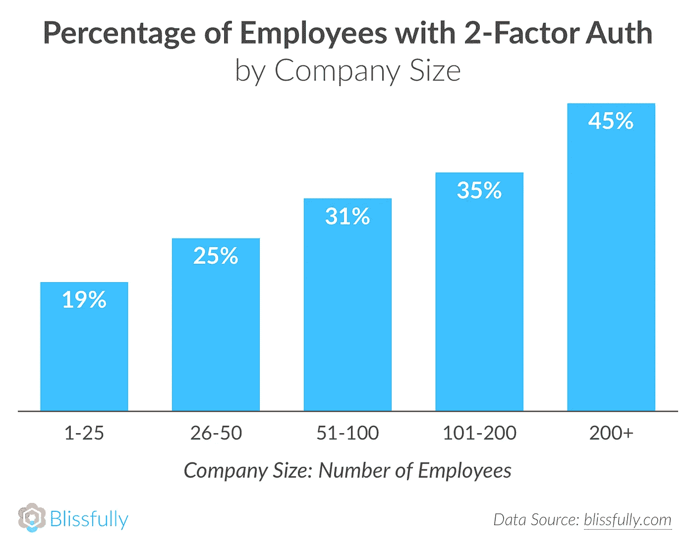
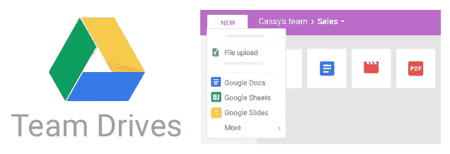
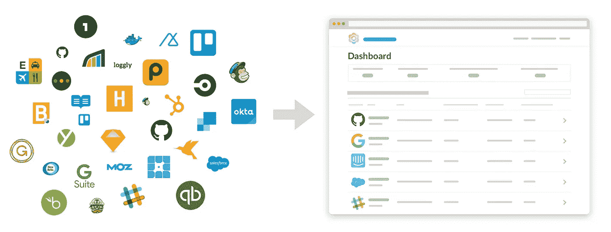
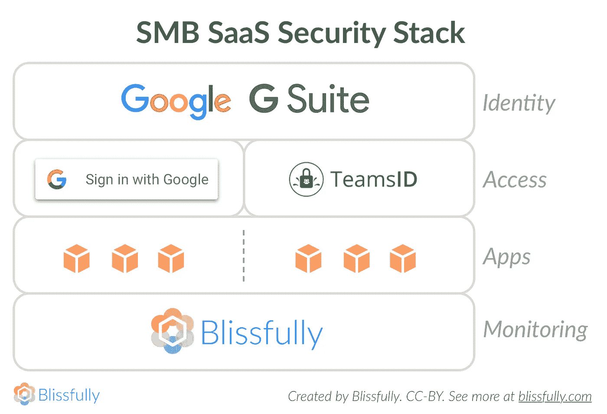
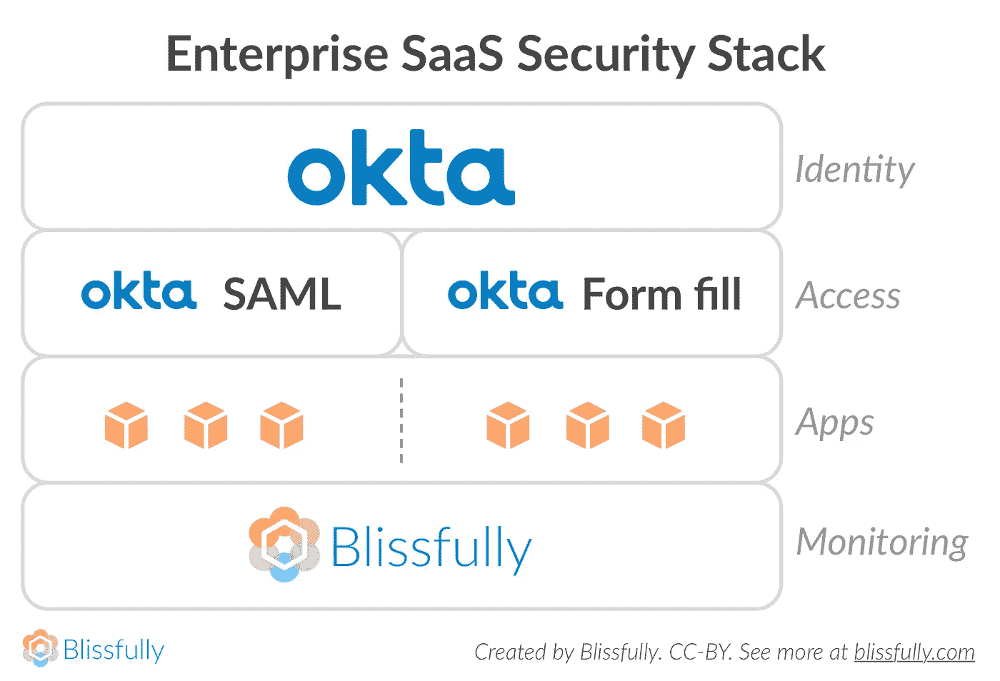

# 以人为本 SaaS 安全实用指南

> 原文：<https://medium.com/hackernoon/practical-guide-to-saas-security-e6b8b76d50a2>

中小企业平均使用超过 54 种 SaaS 产品，这经常导致 SaaS 混乱和安全风险。虽然 SaaS 可以帮助您更高效地完成工作，但如果没有正确锁定，它也会带来安全问题。在 Blissfully，我们帮助数百家公司管理这种 SaaS 混乱，我们已经准备了一个简单，实用，有效的指南，以提高您的组织的 SaaS 安全性。

# 安全从人开始

说到安全，您的员工可能是您最好的防线，也可能是您最薄弱的环节。围绕人建立安全策略和程序是关键，包括花时间了解什么是直观和用户友好的，从而最有可能得到遵守。

总的来说，我们认为你应该更多的依靠系统和护栏，而不是用户动作和培训。换句话说，尽可能排除人为错误。我们还认为最好是拥有更少的向量，而不是更多，并尽可能强化这些向量(我们将在下面更详细地解释这意味着什么)。

许多组织都是根据实际情况来解决安全性问题。这可能是危险的，因为这通常意味着在糟糕的事情发生之前，你不会考虑安全问题。无论是临时安全策略还是缺乏安全策略，都可能让您暴露在一个充满漏洞的世界中。另一方面，一些组织采用晦涩难懂的安全实践(比如强迫用户定期更改密码，而没有真正的原因)，这些实践对用户不友好，因此经常被员工回避。

# SaaS 安全范围

上图展示了 SaaS 安全和访问的范围，以帮助您了解您的组织目前所处的位置。大多数组织开始时没有政策或制度。在这种情况下，每个员工都有责任管理自己的安全，这意味着他们通常会重复使用密码，通过不安全的电子表格共享密码，或者创建其他适合自己但不适合公司的系统。

最好的情况是使用单一接入点解锁对公司应用程序的访问，并创建一个简单的集中点来实施人性化的安全策略。

本指南的其余部分将帮助您从频谱中的任何位置进入安全使用 SaaS 的极乐状态。

## 这本指南是给谁的

在本指南中，我们将分享构建 SaaS 安全堆栈的最佳实践，该堆栈是现实的、可用的，并专注于现代组织开展业务的方式。特别是，我们将重点放在了广泛的中小型企业或 SMB 上。非常小的企业可能还没有准备好实施其中的一些控制，也可能没有必要。另一方面，企业会发现这些建议中有许多是合适的，但可能需要进一步采取措施来完全降低风险。然而，总的来说，我们认为这些建议将适用于各种规模和类型的企业，是一个很好的起点。

此外，值得注意的是，这本电子书关注的是使用 G 套件的组织。举例来说，如果你在 Office365 中操作，它就不那么相关了。它还更加关注 SaaS 运营的安全性(而不是保护您的核心网络或生产服务器。)

# 基础:为安全性配置 G Suite

如果你正在使用 [G 套件](https://gsuite.google.com/together/)来处理你的业务，好消息是你已经拥有了相当多的安全工具和配置选项。然而，这些对你没有好处，除非它们被深思熟虑地实现并自动执行。这又回到了以人为本的安全理念。

当涉及到您的 G Suite 应用程序时，以下是您应该关注的安全领域。

## 多因素认证

要提高您组织的云安全性，您可以做的一件最好的事情就是在所有支持多因素身份认证的产品上打开并实施多因素身份认证，尤其是您的主要电子邮件和协作平台(如前所述，我们推荐 G Suite)。这极大地减少了攻击者使用窃取的凭据所造成的危害。

虽然这似乎是当今时代的一项要求，但我们的数据显示，普通公司只有 37%的员工在其主要 G Suite 帐户上使用多因素身份认证。对于规模较小且处于初创阶段的公司来说，这一数字甚至更低，在员工人数少于 50 人的公司中，只有 22%的员工启用了多因素身份认证。

实施基于谷歌的强认证的另一个好处是，许多 [SaaS 产品](https://www.blissfully.com/saas-products/)越来越支持谷歌单点登录，这意味着如果你对谷歌实施 MFA，你将自动获得所有使用谷歌单点登录的应用程序的好处。

## Chrome 设置

贵组织的 Chrome 管理员可以制定政策，规定员工如何在 Chrome 设备、Android 设备和 Chrome 浏览器上使用他们的 Google 帐户。由于这些策略是在帐户级别实施的，因此无论用户从什么设备登录，它们都将适用。(但是，请注意，这些政策不适用于以访客身份登录的用户或从组织外部使用 Google 帐户的用户。)因为这些设置可以应用于多种设备和 Chrome 浏览器，所以它们是一种加强安全性的好方法，而无需用户或 IT 团队付出大量额外努力。

要实现这些设置，你首先需要[打开 Chrome 管理](https://support.google.com/a/answer/6304822/)。然后，您可以设置用户策略，这些策略可以按团队进行划分，以帮助您将某些策略应用于特定的用户组。策略可以包括注册控制、允许或要求的应用程序和扩展、Chrome 网络商店权限、Android 应用程序和各种其他安全控制。你可以在这里查看[的完整名单](https://support.google.com/a/answer/2657289)。

## 团队驱动

[G Suite Team Drives](https://gsuite.google.com/learning-center/products/drive/get-started-team-drive/) 是团队存储和访问文件的共享空间。这个特性包含在 G Suite 的商业版和企业版中。团队驱动器中的文件属于整个团队，而不是个人。如果有人离开您的团队，这将使事情变得更容易，因为不需要转移文档所有权或重置权限。无论任何个人的状态如何，这些文件都将保持不变，因此员工可以不受干扰地完成工作。

使用团队驱动器还有一个安全好处。添加新成员时，您可以决定是否授予他们上传、编辑和删除文件的完全访问权限，或者是否将他们限制在用户级别的某些活动。根据需要添加成员、设置和更改成员权限以及删除成员都很容易。*在 Blissfully，我们已经与 G Suite 建立了合作伙伴关系，可以在折扣的基础上为您提供团队驾车服务。欲了解更多信息并进行设置，请致电 sales@blissfully.com**联系我们。*

# SaaS 安全监控

您不能说您的组织是安全的，除非您知道组织中的每个人在任何给定时间都在使用什么 SaaS 产品，并且可以肯定地说他们正在采用安全最佳实践。

Blissfully helps you automatically detect and manage SaaS across the entire organization.

借助[的](https://www.blissfully.com)SaaS 安全监控，您可以访问整个公司内正在使用的 SaaS 订阅的最新列表，包括“影子”和未经批准的应用程序。您可以查看整个组织的全面采用趋势，包括部门和产品的详细信息。Plus Blissfully 允许您轻松地审核您组织中的用户对哪些应用程序授予了什么权限，并获得所有新增内容的更新。这是您的 SaaS 堆栈的关键安全层。最后，能够按部门管理员工对您所需的 SaaS 产品的访问，并整合许可证，这将使您对您的 SaaS 堆栈有前所未有的了解。

# SaaS 访问管理

今天的 IT 世界越来越以 SaaS 为中心。这意味着对所有 SaaS 应用程序实施安全访问至关重要。你不能冒险就员工如何访问 SaaS 应用程序制定特别政策，不幸的是，这往往是现状。

当公司没有策略(或有很难遵守的策略)时，员工往往要么将密码存储在不安全的文件中，要么在多个应用程序中重复使用同一个密码。

[2016 威瑞森 DBIR](http:/www.verizonenterprise.com/resources/reports/rp_DBIR_2016_Report_en_xg.pdf) 发现，63%的已确认数据泄露利用了弱密码、默认密码或被盗密码。如果你不想让你的组织成为下一个受害者，是时候加强你的控制了。以下是我们对密码、身份和访问管理的建议。

## 团队密码管理

不幸的是，你的浏览器内置的密码管理功能不够安全，不能依赖。已经有一些针对基于浏览器的密码存储的[成功攻击](https://www.wired.com/2016/08/browser-password-manager-probably-isnt-enough/)，所以我们不建议你或你的员工使用这些功能。你可以并且可能应该关闭你的组织中的人使用 Chrome 的密码管理器的功能，你可以在我们之前谈到的 Chrome 设置中这样做。

我们建议使用 [TeamsID](https://www.teamsid.com) ，它为大大小小的组织提供了各种各样的密码管理解决方案。在我们看来，TeamsID 的杀手锏是能够将其链接到 Google 的 SSO。这意味着员工不必记住另一个密码，相反，您可以在 G Suite 上实施强密码和多因素身份验证，这反过来将解锁您在 TeamsID 中的共享密码。*奖励:当您注册 TeamsID 时，您可以使用代码“blissfully”获得 10%的折扣。*

一个非常可靠的选择是 [LastPass](https://www.lastpasss.com) ，它有许多相同的功能。但是，它没有 Google SSO 选项。它还有一些额外的配置挑战，并且不太容易用于团队共享。例如，入职流程要求您通过电子邮件设置一个临时密码，这并不理想。然而，LastPass 确实有一些额外的工作流和安全特性(例如，健壮的 API 访问和 SAML 配置)可用于一些企业级，根据您的业务需求，这些特性可能很有价值。

这些选项中的任何一个都比简单地让用户在几个服务之间重复使用他们的密码要好得多，这样会让您面临大规模的凭证攻击。

## 身份和访问管理

当您组建自己的 IT 团队，并且员工人数超过 200 人时，开始考虑部署统一的 IAM 解决方案是一个不错的主意。这既可以简化最终用户的体验，又可以保护整个组织免受安全威胁。IAM 解决方案的工作原理是对用户进行一次身份验证，然后为他们解锁所有应用程序，并且可以提供与各种公司目录的深度集成。

IAM 产品有点像类固醇上的 Google 单点登录，提供了更多的配置选项和更深入的集成。对于较小的组织来说，这可能是多余的，特别是如果您不能或不需要利用他们的杀手级功能，如 Active Directory sync(较小、较新的公司可能甚至没有这种功能)和 SAML 集成(通常只在更昂贵的企业级 SaaS 定价层上提供)。但是，如果您是一个更大或更先进的组织，投资 IAM 可能非常值得。

如今，IAM 市场上的一些主要参与者包括: [Okta](https://www.okta.com) 、 [OneLogin](https://www.onelogin.com) 和 [PING](https://www.ping.com) 。我们向大多数拥有 200 名以上员工的组织推荐 Okta。Okta 的单点登录产品声称使用户登录应用程序的速度加快了 50%,并将 it 服务台的请求减少了一半。这让您的 IT 和运营团队成员的生活更加轻松，同时满足“安全功效”目标。Okta 还内置了实时安全报告功能，因此在任何可疑情况发生时，您都会收到警报，让您高枕无忧。

# 将您的堆栈放在一起

简而言之，这些是我们对提高您的团队在 SaaS 行动的安全性的总体建议。

对于大多数企业，以下是我们的建议:

*   将人放在安全策略的中心
*   使用 [G 套件业务](https://gsuite.google.com/solutions/)或[企业](https://support.google.com/a/answer/7284269?hl=en)进行整体运营，并采用可用的安全配置
*   在 G 套件上实施两步验证
*   部署[幸福 SaaS 监控](https://www.blissfully.com)在一个方便的仪表板上密切关注所有应用程序
*   尽可能利用 [Google SSO](https://support.google.com/a/answer/60224?hl=en) ，并使用 [TeamsID](https://www.teamsid.com) (通过 Google SSO)来管理不支持 Google SSO 的产品的共享密码

*   对于企业:使用像 [Okta](https://www.okta.com) 这样的 IAM 来管理身份和访问

我们希望这些安全指南将有助于您的组织实现提高 SaaS 和云安全性的目标，方法是采用可实现且有效的实践和标准来保护您免受各种风险和威胁。最佳策略是可以实施和维护的策略，因此，通过实施本指南中概述的最佳实践，逐步提高您的安全性。如果您需要帮助来实现这一点，请告诉我们！

*最初发表于 www.blissfully.com***，您也可以在这里下载完整的 PDF 格式指南。**