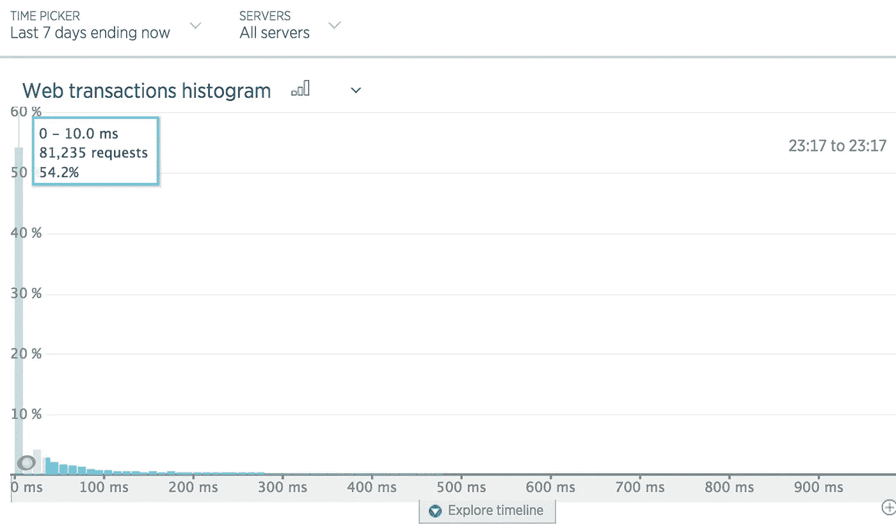

# 网站的实用缩放技术

> 原文：<https://medium.com/hackernoon/practical-scaling-techniques-for-web-sites-554a38dbd492>

在从事高容量网站工作 8 年后，我看到了许多有趣的缩放技术。虽然非常具体的策略确实可以获得巨大的效率收益，但复杂化也不是没有代价的。根据我的经验，中等规模的站点会遇到的扩展问题可以通过以下方法解决:

*   异步工作队列
*   正确使用数据库
*   适当的缓存

下面的例子是在 Ruby on Rails 的上下文中编写的，但是应该可以很好地翻译成其他语言和框架。

## 异步工作队列

随着网站的增长，控制人员很容易变得臃肿，并因他们可能必须执行的所有额外任务而变慢，例如:

*   分析跟踪
*   发送电子邮件
*   创建附加数据库记录
*   意外的 N+1 查询副作用

例如，假设一个用户想要删除他的个人资料和与之相关的数千条记录—这可能需要一段时间。而且它真的没有立即发生*；相反，它可以确认请求已收到，并在完成后向他们发送电子邮件。然后，您可以在一个**异步工作队列**中执行实际的删除。异步工作队列包括:*

1.  *可执行作业和作业参数的队列(通常在 Redis、MongoDB、MySQL 等中)。*
2.  *从队列中提取作业并执行它们的工作池。*

*基本上，可以从控制器推迟的任何事情应该是:*

*   ***对第三方服务的 API 请求。**这些是必须推迟的，因为它们的响应时间可能是可变的/缓慢的，并且 web 请求不应该阻塞响应的呈现。更糟糕的是，如果您没有正确地检测和中止缓慢的响应，失败的 API 提供者可能会使您的站点瘫痪。避开这个问题，在异步工作器中执行尽可能多的 API 调用。*
*   ***电子邮件。基本上是一个 API 请求。***
*   ***数据库记录创建。**虽然通常比 API 请求快几个数量级，但由于数据库负载、索引数量和外键约束等因素，插入仍然需要 10-100 毫秒。*

*不推迟的唯一理由是如果结果对回应很重要；例如，支付请求可能被阻止，从而客户立即被通知支付失败。*

*在 web 请求周期之外，异步工作队列对于并行化大型工作负载非常有用。例如，设想一个每天预定的脚本，向 10k 电子邮件分发列表发布新产品。如果这个脚本按顺序发送所有的电子邮件，这可能需要一个多小时。对于十几个异步工人，这可能需要将近 5 分钟。如果您需要处理工作/流量高峰，也可以简单地临时增加工作人员数量。*

*异步工作器对于各种问题非常有效，并且实现成本低，这使它们成为各种情况下的实用解决方案。*

## *正确使用数据库*

*你的网站编写的编程语言可能是非常通用的——它以效率为代价为灵活性进行了优化。数据库是关系代数的高度优化的计算引擎。几乎有数百(如果不是数千)本书是关于数据库的，所以我将只提到我遇到的一些常见场景。*

***N+1 个查询问题***

*我听到的关于对象关系映射器(ORM)的最大抱怨之一——尤其是 Rails 中的 ActiveRecord 是它们使得在不知道的情况下编写糟糕的查询/查询集变得非常容易。例如，考虑:*

```
*User.each { |u| puts u.address }*
```

*似乎无关痛痒。但是不明显的是，Rails 正在执行一个查询来加载`User`关系，然后在循环的每次迭代中查询`Address`表:*

```
*SELECT * FROM users;SELECT * FROM addresses WHERE user_id = 1;SELECT * FROM addresses WHERE user_id = 2;...*
```

*这类性能问题称为 N+1 查询问题，通过简单分析 SQL 日志就可以很容易地识别出来。修复方法也很简单:收集用户的 id 并在一条语句中查询所有用户，而不是循环查询:*

```
*SELECT * FROM addresses WHERE user_id in (SELECT id FROM users);SELECT * FROM users INNER JOIN addresses ON (users.id = addresses.user_id);*
```

*Ruby on Rails 提供了一些“急切加载”机制，可以轻松避免 N+1 查询模式:*

```
*User.includes(:address).each {|u| puts u.address}*
```

*在幕后，它指示 Rails 使用`SELECT..FROM..WHERE id IN (?)`模式来选择来自用户的带有 user _ ids 的地址。*

***缺少索引***

*当按任何列查询表时，数据库引擎有两种选择:查看表中的每条记录或使用索引，索引是一种高度优化的数据结构，可用于在查看表之前选择或消除记录。*

*在小于 10k 记录的表上，很容易意识不到您丢失了一个索引，因为它足够快了。然而，超过 10k，查询将变得明显缓慢。外键关系(`other_table_id`)是放置索引的明显位置。覆盖索引(需要返回的所有信息都在索引中)可以通过消除访问表本身的需要来加快查询速度。如果不确定是否使用了索引，可以使用数据库引擎的`EXPLAIN`命令:*

```
*EXPLAIN SELECT * FROM foo;

                       QUERY PLAN
---------------------------------------------------------
 Seq Scan on foo  (cost=0.00..155.00 rows=10000 width=4)
(1 row) EXPLAIN SELECT sum(i) FROM foo WHERE i < 10;

                             QUERY PLAN
--------------------------------------------------------------------
 Aggregate  (cost=23.93..23.93 rows=1 width=4)
   ->  Index Scan using fi on foo  (cost=0.00..23.92 rows=6 width=4)
         Index Cond: (i < 10)
(3 rows)*
```

*该工具将快速向您展示您的数据库引擎将使用的策略。即使你使用的是另一个数据库，关于 [Postgres 的解释](https://www.postgresql.org/docs/9.5/static/using-explain.html)的文档也应该是可以遵循的。优秀的数据库管理工具 [PgHero](https://github.com/ankane/pghero) 也会根据使用统计数据自动提出索引添加/删除建议。*

***序列化数据***

*关系代数处理结构化数据:预定义的表、列和关系。尽管 XML 和 JSON 等半结构化数据并不总是预定义的。传统的解决方法是序列化 XML 或 JSON，并将它们存储为文本记录。最近的数据库版本增加了对 JSON(原始文本存储)和 JSONB(二进制结构)的原生列支持。*

*API 响应是存储在数据库中的常见 JSON 结构。使用本机 JSON 格式，在反序列化之后，可以在数据库中而不是在编程语言中轻松地查询 API 响应细节:*

```
*SELECT * FROM stripe_charges WHERE (transfer->'amount')::int > 1000;*
```

*或者，您可以从大型 JSON 对象中提取单个值:*

```
*SELECT (transfer->'created'), (transfer->'amount')::int
FROM stripe_charges;*
```

***数据库中的聚合***

*假设您想选择所有购买金额超过 100 美元的用户:*

```
*users = User.includes(:payments).select do |u|
  u.payments.map(&:amount).sum > 100
end*
```

*这将为表中的每个用户、表中的每个付款实例化一个 ActiveRecord 对象，然后丢弃它不需要的记录。相反，我们可以指示数据库进行过滤，只返回符合条件的用户记录:*

```
*User
  .joins(:payments)
  .group('users.id')
  .select("users.*, SUM(payments.amount) AS total_amount")
  .having("SUM(payments.amount) > 100")*
```

*这同时生成适当的`JOIN`、`HAVING`和`GROUP BY`:*

```
*SELECT users.id, users.name, SUM(payments.amount) AS total_amount 
FROM users
INNER JOIN payments ON payments.user_id = users.id
GROUP BY users.id
HAVING SUM(payments.amount) > 100*
```

***数据库总结***

*数据库是成熟的、高度优化的数据存储。只要有可能，就让数据库做它们擅长的事情，而不是在你的 web 编程语言中做得更慢。*

## *适当的缓存*

*开发社区中的一个常见说法是，在计算机科学中只有两件困难的事情:命名、缓存和相差 1 的错误。缓存可能很难得到正确的结果，从而导致难以追踪的陈旧值错误。我绝对不是说缓存是一颗银弹；但它肯定是你武器库中应该有的铅子弹。*

*通常，可以缓存整个响应，例如:*

*   *对每个用户具有相同响应的 API 端点(例如，产品目录、提前搜索类型数据库)*
*   *注销主页*
*   *`sitemap.xml`*

*这些可缓存的响应是我最喜欢的提高性能的方法。在缓存命中的情况下，不需要调用模板引擎，web 服务器立即开始向客户端提供内容。很难打败 0.1 毫秒的响应。如果 50%的流量是通过注销的主页进入的，那么缓存整个页面将是一个巨大的胜利。特别是因为谷歌在对搜索结果进行排名时，将页面响应时间视为一个信号。除了对用户和排名有利之外，缓存的响应还会减轻服务器的负载。*

*如果一开始看起来整个响应不像是可缓存的，请三思。一个已登录的主页可能只是一个带有已登录菜单栏的已注销主页；在这种情况下，您可以快速提供注销的主页，然后使用 AJAX 将注销的菜单替换为登录的菜单。*

**

*Over 50% of requests to [www.cameralends.com](http://www.cameralends.com) were served in under 10ms*

*即使整个响应不可缓存，昂贵的部分也可以:*

*   *高成本查询的结果(例如像`SELECT COUNT(*)`这样的聚合查询，复杂的连接)*
*   *需要大量计算、在同一页面上多次使用或者可以缓存很长时间的视图片段*
*   *第三方 API 响应*

*缓存的一个常见问题是 [*缓存踩踏*](https://en.wikipedia.org/wiki/Cache_stampede) 问题:*

 *[## 缓存拥挤

### 缓存踩踏是一种级联故障，当具有缓存的大规模并行计算系统…

en.wikipedia.org](https://en.wikipedia.org/wiki/Cache_stampede)* 

*该问题与缓存过期有关；想象一下，一个 JSON 端点需要 10 秒钟才能生成，并且即将过期:*

1.  *在到期之前，它会在 0.1 毫秒内返回*
2.  *它过期并被驱逐*
3.  *尝试访问缓存值的第一个进程发现它丢失了，并开始执行 10s 计算*
4.  *0.1 秒后，第二个进程尝试访问缓存的值，发现它丢失了，并开始 10 秒的计算*

*如果每 0.1 秒就有一个请求，那么在最初的 10 秒请求结束之前，就会有 100 个昂贵的请求开始。如果它能完成的话！如果是一个昂贵的数据库查询，负载会急剧增加。可能需要 20 秒(或更长时间！)来完成第一个查询，这可能足以导致停机。如果只有 100 名网络工作人员，那么 it *将*导致停机。*

*一个常见的解决方案是在值过期之前使用一个调度作业来缓存该值(或者甚至可能*永远不会*使该值过期，因此总是有一个快速响应)。这种策略可能有点像样板文件，不利于普遍使用。这就是为什么我喜欢异步缓存重新计算策略。*

*像产品目录这样的东西可能一天或一周只改变几次。即使这样，也可以接受成百上千的请求用一个稍微陈旧的目录来响应。我使用的异步缓存策略是这样工作的:*

1.  *在到期之前，它会在 0.1 毫秒内返回*
2.  *它软过期:**不是**被驱逐，而是被标记为陈旧*
3.  *软过期将异步作业排队以刷新缓存值*
4.  *在异步作业完成之前访问过时值的进程将在 0.1 毫秒内收到过时的缓存值*
5.  *异步作业完成后，会更新缓存值并清除陈旧标志*

*这种策略可以让您快速返回，除非是初始访问并且需要计算值。尽管如此，您也可以让它返回`nil`并适度降级，并将一个异步作业排队以填充缓存值供将来响应。*

*Rails 通过`[ActiveSupport::Cache::Store#fetch](http://api.rubyonrails.org/classes/ActiveSupport/Cache/Store.html#method-i-fetch)`中的`race_condition_ttl`提供了一个简单的缓存踩踏解决方案。设置此参数后，第一个访问旧值的进程将:*

1.  *将缓存的到期时间延长`race_condition_ttl`*
2.  *重新计算缓存的值*

*访问高速缓存键第二个和进一步的进程将被返回稍微陈旧的值。如果重新计算的值还没有被`race_condition_ttl`缓存，当前进程将跳过到期时间并重新计算。值得注意的是，一些不幸的请求将被重新计算的任务卡住，因此这种策略将对用户体验产生影响。*

***静态缓存***

*对于大量不变的内容，静态缓存可能是一个不错的选择。像 [Jekyll](https://github.com/jekyll/jekyll) 这样的静态站点生成器可以用来构建整个文件结构，以便通过 Nginx 或 Apache 提供服务。在 Heroku 上，你可以简单地使用 Rack 来服务一个静态目录。*

## *总结想法*

*这一系列简单的成功远不是一个全面的优化指南，但可以让您的网站的可伸缩性惊人的远。在添加复杂的性能解决方案之前，有必要检查一下更简单、更直接的解决方案是否可行。*

*[](http://bit.ly/HackernoonFB)**[](https://goo.gl/k7XYbx)**[](https://goo.gl/4ofytp)*

> *[黑客中午](http://bit.ly/Hackernoon)是黑客如何开始他们的下午。我们是 AMI 家庭的一员。我们现在[接受投稿](http://bit.ly/hackernoonsubmission)并乐意[讨论广告&赞助](mailto:partners@amipublications.com)机会。*
> 
> *如果你喜欢这个故事，我们推荐你阅读我们的[最新科技故事](http://bit.ly/hackernoonlatestt)和[趋势科技故事](https://hackernoon.com/trending)。直到下一次，不要把世界的现实想当然！*

**