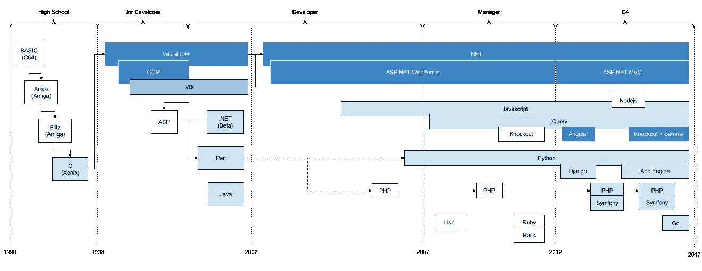

# 实用主义胜过纯洁

> 原文：<https://medium.com/hackernoon/pragmatism-over-purity-57bfe4e10139>

# 过去 20 年的编程框架教会了我什么。

经营 [D4](https://twitter.com/d4software) 最大的好处之一就是我们可以参与大量不同的项目。虽然有些项目允许我们选择我们的[技术](https://hackernoon.com/tagged/technology)平台，但其他项目要求我们去掌握其他东西。有时候是我们以前没用过的新东西。

自从我在卧室里编写 C64 基础版的早期(并梦想着编写下一个'[文明](https://en.wikipedia.org/wiki/Civilization_(video_game))'游戏)以来，我已经使用了大量不同的技术，具有不同程度的强度。我的技术职业史大致如下:

My career history: in languages & frameworks

以下是我一路走来学到的一些东西…

# **帮了大忙的事情……**

**自动内存管理**

我曾经在一个 C++程序员团队工作。我们嘲笑 VB 的人。我们认为他们是用“初学者”语言写代码的懦夫。我们理解指针，这让我们更有男子气概。

问题是，他们比我们做得更多，企业因此而喜欢他们。原因是:他们没有做完整的“是你来分配内存还是我来分配？”每当他们想调用 API 时就跳舞。

**一个包管理器**

一开始有 C，C 有一套你可以调用的库。那是你的命运。如果没有标准的库 API，你就必须自己写函数。

然后有一天人们开始发布库，“DLL 地狱”的概念就诞生了。

但是后来 Perl 有了 CPAN，Ruby 有了宝石，我们看到了曙光。让我用一个命令安装一个库并让它正常工作的语言，让事情变得更容易。

**鸭子打字**

我真的不在乎强打。我这里有个东西，它嘎嘎作响。你有一个需要嘎嘎叫的函数。这才是最重要的。

说真的:如果没有 duck typing，你最终会得到接口，然后你会针对接口编写代码，突然，我不能在 IDE 中右键单击“转到定义”了，因为我只是得到了接口，而不是实际的东西。这听起来可能微不足道，但对我来说，完成任务真的很重要。

**泛型/模板**

如果我不能有鸭子打字，至少让我有编译时变量。所以我可以写一次代码，它适用于多种类型。

**数据库迁移**

在框架伴随着迁移出现之前，我常常自己实现它们。因为软件开发不仅仅是我坐在办公桌前写代码，它还涉及管理多个环境、多个版本，有时是多个分支，以及在多个开发人员之间进行协调，每个开发人员都需要在他们的本地机器上有一个数据库。能够从源代码控制中提取代码，运行命令并获得一个工作数据库，这是一个巨大的胜利。

# 无关紧要的事情

**语法**

假设你有一个可学的和一致的方法来写一个函数，一个函数调用，一个 if，一个循环，一个表达式，和一个包导入，我就 ok 了。

**物体方位**

VB 让你比 Visual C++更有效率。为什么？两者都有拖放视觉设计器。两者都可以访问 Windows APIs。语法并没有太大的不同。VB 没有面向对象。但它确实有自动内存管理。这就是区别所在。

**过度魔法**

ASP。NET WebForms 试图向开发人员隐藏 web 的无状态特性。失败了。然后，当 Ajax 出现时，他们发明了这个叫做 UpdatePanel 的东西，试图对开发人员隐藏一堆 Ajax 回调。在一段时间内，事情似乎还可以，直到有一天，你做了一些简单的事情，比如在页面上添加一个按钮，突然一切都变得疯狂和混乱，你不知道为什么。

棱角分明也是一样。所有的依赖注入、模板加载和聪明的基于约定的行为。这一切都是如此纯粹和微不足道，直到一些奇怪的事情发生，你扯着你的头发试图找出原因。

Unix 的想法是正确的。做好一件事。融入其他一切。不要自作聪明。

**微服务/面向服务的架构**

所以你决定用一个服务来解决一个问题，你所做的，就是获取一个函数调用，并给它自己的服务器。我想这很好。我明白你想做什么。这都是关于关注点的分离，以及扩展等等。但是必须对该服务器进行部署、版本控制、监控和保护。

如果你是谷歌，你有大量的用户，这是有道理的。但真的，你又不是 Google，就当是函数调用吧。

**弱打字**

动态打字还可以。但不是弱打字。为什么我要明确地*而不是*让编译器/解释器告诉我，我把一个整数当作一个日期？*不*告诉我会带来什么好处？

# 偏爱实用主义胜过纯洁

框架经常固执己见。从某种意义上说，它们是用一种特定的心智模型构建的，这种心智模型是关于软件开发应该如何进行的。

就 Java 而言，史蒂夫·耶格说得比我更好。总而言之，Java 自然会引导你走向许多层，以及许多名称中带有“管理器”和“工厂”的类。Java 认为这种面向对象的方法可以让很多人有效地维护相同的代码。

[Python 观点明确发表](https://www.python.org/dev/peps/pep-0020/)，对此我非常尊重。

Rails 是由 Basecamp 团队开发的。一小群非常优秀的开发人员[，他们喜欢特定形式的简单性](http://37signals.com/manifesto)。

这些观点很重要。因为它们会影响技术在学习、开发、部署、维护和支持之间的权衡。套用一句名言:我们塑造我们的框架，然后，它们塑造我们。

开发人员经常陷入的一个特别的陷阱是将[概念的纯粹性误认为可用性](http://www.joelonsoftware.com/articles/fog0000000018.html)。Git 就是一个完美的例子。我每天都使用 Git，我喜欢它。但是我知道这是一项艰苦的工作。我知道从概念上来说这是非常聪明和纯粹的，但我不在乎，我不相信这有助于我学习它。

[https://xkcd.com/1597/](https://xkcd.com/1597/)

我只是记住了一组命令，这些命令对应于我需要完成的现实任务:

*   记住这个代码的特殊版本:git commit-am“Description”
*   将这段代码发送给其他所有人:git push
*   获取别人的代码:git pull

我想你可以把我对框架的很多看法总结为“偏爱实用主义胜过纯粹主义”。我没有时间研究那些试图减缓学习、开发或部署代码过程的技术，因为对最初的开发人员来说，这看起来不整洁。

我们在这里向用户提供功能，仅此而已。

*丹尼尔是伯明翰 D4 软件工作室的总经理，其客户遍布英国甚至更远的地方。*

*除了为从企业到初创公司的各种客户开发软件项目，我们还有自己的内部产品；*[*query tree*](http://querytreeapp.com/)*—面向产品经理的可视化报表工具，以及*[*SQLizer*](https://sqlizer.io/)*—面向开发者的数据库迁移工具。*

> [黑客中午](http://bit.ly/Hackernoon)是黑客如何开始他们的下午。我们是 [@AMI](http://bit.ly/atAMIatAMI) 家庭的一员。我们现在[接受投稿](http://bit.ly/hackernoonsubmission)，并乐意[讨论广告&赞助](mailto:partners@amipublications.com)机会。
> 
> 如果你喜欢这个故事，我们推荐你阅读我们的[最新科技故事](http://bit.ly/hackernoonlatestt)和[趋势科技故事](https://hackernoon.com/trending)。直到下一次，不要把世界的现实想当然！

