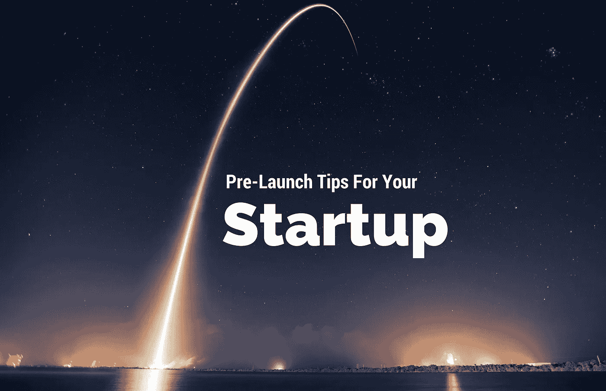

# 给你的创业公司的 55 条创业前建议

> 原文：<https://medium.com/hackernoon/pre-launch-tips-for-your-startup-aedf4bd4393c>

## 可操作项目的完整列表，开始营造发布前的声势。

你开始创业的那一天是具有纪念意义的一天。这肯定是你为之流过血、汗和泪的事情。

由[带来的 API 经济](https://www.apifirst.tech/welcome?ref=medium)。

人们往往忽视的是，在你推出一个产品或公司之前，你需要付出多少努力来建立口碑。一开始，你所拥有的只是一个想法、你的创造力和互联网。根据谁开始了这一旅程，结果可能会有所不同。

你可能有世界上所有的想法开始执行，或者你可能一无所知。如果你对此一无所知，看看下面这些[营销](https://goo.gl/ey72rU)创意。也许每个人都不适合你，但希望你能采纳其中的一些想法并付诸实践！

# 发布前 6 个月

**目标:致力于让你的测试客户兴奋的正确的产品想法。**

*   在[脸书](http://www.facebook.com)、[推特](http://www.twitter.com)、 [Instagram](http://www.instagram.com) 、 [LinkedIn](http://www.linkedin.com) 、 [Pinterest](http://www.pinterest.com) 、 [Google+](http://plus.google.com/) 、 [YouTube](http://www.youtube.com) 、 [Snapchat](http://www.snapchat.com) 、 [UNUM messenger](http://www.unummessenger.com) 上设置账户。
*   使用类似于 [Buffer](http://www.buffer.com) 或 [Hootsuite](http://www.hootsuite.com) 的工具来简化社交媒体管理。
*   了解你所在地区的影响者，并开始与他们建立联系。
*   发布与你的行业相关的内容，开始在你的空间建立声誉。无论你在哪里分享它，只要开始把它传播出去，并把自己树立为思想领袖。
*   注册一个 [Canva](http://www.canva.com) 来轻松开始创建令人惊叹的自定义图形。
*   开始使用像 [RendrFX](http://www.rendrfx.com) 这样的工具来制作视频内容，让人们了解你的产品。视频是一个非常强大的工具。
*   在像 [Reddit](http://www.reddit.com) 和 [hackernews](http://news.ycombinator.com) 这样的网站上参与讨论，赚取因果积分。这将有助于建立你的声誉，为你以后无耻地推销自己。
*   在论坛上活跃起来，比如 Quora 上与你的产品相关的话题。回答问题，做一个乐善好施的人。如果相关的话，在你的答案底部有一个小塞是可以的。Quora 也是一个很好的地方，可以看到人们在你的行业里回答了什么流行的问题。
*   建立您的博客，发布与您的产品相关的有趣内容。发布你想要解决的问题。包括展示公司人性一面的媒体，如团队、办公室的照片，有趣事件的视频等。像 [Slack](http://www.slackhq.com) 和 [UNUM messenger](http://blog.unummessenger.com) 这样受欢迎的公司已经开始在[媒体](http://www.medium.com)上托管他们的博客，以使事情变得简单。设置起来轻而易举，看起来棒极了！
*   开始尝试在你的空间里的小众博客上发表客座博文。也试着开始为更大的出版物写稿，比如[快速公司](http://www.fastcompany.com)、[公司](http://www.inc.com)、[企业家](http://www.entrepreneur.com)、[赫芬顿邮报](http://www.huffingtonpost.com)、 [Mashables](http://www.mashable.com) 以及其他类似的出版物。
*   获得一个好的品牌名称，并注册您的网站。你可以使用 [nameninja](http://www.nameninja.com/) 对品牌名称进行头脑风暴。然后在像 GoDaddy 这样的网站上获取域名。
*   创建一个启动页面。你可以使用类似于 [launchrock](http://www.launchrock.com/) 的网站，通过注册表格开始收集电子邮件和其他联系信息。[这里](http://www.unummessenger.launchrock.com/)是我的页面外观。
*   用[视觉](https://www.invisionapp.com/)建立你产品的概念原型。在这里看我如何建造我的原型。
*   注册 [Mail Chimp](http://www.mailchimp.com) 开始向预先注册您的产品的人发送电子邮件，并保持他们的更新。看到我发的介绍邮件[这里](http://eepurl.com/cIcx5j)。
*   从您在前面步骤中创建的小型网络中，让一些目标用户注册您产品的 alpha/beta 版。
*   选择你想要启动的确切日期，这样你就可以开始倒计时了。确保这是经过深思熟虑的，并给自己足够的时间。你最不希望的就是在你大肆宣传之后不得不推迟发布日期。

# 发布前 3 个月

**目标:打造一款人们会喜欢的超炫产品。**

*   加快步伐，建立一个信息更加丰富的登录页面，有一个清晰的行动号召(注册/联系/购买产品的电话号码，等等。)你可以很容易地使用一个主题来使它看起来很棒。在本文[这里](https://hackernoon.com/building-a-website-with-limited-experience-d595bd4e3128#.uibaev2ft)看到我为建立我的网站所做的一切。
*   制作您的徽标，为您的产品打造品牌。你可以使用像 [Fiverr](http://www.fiverr.com) 这样的网站来得到一些基本的东西，或者在像 [Dribbble](http://www.dribbble.com) 这样的网站上找到令人惊奇的人来做你所有的品牌推广。我发现有人在我们的品牌上做了惊人的工作，他叫[拉明·纳西博夫](https://dribbble.com/nasibov)。
*   不断制作优秀的内容，并广泛传播，让人们了解你的产品。将你的内容提交到像 [StumbleUpon](http://www.stumbleupon.com) 、 [Digg](http://www.digg.com) 、 [Zest](http://www.zest.is) 这样的网站，以及其他提交网站(尤其是与你的产品、内容和行业相关的小众提交网站。)
*   重新规划你的内容。不要让你做的东西失败。通过改变内容的交付方式来改变和重用内容。你可以为像 [YouTube](http://www.youtube.com) 、 [Slideshare](http://www.slideshare.net) 和其他网站重新利用你的内容。
*   培养与你所在领域的博客和媒体的关系。这里有一些培养博客关系的技巧。如果你能让罗伯特·斯考伯或瑞安·胡佛这样的博主感兴趣，这个想法会像野火一样传播开来。
*   开始参加创业相关的活动——继续建立你的关系网，继续交换名片。让你的品牌为人所知。[这里的](https://www.startupdigest.com/digests)是一些启动相关事件的丢失。
*   在天使名单和 T21 上列出你的创业公司。

# 发布前 1 个月

**目标:开始整理东西，为发布打下基础。**

*   优化您的网站速度，因为新客户可能没有足够的耐心，如果网站加载时间太长。这里有 21 个提高网站速度的小技巧。
*   为你的网站做基本的搜索引擎优化，通过搜索引擎带来客户。如果你有一个应用程序，开始考虑你的 ASO 策略。这里的是一些基本的 SEO 策略，这里的[是一些基本的 ASO 策略。](https://blog.kissmetrics.com/app-store-optimization/)
*   在你的网站中设置 [Google Analytics](http://analytics.google.com) 并每天监控你的网站。跟踪访问量、跳出率、流量来源、网站停留时间等。
*   在你的网站上设置像素，开始使用[谷歌标签管理器](http://www.google.com/analytics/tag-manager/)收集你的流量信息。这将有助于你重新定位你的流量。一定要设置好[脸书像素](https://www.facebook.com/business/help/952192354843755)。
*   加入在线团体，如[脸书团体](https://groups.fb.com/)、 [LinkedIn 团体](http://www.linkedin.com/directory/groups/)、 [Google+社区](http://plus.google.com/communities)和 [Slack 社区](http://blog.standuply.com/2016/08/23/the-ultimate-list-of-300-slack-communities/)。来 [Buffer](https://medium.com/u/245d5483fb27?source=post_page-----aedf4bd4393c--------------------------------) Slack 社区跟我打招呼吧，我是这里的版主，加入[这里](http://www.buffer.com/slack)！
*   学会使用社交监控工具，如 [howsociable](http://howsociable.com/) 来追踪你在社交媒体上的品牌。
*   开始使用像 FollowLiker 这样更强大的工具来增加你的社交受众。使用自动化流程和机器人可以帮助你用最少的持续努力粉碎社交媒体。
*   制作一个类似于 Dollar Shave Club 的[这个](https://youtu.be/ZUG9qYTJMsI)的预发布视频。

# 发布前 1 周

目标:扣上扣子的时间到了。确保发布日的一切都完美无缺。

*   反复测试你的产品。真的，能这样就这样吧。人们通常不会给第二次机会。在内部测试之后，你可以使用像 [99tests](http://www.99tests.com) 这样的服务来找出关键的错误和可伸缩性问题。
*   为你的发布准备一篇博文。谈论一些事情，比如你为什么要制造这个产品，它解决了什么问题，制造它是什么样的，等等。人们喜欢看到产品的个性化一面。参见[如何撰写产品发布博文](http://casmccullough.com/how-to-write-a-product-launch-blog-post/)。
*   写好新闻稿。新闻稿是媒体可以直接用来报道你的产品的内容。它是用第三人称写的，谈论你的产品、团队，以及你的产品的优势。通过阅读[撰写新闻稿的技巧](https://blog.hubspot.com/marketing/press-release-template-ht)，学习如何撰写新闻稿。
*   围绕产品发布创建病毒式内容——激发情感的故事、视频和图片，人们可以在社交媒体上轻松分享。点击阅读更多关于如何创建病毒式内容[。](https://socialtriggers.com/craft-contagious-content/)
*   创建有趣的[信息图表](http://www.piktochart.com)和[幻灯片](http://www.slideshare.net)，介绍与您的产品相关的内容(统计数据、优势、用户统计数据、与现有产品的比较),发布到您的博客中。
*   用一种有趣的方式给你的追随者一个预览产品的帖子来戏弄他们。在不过分的情况下，送一件比基尼——暴露(足以让它保持有趣而不暴露一切。)阅读[这篇文章](http://www.elleandcompanydesign.com/blog/2015/4/27/11-ways-to-create-hype-around-a-new-launch)看看如何围绕你的产品制造炒作。
*   创建有趣的竞赛(智力竞赛、社交游戏等)。)给你的社交粉丝——附赠一些赠品。一些 [Buffer](https://medium.com/u/245d5483fb27?source=post_page-----aedf4bd4393c--------------------------------) 最受欢迎的推文已经成为[免费推文](https://blog.bufferapp.com/successful-tweets)。
*   亲自给博主写信(给大博客提供独家新闻)，给他们一个令人信服的故事。博客作者喜欢写有趣的内容，所以让你的故事连贯而有力。要求他们在你上市前不要泄露这个故事。点击这里查看如何让博客写手写关于你的文章[。](http://readwrite.com/2012/07/19/how-to-get-bloggers-to-write-about-your-startup-insider-advice/)
*   收集你和你的团队认识的所有电子邮件联系人的列表。将这些保存在你的 CRM 中，或者至少保存在一个 CSV 文件中。
*   准备一个你的产品的视频演示，并记录对团队和你的初始客户的采访——把它们发布在你的 [YouTube 频道](http://www.youtube.com)上。保持简短有趣。 [RendrFX](http://www.rendrfx.com) 是这些视频的绝佳工具。
*   考虑在你的网站上添加类似于[对讲机](http://www.intercom.com/)的东西，以便能够与早期客户实时聊天，让对话顺畅进行。
*   创建一个关于你的产品的精彩演示，包括问题、你的解决方案、好处等。把它们贴在你的博客上，发给任何对你的产品感兴趣的博主。考虑使用 [Prezi](http://prezi.com) 为你的演示添加一些特色。

# 发布日

目标:让尽可能多的人看到你的产品。此外，确保继续倾听，回应反馈，并跟踪结果。

*   将您的产品提交给[产品搜索](http://www.producthunt.com)。如果人们喜欢你的想法，你会从这个渠道看到一些主要的牵引力。[产品搜寻](https://medium.com/u/b8b4445269d0?source=post_page-----aedf4bd4393c--------------------------------)是产品发布的必需品。
*   在你的博客上发布你从测试版用户那里收到的操作方法、演示、视频和任何评价。让你的博客成为与你的产品相关的所有东西的中心仓库。这就是你如何开始通过内容确立自己的行业领袖地位。
*   安排每小时发布 24 条推文——每条推文涵盖你产品的一个方面——在你的网站上有一个合适的 URL。以下是你创业第一个月在 Twitter 上的 31 个想法。
*   在[黑客新闻](http://news.ycombinator.com)和 [Reddit](http://www.reddit.com) 中提交链接。
*   让你的团队关注社交媒体，让每个人都随时准备接收反馈。监控你的站点指标——流量、负载等。
*   尽快回复邮件询问。如果你所有的努力都有回报，你应该被淹没了！
*   或者你可以不发射。参见 Eric Reis 关于 [**为什么不该推出**](http://www.startuplessonslearned.com/2009/03/dont-launch.html) **的帖子。**

# 发布后

*   感谢所有报道过你的活动的博主。如果可以的话，给他们发一封电子邮件，打一个电话。
*   活跃在社交媒体上，与提及你的产品的客户接触，并收集他们的反馈。接受他们的负面反馈，但不要心存戒备。
*   如果有意义，修复 bug 并处理特性请求。开始对待办事项中的特性请求进行优先级排序。
*   编写教程来帮助您的客户更好地使用您的功能。随着产品的发展，不断更新您的培训材料。
*   随着你的产品继续增长，确保你在用你的产品教育人们。考虑采用类似于 [Northpass](https://www.northpass.com/) 的[学习管理系统](https://www.northpass.com/learning-management-systems)来教育你的[客户和用户](https://www.northpass.com/customer-training)。

# 摘要

围绕你的产品制造轰动效应需要做很多工作。更不用说，你实际制作产品本身所花费的时间。这一切看起来似乎势不可挡，但你只需要制定一个计划，然后开始一点一点地进行。

现实一点，列出你想做的事情。为你想完成的事情和时间做一个粗略的路线图。你可能无法完成所有的事情，但是你需要计划来保持效率。

希望这个列表有所帮助！如果你有任何建议要添加，请在下面的评论中告诉我，我一定会继续为这篇文章添加工具和技巧。

> 如果你喜欢这篇文章，如果你能分享它，推荐它，或者在评论中告诉我，我会非常感激！
> 
> 此外，如果你有兴趣了解更多关于我们正在做的事情，请在此[注册了解详情](https://www.remotest.io)！

> [黑客中午](http://bit.ly/Hackernoon)是黑客如何开始他们的下午。我们是 AMI 家庭的一员。我们现在[接受投稿](http://bit.ly/hackernoonsubmission)并乐意[讨论广告&赞助](mailto:partners@amipublications.com)机会。
> 
> 如果你喜欢这个故事，我们推荐你阅读我们的[最新科技故事](http://bit.ly/hackernoonlatestt)和[趋势科技故事](https://hackernoon.com/trending)。直到下一次，不要把世界的现实想当然！

