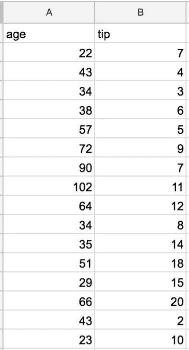
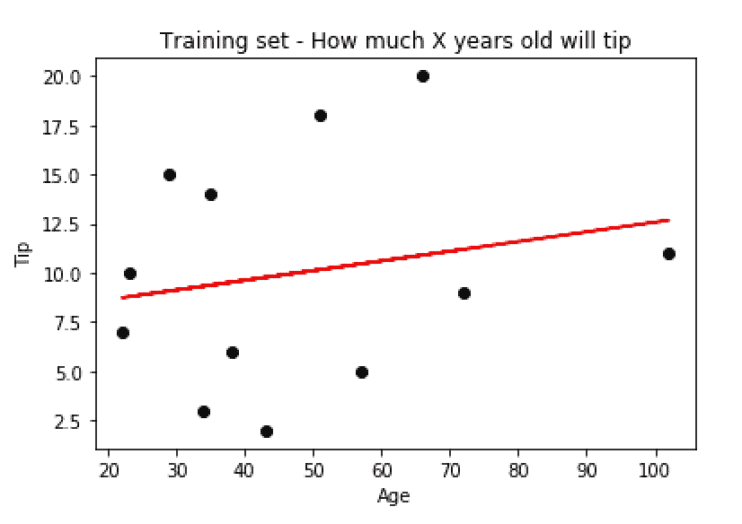
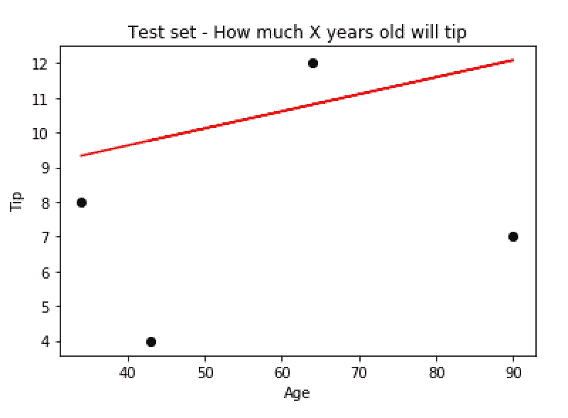
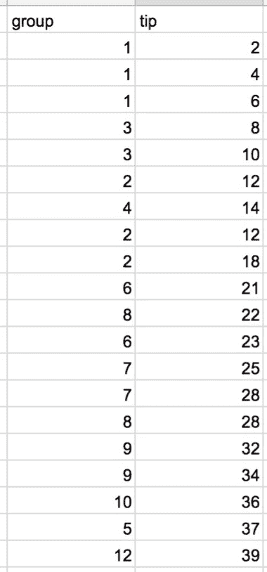
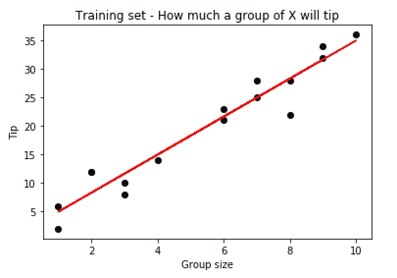
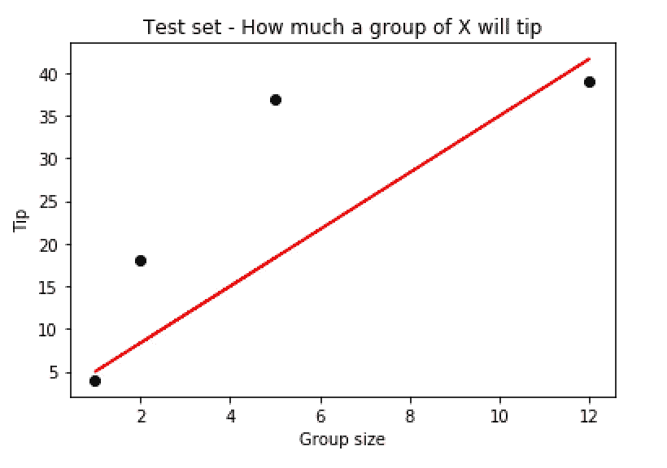

# 使用机器学习预测小费

> 原文：<https://medium.com/hackernoon/predict-a-tip-using-machine-learning-aee94f467ef2>

本指南是使用 Python 和 R 进行机器学习的系列教程的第二部分，你可以在这里找到第 1 部分。

**什么是线性回归？**(来自维基百科)
在[统计](https://en.wikipedia.org/wiki/Statistics)，**线性回归**是一种[线性](https://en.wikipedia.org/wiki/Linear)方法，用于建模标量[因变量](https://en.wikipedia.org/wiki/Dependent_variable) *y* 与一个或多个[解释变量](https://en.wikipedia.org/wiki/Explanatory_variable)(或自变量)X 之间的关系。一个解释变量的情况称为 [*简单线性回归*](https://en.wikipedia.org/wiki/Simple_linear_regression) 。对于多个解释变量，该过程称为*多元线性回归*。(该术语与 [*多元线性回归*](https://en.wikipedia.org/wiki/Multivariate_linear_regression) 不同，多元线性回归预测多个相关的因变量，而不是单个标量变量。)

基本上，这是中学时的函数，`Y = mx + b` ，其中`Y`是 y 轴上的值，等于斜率乘以`x`的值加上常数`b`。

让我们首先创建一个模型，根据他或她的客户的年龄来预测服务员将获得的小费(我将在下面解决这个特定模型的问题)。为了使我们的数据集适合线性回归算法，`X`将是年龄，`Y`将是小费金额。稍后我将演示如何通过使用组大小而不是年龄来改进我们的模型。在该示例中，`X`将是组大小，而`Y`将是小费数量

> 这只是一个演示如何使用线性回归构建简单模型的示例。
> 
> 年龄和小费没有很强的相关性，有许多变量需要考虑，如用餐者总数、地点、餐馆类型、饭菜类型等..

**数据集:**

This random dataset, it isn’t designed to make sense.

> Python 示例

> r 示例

这是图表

This graph is our train dataset

Test dataset graph

从图表中我们可以了解到什么？
正如你可能猜到的那样，小费的多少和顾客的年龄之间存在微弱的相关性。作为数据驱动的人，我们应该总是检查所有的可能性，尽量不要有偏见。现在让我们试着检查不同的数据集`tip`和`number of diners`。

**使用新的数据集:*用餐人数*和*小费***

Group size vs Tip

现在让我们使用线性回归模型来处理这些数字

我们将使用相同的代码(参见上面的示例)，但是我将向您展示新的训练数据集和测试数据集图。

How much a group of X will tip (Train set) — stronger correlation

How much a group of X will tip (Test set) — we can see that our test set fit to our train set

因此，我们看到，团队规模与小费金额之间的相关性比小费金额与客户年龄之间的相关性强得多。

我们可以在我们的模型上运行一个查询，使用这个命令来预测一组 5 名用餐者的小费金额:`my_test_tip = regressor.predict(np.array(5))`

**总结** 这是一个基本模型，仅用于演示线性回归的基础知识以及如何创建模型。在现实生活中，我们使用更多的变量，使得我们的模型更加复杂。

我花了一些时间在这些教程上，所以我希望你们会觉得有用。如果你想要更多，请鼓掌表示你的支持！或者送点比特币爱心给我买瓶啤酒*1 pg 4 bbrevsewroo 6 zs 6 kyvi 1 emfpaglac*

干杯！
欲了解更多多伦西格尔，请登录我的网站 http://segaldoron.com