# 用每日头条新闻预测股市

> 原文：<https://medium.com/hackernoon/predict-stock-market-with-daily-top-news-8c8db25bef8d>

## R 语言中自然语言处理的分类方法

> **观众**

这篇简短的博客文章是为那些对自然语言处理算法 *word2vec，*有基本了解，并且熟悉机器[学习](https://hackernoon.com/tagged/learning)基础知识，特别是分类技术，并且热衷于学习两者在 r 中的实际集成的人写的。我们将详细讨论数据准备以及模型优化。还建议回顾一下[这篇](/@jameschen_78678/social-behavior-analytics-201-523199badba0#.k8nhyigon)关于 *word2vec 的简要介绍。*

> **目标**

目标是了解道琼斯工业平均指数将如何受到 Reddit 上每日热门新闻的影响。

> **数据集**


数据集可以在[这里](https://www.kaggle.com/aaron7sun/stocknews)找到。简化的数据集由道琼斯每日数据和 Reddit 世界新闻频道过去 8 年的每日头条新闻组成。目标变量被标记为(0 表示向下，1 表示向上)。

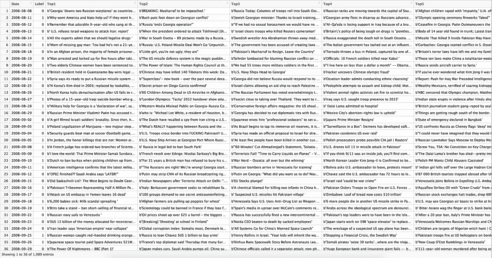

Screenshot of the stock news data set

> **接近**

我们将使用 *word2vec* 算法首先在所有标题上创建 100 维的词向量。然后，我们将通过平均组成每个句子的单词向量，将标题转换成句子向量。最后，我们将使用各种分类算法来预测道琼斯工业平均指数是上涨还是下跌。

> **数据准备**

1…删除不需要的字符，包括标点符号和大写字母

2…删除英语停用词，如“我”、“我的”、“我自己”

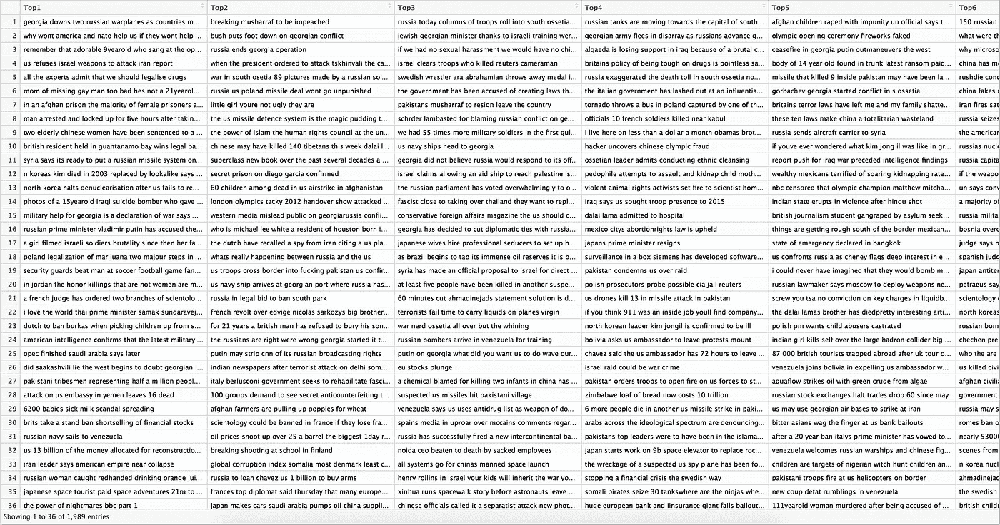

Screenshot of the data set with unwanted features removed

3…将清洗后的标题输入到 *word2vec* 模型中，获得单词向量

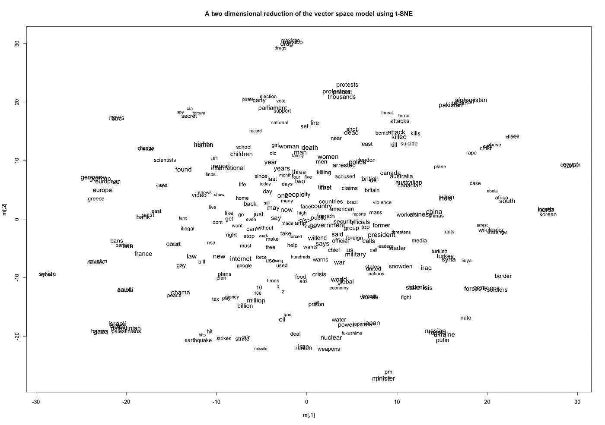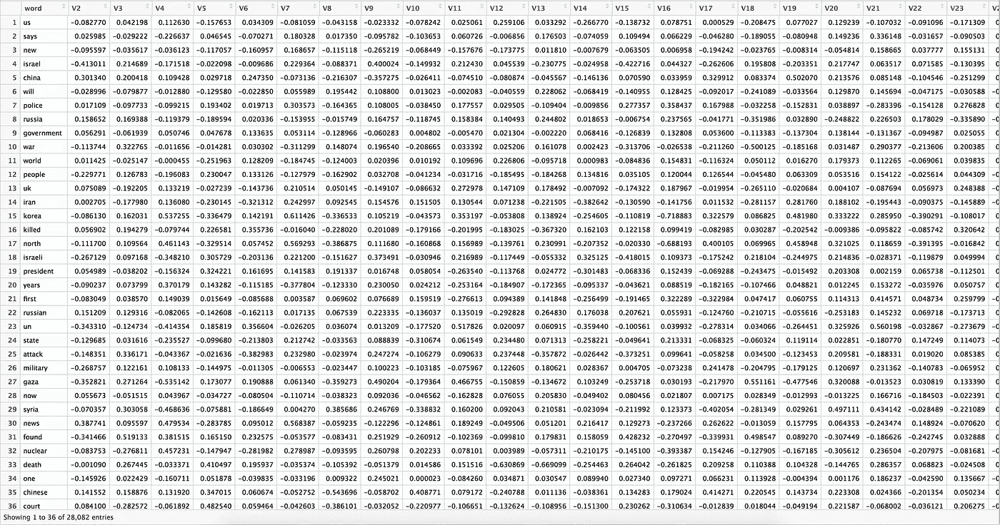

Screenshot of the word vectors generated from cleaned headlines

4…对所有标题应用平均词向量

5…使用 t-SNE 返回标题上的二维向量表示

6…用目标变量和二维向量创建数据集

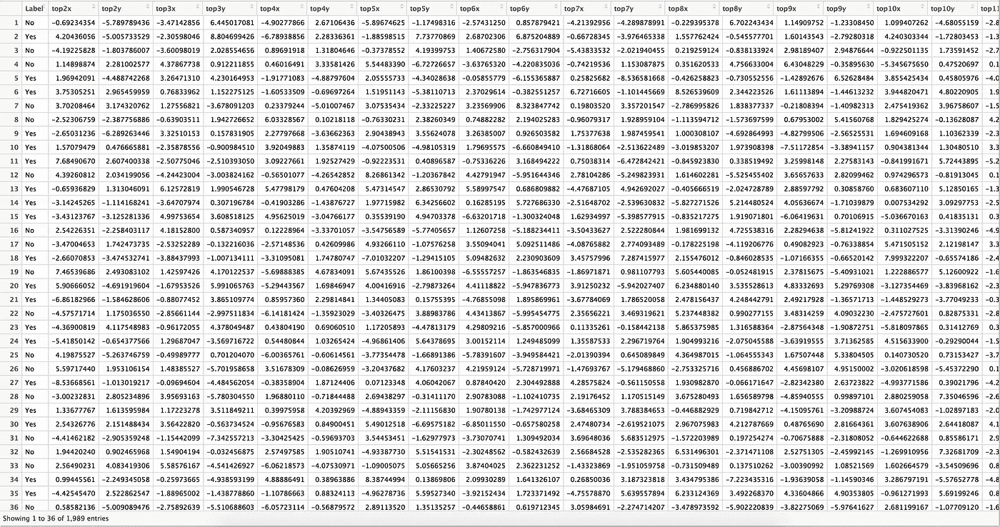

Screenshot of the finished data set

> **模型评估**

在这里，我们将使用 R 中的 *caret* 包来评估各种算法的预测精度，包括 CART (rpart)、逻辑回归(glm)、线性判别分析(LDA)、k-最近邻(kNN)、支持向量机与径向基函数(svmRadial)和极端梯度推进(xgbLinear)。

观察到上述所有算法都具有不令人满意的性能，具有接近 50%的准确度和差的 Kappa 值。然而，具有径向基函数核的 SVM 往往比其他算法执行得更好，精确度的 95%置信区间在 51%和 55%之间。

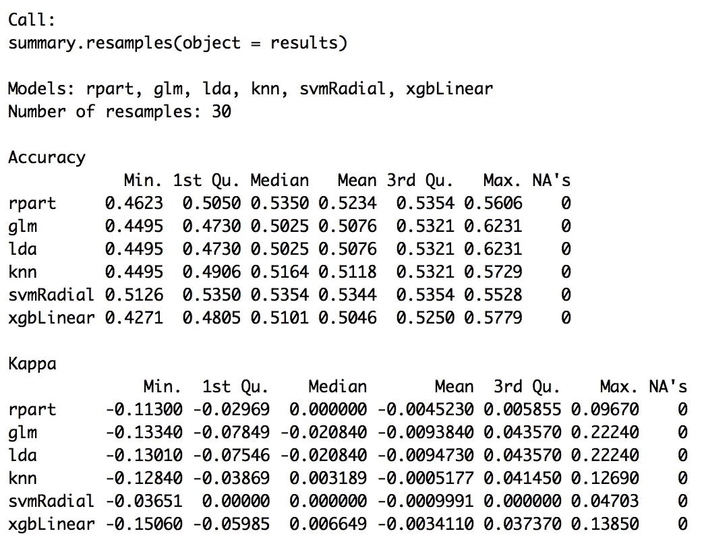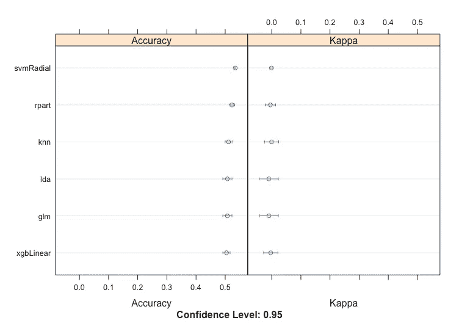

Performance on various classification algorithms

因此，我们将探索一些优化选项。

> **性能优化**

***1…堆叠多个型号***

我们将首先尝试堆叠所有模型，看看性能是否会提高。

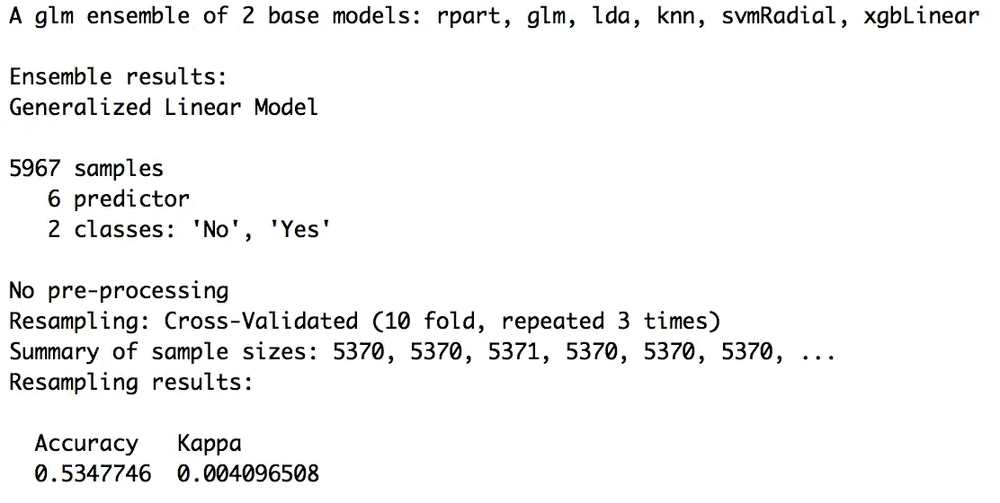

不幸的是，没有观察到多少改善。

***2…平均所有标题***

我们将把所有的标题组合起来，创建一个二维向量集，而不是把标题当作单独的变量。

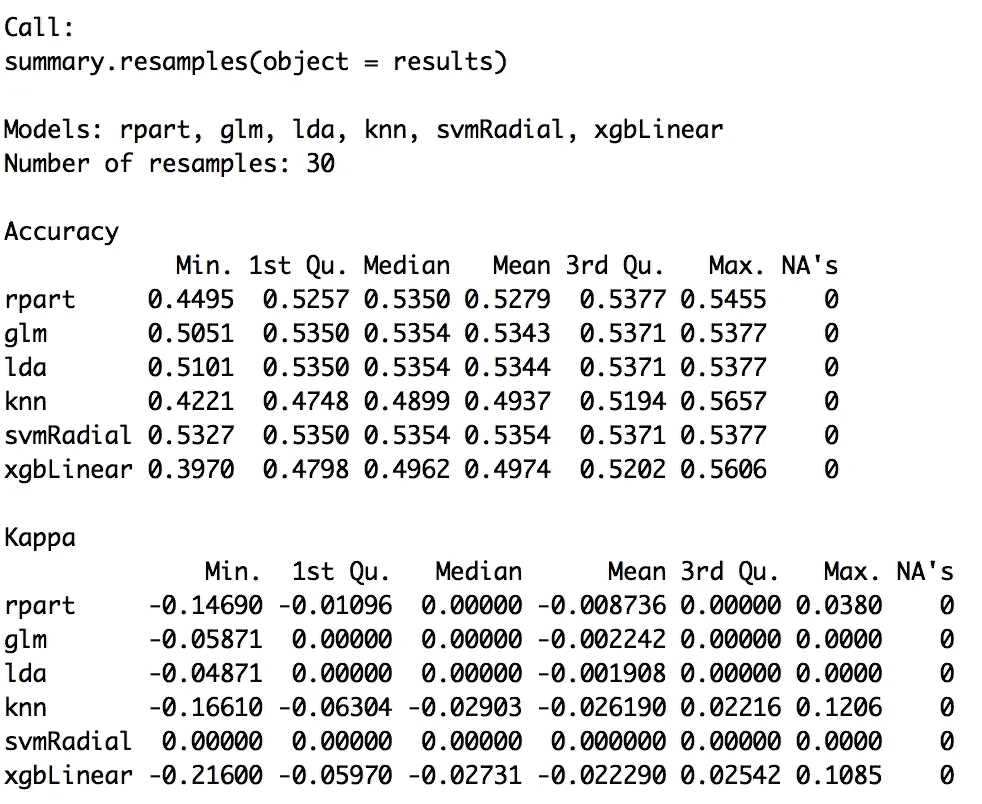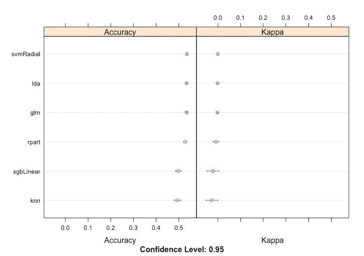

Performance on the algorithms with averaged headlines

在 SVM 算法中观察到平均准确度有 0.1%的轻微增加。

***3…移动目标变量***

我们将尝试将目标变量后移 1-7 天，因为每日新闻可能会对[股票表现](https://goo.gl/1nZ8JP)产生滞后效应。或者，我们也可以将目标变量前移几天，但是，这种方法将与使用每日头条新闻预测*股票营销业绩的目标相矛盾。*

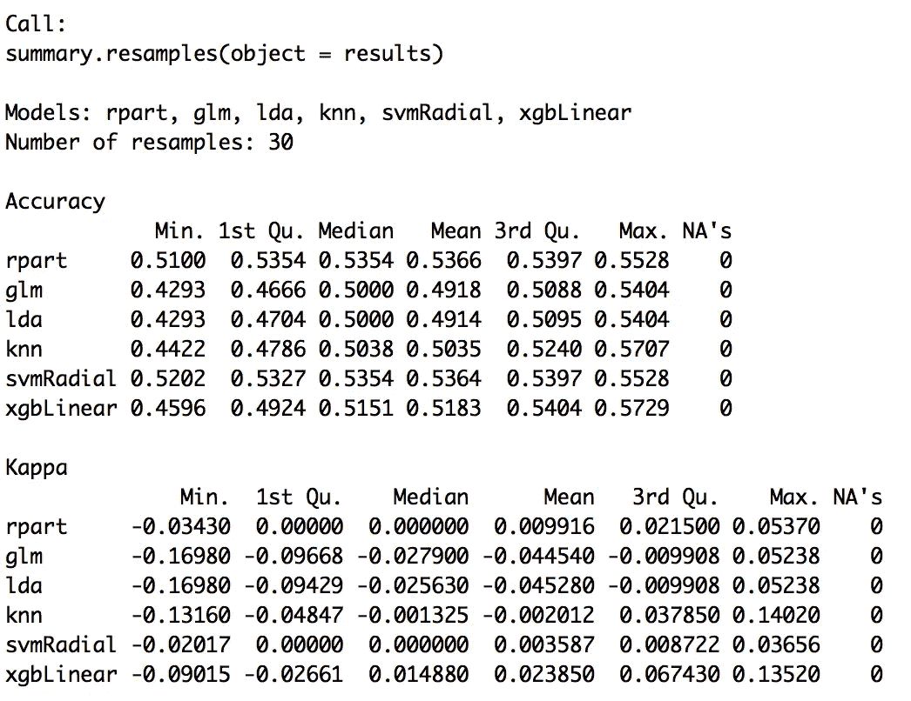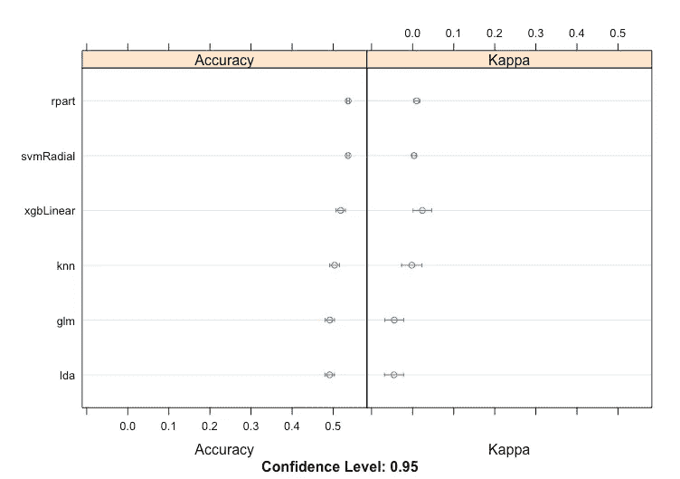

Performance on the algorithms with 3 day lag on target variable

我们可以观察到 CART (rpart)现在在平均准确率方面具有最好的性能，为 53.66%。在 SVM 算法中还观察到平均精度的 0.1%的另一个轻微增加。

***4…调谐模型参数***

在这里，我们将演示如何调整购物车和 SVM 算法的参数，看看我们是否可以提高预测的准确性。

**推车**

在 rpart 中，调谐参数是 *cp* ，或者是*复杂度参数*。我们将检查 *cp* 的不同值的准确性。最佳 cp 值为 0.15，如下所示。

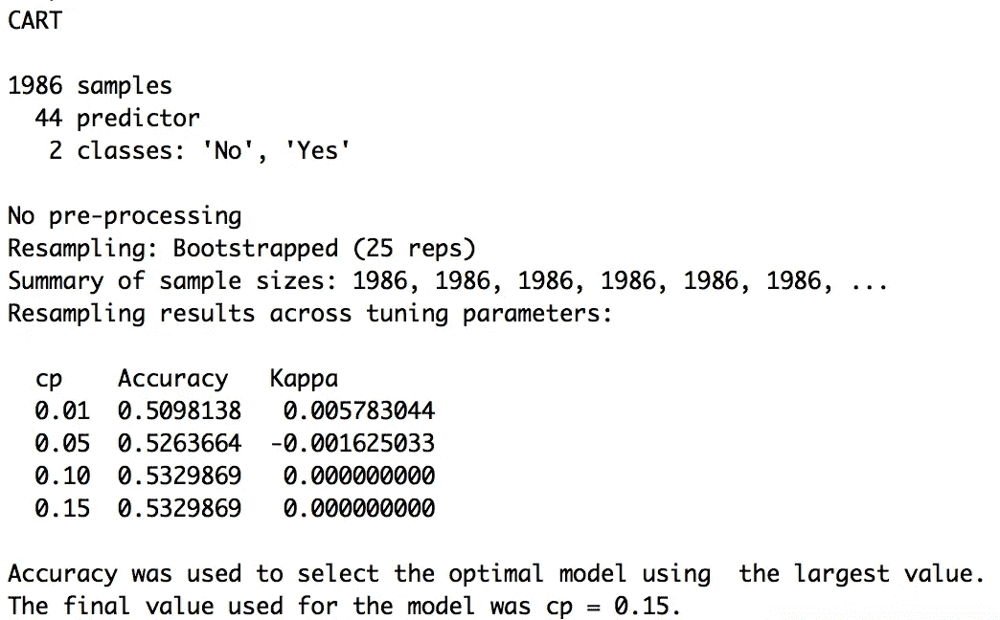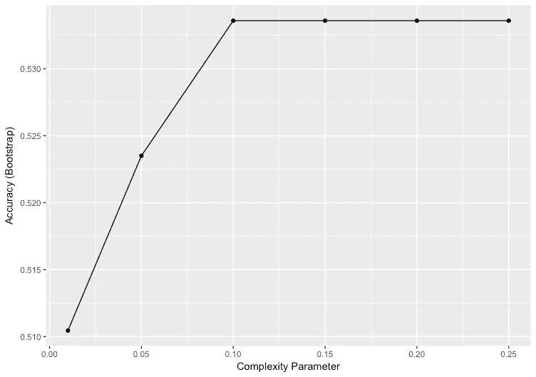

**SVM**

在径向基函数的 SVM 中，调优参数为 *sigma* 和 *C* ( *cost* )。我们将检查*σ*和 *C* 的不同值的准确性。最佳值如下所示，其中*σ= 0.05*和 *C = 3* 。

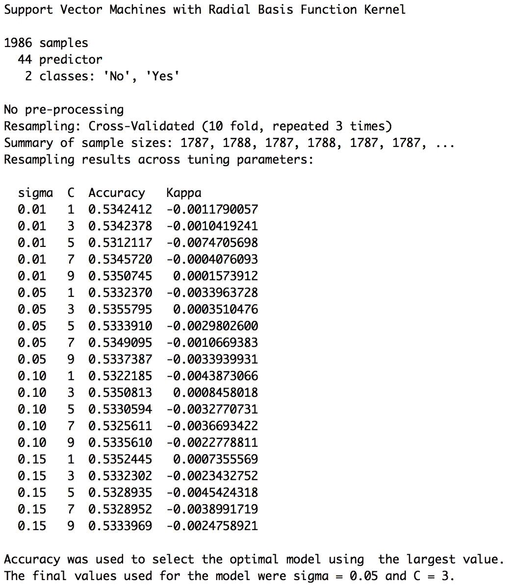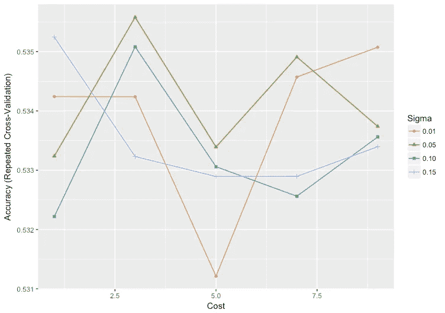

> **R 代码**

```
library(devtools)
library(tm)
library(ggplot2)
library(text2vec)
library(rword2vec)
library(wordVectors)
library(tidyverse)
library(Rtsne)
library(caret)
library(mlbench)
library(caretEnsemble)setwd("~/Desktop/stock")
#Simple Visualization on DJIA data
stock <- read.csv("DJIA_table.csv")
stock$Date <- as.Date(stock$Date)ggplot(data=stock,aes(x=Date,y=Open))+geom_line()+labs(title="Dow Jones Industrial Average")#Read the simplified data set
data <- read.csv("stock.csv")#Remove unwanted columns for natural language processing
text <- datatext$Date <- NULL
text$Label <- NULL#Remove unwanted characters/punctuations/upper-cases
for (i in 1:25){
  text[,i] <- gsub('b"',"",text[,i])
  text[,i] <- gsub("b'","",text[,i])
  text[,i] <- gsub("[[:punct:]]", "", text[,i])
  text[,i] <- tolower(text[,i])
}write.table(text,"text.txt")#Rename column names
new_text <- subset(text,select=paste("Top",1,sep=""))
new_text <- setNames(new_text,"x")for (i in 2:25){
new_text2 <- subset(text,select=paste("Top",i,sep=""))
new_text2 <- setNames(new_text2,"x")
new_text <- rbind(new_text,new_text2)
}write.table(new_text,"text.txt")final_text <- new_text#Remove stopwords
stopWords <- stopwords("en")
'%nin%' <- Negate('%in%')train <- lapply(final_text$x, function(x) {
  t <- unlist(strsplit(x, " "))
  t[t %nin% stopWords]
})train.df = as.data.frame(do.call(rbind, train))
train.df$x <- do.call(paste, c(train.df[,1:45], sep=" "))finaltext <- subset(train.df,select="x")write.table(finaltext,"text_data.txt")#Input words to word2vec
model = train_word2vec("text_data.txt", output="vec.bin", 
                       threads = 4, vectors = 100, window = 12, min_count = 5, iter=10, force=TRUE)#Plot the word vectors
plot(model)
#Convert binary to text format
bin_to_txt("vec.bin","model1text.txt")#Remove first rows manually in the .txt file#Convert .txt to .cvs
m1 <- read.table("model1text.txt",
                     header = F,quote = "", row.names = NULL, stringsAsFactors = FALSE)colnames(m1)[1] <- "word"#Apply word vectors to headlines and return 2-dimension representations with t-SNE
label <- subset(data,select="Label")
labeltext <- cbind(label,text)
labeltext$id <- 1:nrow(labeltext)
labeltext$id <- as.factor(labeltext$id)for (i in 2:24){
  s <- strsplit(labeltext[,i], split= " ")
  new <- data.frame(V1 = rep(labeltext$id, sapply(s, length)), V2 = unlist(s))
  colnames(new) <- c("id","word")
  new <- merge(new,m1,by="word")
  new2 <- aggregate(V2 ~ id, new, mean)
  for (j in 4:102){
    new3 <- aggregate(new[,j] ~ id, new, mean)
    new2 <- merge (new2,new3,by="id")
  }
  colnames(new2)[2:101] <- paste("V", 1:100, sep="")
  tsne <- Rtsne(new2, dims = 2, perplexity=100, verbose=TRUE, max_iter = 500)
  t = as.data.frame(tsne$Y)
  colnames(t) <- c(paste("top",i,"x",sep=""),paste("top",i,"y",sep=""))
  labeltext <- cbind(labeltext,t)
}write.csv(labeltext,"labeltext.csv")#Add back Label information
mydata <- labeltext
mydata[,2:27] <- NULLmydata$Label[mydata$Label==1]<- "Yes"
mydata$Label[mydata$Label==0]<- "No"#Classfication Models
control <- trainControl(method="repeatedcv", number=10, repeats=3, savePredictions=TRUE, classProbs=TRUE)
algorithmList <- c('rpart','glm','lda','knn','svmRadial','xgbLinear')
set.seed(1)
models <- caretList(Label~., data=mydata, trControl=control, methodList=algorithmList)
results <- resamples(models)
summary(results)
dotplot(results)#-----Performance Optimization #1: Stacking Multiple Models-----
#Model Correlations
modelCor(results)
splom(results)
#Model Stacking with GLM
stackControl <- trainControl(method="repeatedcv", number=10, repeats=3, savePredictions=TRUE, classProbs=TRUE)
set.seed(2)
stack.glm <- caretStack(models, method="glm", metric="Accuracy", trControl=stackControl)
print(stack.glm)#-----Performance Optimization #2: Averaging All Headlines-----
mydata2 <- mydata
mydata2$headline <- rowMeans(mydata2[,2:45], na.rm = TRUE)
mydata2[,2:45] <- NULLcontrol <- trainControl(method="repeatedcv", number=10, repeats=3, savePredictions=TRUE, classProbs=TRUE)
algorithmList <- c('rpart','glm','lda','knn','svmRadial','xgbLinear')
set.seed(1)
models <- caretList(Label~., data=mydata2, trControl=control, methodList=algorithmList)
results <- resamples(models)
summary(results)
dotplot(results)#-----Performance Optimization #3: Shifting Target Variable-----
shift <-subset(mydata,select="Label")
shift1 <- as.data.frame(shift[-1,])
shift2 <- as.data.frame(shift[-c(1,2),])
shift3 <- as.data.frame(shift[-c(1,2,3),])
shift4 <- as.data.frame(shift[-c(1,2,3,4),])
shift5 <- as.data.frame(shift[-c(1,2,3,4,5),])
shift6 <- as.data.frame(shift[-c(1,2,3,4,5,6),])
shift7 <- as.data.frame(shift[-c(1,2,3,4,5,6,7),])mydata1 <- mydata[-1989,]
mydata2 <- mydata[-c(1988,1989),]
mydata3 <- mydata[-c(1987,1988,1989),]
mydata4 <- mydata[-c(1986,1987,1988,1989),]
mydata5 <- mydata[-c(1985,1986,1987,1988,1989),]
mydata6 <- mydata[-c(1984,1985,1986,1987,1988,1989),]
mydata7 <- mydata[-c(1983,1984,1985,1986,1987,1988,1989),]mydata1$Label <- NULL
mydata2$Label <- NULL
mydata3$Label <- NULL
mydata4$Label <- NULL
mydata5$Label <- NULL
mydata6$Label <- NULL
mydata7$Label <- NULLmydata1 <- cbind(shift1,mydata1)
colnames(mydata1)[1] <- "label1day"
mydata2 <- cbind(shift2,mydata2)
colnames(mydata2)[1] <- "label2day"
mydata3 <- cbind(shift3,mydata3)
colnames(mydata3)[1] <- "label3day"
mydata4 <- cbind(shift4,mydata4)
colnames(mydata4)[1] <- "label4day"
mydata5 <- cbind(shift5,mydata5)
colnames(mydata5)[1] <- "label5day"
mydata6 <- cbind(shift6,mydata6)
colnames(mydata6)[1] <- "label6day"
mydata7 <- cbind(shift7,mydata7)
colnames(mydata7)[1] <- "label7day"control <- trainControl(method="repeatedcv", number=10, repeats=3, savePredictions=TRUE, classProbs=TRUE)
algorithmList <- c('rpart','glm','lda','knn','svmRadial','xgbLinear')
set.seed(1)
models <- caretList(label3day~., data=mydata3, trControl=control, methodList=algorithmList)
results <- resamples(models)
summary(results)
dotplot(results)#-----Performance Optimization #4: Tuning Model Parameters-----
set.seed(3)
control <- trainControl(method="repeatedcv", number=10, repeats=3, savePredictions=TRUE, classProbs=TRUE)#Tuning cp in CART
rpartGrid <-  expand.grid(cp = c(0.01,0.05,0.1,0.15))rpartFit <- train(label3day ~ .,
                  data = mydata3,
                  method = "rpart",
                  tuneLength = 10,
                  tuneGrid=rpartGrid)rpartFit
ggplot(rpartFit)#Tuning sigma and C in SVM
svmGrid <-  expand.grid(sigma = c(0.01,0.05,0.1,0.15),
                        C = c(1,3,5,7,9))svmFit <- train(label3day ~ ., data = mydata3, 
                 method = "svmRadial", 
                 trControl = control, 
                 verbose = FALSE,
                 tuneGrid = svmGrid)svmFit
ggplot(svmFit)
```

问题、评论或顾虑？
jchen6912@gmail.com

[](http://bit.ly/HackernoonFB)[](https://goo.gl/k7XYbx)[](https://goo.gl/4ofytp)

> [黑客中午](http://bit.ly/Hackernoon)是黑客如何开始他们的下午。我们是 [@AMI](http://bit.ly/atAMIatAMI) 家庭的一员。我们现在[接受投稿](http://bit.ly/hackernoonsubmission)，并乐意[讨论广告&赞助](mailto:partners@amipublications.com)机会。
> 
> 如果你喜欢这个故事，我们推荐你阅读我们的[最新科技故事](http://bit.ly/hackernoonlatestt)和[趋势科技故事](https://hackernoon.com/trending)。直到下一次，不要把世界的现实想当然！

