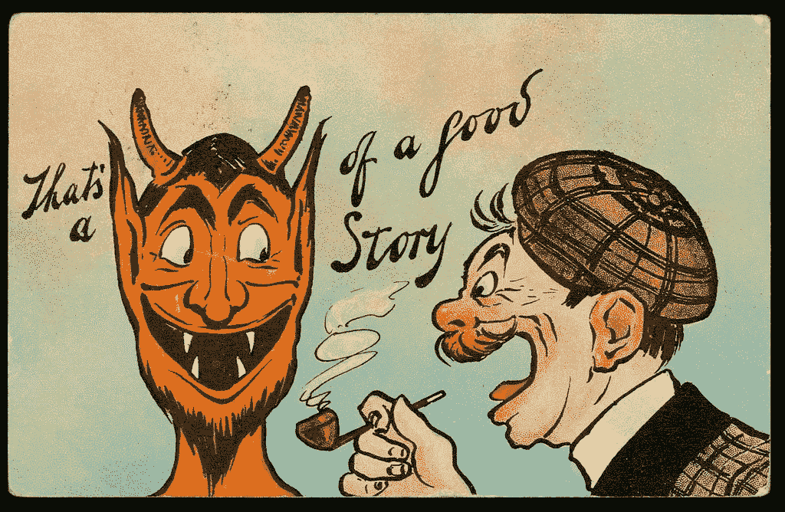
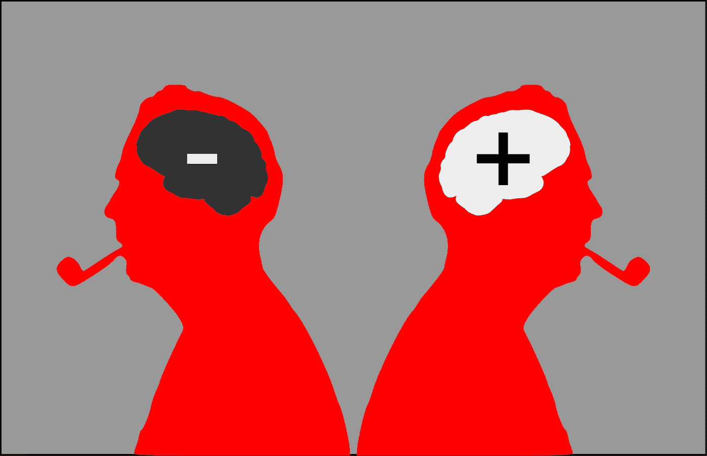
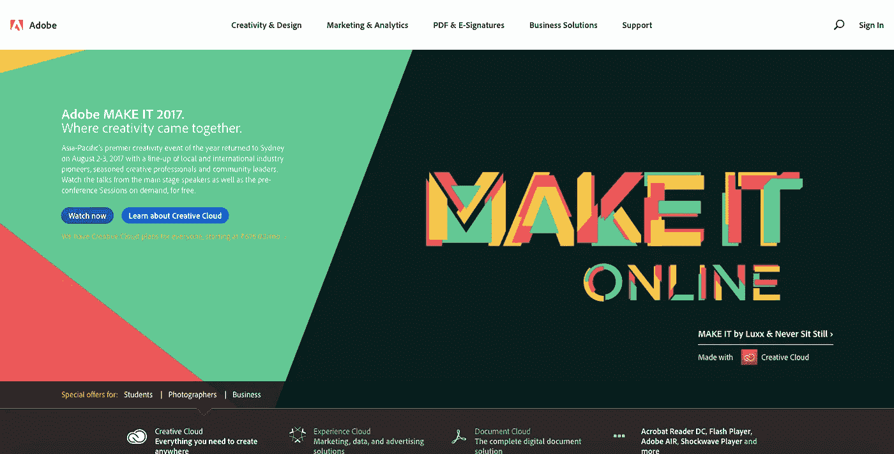
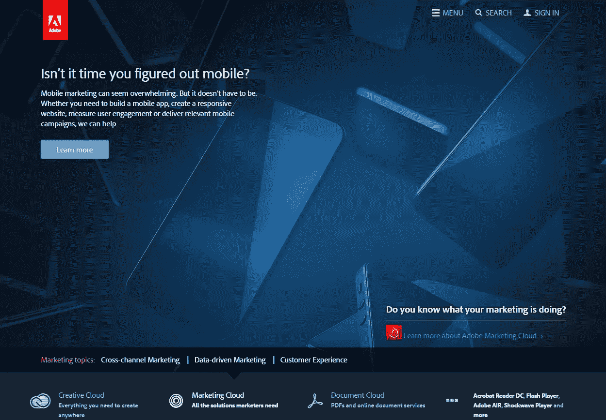

# 预测分析——描绘整体客户图景

> 原文：<https://medium.com/hackernoon/predict-what-your-customers-need-1caf3d5f3792>

*原载于*[*TechRevolve*](https://www.techrevolve.com/predictive-analytics%E2%80%8A-how-to-paint-the-holistic-customer-picture/)*。*

## 预测分析帮助企业警惕客户的未来问题，并尽早解决它们。

一个 ***说书人的生活*** 在科技行业内更多的是围绕**数据挖掘**和**数据分析**而存在的。随着所有这些在一天或一周内(根据公司的规模)得到处理，故事从这里开始。

听了几次 [**TED 演讲**](https://www.google.co.in/url?sa=t&rct=j&q=&esrc=s&source=web&cd=4&cad=rja&uact=8&ved=0ahUKEwjoicCUlvfWAhUjS48KHa-oD2cQtwIIPDAD&url=https%3A%2F%2Fwww.ted.com%2Ftalks%2Fjoseph_pine_on_what_consumers_want&usg=AOvVaw14lifGjbQFrkc523gIYQgM) 关于*人类行为*以及我们所接触到的所有那些见解，它本质上可以归结为一个**单一而坚实的理论**，那就是…

*   为什么讲故事很重要？
*   数据如何做好？

观看约瑟夫·派恩带我们了解当今消费者思维的运作方式。

来自**数据专家**和**日常说书人**的一些这样的演讲已经改变了我们的总体看法。我们对数据的想法和信念。

现在，对我们来说，

> "数据不仅仅是数字，而是我们每个在线传记的页数."

此外，理解人类/客户不仅仅是数据科学家的工作。这也是营销人员的工作。营销人员越沉迷于剖析数据集，他/她就越了解人类心理学。

> 那是相当深刻的。

本质上，有了我们每天处理的足够多的数据，**预测**下一组**用户行为**变得更加自然。理解特定人类行为的目的将有助于我们确定我们的每一个追求。

> "每个人都希望有人陪伴，来处理自己的问题."

> 任务总是未知的。

因此，在这里我们试图了解用户为了更好的未来和更好的生活可能需要什么。

有了**独特的数据集**，我们可以互相帮助实现我们的目标。可视化用户在网上留下的痕迹，我们可以想出一个潜在的解决方案。

## 对于关键字/行话狂人来说，

*   做预测分析(只用数据)
*   圈出客户未来可能面临的问题
*   设计您的解决方案/产品的线框
*   与现有客户一起运行(不要大惊小怪)
*   确立 95%的统计显著性(不能对剩余的 5%进行投标)
*   走向全球

## 进行明智的预测性营销分析的两个步骤

在 2 点中，执行预测分析意味着，

*   解码用户行为
*   优化功能/产品/活动

## 解码用户行为

Understanding user behaviour will help build a better product

我们不再生活在这样一个世界里，仅仅依靠**初级用户行为分析**似乎就足够了。从识别用户的人口统计到检查一个人的点击和关注区域，一切都变得陈旧了。

现在是我们从数据中获得洞察力的时候了，在**机器学习** (ML)的帮助下，在问题可能出现之前提供解决方案。

现在已经发展成为**深度个性化**技术，

*   高级分段
*   超个性化
*   提供全渠道体验
*   跨设备赌博
*   预测分割

如果给你看一个例子，会更容易理解。让我们来看看 **Adobe** 和它的个性化窍门。

通常，Adobe 网站上的新用户会看到这样的主页，

Adobe’s webpage before playing with the inside features

在看了足够多的视频，浏览了多个基于兴趣的功能、博客和教程后，像这样高度个性化的东西出现了。

这就是**用户行为分析**的工作方式。

通过预测用户的兴趣，如浏览网站的方式、选择的功能、花更多时间看的视频，产品可以**可视化**特定**用户地图**。并记录下他们对在线活动的兴趣爱好。

> 它被称为**web analytics intelligence**以防万一，如果你认为这是令人毛骨悚然的 AF！

## 优化功能/产品/活动

Make changes with the derived insights/data

基于从**实时工具**获得的洞察力，改变表现不佳的内容。如果数据更多地描述了产品的功能障碍或功能方面的错误，那么就进行内部敏捷测试，并找到真正的解决方法。

此外，借助高级工具，如 **RapidMiner** 、 **GraphLab** 、 **IBM** 预测分析等，提取精确的用户行为数据并调整现有模型。

> 它适用于 B2C 产品的企业级服务。

很多时候，对测试产品进行**外部用户分析**会创造奇迹。要做到这一点，从你的用户群中挑选出最可靠的客户，让他们试用你的产品。

> 向**免费试用用户**发送更小的调整也可能奏效。

## 投资提示:

Gartner 最近的调查报告称，到 2018 年，50%的消费品投资将转向客户体验创新。

# 嘿，

用户不会再满足于**抄袭创新**或**无聊产品**了。为了摆脱这种饱和的雷达，我们必须建立一些简单的东西，再加上解决问题的药丸。

总是构建可以解决用户复杂问题的工具，而不是把产品本身当成一件要处理的事情。

**祝你好运。**

*原载于*[*TechRevolve*](https://www.techrevolve.com/predictive-analytics%E2%80%8A-how-to-paint-the-holistic-customer-picture/)*。*