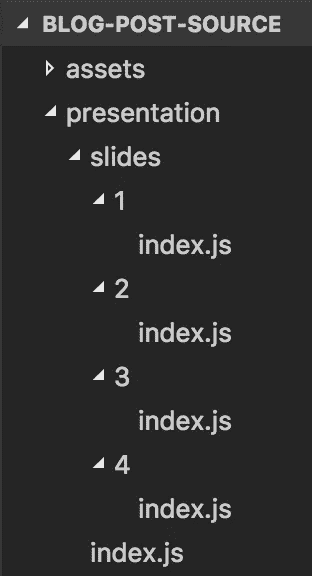
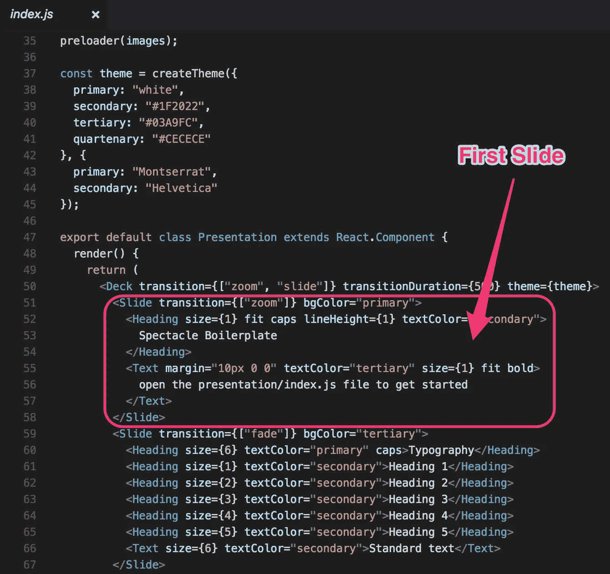
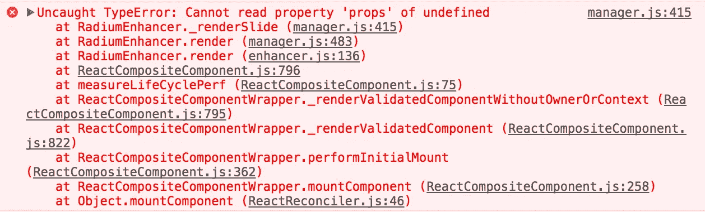
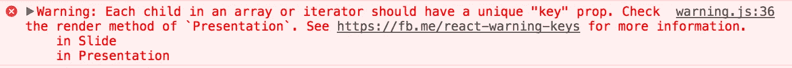

# 展示奇观——我如何模块化我的甲板

> 原文：<https://medium.com/hackernoon/presentations-with-spectacle-how-i-modularize-my-deck-775c082cef08>

**访问**[**【https://www.mikenikles.com】**](https://www.mikenikles.com)**获取我的最新博文。**

当我第一次遇到[奇观](http://formidable.com/open-source/spectacle/)时，我喜欢它是如何容易上手的，以及它是用 React 构建的。我每天都写 React 代码，为什么不用它来创建演示呢？有一段时间一切都很顺利，直到我意识到。/presentation/index.js 文件开始超过几百行。

> 一定有办法把我的幻灯片模块化！

**TL；dr:** 代码可从[https://github . com/mikenikles/presentations/tree/master/packages/blog-post-source](https://github.com/mikenikles/presentations/tree/master/packages/blog-post-source)获得

# 从“奇观样板”开始

正如 Github repo 中所推荐的，我从克隆**biggest-boilerplate**repo 开始，并删除了**。git** 文件夹:

```
$ git clone git@github.com:FormidableLabs/spectacle-boilerplate.git blog-post-source
$ cd blog-post-source
$ rm -fr .git
```

此时，您可以使用`npm install`安装依赖项，并使用`npm start`开始演示。它将在 [http://localhost:3000 上提供。](http://localhost:3000.)

# 为每张幻灯片创建一个文件夹

样板演示文稿中有四张幻灯片。让我们创造一个**。/presentation/slides** 目录，我们将把每张幻灯片移动到它自己的子文件夹中。

```
$ cd ./presentation
$ mkdir slides && cd slides
$ mkdir 1 && mkdir 2 && mkdir 3 && mkdir 4
```

我们还希望每个文件夹中有一个 **index.js** 文件。这是每张幻灯片内容的位置。

```
$ touch ./1/index.js && touch ./2/index.js && touch ./3/index.js && touch ./4/index.js
```

这给我们留下了以下目录结构:



Each slide has its own folder. The slide content lives in **./presentation/slides/[slide-number]/index.js**

*提交*:[https://github . com/mikenikles/presentations/Commit/5d 208 f 669 c 633 da 7d 95424d 48 e 62588081 bd7d 56](https://github.com/mikenikles/presentations/commit/5d208f669c633da7d95424d48e62588081bd7d56)

# 填充每张幻灯片的内容

奇观样板报告已经在**中提供了每张幻灯片的内容。/presentation/index.js** 。我们需要做的就是将每个`<Slide />`反应组件移动到其对应的**中。/presentation/slides/[slide-number]/index . js**文件。

让我们一起来看第一张幻灯片。



Cut and paste that to ./presentation/slides/1/index.js

我们还必须给**添加一些导入语句。/presentation/slides/1/index . js**。此外，让我们确保导出此幻灯片的代码。最终文件如下所示:

```
import React from "react";
import { Heading, Slide, Text } from "spectacle";export default (
  <Slide transition={["zoom"]} bgColor="primary">
    <Heading size={1} fit caps lineHeight={1} textColor="secondary">
        Spectacle Boilerplate
    </Heading>
    <Text margin="10px 0 0" textColor="tertiary" size={1} fit bold>
        open the presentation/index.js file to get started
    </Text>
  </Slide>
);
```

对其余幻灯片执行相同的步骤。

*提交*:[https://github . com/mikenikles/presentations/Commit/a45f 144247d 0 E4 f 0 c 39d 922 a9 a 23 cf 73 c 05 c0a 32](https://github.com/mikenikles/presentations/commit/a45f144247d0e4f0c39d922a9a23cf73c05c0a32)

# 动态加载幻灯片

最后，我们必须动态加载每张幻灯片。这听起来比实际更棘手。概括地说，需要执行以下步骤:

1.  用`import()`动态加载所有幻灯片。
2.  将加载的幻灯片提供给`Presentation`组件的状态。
3.  在执行上述步骤 1 和 2 时，用占位符组件填充状态。
4.  为每个动态加载的幻灯片提供一个独特的`key`道具。

## 1.用`import()`动态加载所有幻灯片

在**中。/presentation/index.js** ，我们定义了所有幻灯片的列表以及它们的顺序。

```
const slidesImports = [
  import("./slides/1"),
  import("./slides/2"),
  import("./slides/3"),
  import("./slides/4")
];
```

每个`import()`语句都返回一个承诺。所以`slidesImports`是一系列承诺。我们可以利用这一点，使用`Promise.all()` [函数](https://developer.mozilla.org/en/docs/Web/JavaScript/Reference/Global_Objects/Promise/all)等待所有幻灯片导入完毕。稍后会有更多内容。

## 2.将加载的幻灯片提供给`Presentation`组件的状态。

`Presentation`组件需要一个`state`，一旦加载的幻灯片可用，我们就在那里提供它们。我们在`constructor()`中填充一个空数组，并用`componentDidMount()`生命周期方法中的实际幻灯片内容替换它。新的`Presentation` 组件现在看起来像这样:

```
export default class Presentation extends React.Component {
  constructor(props) {
    super(props); this.state = {
      slides: [] // A placeholder for slides once they're loaded.
    };
  } componentDidMount() {
    const importedSlides = [];
    Promise.all(slidesImports).then((slidesImportsResolved) => {
      slidesImportsResolved.forEach((slide) => {
        importedSlides.push(slide.default);
      });
      this.setState({ slides: importedSlides });
    });
  } render() {
    return (
      <Deck transition={["zoom", "slide"]} transitionDuration={500} theme={theme}>
      </Deck>
    );
  }
}
```

我们快完成了。接下来，让我们更新`render()`函数并实际渲染所有幻灯片。

```
render() {
  const { slides } = this.state;
  return (
    <Deck transition={["zoom", "slide"]} transitionDuration={500} theme={theme}>
      {
        slides.map((slide) => {
          return slide;
        })
      }
    </Deck>
  );
}
```

当我们查看 [http://localhost:3000/](http://localhost:3000/) 时，我们在浏览器控制台中看到一个空白屏幕和以下错误:



Browser console error based on the current code

仔细查看第 415 行的 **manager.js** ,可以发现该错误是由以下代码行引起的:

```
children: _react.Children.toArray(child.props.children),
```

根据错误消息，我们知道`child`就是`undefined`。这很容易解决。

## 3.在执行上述步骤 1 和 2 时，用占位符组件填充状态

当第一次调用`Presentation`组件的`render()`函数时，`this.state.slides`被设置为空数组。telegraph 不喜欢这样，所以让我们提供一些占位符幻灯片，直到我们的真实幻灯片被导入并添加到状态中。

我们可以提供一个空幻灯片，直到`this.state.slides`可用，大致如下:

```
render() {
  const { slides } = this.state;
  return (
    <Deck transition={["zoom", "slide"]} transitionDuration={500} theme={theme}>
      {
        slides.length ? slides.map((slide) => {
          return slide;
        }) : <Slide />
      }
    </Deck>
  );
}
```

当我们在 [http://localhost:3000/](http://localhost:3000/) 加载第一张幻灯片时，这实际上工作得很好。但是，尝试导航到第二张幻灯片，并在[http://localhost:3000/#/1](http://localhost:3000/#/1)重新加载页面。*错误*。

这告诉我们，在第一次调用`Presentation`组件的`render()`函数时，telegypt 需要知道一个演示需要的幻灯片的确切数量。

很简单，让我们通过将`constructor()`函数从:

```
constructor(props) {
  super(props); this.state = {
    slides: []
  };
}
```

收件人:

```
constructor(props) {
  super(props); this.state = {
    slides: Array(slidesImports.length).fill(<Slide key="loading" />)
  };
}
```

我们基本上用将要导入的幻灯片的确切数量来填充状态的`slides`属性。在上面的代码片段中，我们呈现了一个空的`<Slide />`组件，但是我们也可以设计一个漂亮的幻灯片来显示“Loading…”微调器。

现在回到[http://localhost:3000/#/1](http://localhost:3000/#/1)，欣赏你演示的第二张幻灯片，不要出现我们之前看到的严重错误。

等一下，我说得太早了…



Each <Slide /> component requires a unique “key” prop

哦，是的，没错。[错误信息中的链接](https://facebook.github.io/react/docs/lists-and-keys.html#keys)解释了为什么`key`道具很重要。

## 4.为每个动态加载的载玻片提供独特的`key`支撑

为此，我们有两种选择:

1.  给**内的每个`<Slide />`组件增加一个`key`支柱。/presentation/slides/[幻灯片编号]/index.js** 。
2.  在`Presentation`组件的`render()`函数中动态提供`key`道具。

选项 1 听起来很简单，但我们将选择选项 2，因为它使以后重新排列幻灯片更容易。如果单个幻灯片`index.js`文件不知道它们在演示文稿中的位置，我们可以简单地将幻灯片的文件夹从`1`重命名为`3`，将幻灯片从演示文稿的第一个位置移动到第三个位置。

`render()`函数的更新后的`<Deck />`组件现在看起来像这样:

```
<Deck transition={["zoom", "slide"]} transitionDuration={500} theme={theme}>
  {
    slides.map((slide, index) => {
      return React.cloneElement(slide, {key: index});
    })
  }
</Deck>
```

*提交*:[https://github . com/mikenikles/presentations/Commit/2c 8630086548405 e 7d 7 AC 2394d 087 fcfe 504 b 06 c](https://github.com/mikenikles/presentations/commit/2c8630086548405e7d7ac2394d087fcfe504b06c)

# 结论

使用这种方法，我现在可以轻松地模块化我的眼镜演示。事实上，我可以把这个提升到一个全新的水平…

我可以用常用幻灯片的集合创建一个 NPM 模块，例如我在每次演示时使用的“关于我”的幻灯片。每当我想在演示文稿中使用它时，我可以简单地将它作为依赖项添加到我的 **package.json** 文件中，并将其导入到我的演示文稿中正确的索引处。

如果您有任何问题，请随时联系我们！

[](http://bit.ly/HackernoonFB)[](https://goo.gl/k7XYbx)[](https://goo.gl/4ofytp)

> [黑客中午](http://bit.ly/Hackernoon)是黑客如何开始他们的下午。我们是阿妹家庭的一员。我们现在[接受投稿](http://bit.ly/hackernoonsubmission)并乐意[讨论广告&赞助](mailto:partners@amipublications.com)机会。
> 
> 如果你喜欢这个故事，我们推荐你阅读我们的[最新科技故事](http://bit.ly/hackernoonlatestt)和[趋势科技故事](https://hackernoon.com/trending)。直到下一次，不要把世界的现实想当然！

