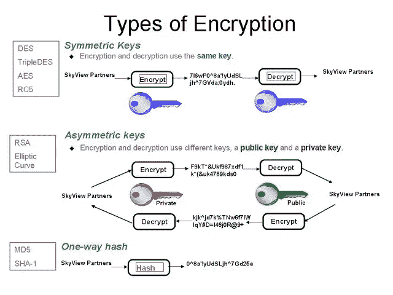
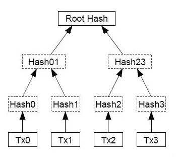
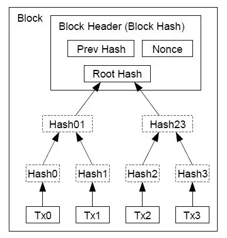
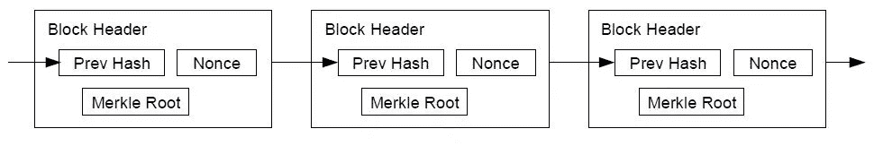

# 相当好的密码术

> 原文：<https://medium.com/hackernoon/pretty-good-cryptography-2b11959c397c>

## 一项古老的颠覆性技术的外行指南

*这篇文章向读者介绍了密码学的基础知识、起源、现状和可能的未来。一项古老的技术正在通过系统的去中介化，将信任的所有权从主流机构转变为网络。有些人认为，这个想法对于我们生活的时代来说过于超前，但它很可能成为现实。无论如何，开发者——现代世界的建筑师——已经开始使用密码学来创造新的货币和代币，颠覆现有的货币和代币，更重要的是，他们的目标是在这个过程中重新定义金融世界和我们对金钱的概念。如果这不是一场革命，我不知道如何描述它。本文的最终目的是解释比特币等加密货币和以太坊等代币背后的基本技术。请记住——根据美国证券交易委员会的最新规定，代币是证券而不是货币，因此不要将以太(代币)与比特币(货币)混淆*

> 每隔一段时间，一项新技术、一个老问题和一个伟大的想法都会转化为创新——迪安·卡门，发明家

# 需要是发明之母

对于一个与秘密有关的词，“密码术”有一个令人惊讶的透明词源。这个词可以追溯到希腊词根 *kryptos，*意为“隐藏”，而*graphen，*意为“书写”(韦氏词典)

如果你想到密码学时首先想到的是象形文字，那么你的单词联想素质非常好。最早的加密形式是象形文字(大约公元前 1900 年古埃及王国坟墓上的铭文)。正如今天所理解的那样，象形文字与其说是一种密码，不如说是一种高贵的艺术品。

公元前 2 世纪到公元 3 世纪之间，情节变得更加复杂，因为《政治学》是一本由考底利耶撰写的关于军事战略、经济和城市规划的杰出的印度著作。Arthashastra 提到了间谍网络的使用，提到了用秘密代码给间谍任务。

公元前 100 年，众所周知，朱利叶斯·凯撒使用一种加密形式向他派驻前线的军队将领传递秘密信息。这是最著名的密码，被称为替代密码，其中字母表的每个字符移动 3。所以，A 变成了 D，B 变成了 E，等等。所以，单词 BALL 会变成 EDOO 等等。解决这个难题的“关键”显然是将字母表移动 3 位。

随后，方法发生了变化，从最初由阿拉伯人开发的密码分析技术，发展到大约在公元 1467 年由[莱昂·巴蒂斯塔·阿尔伯蒂](https://en.wikipedia.org/wiki/Leon_Battista_Alberti)(现代密码学之父)开发的多字母密码，再到在第二次世界大战中广泛使用的机械和机电[密码机](https://en.wikipedia.org/wiki/Cipher)。最著名的是德国的 Enigma 机器，它被波兰以及随后的英国象棋大师和数学老师团队破解，如[戈登·韦尔奇曼](https://en.wikipedia.org/wiki/Gordon_Welchman)、[马克斯·纽曼](https://en.wikipedia.org/wiki/Max_Newman)和[艾伦·图灵](https://en.wikipedia.org/wiki/Alan_Turing)(现代[计算](https://en.wikipedia.org/wiki/Computer)的概念创始人)。

# 奇迹年代

你知道或记得第一次用书呆子的方式谈恋爱的感觉吗？当我在 1997 年得到我的第一台英特尔奔腾 IV 驱动的 PC(个人电脑)时，我经历了那种情绪。大约 6 年前，Phil Zimmerman 开发了一个名为“非常好的隐私”(PGP)的加密软件，用于加密电子邮件、文本文件、磁盘等。

PGP 是我第一次接触用户友好的加密技术。该软件使用起来非常简单，但底层技术(即散列、数据压缩、对称密钥加密以及最终的公钥加密的一系列组合)非常复杂，每一步都使用若干受支持算法中的一种。

# 对称、非对称加密和散列

对称加密使用一个密钥，例如 Julius Caesars 的“3”密钥加密就是对称加密的一个例子。

可以理解，对称加密不太安全。输入非对称或公钥加密。下图用一张图解释了上述概念:

computer-trickster.blogspot.tw/2015/11/encryption.html?m=1

# 一个勇敢的新世界

比特币等现代加密货币基于两种技术:

## A.公钥加密/非对称加密

假设爱丽丝想给鲍勃发一条信息。

1.她用自己的私钥签名，这证明了消息是她发出的。

2.Alice 也使用 Bob 的公钥来加密消息。

3.为了解密消息，鲍勃必须使用他的私人密钥。因此，只有拥有自己私钥的 Bob 才能打开消息。

## B.哈希函数

SHA-2 ( [安全哈希算法 2](https://en.wikipedia.org/wiki/Secure_Hash_Algorithm) )是由美国[国家安全局](https://en.wikipedia.org/wiki/National_Security_Agency_(NSA))设计的一组[密码哈希函数](https://en.wikipedia.org/wiki/Cryptographic_hash_function)

Hashcash 使用对称加密技术(即单向密钥)来创建输入数据的散列(用一种简单的方式解释——混杂/官样文章)。假设数据由名称 Ada 组成。使用单向密钥，该数据被散列(混杂)成 000CFC。CFC 前面的 ooo 在技术术语中被称为“Nonce”。在英语中，Nonce 单词是用于一次性意义的单词(使用一次，否则就是无意义的)。否则是没用的。一个临时词的例子是“Wug ”,它除了教孩子之外没有任何意义。

在比特币的情况下，nonce 是放置在输入数据之前的一串零，以创建数据的唯一散列(混杂)。因此，比特币挖矿是使用蛮力组合来找到哈希“000CFC”。找到这个值的人(使用他的电和计算机)就是拥有黄金随机数的人，并获得 25 个比特币的奖励。

然而，这是一个非常简单的例子。通常使用 Merkle 树对数据或消息进行哈希处理:

在 Merkle 树中，每个非叶节点，例如上面的第二层，在这个例子中用子节点(层 1)的散列值来标记。最后，这棵树产生了所谓的根散列。

然后，这个根哈希与一个随机数和前一个块结合，一直到链中的第一个块，形成一个块链:

因此，比特币不是一种货币，而是一种奖励，奖励那些使用他们的*计算机(CPU 之后是图形处理单元(GPU)芯片，现在是专用集成电路(ASIC)芯片)来解决密码难题的人*，因此显示出在区块链账本中记录交易所做的“工作证明”。

很快，我们就可以见证量子密码术。

# 企业家的宏观经验

从宏观的角度来看，密码学的应用是一种旧思想(现在由于机器和计算的进步而成为可能)在新问题上的应用。虽然，世界可能还没有准备好接受加密货币的想法。

[彭博](https://medium.com/u/3d76181076e6?source=post_page-----2b11959c397c--------------------------------)最近发表了一篇文章，题为“[宽客吵着要数据，引起大银行的自我反省”](https://www.google.com/amp/s/www.bloomberg.com/amp/news/articles/2017-08-08/quants-clamor-for-data-causing-soul-searching-at-large-banks)。这篇文章的关键是，量化对冲基金正在寻找新的途径，即信息来源，以产生更高的回报(阿尔法)。这是因为在这个大数据时代，公开数据的每一个字节都被市场快速处理，即阿尔法被套利走了，寻找新的信息来源以产生更高的回报变得越来越难。

同样，企业家可能面临同样的困境，即市场可能还没有为产品做好准备，或者用首席执行官帕特里克·科利森的话说， [Stripe](https://medium.com/u/3ecae35d6d66?source=post_page-----2b11959c397c--------------------------------) ，可能越来越难找到一个服务不足的利基市场。在这种情况下，问几个问题很重要:

1.这是正确的时间吗，也就是说，你的产品的市场准备好了吗？在时机未到之前推出一个想法可能是有害的。

2.该技术是否可移植到不同的地理位置、市场或客户群，而这些地方或客户群已经为产品做好了准备？这将包括人力资本的监管和可用性。最著名的经济学家之一 Dani Rodrik 解释说，将制造技术移植到另一个国家很容易(例如丰田汽车制造)，农业技术很难移植，因为土壤和天气不同，服务业也是如此。

3.通过改变产品的特性或添加新特性，是否可以创建产品的不同应用程序？

最后，需要相当好的密码学来阐明一个更大的趋势——技术再造现实世界。

# 最后的想法

自从 1997 年我的第一台个人电脑，也是我第一次接触加密技术，也就是使用相当好的隐私(PGP)以来，我对变化的速度感到惊讶。

我没有想到，20 年后，用于保护我电子邮件的一款软件中的技术，有一天会挑战货币和法定货币的概念。换句话说，我无法想象技术变成金融、计算机代码变成货币的未来。

给我们的教训是，这种变化的速度会一直持续下去，观察技术趋势无异于见证一场革命——我非常肯定这场革命将颠覆我们的生活，改变我们的工作和生活方式。围绕我们的数据隐私和人工智能的辩论，既令人兴奋又令人恐惧。因此，我对每个人的要求是尽可能多地学习技术知识(包括但不限于参加数据科学的正式课程)。

> 我们对未来的直觉是线性的。但是信息技术的现实是指数级的，这产生了深远的影响。如果我直线走 30 步，我会走到 30 步。如果我按指数规律走 30 步，我会到达 10 亿-
> 
> 雷·库兹韦尔

我的意图不是吓唬你。恰恰相反。我试图简化行话，让技术变得更人性化、更有趣、更容易理解。我不知道我是否成功，但对我来说，尝试是成功的一半。

## 感谢您的阅读。如果你认为这篇文章有教育意义，请与你在脸书、推特、LinkedIn 或其他社交媒体上的关注者分享。可以在推特上关注我:@akothari_mba

## 如果你喜欢这篇文章，请点击下面的心形推荐它。

