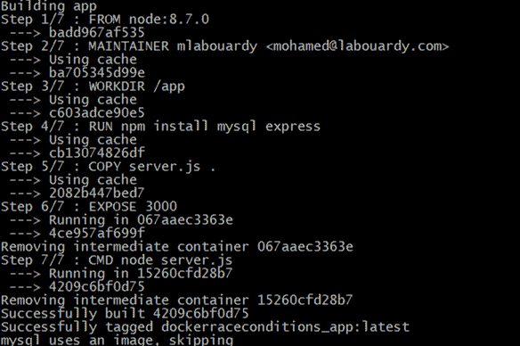
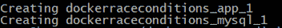
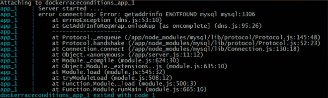
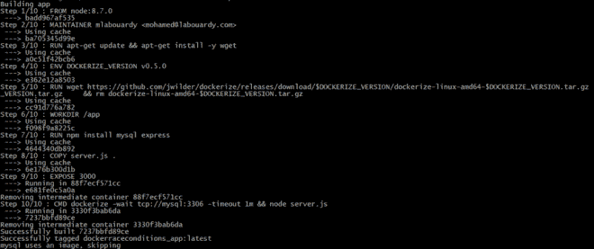
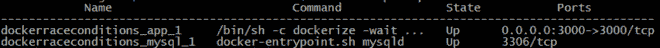
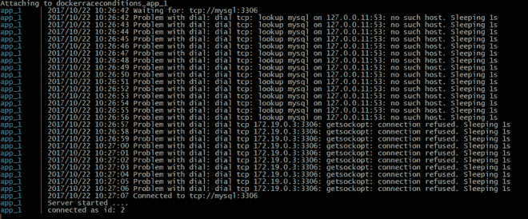

# 防止 Docker 中的竞争情况

> 原文：<https://medium.com/hackernoon/preventing-race-conditions-in-docker-781854121ed3>

用**Compose**&**Docker**很容易得到竞态条件。举个例子，如果你有一个通用的模式，当你的应用服务器依赖于数据库时，但是由于数据库服务器没有时间配置它自己，而应用程序已经启动了，它就不能连接它。

带有**NodeJS**app&MySQL 的竞争条件示例:

为了构建应用程序容器，我使用了下面的 **Dockerfile** :

为了部署堆栈，我使用了 **docker-compose**

让我们构建图像:

> docker-撰写构建

然后，创建容器:

> docker-撰写向上-d

让我们看看状态:

> docker-撰写 ps

应用程序无法启动，让我们看看为什么？

> docker-撰写日志-关闭应用程序

**竞况！**应用程序容器出现在数据库之前，并试图连接到 **MySQL** 数据库，但由于数据库连接错误而失败。为了避免这种情况，有许多解决方案:

*   在代码中添加一种机制，在开始连接数据库之前等待数据库启动和设置
*   使用*重启*策略— [Docker 文档](https://docs.docker.com/engine/admin/start-containers-automatically/)
*   握住容器，直到数据库启动并运行

我将使用第三个解决方案，一个名为 [Dockerize](https://github.com/jwilder/dockerize) 的开源工具，这个工具的优点是它可以非常快速地查看套接字的打开情况，直到它打开，然后启动 web 应用程序。

注意:Dockerize 使您能够等待特定协议上的服务(`file`、`tcp`、`tcp4`、`tcp6`、`http`、`https`和`unix`)

所以只需更新 **Dockerfile** 来安装 **Dockerize** :

然后，构建新的映像:

> docker-撰写向上-d
> 
> docker-撰写 ps

> docker-撰写日志-关闭应用程序

它在❤工作