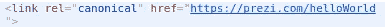
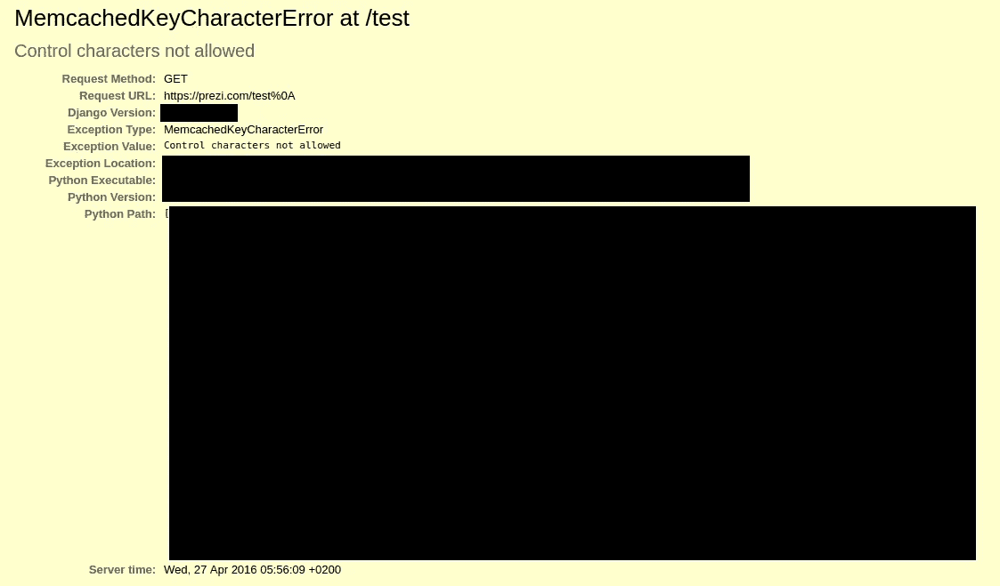
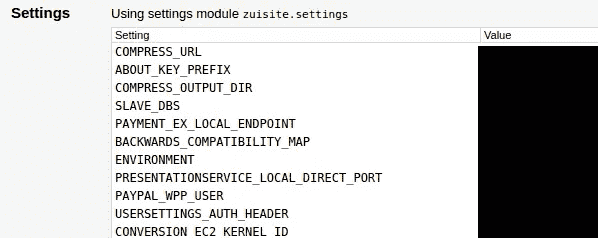
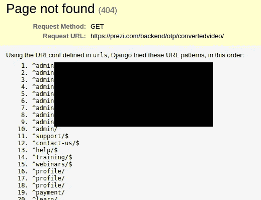

# Prezi: 1031 个变量

> 原文：<https://medium.com/hackernoon/prezi-1031-variables-40703c54f586>


[https://i.ytimg.com/vi/ArGh6FurR0Q/maxresdefault.jpg](https://i.ytimg.com/vi/ArGh6FurR0Q/maxresdefault.jpg)

Prezi 是一种流行的演示服务，被那些没有学会如何使用 powerpoint 的拖拉的青少年和成年人所使用。它打破了单调乏味的幻灯片风格，为演示增添了一些趣味。虽然我从未使用过这项服务，但我注意到他们有一个 [bug](https://hackernoon.com/tagged/bug) 赏金项目，并决定研究一下。

几个月前，当我开始渗透测试时，我发现了这个漏洞，所以当时我唯一的希望是用一些字符发送垃圾网址，看看程序给了我什么。我从像%0A 和%0D 这样的控制字符开始，得到了一些特殊的结果；使用类似“helloWorld%0A”的字符串，可以在 DOM 中成功解析新行:



helloWorld%0A

# 万能的上帝

又试了几次之后，我还是无法从中获得任何东西，因为 Prezi 成功地对引号和其他 XSS 字符进行了编码。经过一次刷新后，让我高兴的是，我看到了强大的调试页面。



Top of debug page

这是由于“Debug=True”标志被意外地设置在生产环境中的开发服务器上。在这一部分之后，有 718 个环境服务器变量的转储。



Beginning of environmental variables

这些变量包括很多，但由于 Django 内置的调试代码，大多数高度敏感的变量都被删除了:

```
HIDDEN_SETTINGS = re.compile(‘API|TOKEN|KEY|SECRET|PASS|SIGNATURE’, flags=re.IGNORECASE) CLEANSED_SUBSTITUTE = ‘********************’
```

然后，[安全性](https://hackernoon.com/tagged/security)是服务器管理员的责任，用“HIDDEN_SETTINGS”变量中的一个来命名所有敏感变量(只是作为最后的手段，在暴露于 prod 的服务器中关闭调试是第一道防线)。在触发这个错误一次后，我不能用相同的字符串再次触发它。我后来发现这是因为他们的服务器中只有一个有调试标志，这使得它很难重现。

# 他复活了

在这一点上，我准备报告这个问题，但我决定尝试另一个控制字符“%0D”，看看会发生什么。这次我找到了全能调试员的儿子



由于某种未知原因，控制字符没有出现在请求 URL 中。由于这是在网站的另一部分，不同的错误被触发，不同的信息出现。然后，这为他们的 Django 应用程序转储了 313 个 url 正则表达式路由。大多数都被正确配置为不允许未经验证的查看，但一个更复杂的演员可能会对这些进行一些处理。

# 他真的复活了

此时，我通过电子邮件向 Prezi 报告了该漏洞，并继续查看这些变量转储中给出的信息。Django 没有屏蔽的一个有趣的变量组合是 GOOGLE_ANALYTICS_USER_EMAIL 和 GOOGLE_ANALYTICS_USER_PASS(应该已经屏蔽了)。我向 Prezi 报告了这一情况，他们证实这可能会导致接管 gmail 帐户和相关的分析帐户，但它已不再使用，所以他们停用了该帐户。

Prezi 很快发现他们只有一台带有 debug 标志的服务器，而且这是一台意外暴露给 prod 的开发服务器，这就是为什么这不容易重现的原因。他们重新配置了服务器并解决了问题。

# 解决时间线

**2016 年 4 月 27 日**

*   美国中部时间上午 12 时 03 分:通过电子邮件向 Prezi 报告了问题
*   CDT 上午 6:45:Prezi 确认收到电子邮件

**2016 年 5 月 6 日**

*   CDT 时间上午 8:42:问题确认修复，并颁发 1000 美元奖金

当时这是我第一次向一个 bug bounty 项目汇报，非常愉快，我要感谢 Prezi 的专业精神和快速反应。如果你有兴趣，一定要去看看 https://bugbounty.prezi.com/的

[](http://bit.ly/HackernoonFB)[](https://goo.gl/k7XYbx)[](https://goo.gl/4ofytp)

> [黑客中午](http://bit.ly/Hackernoon)是黑客如何开始他们的下午。我们是 [@AMI](http://bit.ly/atAMIatAMI) 家庭的一员。我们现在[接受投稿](http://bit.ly/hackernoonsubmission)并乐意[讨论广告&赞助](mailto:partners@amipublications.com)机会。
> 
> 如果你喜欢这个故事，我们推荐你阅读我们的[最新科技故事](http://bit.ly/hackernoonlatestt)和[趋势科技故事](https://hackernoon.com/trending)。直到下一次，不要把世界的现实想当然！

[](https://goo.gl/Ahtev1)